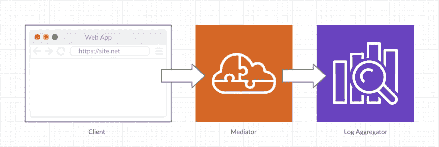
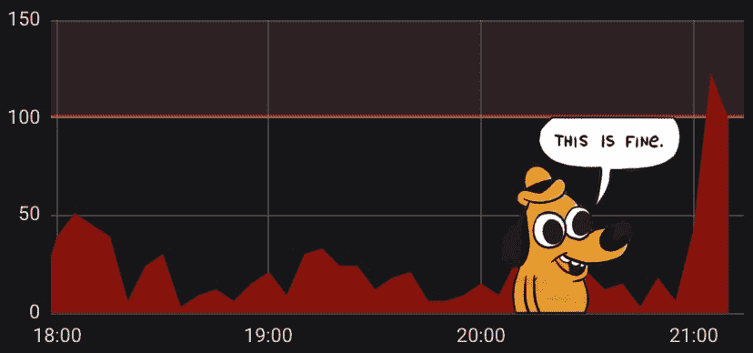

# 前端可观察性。用 window.onerror 监控浏览器错误的实用指南💂‍

> 原文：<https://dev.to/omrilotan/front-end-observability-a-practical-guide-to-browser-error-monitoring-2gcm>

前端应用程序代码比其他任何代码都要运行在我们几乎无法控制的环境中。

每个浏览器都有其独特的属性、功能支持、连接级别等。在现代应用程序中，用户配置一半的功能，A/B 测试改变其余的功能，用户安装的浏览器扩展影响数据传输和代码执行。所有这些为浏览器应用程序代码的执行创造了一个**高度不稳定的环境**。

由于执行远离我们的基础设施，并且运行时环境特别嘈杂，我们倾向于忽略来自浏览器的错误触发，并从我们的浏览器应用程序陷入一种幸福的寂静。

在 [Fiverr](https://medium.com/fiverr-engineering) 我们已经敏锐地意识到浏览器应用程序错误的丰富性，并逐渐改进收集和处理错误日志流程的流程和质量，直到我们严格监控我们的浏览器应用程序。随着时间的推移，我学到了可能对他人有益的经验。我知道你在想什么:“你为什么不用哨兵？”我们已经不这么做了。

## 🎉好消息，各位！

我们的 web 应用程序通常运行 Javascript 并共享一个名为`window`的全局范围。当运行时错误没有被您的功能流捕获和处理时，它会触发一个`window.onerror`事件(以及窗口的`'error'`事件监听器)。这个界面可能会提供一个很好的机会，让你的访客了解他们在努力工作时遇到的障碍。

我们不能浪费窗口错误调用的天赋。事实上，我们免费获得这个全部捕获事件监听器只是第一步——现在我们必须对它做些什么。

我打算展示记录错误、保护基础设施、减少误报并最终创建正确警报所需的简单设计。我的设计专门捕捉**未捕捉到的**错误；在 try/catch 块或 promise catch 子句之外引发的意外错误，然后通过可选的中介层转发到日志聚合服务。

> 💁‍♂️阅读这篇文章没有特别的顺序。随意跳到你比其他人更感兴趣的话题。此外，本文中的实现旨在启发，您可以自行决定是否应用。

#### 我们系统的关键人物

1.  **浏览器**-web 应用程序是访问者客户端的运行时。在它的全局范围内，我们将编写错误处理程序，它捕捉错误并将其作为日志记录转发，最好是在它的生命周期的早期，靠近文档顶部的某个地方。
2.  **Mediator** ( *可选*)——这一层允许我们在将日志转发到我们的日志聚合器之前应用逻辑，例如:访问者验证(会话令牌)、过滤已知问题、修改日志级别、丰富日志记录以及在端系统中收集统计数据。它可以实现为一个连接到 API 网关的无服务器功能或者一个可持续的 HTTP API 服务——一切都可以。
3.  **日志聚合器** -这一层可以是一个自托管数据库，如 ElasticSearch，上面有一些系统，可以管理流和警报，如 Graylog，或托管日志解决方案。这一层将是开发人员开始调查的第一个地方。

| 这是一个非常简单的系统 |
| --- |
|  |

## 🖥浏览器

### 确保你已经设置了 CORS 标题

在我们开始捕捉和发送错误之前，这个先决条件通常是非常必要的。

除了您的 web 应用程序(可能是您的 CDN)之外，托管在其他域上的脚本文件不会显示错误发生的位置、错误是什么或其堆栈跟踪。相反，您将看到错误消息:`Script error.`。

显然，这无助于提高可见度。向脚本标签添加`crossorigin`属性将 CORS 策略设置为“同源”。值`anonymous`意味着将不会有用户凭证的交换，除非它在同一个源中。

```
<script src="..." crossorigin="anonymous"></script> 
```

Enter fullscreen mode Exit fullscreen mode

长话短说——你现在可以了解错误的全部细节。

> 这里有一个小小的警告——小心浏览器缓存。如果只将属性添加到浏览器缓存的现有脚本标签中，用户可能会得到 CORS 错误**，因为响应已经被缓存，没有 CORS 头**。解决这种情况的方法是添加一个查询参数。
> 
> ```
> <script src="...?cors=1" crossorigin="anonymous"></script> 
> ```

### 不要欺负你的房客

我们将使用`window.onerror`属性来捕捉未处理的错误。您应该知道有人可能已经在您的运行时中注册了一个 onerror 处理程序。

考虑共享全局运行时的其他占用者。供应商能够监控和解决他们自己的错误符合每个人的最佳利益。

当覆盖现有的监听器时，确保自己触发它们。你可以在你的逻辑之前或之后拜访他们。

```
const { onerror } = window; // Existing onerror handlers

// Trust others adhere to onerror handling rules
window.onerror = (...args) => {
    let handled; // is someone else taking care this error?
    try {
        handled = onerror && onerror.apply(window, args);
    } catch (error) {

        // Catch others' onerror errors
        myOnErrorHandler(error.message, '', 0, 0, error);
    } finally {
        handled || myOnErrorHandler(...args);
    }
    return false;
}

// Or simply be first and catch everything
window.onerror = (...args) => {
    myOnErrorHandler(...args);
    onerror && onerror.apply(window, args);
    return false;
} 
```

Enter fullscreen mode Exit fullscreen mode

还不还真。它将阻止默认事件处理程序的触发。

### 创造限制

一旦设置完毕，错误可能会开始充斥你的系统。考虑哪些条件构成了你**不关心的错误**，并尽早过滤它们。这将有助于你的团队关注真正的问题。

例如，一个破损的页面可能会抛出大量错误，这些错误都源于一次破损。得到所有的错误对我们没有太大的好处——我将同一页面上的错误数量限制为 10 个。

```
const errorsHistory = [];
function abortErrorReport(message, file, line, column, error) {

    // Close the log behind a rollout mechanism to protect your infrastructure
    if (!errorLoggingEnabled) return true;

    // Limit the amount of errors from one page
    if (errorsHistory.length > 10) return true;

    // Send the same error twice from the same page can create false multiplications
    if (errorsHistory.includes(message)) return true;
    errorsHistory.push(message);

    // A page may be considered stale if it's been open for over, lets say, an hour
    if (window.performance.now() > 36e5) return true;

    // Add more rules that suit your consideration

    return false;
}

function myOnErrorHandler(...args) {
    if(abortErrorReport(...args)) {
        return;
    }

    ...
    sendError(record);
} 
```

Enter fullscreen mode Exit fullscreen mode

### 关于错误的详细信息

window.onerror 的接口公开了有助于理解错误是什么以及错误源自何处的详细信息。对于 HTTP 请求负载，错误对象不能序列化为 JSON，但是您应该提取它的堆栈。

```
/**
 * This is the signature of the browser's built in onerror handler
 * @param  {string} message Error message
 * @param  {string} file    Source file where the script threw an error
 * @param  {number} line    Line number
 * @param  {number} column  Column number
 * @param  {Error}  error   Error object
 * @return {Boolean}        Should the default event handler fire?
 */
function myOnErrorHandler(message, file, line, column, error) {
    const record = {
        message,
        file,
        line,
        column,
        stack: error.stack,
        name: error.name,
    };

    ...
    sendError(record);
}; 
```

Enter fullscreen mode Exit fullscreen mode

### 许许多多的细节

越多越开心。您的开发人员将不得不调查错误日志，他们希望获得有助于重现问题的详细信息，推测问题发生的原因，并假设问题出现的环境。

我们可以从浏览器 API
中获得很多丰富的东西

```
record.metadata = {

    url: document.location.href,
    referrer: document.referrer,
    cookie: navigator.cookieEnabled ? document.cookie : 'disabled',
    language: navigator.language,
    connection: navigator.connection.effectiveType,
    hasFocus: document.hasFocus(),
    readyState: document.readyState,
    secondsIn: Math.round(performance.now() / 1000), // page age in seconds
    heap: Math.round(performance.memory.usedJSHeapSize / 1048576), // MB of heap used
    heapPercent: Math.round(performance.memory.usedJSHeapSize / performance.memory.jsHeapSizeLimit * 100), // Percent of heap used
};

...
sendError(record); 
```

Enter fullscreen mode Exit fullscreen mode

真的，天空是这里的极限。但是你独特的业务可能会有更多的亮点:

### 添加一些独特的细节

不要相信我——看看 GitHub 的网页源代码。元元素将信息从服务器传送到客户端，包括但不限于:

*   请求 ID(检查日志相关性的通用唯一标识符)。
*   用户名和用户 ID
*   带有请求日期的时间戳
*   启用功能的列表
*   分析信息

```
<meta name="correlation-id" content="123e4567-e89b-12d3-a456-426655440000">
<meta name="user-logged-in" content="true"> 
```

Enter fullscreen mode Exit fullscreen mode

我喜欢这种方法，但是您可以使用服务器上呈现的全局作用域变量或您能想到的任何其他方式来传递信息。

重要的是将这些细节附加到错误日志中。这将证明非常有助于调查重复出现的错误的共同点或模式。

在您实现日志关联方法的情况下，关联 ID 在与服务器日志关联时将被证明特别有用。

### 自定义误差字段

想想你的错误现在已经被完美地收集和丰富了。您的开发人员现在更喜欢简单地抛出错误，而不是主动将它们发送给记录器。允许您的开发人员向抛出的错误添加详细信息。

```
async function userRefreshInbox({ username }) {
    try {
        const response = await getNewInboxItems();
        // Do the thing you are supposed to do
    } catch (error) {
        error.code = 'SOME_ELABORATE_FLOW';
        error.details = {
            username,
            flow: 'User refresh inbox',
        };
        setTimeout(() => { throw error; }); // Delayed so there should be no runtime breakage

        // Explain nicely to your user that an error has occurred
    }
} 
```

Enter fullscreen mode Exit fullscreen mode

然后你在定制字段上收集，就像你收集堆栈跟踪

```
const { code, details } = error;

Object.assign(record, { code, details });
...
sendError(record); 
```

Enter fullscreen mode Exit fullscreen mode

### 声明日志流/子系统

我的开发人员可以在页面上添加一个 meta 标签，这样我的中介就知道将日志转移到哪里。这将允许团队对他们的错误承担全部责任。

```
<meta name="log-subsystem" content="user-page"> 
```

Enter fullscreen mode Exit fullscreen mode

## 调解员

中介是一个可选层，但是我的中介服务已经证明非常有用——我用它来丰富日志记录，决定记录的严重性，用特殊的错误代码描述某些错误，并将记录引用到相关的流。

中介可以是简单的，也可以是复杂的，并且可以作为一个转移流量的 lambda 函数运行——或者是一个可持续的服务。客户端不应该等待来自该服务的响应，也不应该像数据检索系统一样工作——而是简单地将消息中继到正确的端点。

优选地，它可以添加验证层，并作为缓冲器来保护日志系统免受错误和溢出情况的影响。

### 更加充实

我的服务器可以添加一些客户端不一定知道的细节，或者简单地省去浏览器的计算。

1.  识别已知的爬虫
2.  添加 IP、国家、用户代理字符串。

```
const { headers } = request;

const request_metadata = {
    user_agent: headers['user-agent'],
    ip: headers['true-client-ip'], // provided by DNS service
    country: headers['cf-ipcountry'], // Cloudflare provides GeoIP for free!
    is_known_crawler: isbot(headers['user-agent']),
    referrer: headers.referer,
}; 
```

Enter fullscreen mode Exit fullscreen mode

### 转移“已知”问题

大多数随叫随到的开发人员都患有一种我现在正在创造的叫做“*日志疲劳*”的疾病。我会抓住任何“减少噪音”的机会——转移我不一定期望我的开发人员像处理普通应用程序错误那样定期和紧急解决的问题。这些日志有自己的阈值。我还将日志级别从“错误”降低到“警告”。以下是其中的一些:

*   CORS errors ( `Script error.` )
*   来自(已识别的)机器人的错误
*   浏览器扩展引发的错误(源文件在协议`moz-extension://`、`chrome-extension://`中)
*   缺少全局依赖项(`React is not defined`)
*   在其堆栈跟踪中只有外部源的脚本(也将在下一部分讨论)
*   由于某种原因缺少基本聚合填充(`Uncaught ReferenceError: Set is not defined`)
*   网络问题导致的语法错误(`SyntaxError: Unexpected end of input`)
*   您想要的任何其他错误(比如 Safari 中私有会话上的 localStorage 访问)

这并不是说我们不在这些日志上设置警报——它们只是在敏感度和紧急程度上有所不同。

从您的日志中找出哪些错误是您认为可以接受的，并让开发人员可以很容易地提出编辑和添加的建议。严格记录这一过程。

所有日志都由中介根据这些条件进行测试(从最常见到最不常见)，并根据预先声明的错误代码(`SCRIPT_ERROR`、`MISSING_DEPENDENCY`、`MISSING_POLYFILL`等)重定向到各自的流(如第三方提供商)或另一个带有警报的批量流。).这种做法证明是有效的。

### 为提供商创建单独的流

当引发错误的文件是由第三方供应商提供时，我选择将日志转移到专门的流:

```
const providers = [
    ['googletagmanager.com', 'googletagmanager'],
    ['linkedin.com', 'linkedin'],
    ['d2c7xlmseob604.cloudfront.net', 'smartling'],
    ['d2fltix0v2e0sb.cloudfront.net', 'dev.to'],
];

/**
 * Get the name of the script provider where applicable
 * @param  {string} url
 * @return {string|undefined}
 */
function thirdPartyProvider(url) {
    const { hostname } = new URL(url);

    return (
        providers.find(
            ([domain]) => hostname.endsWith(domain)
        ) || []
    )[1];
} 
```

Enter fullscreen mode Exit fullscreen mode

所有未识别的第三方错误都可以获得自己的组流，但这种做法使我们能够实施宽容政策，并在第三方脚本引入关键问题时即时禁用它们。

## 🗄日志聚合器

我们将这些信息发送到我们的日志系统，希望我们能够理解所有这些信息。现在是时候研究一下，分清轻重缓急了。

如果一开始数量和种类令人生畏，也不要气馁。我们设置了分流机制，降低噪音。不要犹豫，添加更多的规则，从主流中排除项目，使其更加平易近人。我们的目标是从这个流中得到一个主动的解决方案，并把它降下来——甚至通过排除后验性较低的消息。

### 创建预警

最终，你已经让你的系统运行了一段时间，你应该停止查看日志，开始引入更多的~ bugs ~特性。现在是时候为错误日志数量设置一个上限了。当现状受到挑战时，系统会提醒你。警报是非常重要的，当它们恶化时，它们将我们带回系统，或者当你犯了一个可怕的错误时(在客户支持开始打电话给你之前)提醒你，更重要的是-当一切正常时，让我们远离。

[](https://res.cloudinary.com/practicaldev/image/fetch/s--DO4vantn--/c_limit%2Cf_auto%2Cfl_progressive%2Cq_auto%2Cw_880/https://thepracticaldev.s3.amazonaws.com/i/f1rumnym0byi5d5k02ao.png)

### 对数减少/对数聚集

我们将尽可能多的细节发送到日志中，并且我们希望有一个系统能够在警报触发时帮助我们找到模式。在您选择的日志提供程序中寻找这个特性。

### 对预警的描述要详细

警报可能会令人生畏。我发现开发人员倾向于忽略那些看起来很难处理或者难以理解的警告。

我们在本文中讨论的错误的本质是我们不希望它们出现的(未处理)——这使得它们成为开发人员忽略的主要候选对象。

这不是针对浏览器错误的唯一做法——我们发现指导随叫随到的开发人员采取最初的几个步骤是非常有益的。并在警报内容或警报频道中发布一些信息维基或有用仪表板的链接。

对于我们“已知”问题的警告(见上文),我甚至添加了一个段落来解释这个错误意味着什么

> **`Script error.`水平高于其预定义的阈值:每分钟 100 以上，持续 5 分钟。**
> 
> 此错误是由来自不同来源(不同的域、端口或协议)的 Javascript 文件引起的。如果没有适当的跨原点头，我们得到的只是行和列设置为 0 的`Script error.`，没有源文件和错误对象。
> 
> 有关处理此类错误的信息，请查看仪表板中的“已知错误”部分。

### 帮助你的数据库识别重要模式。

我们已经为每个日志记录添加了很多细节。如果您想保持数据库的可维护性，您应该选择要索引日志中的哪些字段，或者至少要索引哪些字段**而不是**。我建议对用于区分错误的字段进行索引:消息、文件、url 和错误代码(如果您已经添加了一个，请参见“已知问题”)。索引字段可以区分您可能忽略测试的访问者群体:用户代理(或解析的操作系统和浏览器名称和版本)、地理位置、本地化。不要索引非常独特或复杂的字段，如面包屑或失败的请求体，因为它们通常单独用于尝试和复制流。记住——记录总是以字符串的形式保持可搜索性。

## 💂谁在看《守望者》的‍？

我们已经让浏览器错误变得可见和可操作。最后，我们让整个操作像时钟一样运行。我们已经能够解决反复出现的问题，我们的各种警报保持安静。

但是当未处理的 onerror 处理程序出错时会发生什么呢？这一条没有附带条件。这是最后一局。

### 警惕

在代码库的这个特定分区中，确保您有良好的代码测试覆盖率。考虑专门使用历史非多填充特征(使用`[].indexOf(x) !== -1`等代替`[].includes(x)`)。

### 在错误处理程序中捕捉错误

将整个浓缩过程包装在一个 try/catch 块中，并在发送之前用新捕获的错误替换，以防出错。例如，Linux 上的 Firefox 甚至不允许 CORS 错误读取堆栈:`Exception sending window error: Permission denied to access property \"stack\"`；

### 监控错误日志流

像任何父母一样，我可以告诉你，如果安静了一段时间，一定是出了什么问题。监控您的流，确保**没有错误**。我最喜欢的警报是我为低边界流设置的警报。我的懈怠打电话给我说:

> 🚨[ALERT] **来自浏览器的错误日志不足**
> 
> 这非常可疑，过去 15 分钟几乎没有任何日志。您应该验证系统是否正常工作:
> 
> *   🖥浏览器应该向中介服务发送日志消息
> *   ☁️调解服务已启动并运行
> *   🗄记录系统正在接收和显示日志
> 
> ℹ️进一步的信息可以在维基中的条目“*前端日志和错误(浏览器)*下找到

## 🤸‍‍课外活动

总是有更多的方法来提高知名度。以下是一些您可以添加到系统中的功能，以丰富日志记录或减少系统噪音。

### 面包屑

很可能你的开发团队仍然会遇到很多他们无法重现的错误。用户交互的痕迹可以提供一个启发性的窗口，让我们了解导致错误的情况。我建议在一个全局数组中收集交互，并在每个错误时发送它。

您可以为开发人员公开一个接口，从他们的代码中手动添加面包屑(这可能永远不会发生),或者选择收集一组全局预定义的用户交互，例如所有的点击、触摸事件和表单提交。

```
/**
 * Add a breadcrumb to "interactionTrail" array
 * @param  {Event} event
 */
function collectBreadcrumb({ type, target }) {
    const { tagName, attributes = [] } = target;
    const breadcrumb = {
        type,

        // Turn the event target into a descriptive object
        target: Object.assign(
                { tagName },
                ...[...attributes].map(
                    ({name, value}) => ({[name]: value})
                ),
            )
        )
    };

    // For form submission - collect form information
    /form/i.test(tagName) && Object.assign(
        breadcrumb,
        {
            fields: [...target].filter(

                // Don't want sensitive information in our logs
                ({name}) => name && /password/i.test(name)
            ).map(

                // Turn fields into key-value objects
                ({name, value}) => ({[name]: value})
            )
        }
    );

    // I'm using unshift so that the most recent interaction is at the top
    (window.interactionTrail = window.interactionTrail || []).unshift(breadcrumb);
}

['click', 'submit'].forEach(
    type => window.addEventListener(type, collectBreadcrumb)
); 
```

Enter fullscreen mode Exit fullscreen mode

### 避免来自旧的缓存页面的错误

好吧，这个有点棘手，但我认为这是完全值得的。通过应用这个流，我能够标记旧的缓存网页中的错误。

1.  页面的服务器端呈现在服务器上添加了 UTC 时间戳的元数据。
2.  浏览器会将其提取出来，并与错误日志一起发送。
3.  中介服务计算自从这个页面被**创建**以来经过了多少**个小时**，并在记录中添加一个字段。
4.  比如说，警报系统会对超过 24 小时的页面设置一个阈值。

### 页面快照

将 HTML 的快照存储在一个临时桶中(低 TTL)，以便在错误调查时允许打印屏幕。

### Sourcemap 集成

使用对应于包文件的 sourcemap 文件映射错误位置。可选——发送封装的 10 行代码。

* * *

### 提建议

我敢肯定，这个清单还可以继续下去。我很想听听你对改善这一流程的一些想法。请不要说“用哨兵”。

* * *

<figure>

🙌感谢 [Yossi Eynav](https://github.com/yossi-eynav) 最初推动开始监控 [Fiverr](https://www.fiverr.com) 上的浏览器错误。

<figcaption>Cover image by [Paweł Czerwiński on Unsplash](https://unsplash.com/photos/OfwiURcZwYw)</figcaption>

</figure>