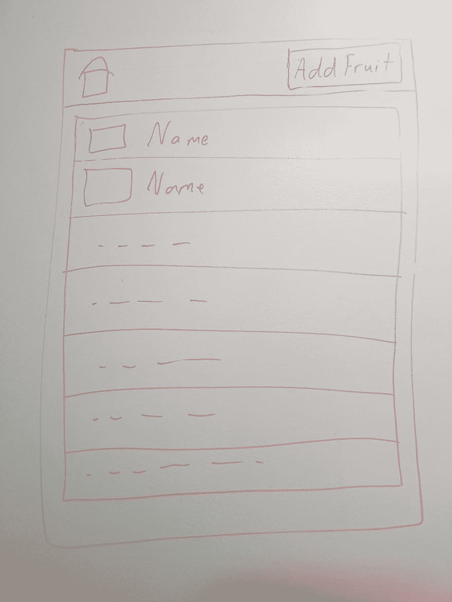
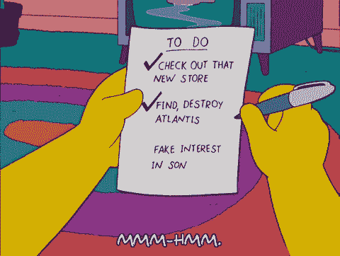

# 水果车:测试游戏规则

> 原文：<https://dev.to/sleepycecy/fruit-cart-testing-rules-of-the-game-1k0>

在一个充满“代码漏洞”的配置和关于我们需要向原始堆栈添加什么(如果有的话)的讨论之后，我们准备开始我们的第一个用户故事:登录页面。

我们的初始页面旨在显示导航栏以及数据库中所有水果的列表。用户故事非常简单，以“As，wants to，so that”格式完成:作为一个用户，我想访问登录页面，这样我就可以看到所有当前水果的列表。我们有一个上下文(用户)，一个动作(访问登陆页)，一个值(看到当前的果实)。

验收标准很少，同样简单:如果没有水果，用户应该会看到一个“添加水果”的消息；如果有水果，用户应该看到水果。(回想起来，错误处理也应该是一个 AC:如果页面加载失败，就会显示一条错误消息。)

水果目前只有 id、名称和描述——非常简单的数据。现在 navbar 是一个独立的卡片，所以我们只关注水果的列表。

下一步:完成任务。我们需要做什么，需要接触哪些文件来完成 ACs 并完成卡片？

随着数据库的建立，我们需要一个水果模型(我们的后端是面向对象的)，水果存储库来处理 SQL 到模型的映射，水果服务来处理业务逻辑，水果控制器来提供实际的端点和处理调用。我们必须在同一个包中为所有这些创建目录和文件夹。但首先要做的是:测试。

这个项目的主要目标是使用 TDD 或测试驱动开发创建一个简单的 CRUD 应用程序。这在实践中意味着什么:

*   我们首先编写测试每当我们开始一项新功能时，测试是我们编写的第一行代码。因此。。。
*   *测试定义生产代码*它们首先定义编写什么代码。他们驱动代码。例如:我们知道当调用`getAllFruits()`方法时，我们的水果购物车服务需要返回一个名为“apple”的水果项目。因此我们编写了一个调用`getAllFruits()`的测试，其结果应该包括字符串“apple”。这使我们能够牢记结果和期望，并最终变得更受价值驱动。毕竟，如果你不知道你想要你的代码做什么，为什么要写它呢？
*   测试和产品代码一样重要我们花同样多的时间来编写好的测试和好的代码。它们不是事后的想法，它们允许我们以一种叫做。。。

*   我们一步一步来。如果通过硬编码一个字符串“apple”的返回值最容易使服务通过上面的测试，那么这就是我们所做的。测试将会通过，我们可以进入下一步:重构。
*   *红，绿，重构*啊，TDD 的核心。写你的测试，让它失败(红色)。写你的代码，用最简单的方式，让它通过(绿色)。这最初可能意味着硬编码，就像上面的例子一样。然后重构您的代码。硬编码值是一种代码味道，所以在这种情况下，您应该将其重构出来。每当您做出可能改变返回值的更改时，都要运行测试。

*   改变你的测试或者代码，而不是两者都改变现在测试可以像代码一样被重构。但是您不希望对两者都进行更改，运行您的测试，然后看着它们失败。那么你就不知道什么真正失败了:新重构的代码或者新重构的测试。此外，您可能实际上改变了测试所期望的行为，使得先前可靠的代码失败。

*   *测试金字塔*我们将遵循经典的测试金字塔。
    *   *单元测试将构成我们测试套件的主体*这些测试运行在离散的方法之上，并且有具体的期望。例如，如果我运行从数据库中获取所有水果信息的`getAllFruits()`方法，我应该对它的返回值有一个可靠的预期(例如，一个水果对象的数组，其中一个包含名称“apple”)。它们的优点是速度快、体积小:当它们失败时，它们很快就会失败，因此我们可以获得近乎即时的反馈(假设我们定期运行我们的测试)；当他们失败时，他们失败的是一个单一的功能，所以很容易找到失败的代码行。此外，它们运行所需的资源更少。拥有 Hamcrest 库的 JUnit 将成为我们后端的朋友，Jest 和 Enzyme 将成为 React 前端的朋友。T6】
    *   从计算资源的角度来看，这些测试稍微贵一些，但是它们测试的是移动部件之间的连接。例如，我们的控制器测试实际上是集成测试——当我们到达一个端点时，控制器调用服务，服务调用存储库，存储库调用数据库来获取结果。这里调用了跨多个类的几个方法，我们想确保一切正常。这些更大，需要模仿和存根(我们将在另一篇文章中返回)，并且跨越多个类。他们确保所有的东西都能一起工作，但是当他们失败时，他们要花更长的时间去做，而且很难说出到底是什么失败了。对于这些测试，我们将把 Mockito 添加到 JUnit 中。
    *   功能或 UI 测试位于顶端他们测试所有的东西——用户界面、数据库、服务等——以确保所有的东西都能正常工作。例如，当用户登陆我们的页面时，他们应该看到所有列出的水果。这是前端和后端部分一起工作的结果。这些测试需要更长时间，可能需要启动僵尸网络浏览器来模拟用户交互。当他们失败时，很难说出原因。Selenium 将是我们自动化这些的首选工具。

这是规矩。让(水果)游戏开始吧！