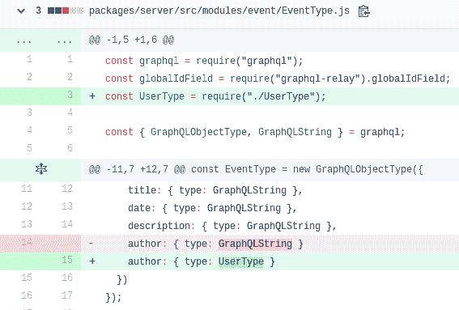
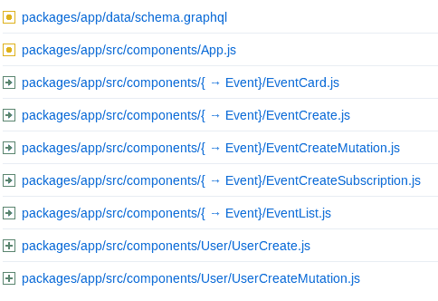
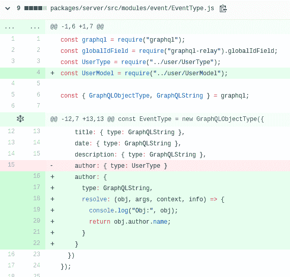

# 全堆叠:用户+登录/注册

> 原文：<https://dev.to/heymarkkop/fullstacking-users-login-register-2l6b>

在添加用户之前，我试图实现 GraphQL 的订阅，但最终遇到了很多麻烦，并决定以后再担心这个问题，因为我应该尽快启动 MVP。由于这个原因，这部分教程会有点笨拙，对此表示抱歉。

我们现在的目标是添加用户的登录和注册。我们将从复制我们所有的活动文件开始，并根据用户调整它们，因为背后的想法是完全一样的。

## (服务器用户文件)

这里没有什么大的秘密，只需复制并粘贴您的`EventType`和`EventModel`文件，并更改从事件到用户的所有内容。

此外，将 EventType 作者从 String 更改为 User，如下所示

当我们在服务器端时，我们也可以创建 [UserLoginWithMutation.js](https://github.com/Markkop/fullstacking/commit/97533ea988a8643524c87838118cd56a64607c88#diff-6ec151a2085e8c0deccbc7a0da03e720) 和[userregisterwithmutation . js](https://github.com/Markkop/fullstacking/commit/97533ea988a8643524c87838118cd56a64607c88#diff-f34217d827a55eae529952ebfb32c7ca)

不要忘记[添加](https://github.com/Markkop/fullstacking/commit/97533ea988a8643524c87838118cd56a64607c88#diff-6ec151a2085e8c0deccbc7a0da03e720)这些新的查询和变异到我们的 GraphQL 类型中，并更新它的模式(`yarn update-schema`)

请确保将用户和事件文件分在不同的文件夹中，以便项目保持有序。

## 用户文件(app)

在应用程序的文件夹中，你将[模仿策略](https://github.com/Markkop/fullstacking/commit/8c92938e2fd2df4768ab1c878ad144033ea9c120)。

## 密码和 JWT

为了加密和解密密码，我们将使用`bcryptjs` lib 和 JWT `jsonwebtoken` lib。
检查[这个提交](https://github.com/Markkop/fullstacking/commit/6fb3f0dfa81a249ac5044e8ddada71369ee37ed3)看看这几行是怎么实现的。

## 导航和认证

对于[导航](https://github.com/Markkop/fullstacking/commit/740bc38c7afd837c8d9dcb5da099070b4ee9eb3b)，我们将使用`react-navigation`和名为`createMaterialTopTabNavigator`的临时导航器。这与`react-router`非常相似，认证栈可以通过这种方式实现[。](https://reactnavigation.org/docs/en/auth-flow.html)

我们还需要从服务器返回 JWT，以确保我们的用户可以执行请求。

## 作者字段

我们希望显示事件的作者姓名，而不需要手动插入。我仍然没有找到正确的方法，但设法实现了这个变通办法:

我们很快就会改变这种情况