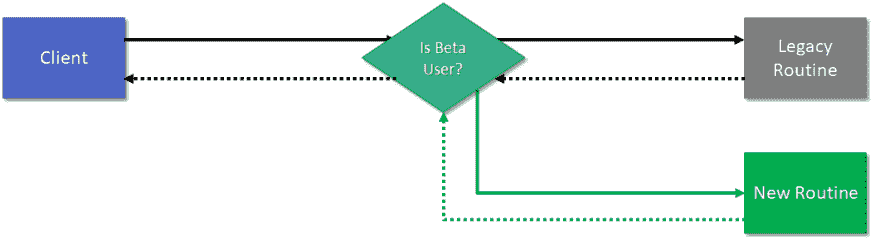
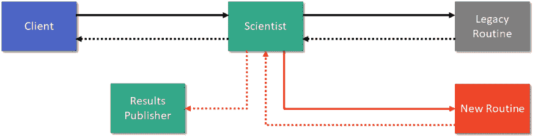

# 功能标志带来的乐趣

> 原文：<https://dev.to/integerman/fun-with-feature-flags-31jf>

特性标志是一种简单的技术，它可以让你切换一个新的功能在你的软件中是否可用，或者它的行为的某些方面。

在本文中，我将讨论为什么这个想法并不像听起来那么疯狂，如何实现一个简单的特性标志，不同类型的特性标志以及触发它们的不同方式，

注意:如果“标志”这个术语让你感到困惑，那就把它想象成一个开关。它指的是一个布尔(真/假)变量，而不是一块在风中飘动的织物。

# 为什么要使用特征标志？

乍一看，标志的想法听起来有点奇怪——毕竟，如果你不想让某个特性可用，为什么一开始就把它放在代码中呢？

首先，对一个用户有效的方法可能不适用于生产环境中更广泛的数据集或交互。您可能希望定义一个 *beta 用户专用*类型的功能标志，其中某个功能只对一部分用户启用，直到被证明可以正常工作。

[](https://res.cloudinary.com/practicaldev/image/fetch/s--_U9HtrlY--/c_limit%2Cf_auto%2Cfl_progressive%2Cq_auto%2Cw_880/https://imgur.com/vy6nhFg.png)

其次，许多产品都有一个精心安排的“上线”日期。您可能希望新代码提前投入生产，以减少任何额外的风险，然后在某个神奇的日期到来时激活某个特性。

最后，如果您频繁地将代码发布到产品中，如果大型特性(也称为 epics)需要很长时间才能完成，那么分支管理可能会很困难。您花费了更多的时间来管理不同的分支，并且失去了生产力和在周期的早期发现 bug 的机会。特性标志允许您在生产中以离线状态发布部分特性，但是在完整特性准备好之前，在 QA 或 beta 环境中测试它们。

# 实现一个特征标志

那么，功能标志实际上是什么样子的呢？

```
private static IResumeAnalyzer GetResumeAnalyzer()
{
    // Check whatever configuration management this application uses
    if (ConfigHelper.GetBoolean("UseNewAnalyzer"))
    {
        return new RewrittenAnalyzer();
    }
    else
    {
        return new ResumeAnalyzer();
    }
} 
```

Enter fullscreen mode Exit fullscreen mode

在上面的例子中，我们从应用程序框架所依赖的配置文件中提取一个设置。如果`UseNewAnalyzer`的值被设置为真，那么将使用`RewrittenAnalyzer`，否则将使用遗留版本。

非常简单的代码，但是最终效果是让我们改变一个文件，应用程序的行为完全不同。根据您的语言和部署环境，应用程序甚至可能不需要重新启动。

# 配置特征标志的方式

特性标志不必从配置文件中移除。在不同的情况下，有许多其他的选择可能是有意义的。

功能标志的常见触发器包括:

*   基于配置文件中的值(参见上面的示例)
*   基于数据库表中的值
*   在某一天(或在一系列日期之间)变得活跃或不活跃
*   仅对测试版用户有效
*   仅在一定比例的时间内或对随机的用户子集有效(通常用于 A/B 测试)
*   基于外部 web 服务调用返回的值
*   由外部服务管理，如[黑暗启动](https://launchdarkly.com/features/feature-flags/)

# 对特征标志的异议

好的，特性标志使得离线部署代码或者向特定的用户子集部署代码变得更加容易。听起来质量不错，但是代价是什么呢？

没有什么是免费的，通过功能标志，您可以在几个关键领域付出代价:

### 测试

测试变得更加困难和冗长，因为你现在需要确保你测试激活一个特性和去激活一个特性。我曾经看到过团队尝试采用特性标志，并且只在活动状态下测试特性，然后看到当特性在离线状态下部署时，预览环境被磨得不成样子。

此外，如果各种功能相互作用，并且每个功能都有一个开关，您应该测试不同功能状态的所有不同组合。这也是我强烈建议删除那些已经完全上线或永久退役的功能的旧功能标志的主要原因。

### 数据库模式

如果您有一个依赖于数据库迁移脚本的新功能，该脚本会影响现有的表，那么您需要考虑如果该功能脱机，旧数据将会工作多久，如果该功能需要从联机变为脱机(反之亦然)会发生什么，以及其他各种问题。

通常最好的做法是通过部署新特性来迁移数据——即使它将处于离线状态，但这并不是在所有情况下都可行。

或者，您可以将要素版本存储在正在修改的表的列中，这样您就可以区分哪些行与新要素相关联，哪些行与传统方式相关联。这有助于您控制与新功能状态之间的迁移，但是复杂性的代价很高。

### 配置管理

更多配置的开销意味着现在管理每个环境和跟踪每个环境中每个功能的状态有点困难，这可能会导致混乱或其他问题。

# 下一步

最终，对于需要尽早发布的主要长期测试版特性，或者对于可能需要快速回滚选项而不需要代码更改/部署的有风险的更改，特性标志是一个值得考虑的好东西。

如果你想了解更多关于 C#中特性标志的知识，请看[我的关于特性切换](https://dev.to/integerman/safe-net-feature-flags-with-featuretoggle-450h)的文章。

虽然在某些情况下我会使用特性标志，但我更喜欢使用 Scientist 系列库，以便在不影响用户的情况下测试新代码在生产中的效果。

[](https://res.cloudinary.com/practicaldev/image/fetch/s--K_ZTM6A2--/c_limit%2Cf_auto%2Cfl_progressive%2Cq_auto%2Cw_880/https://imgur.com/FDAgrQO.png)

见我与科学家一起写的关于无受害者金丝雀测试的文章。NET 获得更多关于这个过程的细节。

[](/integerman) [## 无受害者的金丝雀测试与科学家。网

### matt Eland Aug 31 ' 194min read

#testing #dotnet #devops #codequality](/integerman/victimless-canary-testing-with-scientist-9nn)

* * *

*保罗在 Unsplash 上的封面照片*