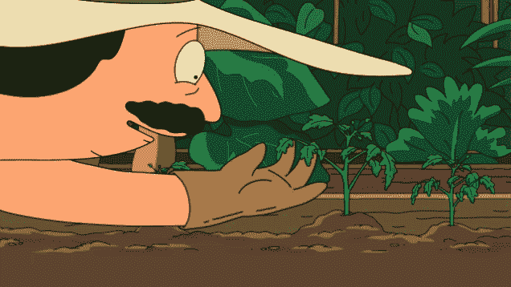
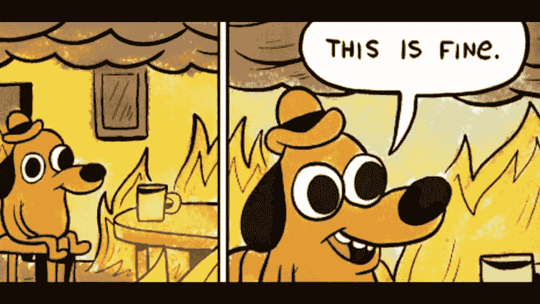
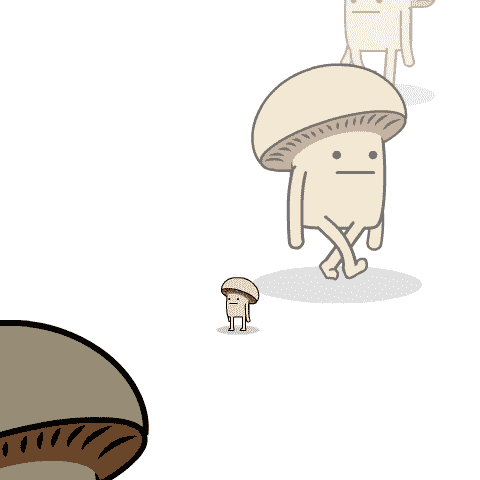
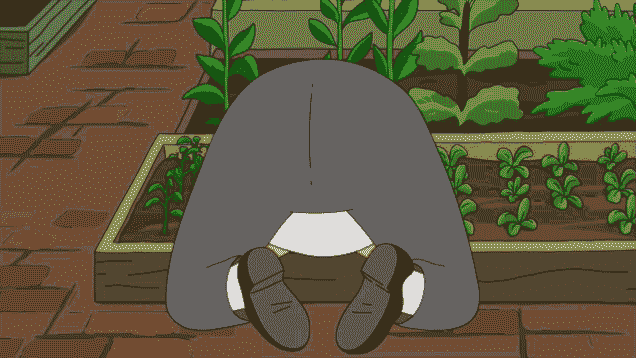

# 园艺-培养更好的软件

> 原文：<https://dev.to/htissink/gardening-cultivating-better-software-4kll>

# 熵

看起来，生命中的系统，无论我们如何努力保持它们的运行，都趋向于熵。无论我们如何努力，我们都无法建造永生的东西——永生，即使从抽象的意义上来说，似乎也是一个遥不可及的目标。

系统是建立起来的，它们存在一段时间，一生。更成功的系统持续时间更长，做得更多。这种系统可以经受住时间的考验，通过维护和保养，使用侵蚀的强度可以减轻，但不能防止。

有一个至关重要的因素可以让好的系统运行更长时间——园艺。精心梳理、浇水和除草对花坛的生存至关重要。它需要持续的监控和警惕——当杂草冒出来的时候就除掉它们；地面变干时给花浇水；当土壤变得贫瘠时给它施肥。

# 园艺

美丽的花园是一件快乐的事情。它的价值，投入的时间和精力，都隐含在它的存在中。在它的设计中可以找到某种乐趣——这就是*系统*中的人的因素。

一个花园只能有一个**园丁**存在；一个美丽的花园需要一个好的**园丁**，做*持续的园艺*。没有园丁，花园就会枯萎死亡——就像一个系统。园艺对于创造、维护和保存一个美丽的花园是必不可少的；但是园丁来来去去，花园也是如此。

对我来说，软件就是对构建美丽系统的痴迷，就像美丽的花园一样，这些系统需要*持续的园艺*。没有它，他们腐烂——地面干涸；土壤变得贫瘠，*杂草接管*。

作为有责任心、有礼貌的园丁，我们有责任保持花园的健康。健康的软件寿命更长，性能更好。维护更容易，而且它对变化的反应也很好。

那么，我们如何维护我们的软件呢？我们如何浇灌我们的代码，清除错误，清除腐败？

## 一切都在**火上**

我们很少有机会开始新的东西。我们所做的大部分事情都是在维护已经做好的事情——而且通常是一团糟。这些项目的*欢迎委员会*总是有*的理由*和*的借口*来解释为什么会这样。混乱总是有原因的。但说实话，谁在乎呢。

让我们花一分钟来感谢那些善意的傻瓜，包括我们自己，没有他们，我们大多数人都不会有工作。感谢过去的我，也感谢过去的你。

开始这样一个项目是令人生畏的。代码库又大又纠结，总有一部分代码没人碰。用双手，我怎么强调都不为过，伸出手抓住那些部分。把它们摇来摇去；打破他们一些；弄清楚它们是如何工作的，慢慢开始理解它们。

这样做会让你成为团队中的关键人物——你是那种愿意和令人讨厌的东西一起工作的人。它会让你修理它，清洁它，并擦洗掉腐烂。

## 小补丁也是补丁

所有的修复都是有价值的。重命名变量、重构代码或大的功能更改都会增加代码的价值。不要犹豫，因为你的零钱太少了。

## 但是什么是**遗留代码**？

遗留代码是未经测试的代码。为你的单元测试保持一个良好的覆盖率——根据你自己的判断选择一个——并且总是确保你的系统的核心部分经过了完全的单元测试。这将允许你朝三暮四，随心所欲地重构，而不必担心破坏一些关键的东西。

但是**不要在测试迷宫中迷路。这可能以几种方式发生。第一个是当你开始写这么多测试时，你最终会测试一些愚蠢的东西*，比如控制器*。100%的测试覆盖率是愚蠢的——这让我想到了[罗素悖论](https://en.wikipedia.org/wiki/Russell%27s_paradox) *什么测试测试*？有一个好的测试级别，然后有一个任意级别的测试-尝试并坚持前者。**

你可能会发现自己身处的第二个迷宫，是试图测试比 1956 年斯潘德克斯泳装目录中的*贝蒂·怀特耦合得更紧的代码。你开始注入，注入*和注入*依赖，你的测试开始看起来一团糟。在这种情况下，最好把它留到以后。*

## 时间投入

当杂草冒出来时，花点时间给花园除草。最优雅的修复需要时间——最优雅的修复持续时间最长。编写好的代码需要时间——修复不好的代码需要更长的时间。倾向于代码的*床，理解它需要时间，不要匆忙(但也不要太慢)。*

作为一名*专业*软件工程师，我遵守 [IEEE 道德准则](https://www.computer.org/education/code-of-ethics)。正因为如此，我对自己有一定的标准——这是我的客户可以期待的标准。我不会匆匆忙忙地将某样东西投入生产*，因为业务现在就需要它*。这是不负责任的，不道德的。我也不会以蜗牛的速度前进，但我会确保我产生最小的技术债务。

## 满床的玫瑰

阅读代码是一种痛苦的经历；写代码是一件快乐的事。这会将我们引向一条非常危险的道路——我们开始编写我们需要的所有代码*,尽管大部分功能已经存在*。

记住你写的任何代码都是旧的。在开始之前花些时间，在代码库中搜索已经存在的内容。必要时扩展它，必要时编写新代码。练习你的[编码高尔夫](https://en.wikipedia.org/wiki/Code_golf)。

编写高尔夫代码是使用尽可能少的键击来编写函数的艺术。这是对代码简洁的一个很好的练习。

## 语境是关键

确保你了解你正在做的事情的背景。不要因为别人叫你做什么你就做什么。更大的图景是编写有目的的软件的关键。理解所有的活动部分是如何一起工作的，可以让你清晰地编写 API，并有力地定义这些契约。你很快就会弄清楚你的作品到底需要什么样的*才能在更大的系统中干净利落地*工作*。*

## 以极端偏见终止

另一个有争议的点，也是我的开发者非常关心的，就是消除带有极端偏见的糟糕代码。如果你能看到它，如果你能从逻辑上解释为什么它不好——把它像**肿瘤**一样切除。

有了 Git 这样的版本控制工具，删除糟糕的代码应该很容易，而且应该毫不畏惧地完成。如果你打碎了什么东西，那又怎么样？现在，您的代码损坏更少了——彻底修复损坏的代码，一切都会变得更好。最坏的情况只是回滚您的更改并重试。

不要害怕改变事情——代码变得更好、更健康的唯一方法是采取零容忍的方法来清理它。

## 休息一下

打破东西不好，*对不对*？让我在这里说得非常清楚

**打破事物是伟大的(甚至是荒诞的)**！

你刚刚破解了密码的关键部分吗？如果适当的单元测试已经就绪，这些代码将*永远不会*进入代码库。因此，编写测试来防止下次出现这种*。修复它，理解它，重组代码，这样**就不能再在这里中断了。***

 *编写好的代码应该做好两件事——它应该允许自己优雅地中断；并且它应该允许自己被快速修复。

破解代码可能是一个有争议的话题。因为*破*这个概念本来就不好。但是，如果你不断地以不同的方式打破一些东西，并消除所有破坏它的缺陷，你就会有一个更强大、更有弹性的系统。

## 好心没好报

在你追求真理、荣誉和更好的代码的过程中，你不可避免地会被冒犯。老实说，这可能是*园艺*中最难的部分。人是有感情的，人是写代码的。这些人将他们的代码视为自己的延伸。我也是——而且我*真的不应该*。这将会发生，你能做的最好的事情就是大声说出你在做什么，为什么要这么做。

完全清晰地解释你自己。不要怀疑你正在做的事情；并且清楚地表明你这样做没有轻蔑或恶意。你在为每个人编写更好的代码*。*

这是一场艰难的文化变革，伤害人们的感情很糟糕——但你必须*敲碎一些鸡蛋来做煎蛋卷*。如果煎蛋卷对每个人都有好处，那也没关系。

## 赤裸裸的真相

最终我们都是人。我们犯错，犯错误。一起工作，而不是相互对抗。作为一个团队，你可以比个人取得更多的成就。寻找共同点，与你的开发伙伴建立团结。我们都在一起，健康的工作环境让每个人的生活都变得更好。

# 再见，感谢所有的鱼

这是一首更柔和的曲子，比我通常写的东西少了很多技术性——但它直接来自我的内心。我袖手旁观所有的观点，我希望它能帮助你努力建造一个美丽的花园。

如果你不介意的话，我现在就在这里做园艺

*