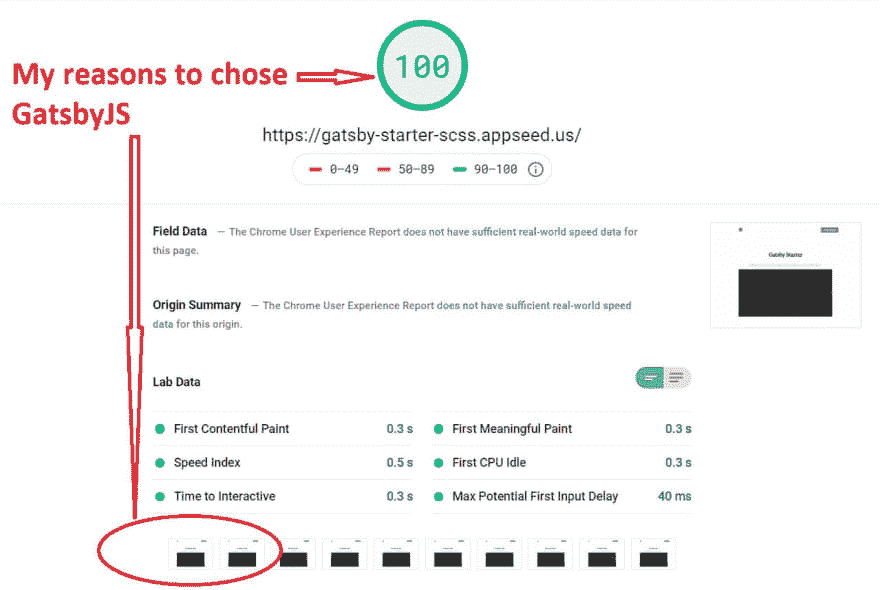
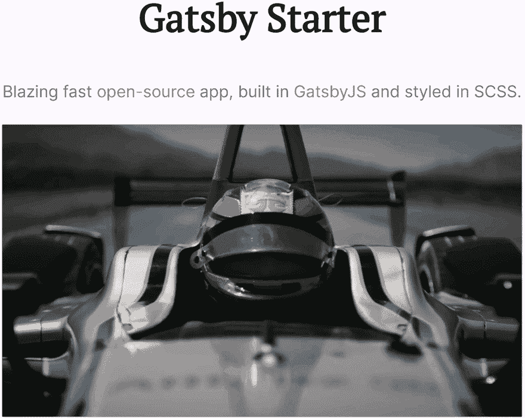

# 盖茨比-轻松拿下灯塔 100 分

> 原文：<https://dev.to/sm0ke/gatsby-starter-how-to-score-100-on-lighthouse-3582>

各位编码员好，

我最近非常关注 JAMstack 和 web 开发工具。
在挖掘了几个星期来寻找一个现代工具链来共鸣之后，我可以说赢家是[盖茨比](https://www.gatsbyjs.org/)。我写这篇文章不是为了说服任何人 [GatsbyJS](https://www.gatsbyjs.org/) 会征服宇宙或者比其他工具更好。只是有些东西我 100%兼容。

* * *

> 谢谢大家！**内容由 [AppSeed - App 生成器](https://appseed.us)T3】提供。**

* * *

IMHO， [GatsbyJS](https://www.gatsbyjs.org/) 成功地将网络应用内容(用户看到的&使用的内容)与技术(开发者空间)隔离开来，并将这些**世界**很好地联系起来。

基于这些事实，请允许我介绍我玩的最新应用程序:一款由 SCSS 设计的[盖茨比 stater](https://gatsby-starter-scss.appseed.us/) 。没有沉重的引导，没有 jQuery。只是一个干净简单的布局，超快的用户界面，在 Lighthouse 上得分最高。

[](https://res.cloudinary.com/practicaldev/image/fetch/s--bE9Oszrn--/c_limit%2Cf_auto%2Cfl_progressive%2Cq_auto%2Cw_880/https://raw.githubusercontent.com/app-generator/static/master/gatsby-starter-scss/gatsby-starter-scss-lighthouse-score.jpg)

> 如何使用这款 Gastby 启动器

```
npm install -g gatsby-cli # install Gatsby CLI

# clone the app
gatsby new gatsby-starter-scss https://github.com/app-generator/gatsby-starter-scss

# start the app
cd gatsby-starter-scss/ && gatsby develop

# Build for production
gatsby build 
```

Enter fullscreen mode Exit fullscreen mode

[](https://res.cloudinary.com/practicaldev/image/fetch/s--e3JWCNA0--/c_limit%2Cf_auto%2Cfl_progressive%2Cq_66%2Cw_880/https://raw.githubusercontent.com/app-generator/static/master/gatsby-starter-scss/gatsby-starter-scss-intro.gif)

## 资源

*   [盖茨比启动器 SCSS 演示](https://gatsby-starter-scss.appseed.us/)
*   [盖茨比首发 SCSS 来源](https://github.com/app-generator/gatsby-starter-scss)
*   [GatsbyJS 应用程序](https://appseed.us/apps/gatsbyjs) -由 AppSeed 提供的索引
*   盖茨比主题 -由 HTM5Up、LekoArts、Creative-Tim 制作

> 谢谢大家！