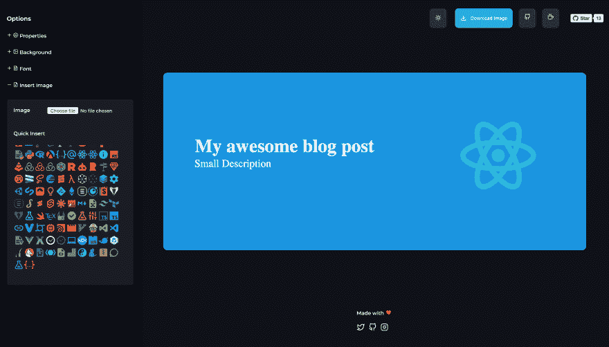

# 轻松为你的开发职位生成封面图像

> 原文：<https://dev.to/pjijin/generate-cover-image-for-your-dev-posts-easily-27co>

为你的在线开发文章生成封面图片。

[https://www.youtube.com/embed/GGTrhgKrch8](https://www.youtube.com/embed/GGTrhgKrch8)

##  [ PJijin ](https://github.com/PJijin) / [封面-图像-生成器](https://github.com/PJijin/Cover-Image-Generator)

### 📕为你的博客文章生成封面图片📝https://blogcover.now.sh/

<article class="markdown-body entry-content container-lg" itemprop="text">

# <g-emoji class="g-emoji" alias="cityscape" fallback-src="https://github.githubassets.cimg/icons/emoji/unicode/1f3d9.png">🏙</g-emoji>封面图像生成器

在线为你的博客文章制作封面图片。

### 其他项目:

*   <g-emoji class="g-emoji" alias="bookmark" fallback-src="https://github.githubassets.cimg/icons/emoji/unicode/1f516.png">🔖</g-emoji> [降价](https://github.com/JP1016/Markdown) -现场降价生成器
*   <g-emoji class="g-emoji" alias="spiral_notepad" fallback-src="https://github.githubassets.cimg/icons/emoji/unicode/1f5d2.png">🗒</g-emoji> [论文](https://github.com/JP1016/Paper)——一款“无云”笔记 app，分享“无网络”。
*   <g-emoji class="g-emoji" alias="man_technologist" fallback-src="https://github.githubassets.cimg/icons/emoji/unicode/1f468-1f4bb.png">👨‍💻</g-emoji> [ShowPath](https://github.com/PJijin/Show-Path) -程序员的学习之路

**[用 CodeKeep 截图生成代码截图](https://codekeep.io/screenshot)**

```
⚠️ Clear cache and check demo. On mac CMD + Shift + R, On Windows Ctrl + F5 
```

[](https://github.com/PJijin/Cover-Image-Generator)

<g-emoji class="g-emoji" alias="white_check_mark" fallback-src="https://github.githubassets.cimg/icons/emoji/unicode/2705.png">✅</g-emoji> 现场预告:[点击这里](https://blogcover.now.sh/)

<g-emoji class="g-emoji" alias="video_camera" fallback-src="https://github.githubassets.cimg/icons/emoji/unicode/1f4f9.png">📹</g-emoji>视频预告:[点击这里](https://www.youtube.com/watch?v=GGTrhgKrch8)

由 [](https://twitter.com/jp1016v1) [](https://twitter.com/PJijin) 制成带<g-emoji class="g-emoji" alias="heart" fallback-src="https://github.githubassets.cimg/icons/emoji/unicode/2764.png">的❤️</g-emoji>

## <g-emoji class="g-emoji" alias="sparkles" fallback-src="https://github.githubassets.cimg/icons/emoji/unicode/2728.png">✨</g-emoji> 特色

*   <g-emoji class="g-emoji" alias="milky_way" fallback-src="https://github.githubassets.cimg/icons/emoji/unicode/1f30c.png">🌌</g-emoji>在线生成封面图片。

*   <g-emoji class="g-emoji" alias="computer_mouse" fallback-src="https://github.githubassets.cimg/icons/emoji/unicode/1f5b1.png">🖱</g-emoji> 拖放-轻松改变内容位置

*   🖼从电脑中插入图片

*   <g-emoji class="g-emoji" alias="sunrise" fallback-src="https://github.githubassets.cimg/icons/emoji/unicode/1f305.png">🌅</g-emoji>从 URL 更改背景图片，从 Unsplash 插入

*   <g-emoji class="g-emoji" alias="computer" fallback-src="https://github.githubassets.cimg/icons/emoji/unicode/1f4bb.png">💻</g-emoji>快速插入编程标志(材料图标)

*   <g-emoji class="g-emoji" alias="rainbow" fallback-src="https://github.githubassets.cimg/icons/emoji/unicode/1f308.png">🌈</g-emoji>更改画布边框

*   <g-emoji class="g-emoji" alias="high_brightness" fallback-src="https://github.githubassets.cimg/icons/emoji/unicode/1f506.png">🔆</g-emoji>暗/亮模式

*   <g-emoji class="g-emoji" alias="on" fallback-src="https://github.githubassets.cimg/icons/emoji/unicode/1f51b.png">🔛</g-emoji>改变画布宽度、高度

*   <g-emoji class="g-emoji" alias="art" fallback-src="https://github.githubassets.cimg/icons/emoji/unicode/1f3a8.png">🎨</g-emoji>自定义背景、字体颜色

*   <g-emoji class="g-emoji" alias="arrow_down" fallback-src="https://github.githubassets.cimg/icons/emoji/unicode/2b07.png">⬇️</g-emoji> 下载 PNG、SVG、JPEG 格式的图片

*   <g-emoji class="g-emoji" alias="fountain_pen" fallback-src="https://github.githubassets.cimg/icons/emoji/unicode/1f58b.png">🖋</g-emoji> 字体选择选项

*   背景变暗选项

## <g-emoji class="g-emoji" alias="memo" fallback-src="https://github.githubassets.cimg/icons/emoji/unicode/1f4dd.png">📝</g-emoji>到

…</article>

[View on GitHub](https://github.com/PJijin/Cover-Image-Generator)

一些特征是

🌌在线生成封面图像。

🖱拖放-改变内容位置很容易

🖼从电脑上插入图像

💻快速插入编程标志(材料图标)

🌈更改画布边框半径和样式

🔆暗/亮模式

🔛更改画布宽度、高度

🎨自定义背景、字体颜色

⬇️下载图片

计划添加一些选项，如:

*   选择一个预制模板，节省时间⏰

随时报告问题并贡献🥰

如果你喜欢这个项目，就去⭐️😍，请随意提出问题🎉

github:[https://github.com/PJijin/Cover-Image-Generator](https://github.com/PJijin/Cover-Image-Generator)

现场演示:[https://blogcover.now.sh/](https://blogcover.now.sh/)

加入 https://www.producthunt.com/posts/blog-cover✨[的 product hunt](https://www.producthunt.com/posts/blog-cover)

评论你的建议🥰

在推特上关注:[https://twitter.com/PJijin](https://twitter.com/PJijin)