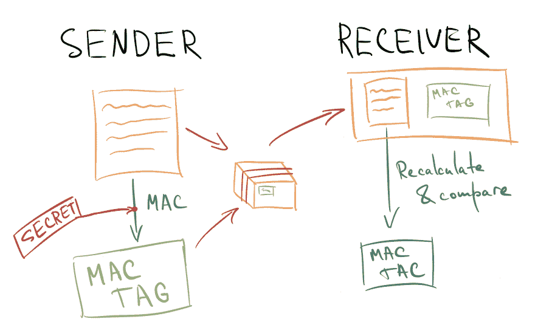
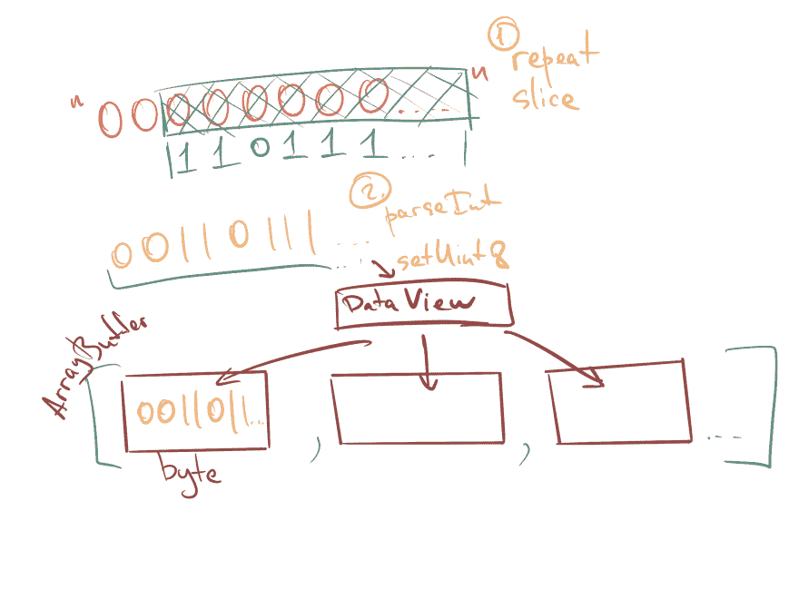
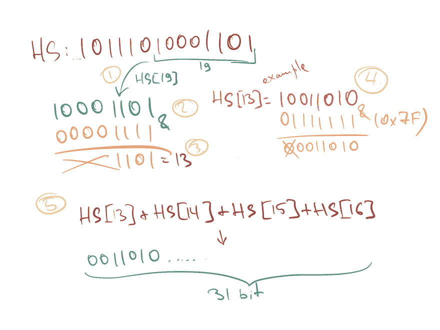

# 使用 Web Crypto API 在 JS 中生成 2FA 一次性密码

> 原文：<https://dev.to/al_khovansky/generating-2fa-one-time-passwords-in-js-using-web-crypto-api-1hfo>

###### 照片由[弗洛里安·伯杰](https://unsplash.com/@bergerteam)拍摄

## 简介

今天 2FA 无处不在。这使得盗取账户比获得正确的密码更难。虽然这并不能让你的在线资产免受黑客攻击，但这需要更复杂、更多层次的攻击。就像世界上的任何事情一样，事情越复杂，就越有可能失败。

我非常肯定，正在阅读这篇文章的每个人一生中都使用过基于 OTP 的 2FA。今天，我邀请您来看看这种简单却如此普遍的技术的内幕，这种技术如今保护着无数的账户。

但是在我们开始之前——这里是我们今天将要构建的[演示](https://khovansky.me/demos/web-otp)。

## 基础知识

谈到 OTP，首先应该提到的是，OTP 有两种类型。 **HOTP** 和 **TOTP** 。即**基于 HMAC 的一次性密码**和**基于时间的动态口令**。TOTP 并不是完全不同的东西，而是对 HOTP 的增强，所以让我们先来谈谈基本形式。

**HOTP** 算法由 [RFC4226](https://tools.ietf.org/html/rfc4226) 描述。这是一个 35 页长的小规范，包含了从形式描述到实现示例和测试用例的所有内容。让我们看看它的一些核心概念。

首先， **HMAC** 基是什么意思？HMAC 代表**基于哈希的消息验证码**。

MAC 是一种证明消息来自预期发送者而不是其他人的方法。 **MAC 算法**使用只有发送方和接收方知道的密钥产生一个 **MAC 标签**。因此，当你收到一条消息时，你可以自己重新计算 MAC 标签，如果它与发送的那个相匹配，那么你就可以确定这条消息来自预期的发送者，而不是那些戴着巴拉克拉法帽的黑客。另外，这也验证了数据的完整性，比如数据在传输过程中是否被损坏。您无法真正区分两个事件，但可以肯定的是，在这两种情况下，数据都被破坏了。

[](https://res.cloudinary.com/practicaldev/image/fetch/s--JWFsSihq--/c_limit%2Cf_auto%2Cfl_progressive%2Cq_auto%2Cw_880/https://thepracticaldev.s3.amazonaws.com/i/je8t165ars4io9awph20.PNG)

我在本文中包含了一些类似的图片。这可能很傻，但希望有助于说明一些事情，并使这面文字墙不那么沉闷。也许他们太愚蠢了...

现在，什么是哈希？哈希是通过**哈希函数**运行消息的产物。哈希函数获取您的数据，并从中生成其他固定长度的数据。比如有一个众所周知的 **MD5** 哈希函数。它被广泛用于验证你下载的数据没有被破坏。基本上，你输入一些数据，在输出端得到一个类似于`CCB4DB2088210…`的字符串。

**MAC** 本身并不是一个特定的算法，而是指代一个的术语。**反过来是一个具体的实现。或者更准确地说——HMAC-*X*，其中 *X* 是密码哈希函数之一。现在，HMAC 接受两个参数——一个密钥和你的信息，以一种特殊的方式将它们混合在一起，应用你选择的散列函数两次，产生一个 MAC 标签。**

 **但是这篇文章不是关于密码学的，您可能想知道——所有这些与一次性密码有什么关系？别担心，我们就快到了。

根据规范，HOTP 基于两个值计算:

*   **K** —客户端和服务器端共享的**密钥**
*   **C**—**计数器**或移动因子

密钥是一个长度必须超过 128 位的值，最好是 160 位。它是在您最初设置 2FA 时生成的。

计数器是一个 8 字节的值，在服务器和客户端之间同步。它会随着您生成密码而不断更新。在 HOTP，每次生成新密码时，客户端计数器递增，每次验证密码时，服务器计数器递增。因为我们可以在不实际使用密码的情况下生成密码，所以服务器允许计数器值比当前值稍微超前一点，但只能在某个窗口内。如果你玩 OTP 令牌玩得太多，而且它是一个`HOTP`算法——你将不得不与服务器重新同步你的令牌。

好吧。您可能已经注意到，这里有两个输入参数，就像 HMAC 本身一样。RFC4226 是这样定义 HOTP 的:

```
HOTP(K,C) = Truncate(HMAC-SHA-1(K,C)) 
```

Enter fullscreen mode Exit fullscreen mode

因此，K 可预见地被用作我们的密钥，而**C**counter 被用作消息。在 HMAC 生成 MAC 之后——一个神秘的`Truncate`函数被用来提取你在认证器应用中看到的熟悉的数字一次性密码。

让我们开始生成，并在编码的过程中学习剩下的部分！

## 实施计划

我们将需要以下步骤来获得这些 OTP。

[](https://res.cloudinary.com/practicaldev/image/fetch/s--XzaiCdCP--/c_limit%2Cf_auto%2Cfl_progressive%2Cq_auto%2Cw_880/https://thepracticaldev.s3.amazonaws.com/i/5q7gaqkfytoevuwugwbw.PNG)

*   从我们的 **K** 和 **C** 参数生成 HMAC-SHA1 值。这将是一个 20 字节的字符串
*   以特定方式从字符串中提取 4 个字节
*   将这些字节转换成一个数，用该数除以 10^n，其中 n = OTP 中的位数，然后取余数。通常 n=6。

看起来并不复杂，对吧？我们将从生成 HMAC 开始。

## 生成 HMAC-SHA1

这可能是我们计划中最简单的部分。当然，我们不会推出自己的密码。永远不要使用你自己的密码。我们将使用 [**Web Crypto API**](https://www.w3.org/TR/WebCryptoAPI/) 。现在，这里要提到的一点是，根据规范，它只在安全的上下文中公开。这意味着，除非你的脚本运行在 HTTPS 网站上，否则你无法修改它。我怀疑您的 localhost dev 服务器是这样配置的。我的当然不是！你可以在这里阅读更多关于为什么会变成这样的历史(以及无数失望的开发者的声音)[。](https://github.com/w3c/webcrypto/issues/28)

幸运的是，在 Firefox 中，你可以在任何上下文中使用 Webcrypto，而不必重新发明轮子或导入任何第三方库来做这件事。因此，出于本文的目的，我们将使用 FF。

加密 API 本身位于`window.crypto.subtle`下。如果你想知道它的微妙之处，让我在这里引用它的规格:

> 命名为`SubtleCrypto`是为了反映这样一个事实，即许多算法都有微妙的使用需求，以便提供所需的算法安全性保证

让我们快速浏览一下我们将使用的 Crypto API 方法，并设置好一切。 **NB** :这里提到的所有方法都是异步和返回承诺。

首先，我们需要`importKey`方法，因为我们自带密钥，而不是在浏览器中生成密钥。它需要 5 个参数:

```
importKey(
    format
    keyData,
    algorithm,
    extractable,
    usages
); 
```

Enter fullscreen mode Exit fullscreen mode

在我们的案例中:

*   `format`将是`'raw'`，这意味着我们将在`ArrayBuffer`中以原始字节的形式提供密钥。
*   `keyData`就是上面说的 ArrayBuffer。我们稍后将讨论如何生成它
*   根据 OTP 规范，`algorithm`将为`HMAC-SHA1`。这必须是一个 [HmacImportParams](https://developer.mozilla.org/en-US/docs/Web/API/HmacImportParams) 对象
*   `extractable`可以是假的，因为我们不打算导出密钥
*   最后，在所有可能的`usages`中，我们只需要`'sign'`

我们的密钥将是一个长的随机字符串。实际上，它可能是一个不一定可打印的字节序列，但是为了方便起见，在本文中我们只使用一个字符串。为了将它转换成一个`ArrayBuffer`，我们将使用`TextEncoder`。有了它，这个过程只需要两行代码:

```
const encoder = new TextEncoder('utf-8');
const secretBytes = encoder.encode(secret); 
```

Enter fullscreen mode Exit fullscreen mode

现在，让我们一起来编译一切:

```
 const Crypto = window.crypto.subtle;
  const encoder = new TextEncoder('utf-8');
  const secretBytes = encoder.encode(secret);

  const key = await Crypto.importKey(
    'raw',
    secretBytes,
    { name: 'HMAC', hash: { name: 'SHA-1' } },
    false,
    ['sign']
  ); 
```

Enter fullscreen mode Exit fullscreen mode

太好了！我们让我们的加密实例处于待命状态。现在我们来处理柜台，最后在信息上签字。

根据规范，我们的计数器应该是 8 个字节，并且也是以`ArrayBuffer`的形式出现。为了将它转换成这种形式，我们将首先使用一个通常用于在 JS 中用前导零填充数字的技巧，然后使用一个`DataView`将每个单独的字节放入`ArrayBuffer`中。请注意，根据规范，所有二进制数据都被视为**大端序**(最高有效位优先)。

```
function padCounter(counter) {
  const buffer = new ArrayBuffer(8);
  const bView = new DataView(buffer);

  const byteString = '0'.repeat(64); // 8 bytes
  const bCounter = (byteString + counter.toString(2)).slice(-64);

  for (let byte = 0; byte < 64; byte += 8) {
    const byteValue = parseInt(bCounter.slice(byte, byte + 8), 2);
    bView.setUint8(byte / 8, byteValue);
  }

  return buffer;
} 
```

Enter fullscreen mode Exit fullscreen mode

[](https://res.cloudinary.com/practicaldev/image/fetch/s--GFd0j93h--/c_limit%2Cf_auto%2Cfl_progressive%2Cq_auto%2Cw_880/https://thepracticaldev.s3.amazonaws.com/i/5s74etjvd3wzjmcv2180.PNG)

有了这些，我们就可以签字了！为此，我们只需使用`SubtleCrypto`的`sign`函数。

```
const counterArray = padCounter(counter);
const HS = await Crypto.sign('HMAC', key, counterArray); 
```

Enter fullscreen mode Exit fullscreen mode

嘭！第一阶段完成。我们已经计算出了我们的`HS`值。虽然这是一个隐晦的变量名，但这是 spec 中调用该值的方式，所以我决定保留它。用这种方式将步骤从规范映射到我们的代码会更容易。下一步是什么？

> 第二步:生成 4 字节字符串(动态截断)
> 设 Sbits = DT(HS) // DT，定义如下，
> //返回 31 位字符串

DT 代表动态截断。它是这样工作的:

```
function DT(HS) {
  // First we take the last byte of our generated HS and extract last 4 bits out of it.
  // This will be our _offset_, a number between 0 and 15.
  const offset = HS[19] & 0b1111;

  // Next we take 4 bytes out of the HS, starting at the offset
  const P = ((HS[offset] & 0x7f) << 24) | (HS[offset + 1] << 16) | (HS[offset + 2] << 8) | HS[offset + 3]

  // Finally, convert it into a binary string representation
  const pString = P.toString(2);

  return pString;
} 
```

Enter fullscreen mode Exit fullscreen mode

[](https://res.cloudinary.com/practicaldev/image/fetch/s--WQKG-jTs--/c_limit%2Cf_auto%2Cfl_progressive%2Cq_auto%2Cw_880/https://thepracticaldev.s3.amazonaws.com/i/qflqwf0t0udwp9nie0tf.PNG)

请注意我们是如何对 HS 的第一个字节应用按位 AND 的。二进制中的`0x7f`是`0b01111111`，所以我们在这里只是删除第一位。在 JS 中，它只是实现了对规范定义的 31 位的截断，但在其他平台中，它还会确保第一位(也是符号位)被屏蔽掉，以避免有符号/无符号数之间的混淆。

好了，我们快到了！现在我们只需要把 DT 转换成一个整数，然后进入第三步。

```
function truncate(uKey) {
  const Sbits = DT(uKey);
  const Snum = parseInt(Sbits, 2);

  return Snum;
} 
```

Enter fullscreen mode Exit fullscreen mode

阶段 3 真的很小。我们现在需要做的就是将得到的数字除以`10 ** (number of digits in OTP)`,然后取该除法的余数。这样，我们基本上从结果数中去掉了最后 N 个数字。规范提到你必须提取至少 6 位数，可能 7 或 8 位数。理论上，因为它是一个 31 位的整数，你可以提取多达 9 位数，但在现实中，我从未见过任何超过 6 位的数字。有吗？

包含我们上面创建的所有函数的最终函数的代码将如下所示:

```
async function generateHOTP(secret, counter) {
  const key = await generateKey(secret, counter);
  const uKey = new Uint8Array(key);

  const Snum = truncate(uKey);
  // Make sure we keep leading zeroes
  const padded = ('000000' + (Snum % (10 ** 6))).slice(-6);

  return padded;
} 
```

Enter fullscreen mode Exit fullscreen mode

万岁！现在，我们如何验证我们刚刚编写的代码实际上是正确的？

## 测试

为了测试我们的实现，我们将使用 RFC 中提供的例子。附录 D 提供了秘密字符串`"12345678901234567890"`的参考值和从 0 到 9 的计数器值。它还为我们提供了计算的 HMACs 和中间截断值。对调试这个算法的所有步骤非常有用。下面是只有计数器和 HOTP 值的表格示例:

```
 Count    HOTP
   0        755224
   1        287082
   2        359152
   3        969429
   ... 
```

Enter fullscreen mode Exit fullscreen mode

如果您还没有查看过[演示](https://khovansky.me/demos/web-otp)页面，现在正是时候。继续尝试那边的一些 RFC 值。请务必回来，因为我们即将继续到托普斯！

## TOTP

最后，我们来到了更现代的 2FA——TOTP。当你打开你最喜欢的认证器应用程序，看到一个小时钟在倒计时，数着你的代码到期——这就是 TOTP。那么有什么区别呢？

**基于时间的**意味着当前时间被用作移动因子，而不是静态计数器。或者准确地说，当前*时间步长*。为了计算这个*时间步长*，我们采用当前的 unix 纪元时间(从 1970 年 1 月 1 日 00:00:00 UTC 开始的毫秒数)并除以一个*时间窗口*(通常为 30 秒)。服务器通常允许一点时间漂移，以解决时间同步的不完美——大约向前和向后 1 步，取决于配置。

如你所见，这显然比普通的`HOTP`更安全。在基于时间的情况下，有效的 OTP 每 30 秒改变一次，即使它没有被使用。在原始算法中，有效密码由当前存储在服务器上的任何计数器值+计数器密码之前的任何窗口来定义。如果您不进行身份验证，该 OTP 将无限期有效。更多关于 TOTPs 的信息可以在 [RFC6238](https://tools.ietf.org/html/rfc6238) 中找到。

由于基于时间的方案是对原始算法的扩展，因此不需要对原始实现进行任何改变。我们将使用`requestAnimationFrame`并检查我们是否仍在时间窗口内。如果不是，我们将计算一个新的时间步长(计数器)并用它重新生成 HOTP。省略所有的管理代码，它看起来大概是这样的:

```
let stepWindow = 30 * 1000; // 30 seconds in ms
let lastTimeStep = 0;

const updateTOTPCounter = () => {
  const timeSinceStep = Date.now() - lastTimeStep * stepWindow;
  const timeLeft = Math.ceil(stepWindow - timeSinceStep);

  if (timeLeft > 0) {
    return requestAnimationFrame(updateTOTPCounter);
  }

  timeStep = getTOTPCounter();
  lastTimeStep = timeStep;
    <...update counter and regenerate...>
  requestAnimationFrame(updateTOTPCounter);
} 
```

Enter fullscreen mode Exit fullscreen mode

## 点睛之笔——QR 支持

通常，当我们设置 2FA 时，我们通过扫描包含所有所需数据的设置 QR 码来完成:密码、选定的 OTP 算法、帐户名、发行人名称、位数。

在我的[上一篇文章](https://dev.to/al_khovansky/intro-to-screen-capture-api-scanning-qr-codes-bgi)中，我谈到了我们如何使用`getDisplayMedia` API 直接从屏幕上扫描二维码。我最终创建了一个小的 npm 库，我们现在可以使用它轻松地将 QR 码阅读支持添加到我们的演示中。这个有问题的库叫做[流显示](https://github.com/khovansky-al/stream-display)，它将伴随着一个惊人的 [jsQR](https://github.com/cozmo/jsQR) 包。

2FA 的 QR 码中编码的 URL 应采用以下格式:

```
otpauth://TYPE/LABEL?PARAMETERS 
```

Enter fullscreen mode Exit fullscreen mode

所以，比如:

```
otpauth://totp/label?secret=oyu55d4q5kllrwhy4euqh3ouw7hebnhm5qsflfcqggczoafxu75lsagt&algorithm=SHA1&digits=6&period=30 
```

Enter fullscreen mode Exit fullscreen mode

我将省略流/识别本身的设置代码，因为在两个库的文档中都可以很容易地找到它。相反，我们可以这样解析这个 URL:

```
const setupFromQR = data => {
  const url = new URL(data);

  // drop the "//" and get TYPE and LABEL
  const [scheme, label] = url.pathname.slice(2).split('/');
  const params = new URLSearchParams(url.search);

  const secret = params.get('secret');
  let counter;

  if (scheme === 'hotp') {
    counter = params.get('counter');
  } else {
    stepWindow = parseInt(params.get('period'), 10) * 1000;
    counter = getTOTPCounter();
  }
} 
```

Enter fullscreen mode Exit fullscreen mode

在现实世界的场景中，这个秘密将是一个基数- **32** (！)编码的字符串，因为某些共享机密字节可能是不可打印的。但是为了演示的目的，我们在这里再次省略了它。不幸的是，我找不到任何关于为什么决定采用 base-32 或这种特定格式的信息。对于`otpauth`似乎没有实际的 RFC，格式本身似乎是谷歌发明的。你可以在这里了解更多信息[。](https://github.com/google/google-authenticator/wiki/Key-Uri-Format)

如果你想生成自己的 2FA 二维码用于测试，你可以使用一个神奇的 [FreeOTP](https://freeotp.github.io/qrcode.html) 工具。我做这个的时候肯定用了很多。

## 结论

有了这个——我们就完事了！同样，您可以查看[演示](https://khovansky.me/demos/web-otp)来查看它的运行情况，或者查看驱动整个过程的完整代码。

我想我们已经介绍了一些我们日常使用的重要技术，希望你今天学到了一些新东西。我花了比我想象的更多的时间来写这篇文章。但是把一个纸上的规范变成一个工作的和熟悉的东西也是非常令人愉快的。以后我们还有更多有趣的事情可以聊，敬请期待。

下次见！**