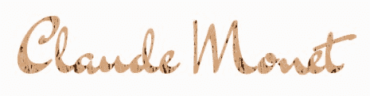
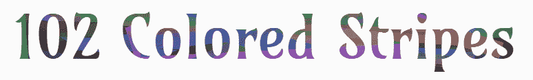
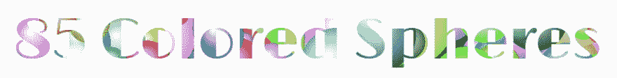

# 使用 CSS Paint (Houdini) API 生成挖空文本

> 原文：<https://dev.to/jamessouth/generating-knockout-text-with-the-css-paint-houdini-api-2lac>

在我关于新的 [CSS Paint (Houdini) API](https://developer.mozilla.org/en-US/docs/Web/Houdini) 的第一篇文章中，我介绍了 Houdini 的三个用例，以及在不支持的浏览器中填充它和用 webpack 构建。今天，我想讨论如何将 Houdini 和一种敲除文本技术结合起来，轻松地创建有吸引力的、可生成的文本效果。因为我已经介绍过 polyfill，所以我选择在本文的[演示](https://jamessouth.github.io/knockout-demo/)中不使用它，所以它们只能在 Chrome 中工作；其他浏览器只会显示黑色回退。这篇文章的回购在这里:

##  [詹姆斯南特](https://github.com/jamessouth) / [淘汰赛-demo](https://github.com/jamessouth/knockout-demo)

### 回购我的文章对 css 油漆和敲除文本

挖空文本是一种视觉效果，其中元素的文本内容被剪切掉，显示出其背后的背景，从而为字母赋予颜色，以便它们与前景形成对比并可以阅读。在 web 开发中，有几种方法可以实现挖空文本；对于这些演示，我使用了`background-clip: text` CSS 属性，因为它[被广泛支持](https://developer.mozilla.org/en-US/docs/Web/CSS/background-clip#Browser_compatibility)(带前缀)，简单且易于访问。查看我的 [15 字谜生成器](https://jamessouth.github.io/fifteen-puzzle-generator/home)来看看另一个使用图像、伪内容和 [`mix-blend-mode`](https://developer.mozilla.org/en-US/docs/Web/CSS/mix-blend-mode) CSS 属性的敲除文本技术，以及随后需要的可访问性黑客(一个微小的、不可见的`<h1>`标签)。这篇文章的演示在这里[直播](https://jamessouth.github.io/knockout-demo/)。

## 标记

<figure>

```
 <!-- index.html -->
  <body>
    <h2>Claude Monet</h2>
    <h2>102 Colored Stripes</h2>
    <h2>85 Colored Spheres</h2>
  </body>
  <style>
    h2{
      background-image: linear-gradient(black, black);
    }
    h2:first-of-type{
      background-image: paint(demo1);
    }
    h2:nth-of-type(2){
      background-image: paint(demo2);
    }
    h2:last-of-type{
      background-image: paint(demo3);
    }
  </style> 
```

<figcaption>[index.html](https://github.com/jamessouth/knockout-demo/blob/master/src/html/index.html)</figcaption>

</figure>

这里我们只有三个带有文本的`<h2>`标签，就像你在真实文档中看到的一样。为页面标题添加一个`<h1>`，这对于屏幕阅读器来说是一组二级标题。正如我在上一篇文章中所讨论的，调用我们的`paint` worklets 的`<style>`标签需要解决一个明显的缓存问题。

## 造型

<figure>

```
//demo.scss
*{
  margin: 0;
  padding: 0;
  box-sizing: border-box;
}
body{
  display: flex;
  background: #fbfbfb;
  justify-content: space-around;
  flex-direction: column;
  align-items: center;
}
h2{
  color: transparent;// can be anything but background only visible to extent transparent
  font-size: 68px;
  background-clip: text;
  -webkit-background-clip: text;// must be prefixed
  text-align: center;
  line-height: 76px;
  font-weight: 500;
  margin: .3em .25em;
}
h2:first-of-type{
  --brushstrokes: 3825;
  font-family: 'Dr Sugiyama', cursive;
  width: 60%;// reduces paint area when text takes 2 lines to maintain desired visual effect
  //of just a few dark gaps in the 'hay'
}
h2:nth-of-type(2){
  --stripes: 102;
  font-family: 'Amarante', cursive;
  line-height: 78px;// without this the descender of the 'p' gets cut off
}
h2:last-of-type{
  --spheres: 85;
  font-family: 'Limelight', cursive;
}
@media screen and (min-width: 450px){
  h2{
    font-size: 88px;
    line-height: 96px;
    max-width: 501px;// otherwise paint area would extend across viewport, requiring more
//objects to be drawn in our worklet to get the desired effect
    margin: .4em 0;
  }
  h2:first-of-type{
    width: 450px;// otherwise the cross-stroke of the 't' gets cut off
  }
  h2:nth-of-type(2){
    line-height: 102px;// also used to preserve the descender of the 'p'
  }
}
@media screen and (min-width: 775px){
  h2:nth-of-type(2){
    max-width: initial;// allows to expand as one line
  }
}
@media screen and (min-width: 942px){
  h2{
    margin: .5em 0;
  }
  h2:last-of-type{
    max-width: initial;// allows to expand as one line
  }
} 
```

<figcaption>[demo.scss](https://github.com/jamessouth/knockout-demo/blob/master/src/css/demo.scss)</figcaption>

</figure>

非常简单的样式，只是一些基本的 flexboxing 在主体上，然后是一些典型的文本样式的`<h2>`标签，每个标签都有一个 CSS 自定义属性，我们将在它们各自的 worklets 中使用。挖空文本效果是由透明文本颜色(背景只有在文本颜色透明的情况下才可见)和`background-clip: text`属性(将背景图像的外观限制在文本区域内)共同创建的，在大多数浏览器中必须将[作为前缀。](https://developer.mozilla.org/en-US/docs/Web/CSS/background-clip#Browser_compatibility)

我们希望背景足够大，能够完全覆盖文本。任何未覆盖的文本将只是文本`color`。然而，如果我们的背景尺寸远远超过了文本的面积，我们的 worklet 将会做很多未被利用的工作，这是次优的，如果你将背景动画化，这可能是一个问题。对属性做一些简单的调整，如`line-height`、`width`和`font-size`(还有`padding`和`border`)可以最小化背景尺寸和我们的`paint`函数的复杂性，同时仍然包含文本。现在，让我们来看看工作表！

## 演示 1

[](https://res.cloudinary.com/practicaldev/image/fetch/s--WLXbMw1L--/c_limit%2Cf_auto%2Cfl_progressive%2Cq_auto%2Cw_880/https://raw.githubusercontent.com/jamessouth/knockout-demo/mastimg/demo1.png)

在这里，我试图重现克洛德·莫内著名的干草堆，例如在[这幅画](https://www.claudemonetgallery.org/Haystacks-Overcast-Day.html)中看到的。通过限制背景的宽度，我可以将笔触的数量保持在合理的 3，825😃。如果背景更宽，笔触将被稀释，更多的黑色区域将可见，因此相同的外观需要更多的笔触，增加了`paint`功能的复杂性。我选择了杉山博士谷歌字体来模糊地模仿莫奈的签名。要查看底层背景图，打开开发工具并取消选中`-webkit-background-clip: text`。

<figure>

```
//(partial) demo1.js - static methods omitted, see link to file below 
  paint(ctx, { width, height }, props) {
    const brushstrokes = props.get('--brushstrokes');

    ctx.fillStyle = 'rgb(30, 10, 0)';
    ctx.fillRect(0, 0, width, height);

    for (let i = 0; i < brushstrokes; i += 1) {
      const [x, y] = Demo1.getRandomPoint(width, height);
      ctx.beginPath();
      ctx.moveTo(x, y);
      ctx.lineTo(x + Demo1.getXAdjustment(8), y + Demo1.getYAdjustment(28));
      ctx.lineWidth = Demo1.getWidth();
      ctx.strokeStyle = `rgba( ${Demo1.getNumber(201, 40)}, ${Demo1.getNumber(148, 45)}, ${Demo1.getNumber(102, 45)}, ${Demo1.getNumber(70, 31) / 100} )`;
      ctx.stroke();
    }
  } 
```

<figcaption>[demo1.js](https://github.com/jamessouth/knockout-demo/blob/master/src/js/demo1.js)</figcaption>

</figure>

非常简单，只需循环 CSS 中的笔画数，然后用随机的稻草颜色画一小段“干草”。

## 演示 2

[](https://res.cloudinary.com/practicaldev/image/fetch/s--15mqO-uu--/c_limit%2Cf_auto%2Cfl_progressive%2Cq_auto%2Cw_880/https://raw.githubusercontent.com/jamessouth/knockout-demo/mastimg/demo2.png)

这也是一束彩色的线，做起来很简单，但视觉上很吸引人。

<figure>

```
//(partial) demo2.js - static methods omitted, see link to file below 
  paint(ctx, { width, height }, props) {
    const stripes = props.get('--stripes');

    ctx.fillStyle = 'rgba(30, 30, 30, .6)';
    ctx.fillRect(0, 0, width, height);

    for (let i = 0; i < stripes; i += 1) {
      const start = Demo2.getRandomPoint(width, height);
      const end = Demo2.getRandomPoint(width, height);
      ctx.beginPath();
      ctx.moveTo(...start);
      ctx.lineTo(...end);
      ctx.lineWidth = Demo2.getWidth();
      ctx.lineCap = 'square';
      ctx.strokeStyle = `rgba( ${Demo2.getColor(16, 150)}, ${Demo2.getColor(18, 150)}, ${Demo2.getColor(12, 200)}, ${Demo2.getTransparency()} )`;
      ctx.stroke();
    }
  } 
```

<figcaption>[demo2.js](https://github.com/jamessouth/knockout-demo/blob/master/src/js/demo2.js)</figcaption>

</figure>

这里的字体是 Amarante 谷歌字体，这是他们最具新艺术风格的字体。

> **提示:**在谷歌字体上你只能搜索字体名称，但是如果你想搜索某种*风格*的字体(或者任何出现在字体描述中而不是名称的东西)，搜索 GitHub repo！

## 演示 3

[](https://res.cloudinary.com/practicaldev/image/fetch/s--NX10uqZI--/c_limit%2Cf_auto%2Cfl_progressive%2Cq_auto%2Cw_880/https://raw.githubusercontent.com/jamessouth/knockout-demo/mastimg/demo3.png)

在演示 3 中，我尝试绘制球体(改编自 MDN T1 ),我认为它们非常棒。只是比条纹复杂一点，但不会太重。这种字体是“风头”，是许多装饰艺术风格的谷歌字体之一。

<figure>

```
//(partial) demo3.js - static methods omitted, see link to file below 
  paint(ctx, { width, height }, props) {
    const spheres = props.get('--spheres');

    ctx.fillStyle = 'rgb(10, 10, 10)';
    ctx.fillRect(0, 0, width, height);

    for (let i = 0; i < spheres; i += 1) {
      const radius = Demo3.getColor(4, 60);
      const [x, y] = Demo3.getRandomPoint(width + 1, height + 1);
      const [r, g, b] = Demo3.makeColor();
      const radgrad = ctx.createRadialGradient(
                        x,
                        y,
                        0,
                        x + (radius / 4),
                        y + (radius / 4),
                        radius
      );
      radgrad.addColorStop(0, '#ffffff');
      radgrad.addColorStop(0.99, `rgba(${r}, ${g}, ${b}, 1)`);
      radgrad.addColorStop(1, `rgba(${r}, ${g}, ${b}, 0)`);
      ctx.fillStyle = radgrad;
      ctx.fillRect(0, 0, width, height);
    }
  } 
```

<figcaption>[demo3.js](https://github.com/jamessouth/knockout-demo/blob/master/src/js/demo3.js)</figcaption>

</figure>

画布绘制中的径向渐变以两个圆作为参数，然后可以添加色标。然后，您可以将渐变应用为填充样式或描边样式。

## 结论

挖空文本是一种很酷的效果，很容易实现，当我们使用 Houdini 制作背景时，我们可以随机生成有吸引力的图案来显示我们挖空的文本，作为加载图像的替代方法。这项技术与胡迪尼聚合填料一起使用，可以在任何地方使用；唯一的限制是你的想象力！我希望这篇文章对你有用，希望你会喜欢并与世界分享！