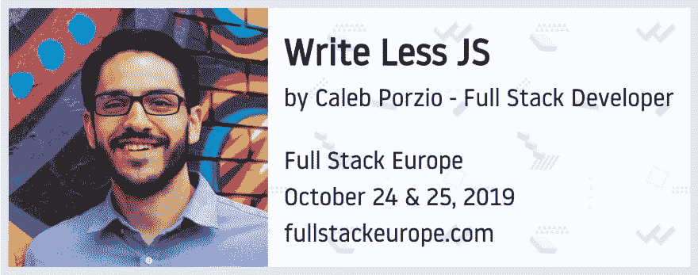
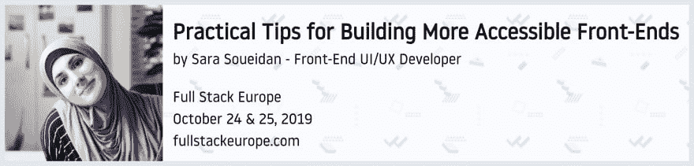
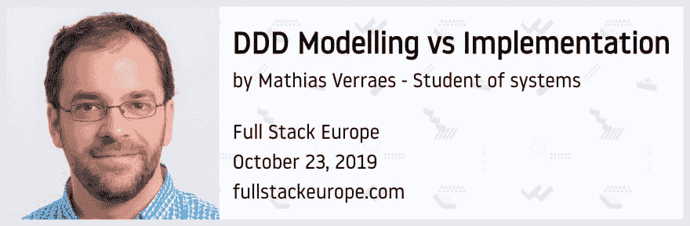
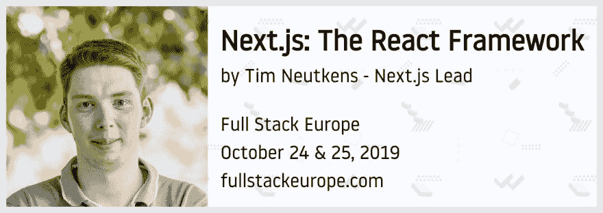

# ★使用 Tailwind 和 Laravel 生成扬声器卡

> 原文：<https://dev.to/freekmurze/generating-speaker-cards-using-tailwind-and-laravel-1li>

我目前正在组织[全栈欧洲会议](https://fullstackeurope.com/)。第一版将于 10 月 23 日至 25 日在比利时美丽的城市安特卫普举行。我相信最好的应用或网站不是由程序员开发的。它们是由团队建造的。这就是为什么我们为每个人设计这个会议，而不仅仅局限于编程的一个方面。

像许多其他会议一样，我们想给我们的演讲者和研讨会教师一个小图像，他们可以在 Twitter 上分享或在他们的幻灯片中使用。这样的卡片图像应该有照片、发言者的名字和会议的一些细节。

我可以打开一个图像编辑器，手工制作 20 多张这些图像。但是相反，我用我的 PHP 和前端知识来生成这些卡。

我创建了一个 Laravel 应用程序，安装了 [Tailwind](https://tailwindcss.com/) ，然后开始工作。首先，我创建了[一个显示所有扬声器卡片的视图](https://github.com/fullstackeurope/cards-generator/blob/master/resources/views/cards.blade.php)。

那一页上的每一张卡片都应该被转换成一幅图像。不久前，我做了一个名为 [Browsershot](https://github.com/spatie/browsershot) 的包，可以将任何网页转换成 URL。在引擎盖下，它使用无头铬来实现这一点。Browsershot 还有一个将特定 dom 节点渲染到图像的选项。

这是用于为每个扬声器生成图像卡的代码。

```
Browsershot::url('http://cards-generator.test/')
  ->select($elementId)
  ->deviceScaleFactor(2)
  ->windowSize(2000, 2000)
  ->save(storage_path("app/cards/{$slug}.jpg")); 
```

在 Laravel 应用程序中，我已经将这段代码放在了[一个方便的工匠命令](https://github.com/fullstackeurope/cards-generator/blob/326a70f6b8361a13ba4b05cec8ca8d81c206d338/app/Console/Commands/GenerateCardsCommand.php)中。

以下是一些生成的卡片:

[](https://res.cloudinary.com/practicaldev/image/fetch/s--03QIQJXs--/c_limit%2Cf_auto%2Cfl_progressive%2Cq_auto%2Cw_880/https://freek.dev/uploads/media/fseu-generator/card-1.jpg)

[](https://res.cloudinary.com/practicaldev/image/fetch/s--df02SC1x--/c_limit%2Cf_auto%2Cfl_progressive%2Cq_auto%2Cw_880/https://freek.dev/uploads/media/fseu-generator/card-2.jpg)

[](https://res.cloudinary.com/practicaldev/image/fetch/s--Hsle-Nn5--/c_limit%2Cf_auto%2Cfl_progressive%2Cq_auto%2Cw_880/https://freek.dev/uploads/media/fseu-generator/card-3.jpg)

[](https://res.cloudinary.com/practicaldev/image/fetch/s--ARO03IPJ--/c_limit%2Cf_auto%2Cfl_progressive%2Cq_auto%2Cw_880/https://freek.dev/uploads/media/fseu-generator/card-4.jpg)

尽管我主要是后端开发人员，但我的基本前端技能确实派上了用场。

如果您想走出自己的舒适区，并想了解一些您可能不习惯的堆栈部分，请考虑参加我们的会议。你会找到所有关于 fullstackeurope.com 的信息。我可能有偏见，但我真的认为这将是一个非常好的事件，值得你花时间。