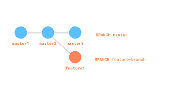
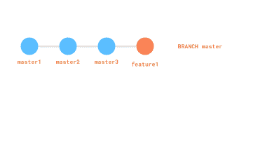

# git merge 和 git rebase 简介

> 原文：<https://dev.to/iggredible/gentle-introduction-to-git-merge-and-git-rebase-27oc>

我在编程方面最大的弱点之一就是使用 git。有时候我觉得我可能会不小心删除了我一直在处理的文件，因为我不知道我在做什么。

git 的一个常见用途是将特性分支应用到主分支中。我想以最温和的方式回顾两个流行的命令:`git rebase`和`git merge`。希望在本文结束时，您会理解它们各自的作用以及它们的不同之处。

# 入门

让我们和我一起编码吧(这应该不需要你在 github 中实际创建一个新项目)。创建一个目录并创建一个空的 git 存储库。

```
mkdir git-playground && cd $_
git init 
```

Enter fullscreen mode Exit fullscreen mode

创建一个 txt 文件，假设这是每个人都要处理的文件。

```
touch main.txt
echo "master1" >> main.txt 
```

Enter fullscreen mode Exit fullscreen mode

这将是我们的第一次提交，让我们用相同的提交名称来提交它，这样我们可以区分它。

```
git add .
git commit -m "master1" 
```

Enter fullscreen mode Exit fullscreen mode

检查我们的 git 日志，我们应该只看到一件事，我们的“master1”提交。

```
git log 
```

Enter fullscreen mode Exit fullscreen mode

假装在同一文件的主分支上做另一项工作！我们再补充一个内容。添加变更并提交。

```
echo "master2" >> main.txt
less main.txt // should say "master1" and "master2"
git commit -am "master2" // git add and commit at the same time 
```

Enter fullscreen mode Exit fullscreen mode

到目前为止，一切都是线性的。然后有一天，我们的老板让我们单独做一个专题。我们创建一个新的分支，并在那里开发我们的功能。稍后它将被应用回主服务器。

```
git checkout -b feature1 
```

Enter fullscreen mode Exit fullscreen mode

我们的特色工作将是更新`main.txt`

```
echo "feature1" >> main.txt
git commit -am "feature1" 
```

Enter fullscreen mode Exit fullscreen mode

在 git 登录时，您将看到 3 个项目:

```
commit 9238fc8a51ca9ba07716218c8c70ad1747488240
Author: Iggy <igoririanto@rocketmail.com>
Date:   Thu Sep 12 07:43:24 2019 -0500

    feature1

commit b1c6125495497dc36310501d4decebf8d3690bd5
Author: Iggy <igoririanto@rocketmail.com>
Date:   Thu Sep 12 07:39:42 2019 -0500

    master2

commit d0a5a8847025736fbf8903ba517b71e9c1c3cfed
Author: Iggy <igoririanto@rocketmail.com>
Date:   Thu Sep 12 07:37:37 2019 -0500

    master1 
```

Enter fullscreen mode Exit fullscreen mode

让我们假设在我们开发一个特性的同时，有人开发了另一个特性并把它推给了 master。

回到主分支。

```
git checkout master
echo "master3" >> main.txt
git commit -am "master3" 
```

Enter fullscreen mode Exit fullscreen mode

在文件内部，您应该会看到

```
master1
master2
master3 
```

Enter fullscreen mode Exit fullscreen mode

注意:由于我们转换了分支，我们在特征分支的所有工作仍然在特征分支。

如果我们检查 git 日志:

```
commit fbf7329cc6be6e1e44527e5ed5749adfe14b9ebf
Author: Iggy <igoririanto@rocketmail.com>
Date:   Thu Sep 12 07:47:54 2019 -0500

    master3

commit b1c6125495497dc36310501d4decebf8d3690bd5
Author: Iggy <igoririanto@rocketmail.com>
Date:   Thu Sep 12 07:39:42 2019 -0500

    master2

commit d0a5a8847025736fbf8903ba517b71e9c1c3cfed
Author: Iggy <igoririanto@rocketmail.com>
Date:   Thu Sep 12 07:37:37 2019 -0500

    master1 
```

Enter fullscreen mode Exit fullscreen mode

我们的特色工作已准备好应用于 master，但是...在这种情况下，将我们的特色工作整合到 master branch 的最佳方式是什么？

我们可以通过 git merge 和 git rebase 来实现。让我们一起来看一看。

[](https://res.cloudinary.com/practicaldev/image/fetch/s--uzVqa1Oc--/c_limit%2Cf_auto%2Cfl_progressive%2Cq_auto%2Cw_880/https://thepracticaldev.s3.amazonaws.com/i/rsj4zl6dxnsbdfajwhgw.png)

# Git merge

让我们回到主分支和合并特征分支。

```
git checkout master
git merge feature1 
```

Enter fullscreen mode Exit fullscreen mode

糟糕，我们有冲突。Git 查看变更历史，发现`master`和`feature1`分支都在相同的位置实现了变更。不确定如何处理同样的变化。

让我们修理它。转到`main.txt`，你应该会看到这个:

```
master1
master2
<<<<<<< HEAD
master3
=======
feature1
>>>>>>> feature-branch 
```

Enter fullscreen mode Exit fullscreen mode

“<<<<<<< HEAD" and "=======" are coming from our [当前检出分支](http://researchhubs.com/post/computing/git/what-is-HEAD-in-git.html)之间的所有内容和“=======”与“> > > > > > >特征-分支”之间的所有内容都是传入工作。

顺便说一句，git 会自动应用其他不冲突的作品。因此，如果我们在其他文件中进行了更改并且它们不冲突，这些更改将自动应用到主分支。

我们希望我们的专题作品是在 master3 之后，让我们把它清理成这样:

```
master1
master2
master3
feature1 
```

Enter fullscreen mode Exit fullscreen mode

保存然后`git add .`，然后做`git commit`。您将看到一个默认文本为`"Merge branch 'feature1'"`的`"COMMIT_EDITING"`窗口。你可以把它们改成你想要的，或者保留默认设置(`:wq`)。这将是用于合并的提交消息。

当你登录后，你会看到:

```
commit 623f8868826b6622b62d8d2949ce26ff79463621
Merge: fbf7329 9238fc8
Author: Iggy <igoririanto@rocketmail.com>
Date:   Fri Sep 13 07:42:54 2019 -0500

    Merge branch 'feature1'

commit fbf7329cc6be6e1e44527e5ed5749adfe14b9ebf
Author: Iggy <igoririanto@rocketmail.com>
Date:   Thu Sep 12 07:47:54 2019 -0500

    master3

commit 9238fc8a51ca9ba07716218c8c70ad1747488240
Author: Iggy <igoririanto@rocketmail.com>
Date:   Thu Sep 12 07:43:24 2019 -0500

    feature1

commit b1c6125495497dc36310501d4decebf8d3690bd5
Author: Iggy <igoririanto@rocketmail.com>
Date:   Thu Sep 12 07:39:42 2019 -0500

    master2

commit d0a5a8847025736fbf8903ba517b71e9c1c3cfed
Author: Iggy <igoririanto@rocketmail.com>
Date:   Thu Sep 12 07:37:37 2019 -0500

    master1 
```

Enter fullscreen mode Exit fullscreen mode

你会注意到一件事，尽管我们在技术上有 4 个提交:“主 1，主 2，主 3，特征 1”，git 认为合并分支的行为本身就是一个提交。这就是为什么无论何时运行 git merge，都会看到一个额外的 commit(通常称为“Merge branch 'X-BRANCH '”)。

从 [docs](https://git-scm.com/docs/git-merge) ，git merge“将来自命名提交的变更(自从它们的历史从当前分支中分离出来)合并到当前分支中”

这里重要的是“从他们的历史发生分歧的时候开始”。Git 回顾了他们的历史分歧点，也就是 master2。此后应用的所有更改都不同(主分支中的单词“master3”和特征分支中的单词“feature1”)。Git 找到这两个变化，并试图将它们放在一起(自动合并)。因为它们是同一点的变化，所以 git 是冲突的(双关语)。

然而，如果我们在 feature1 分支内的一个新文件夹中做了更改，git 会应用所有新的更改。这篇 [SO post](https://stackoverflow.com/questions/14961255/how-does-git-merge-work-in-details) 对于给出 git-merge 的高层次概述非常有帮助。

关于 git merge 的其他阅读材料:

*   [如何使用 git 合并的正确方式](https://dev.to/neshaz/how-to-use-git-merge-the-correctway-25pd)
*   [git 合并合并后的分支会发生什么情况](https://stackoverflow.com/questions/39848521/git-merging-what-happens-to-the-merged-branch)

# Git rebase

让我们回到 feature1 在 feature-branch 中工作，master3 在 master branch 中工作的地方(就在上面的“Git Merge”部分之前)。确保我们在特征分支内。

```
git checkout feature-branch
git rebase master 
```

Enter fullscreen mode Exit fullscreen mode

我们会看到冲突。请记住，我们在“主 3”的相同位置添加了“功能 1”。我们需要解决这个问题。

顺便说一句，如果你现在登录，你会看到:

```
commit b71640c9c9440e3a728f299d7c53889d7d02e101
Author: Iggy <igoririanto@rocketmail.com>
Date:   Sat Sep 14 09:49:00 2019 -0500

    master3

commit 3272efa79a998460a8a19aacbc8ed9e1333eca06
Author: Iggy <igoririanto@rocketmail.com>
Date:   Sat Sep 14 09:47:54 2019 -0500

    master2

commit ad41707299da77d711204226c5c4e3b2f4b37869
Author: Iggy <igoririanto@rocketmail.com>
Date:   Sat Sep 14 09:47:41 2019 -0500

    master1 
```

Enter fullscreen mode Exit fullscreen mode

下面是 main.txt 里面的内容:

```
master1
master2
<<<<<<< HEAD
master3
=======
feature1
>>>>>>> feature1 
```

Enter fullscreen mode Exit fullscreen mode

我们希望我们的功能在 master3 之后，所以清理它:

```
master1
master2
master3
feature1 
```

Enter fullscreen mode Exit fullscreen mode

一旦一切都清理完毕，添加更改并继续重设基础

```
git add .
git rebase --continue 
```

Enter fullscreen mode Exit fullscreen mode

如果我们使用 git log，您会看到历史记录排列得很好:

```
commit a5b2d0a963a29bf68f7654279b8979e7a08e08f3
Author: Iggy <igoririanto@rocketmail.com>
Date:   Sat Sep 14 09:48:32 2019 -0500

    feature1

commit b71640c9c9440e3a728f299d7c53889d7d02e101
Author: Iggy <igoririanto@rocketmail.com>
Date:   Sat Sep 14 09:49:00 2019 -0500

    master3

commit 3272efa79a998460a8a19aacbc8ed9e1333eca06
Author: Iggy <igoririanto@rocketmail.com>
Date:   Sat Sep 14 09:47:54 2019 -0500

    master2

commit ad41707299da77d711204226c5c4e3b2f4b37869
Author: Iggy <igoririanto@rocketmail.com>
Date:   Sat Sep 14 09:47:41 2019 -0500

    master1 
```

Enter fullscreen mode Exit fullscreen mode

不过，我们还在特色科里面。做`git checkout master` -我们看到我们还没有特性 1 的改变。我们重新设定了特征对主特征的基础，但还没有主特征对特征的基础。让我们根据功能分支重新定义主功能。

```
git rebase feature-branch 
```

Enter fullscreen mode Exit fullscreen mode

由于我们之前已经清理了冲突，所以它应该没有冲突地重定基础。如果你勾选`git log`和`less main.txt`，你会看到所有的特征分支变化。恭喜你！您已成功重置基础！

好了，现在你可能会问——刚刚发生了什么？为什么我们重定了两次基数？

我们第一次重建基础时(当我们在特性分支中运行`git rebase master`)，git 重建基础在特性分支和主之间寻找一个共同的“基础”。我说的共同基础是指共同承诺。在这种情况下，我们常见的提交是`"master2"`提交。它还发现 master 具有特征 branch 没有的“master3”。

然后，它将“master3”而不是“master2”作为我们特性分支的新基础(*因此有 rebase* )。将“master3”作为我们的新基础后，在特征分支中所做的所有更改都将应用到新基础之上。这就是为什么在 git 日志上我们看到主 1 - >主 2 - >主 3 - >特征 1。这是第一次重定基数。

当我们在重定基础后检查主分支时，我们运行`git rebase feature1`。Git 搜索 master 和 feature 分支之间的公共库，发现 master3 是公共分支，酷！由于两个分支机构共享同一个基数，所以主机构不会重定基数。但是，它发现 feature 有不在 master 中的提交，所以它将 feature1 应用到 master 中。

git rebase 上的资源:

*   [git-rebase](https://git-scm.com/docs/git-rebase)

就是这样！我们的主人现在成功地根据我们的特征改变重置了基础。

[](https://res.cloudinary.com/practicaldev/image/fetch/s--SbPDcdjK--/c_limit%2Cf_auto%2Cfl_progressive%2Cq_auto%2Cw_880/https://thepracticaldev.s3.amazonaws.com/i/x16oe8ox92k1n1qslp16.png)

# 应该合并还是重定基数？

现在的问题是，我们用什么？答案一如既往的是*看*。

只要记住这些事情:

Git merge 在合并时生成一个提交，并保留所有历史。这更混乱，但使事情有迹可循(我们可以从历史中判断合并何时完成)。我们所做的是可读的，因为没有发生很多事情，但是想象一下一个由 30-50 名开发人员组成的团队每天都在进行合并。

Git rebase 要干净得多，但是很难追溯，因为它重写了历史(如果您在我们刚刚做了什么之后看到 Git 日志，很难判断刚刚发生了 rebase)。

更多资源:

*   [git rebase](https://www.atlassian.com/git/tutorials/rewriting-history/git-rebase)
*   [git rebase 介绍我希望我有](https://dev.to/maxwell_dev/the-git-rebase-introduction-i-wish-id-had)

感谢你们读到这里。祝大家编码愉快！