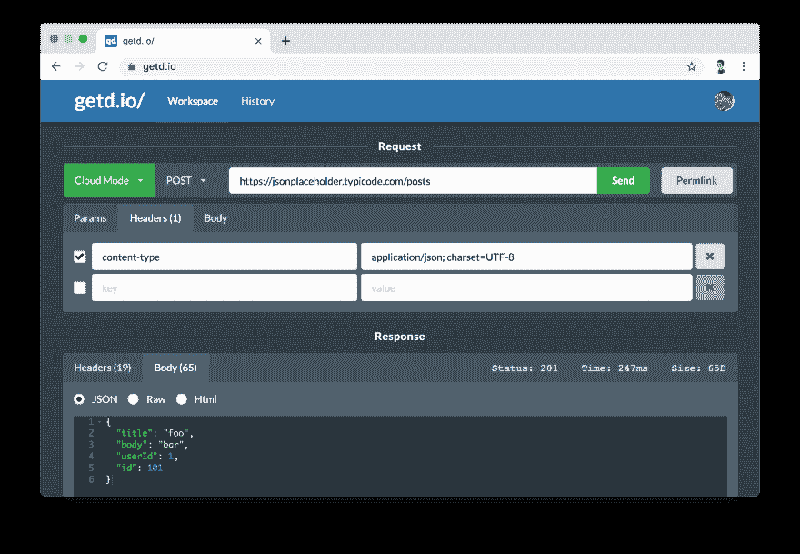
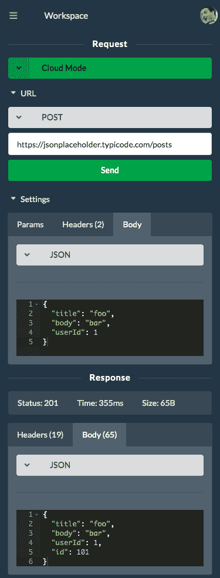
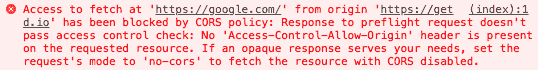

# 所以我在 CORS 的支持下建立了一个免费的在线 API 构建器🚀(为什么是另一个邮差选择)

> 原文：<https://dev.to/getd/getd-io-an-online-api-request-tester-builder-with-cors-support-3d3m>

# TL；速度三角形定位法(dead reckoning)

使用[getd.io/](https://getd.io/)只需你的浏览器就能测试 APIs 不需要任何应用或插件。也支持 CORS 的请求🔥！

以下是桌面截图:

[](https://res.cloudinary.com/practicaldev/image/fetch/s--bi8P6oiZ--/c_limit%2Cf_auto%2Cfl_progressive%2Cq_auto%2Cw_880/https://thepracticaldev.s3.amazonaws.com/i/s1xlaq7drtxygbdctugp.png)

下面是更新后的移动响应 UI(感谢 [@maybebored](https://dev.to/maybebored) 提出建议):

[](https://res.cloudinary.com/practicaldev/image/fetch/s---kWSmc-M--/c_limit%2Cf_auto%2Cfl_progressive%2Cq_auto%2Cw_880/https://thepracticaldev.s3.amazonaws.com/i/qjzgyo8ucuo100edbqu3.png)

# 为什么另一个邮递员另类？

目前市场上的大多数 Postman 替代品(包括 Postman)都需要下载一个特定于平台的客户端应用程序，或者安装一个 Chrome 插件。这是提供完全请求支持(如 CORS)所必需的。然而，这种方法有一些缺点:

1.  设置一个新的开发环境需要再次下载和安装应用程序。
2.  应用程序需要定期更新/修补。
3.  占用开发机器的宝贵内存。
4.  并非所有平台都受支持。

受到女邮递员的启发，我爱上了基于网络的 API 测试者的想法。然而，女邮递员不支持 CORS 的请求。

如果你不确定 CORS 是什么，请滚动到底部。

# 介绍 getd.io/🚀🚀🚀

getd.io/的目标是建立一个 100%纯基于网络的解决方案，支持所有类型的 API 服务器，同时提供一个现代的、流畅的、黑暗主题的用户界面😎这是现有的邮递员用户所熟悉的。

[getd.io/](https://getd.io/)提供两种模式:

*   ☁️云模式:请求被转发到后端由 node.js 执行，返回响应显示给用户。此模式适用于所有请求类型，例如 CORS。该网站受 TLS 保护，因此您的请求信息在网络上是安全的。
*   💻浏览器模式:使用 fetch()从本地浏览器发送请求。这不适用于不允许 CORS 的 API。

**注意:**如果你是开发本地/私有 API 服务器，由于我的云服务器无法访问你的私有服务器，所以只能使用浏览器模式。由于浏览器模式不支持 CORS，你必须为你的私人服务器启用 CORS 来使用 [getd.io](https://getd.io) 。这是一个两行的变化，你可以在你的服务器上市前删除它。

```
import cors from "cors";
app.use(cors()); 
```

# 云模式

目前，我使用个人开发服务器来支持后端请求。如果请求得到大量响应(例如，文件下载)，响应将在超过特定限制后终止。这有助于降低我的上网费用:) [❤️支持我 Patreon](https://www.patreon.com/getd) 如果你想让这项免费服务继续运行，甚至更好，可以访问没有请求限制的高级功能。

# 特性/路线图

| 特征 | 支持 |
| --- | --- |
| 本地请求历史和搜索 | ✔ |
| 本地持久工作区状态 | ✔ |
| 与他人共享整个请求的永久链接 | ✔ |
| 请求参数 | ✔ |
| 请求标题 | ✔ |
| 请求正文(JSON 编辑器，文本) | ✔ |
| 请求表单(表单数据，x-www-form-urlencoded) | ✔ |
| 响应头、正文、JSON / Html 漂亮 | ✔ |
| 移动响应 | ✔ |
| 本地多工作区支持 |  |
| 将工作空间保存到云 |  |
| 将历史保存到云 |  |
| Websocket 支持 |  |
| GraphQL 支持 |  |
| ...还有更多！ |  |

# 好看！下一步是什么？

1.  前往[getd.io/](https://getd.io/)开始四处逛逛吧！
2.  关注 [twitter](https://twitter.com/getd_io) 获取更新。
3.  加入[懈怠](https://join.slack.com/t/getd/shared_invite/enQtNzM3NDU3NjkyNTMzLTE4YWVhMTFkNzE2NTM3NzhjYTk0MWQ1ODBkMjRlNTc1MmY3ZjBmOTdhNzY0Mzk5NzRmYTQ4MDdlMGQ5MjNmNjA)或[不和谐](https://discord.gg/4hmXCaT)以提供反馈或加入讨论。
4.  支持❤️的这项免费服务
5.  在下面留下评论，提供一些反馈。我喜欢反馈！

# WTF 是 CORS 吗？

抱歉，我一直说“CORS”。你可以在这里阅读更多但基本思想是，浏览器不允许网站 A(加载在浏览器中)向网站 B 发送 API 请求，除非 B 在响应头中明确表示‘允许 A’或‘允许任何人，我不在乎’。这是由浏览器强制实施的限制。这就是为什么像 Postman 这样的工具创建自己的客户端应用程序来解决这个问题。错误示例如下所示:

[](https://res.cloudinary.com/practicaldev/image/fetch/s--fJNep9-R--/c_limit%2Cf_auto%2Cfl_progressive%2Cq_auto%2Cw_880/https://thepracticaldev.s3.amazonaws.com/i/l42lh4gvjuhwa4djbh8l.png)