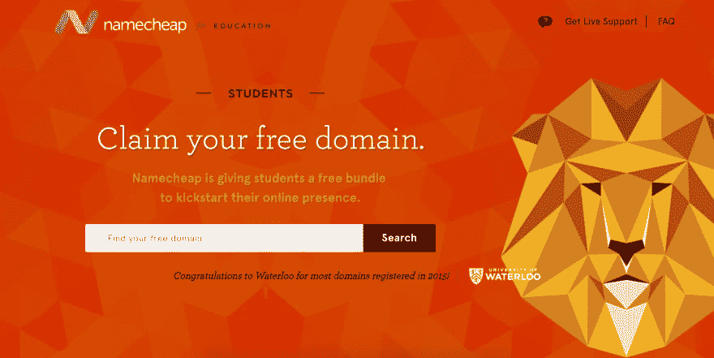

# 为学生获取免费域名

> 原文：<https://dev.to/rightfrombasics/getting-a-free-domain-for-students-on7>

如果你是学生，你正在寻找得到一个域名，那么你很幸运！你可以用 Namecheap 免费得到一个。Namecheap 提供域名注册和虚拟主机服务等服务。

如果你想要一个免费域名，点击这里查看他们的学生服务。

不过有一个小问题。您将只能免费获得`.me`域名。`.me`域名通常用于个人网站和博客(比如我的)。

如果你正在寻找`.com`、`.net`、`.io`和其他域名，那么这个优惠就不适用——你不会免费获得域名，而是以折扣价获得。尽管如此，Namecheap 的域名托管非常实惠，每年*只需几美元。*

 *### 找托管？

*   如果你想要最好的 Wordpress 托管，我强烈推荐 [Bluehost](https://www.bluehost.com/track/harishv/) 。当你[通过此链接](https://www.bluehost.com/track/harishv/)申请时，可以获得很大的折扣。
*   此外，当你[通过此链接](https://www.hostg.xyz/aff_c?offer_id=6&aff_id=2883)申请时，还可以获得 [Hostinger](https://www.hostg.xyz/aff_c?offer_id=6&aff_id=2883) 的大幅折扣。

这两项服务都提供了良好的正常运行时间和客户服务。哦，我有没有提到——你可以获得一个包含 Bluehost 和 Hostinger 的免费域名。*