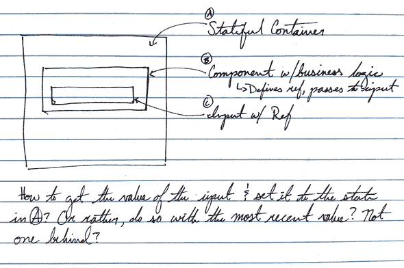
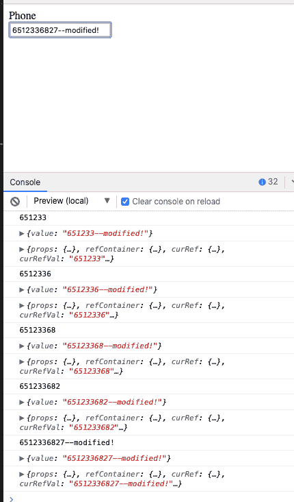

# 让引用与容器状态同步

> 原文：<https://dev.to/stephencweiss/getting-refs-to-sync-with-container-state-1mc3>

我最近在做一个项目，该项目使用 Refs 来与第三方库集成。

我对 refs 的心理模型是，它们允许你查看组件*的内部状态，而不需要*显式地跟踪它。这样，您就可以用它来进行计算，而不会产生使组件有状态的开销，否则就不需要状态了。

我的场景大概是这样的: [](///static/ac14879814a3a6783c89587008e485ce/fdb8e/ref-container.png)

一个有状态容器，其组件存储了包装输入的业务逻辑。

目标是找到一种方法，在在包含业务逻辑和*的包装器中处理输入后，将输入的值提升到顶层容器*，而*不将它作为状态存储在包装器中。我还需要能够基于业务逻辑考虑在某些情况下更新输入的值。*

下面是我想到的一个简化版本:

```
import React, { Component } from ‘react’;
import { render } from ‘react-dom’;
import ‘./style.css’;

const WrapperComponent = props => {
  const refContainer = React.useRef({});
  const { onChange } = props;
  const curRef = refContainer.current
  const curRefVal = refContainer.current && refContainer.current.value;
  console.log({ props, refContainer, curRef, curRefVal })

  const businessLogic = (val) => {
    return val.concat(`—modified!`)
  }

  const handleChange = (e) => {

    onChange(businessLogic(e.target.value))
    if(e.target.value.length === 10) {
      refContainer.current.value = businessLogic(e.target.value)
    }
    console.log(refContainer.current.value)
  }
  return (
    <React.Fragment>
      <div> Phone </div>
      <input ref={refContainer} onChange={handleChange} type='tel'></input>
    </React.Fragment>) }

const App = () => {
  const [value, setValue] = React.useState(null)
  console.log({ value })
  return (<WrapperComponent onChange={setValue} />) 
}

render(<App />, document.getElementById(‘root’)); 
```

检查控制台，我们可以看到这是可行的！

我的`input`有值。我的包装器应用业务逻辑，然后将其传递给容器的`onChange`方法。

我还可以格式化输入中的值，并在需要时进行更改——就像我在这里遇到一个有效的 10 位电话号码时所做的那样。

[](///static/765f987c0fd145a6582d2f10c85917e9/e82b9/ref-modified.png)

## 结论

我不期望经常使用参考文献。React 团队不鼓励个人实践，除非在某些情况下(比如与第三方库合作，这是本练习的动力)。 <sup>1</sup>

尽管如此，学习如何使用它们来管理状态，而不需要在组件改变时重新呈现组件，还是很有用的，这正是我在这里所做的。

Refs 还允许你在 React 中达到 *up* ，至少从某个角度来看是这样，并且知道这一点是很方便的。

注:如果你有兴趣玩/ <sup>2</sup> 的话，我也把这个放到一个堆栈里

## 资源

*   <sup>1</sup> [裁判和 DOM | React](https://reactjs.org/docs/refs-and-the-dom.html)
*   <sup>2</sup> [同步参考| StackBlitz](https://stackblitz.com/edit/refs-in-sync)