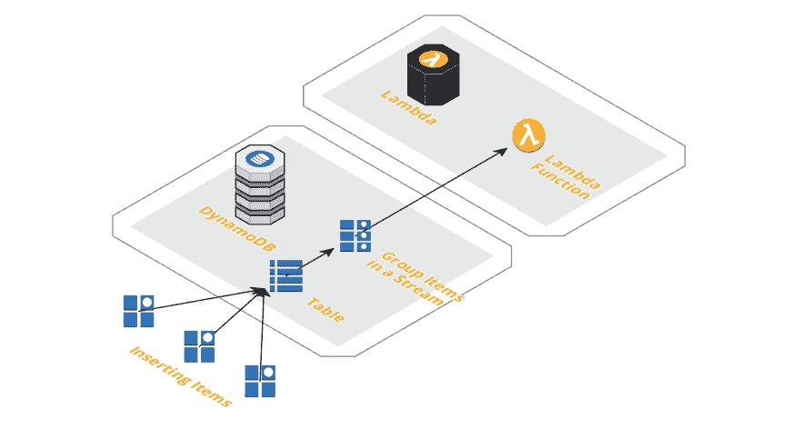
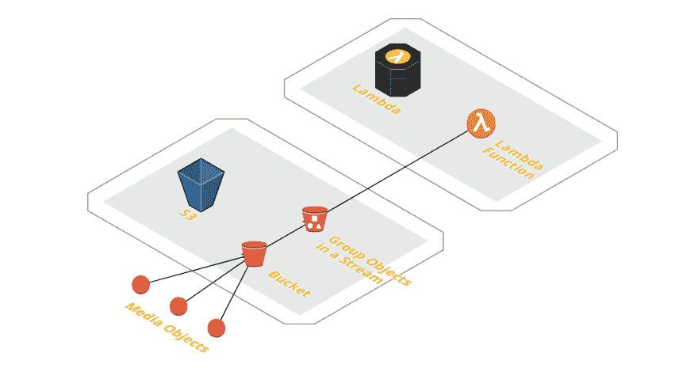

# AWS Lambda 事件源入门

> 原文：<https://dev.to/byrro/getting-started-with-aws-lambda-event-sources-5coi>

也许 AWS Lambda 最强大的组合之一是使用自治事件源。我所说的“自主事件源”是指无需显式调用就能触发 Lambda 函数的方法。

# 从例子开始...

假设您希望每次有人在您的应用程序中发布某个请求时都发送一封确认电子邮件。例如，如果您使用的是 [DynamoDB](https://aws.amazon.com/dynamodb/) ，您可以让它在数据库表中插入新项目时自动触发 Lambda 函数。Dynamo 还可以提供带有调用有效负载的项目数据，因此 Lambda 甚至不必发出 read 查询，它已经从调用本身获得了发送电子邮件所需的内容。

另一个例子是当一个新的对象被保存到一个 [S3 桶](https://aws.amazon.com/s3/)时触发一个 Lambda。假设您提供某种媒体存储和处理服务。当一个第三方上传一个图像、音频或视频文件到你的桶中时，它可以自动触发一个 Lambda 函数，这个函数会继续处理并做它需要做的任何事情。

# 事件驱动的力量

借助 Lambda 自治事件源，我们可以协调多个云基础设施资源，以事件驱动的方式实现一个目标- *为了不与代码级别的事件驱动编程混淆，我们在这里讨论云架构。*

事件驱动方法在云级别的主要优势与编程级别非常相似:松耦合、可扩展性、易于管理。

回到上面的例子…

如果你现在想在另一个上下文中发送一封电子邮件(比如，一个用户想邀请一个朋友加入你的应用)，这很容易实现。你可以部署一个新的 Lambda 函数并让 Dynamo 触发它，或者你可以让你的初始 Lambda 函数根据你的数据库表中插入的条目发送不同的电子邮件。

管理这样的基础设施很容易，因为引起动作的事件负责触发应用程序对它的响应。您不必担心跟踪正在发生的事情并确保您的应用程序做出相应的响应。AWS 会帮你搞定的。

更好的是:AWS 免费提供这项服务。激活这些自主触发器不需要额外的成本。你所支付的只是普通的兰姆达、迪纳摩、S3 或其他服务费用。

# 我们还能把什么*事件驱动*？

我承认， *drivenize* 是一个相当难听的词发明，但是，无论如何，你得到了这个想法。

有很多服务可以为我们自动触发 AWS Lambda。以下是按调用类型分组的列表:

## 同步调用

### [T1](#api-gateway)[API 网关](https://docs.aws.amazon.com/lambda/latest/dg/with-on-demand-https.html)

使用 API Gateway 和 Lambda 很酷，因为你可以用运行在 Lambda 上的代码动态地响应 HTTP 请求。见鬼，你甚至可以在这两个服务之上构建一个完整的 web 应用程序。

### [负载平衡器](https://docs.aws.amazon.com/lambda/latest/dg/services-alb.html)

使用 Lambda 处理 HTTP 请求的另一种方式是将其连接到一个弹性负载平衡器。

### [亚马逊 Alexa](https://docs.aws.amazon.com/lambda/latest/dg/services-alexa.html)

Lambda 可以用来为 AWS 语音助手建立新的技能。例如，您可以创建代码来响应和执行用户对 Amazon Echo 发出的任何语音命令。

### [身势](https://docs.aws.amazon.com/lambda/latest/dg/services-kinesisfirehose.html)

我们上面的一个例子是关于媒体处理的。相反，你可以使用 Kinesis，让它在数据发送到 Lambda 之前做一些预处理，创建一个强大的数据处理管道。

### [认知到](https://docs.aws.amazon.com/lambda/latest/dg/services-cognito.html)

Cognito 使跨多种设备管理和同步用户数据变得更加容易。例如，它可以在用户同步事件时触发 Lambda，这样您就可以做出相应的响应。

### [云锋](https://docs.aws.amazon.com/lambda/latest/dg/lambda-edge.html)

Lambda 可以用来定制 CloudFront 提供的内容。认为我们可以让*静态*的内容实际上是*动态*的想法很酷，但不，它来自 CDN，必须是*静态*。无论如何，它肯定开启了有趣的可能性。例如:根据用户浏览器定制图像或 Javascript 代码。

### [亚马逊 Lex](https://docs.aws.amazon.com/lambda/latest/dg/services-lex.html)

Lex 允许您构建对话式(语音或文本)应用程序。类似于 Alexa 集成，Lambda 可以在这里用来给你的 Lex 机器人赋予新的能力或技能。

## 异步调用

### [S3](https://docs.aws.amazon.com/lambda/latest/dg/with-s3.html)

如上所述，当在桶中插入、删除或修改对象时，S3 可以触发 Lambda 函数。

### [【SNS】](https://docs.aws.amazon.com/lambda/latest/dg/with-sns.html)

Lambda 可以在消息发布到 SNS 主题时被调用。

### [SES](https://docs.aws.amazon.com/lambda/latest/dg/services-ses.html)

如果您使用 SES 来接收电子邮件，您可以使用 Lambda 函数来处理所有传入的电子邮件并相应地采取行动。

### [云手表](https://docs.aws.amazon.com/lambda/latest/dg/services-cloudwatchlogs.html)

Lambda 可用于监控 CloudWatch 日志流上发布的日志，或者响应 CloudWatch 指标产生的某些指标阈值。

### [代码提交](https://docs.aws.amazon.com/lambda/latest/dg/services-codecommit.html)

CodeCommit 可以在存储库中发生某些事件时调用 Lambda 函数，比如创建代码分支。

# 牛逼，但有什么蹊跷？

AWS Lambda 是一个强大、稳定和可靠的服务，但它自然会带来挑战。

它有一些限制，例如内存(最多 3 Gb)和执行持续时间(最多 15 分钟内超时)。在媒体处理示例中，您将无法摄取 10 Gb 的视频文件或执行需要几个小时才能完成的处理工作(除非您可以中断并批处理它们)。

监控和调试也很困难。虽然 AWS 提供了 CloudWatch，但它并不完全适合 Lambda。像 [Dashbird](https://dashbird.io/?utm_source=dev.to&utm_medium=referral&utm_campaign=article&utm_content=educational) (顺便说一下，它是免费的)这样的服务可以填补这些空白，因为它从一开始就是为 Lambda 设计的。

# 包装完毕

AWS 在 Lambda 与其他几个服务的集成方面做得很好，为我们开发人员提供了无与伦比的构建自主、事件驱动架构的灵活性。无服务器领域发展迅速，为初创公司、中小企业和企业带来了优势。我们最近出版了一本关于“[无服务器最佳实践](https://dashbird.io/serverless-benefits/)”的免费电子书，我想你可能会对[阅读](https://dashbird.io/serverless-benefits/)感兴趣。