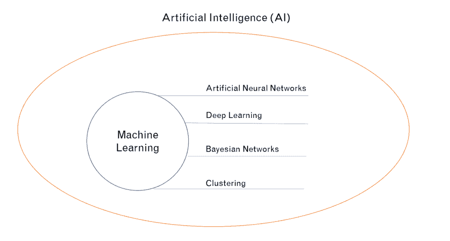
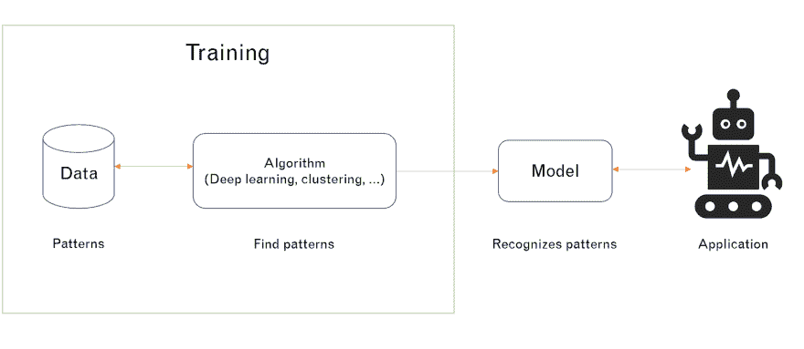
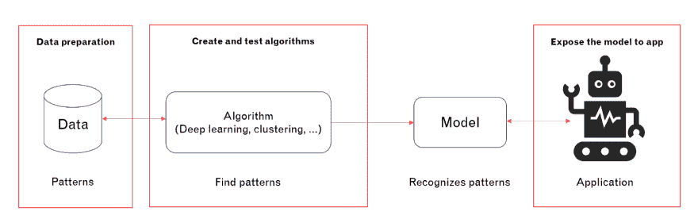
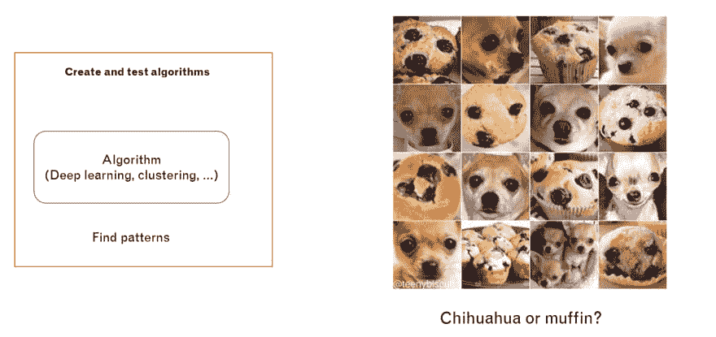
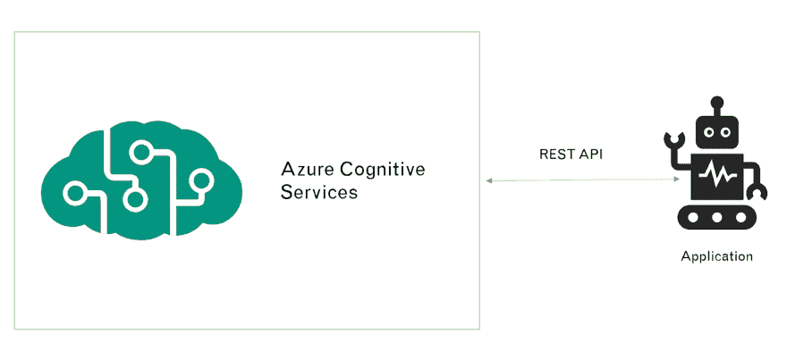
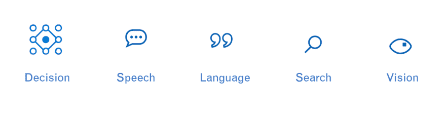
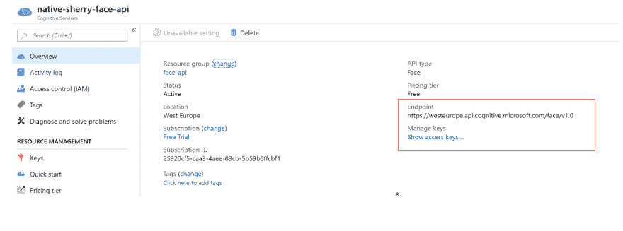

# Azure 认知服务入门

> 原文：<https://dev.to/azure/getting-started-with-azure-cognitive-services-cma>

# 开头

 
你肯定听说过这些不同的缩写:AI，ML，ANN，…但你可能不知道这些缩写的确切含义或它们之间的关系。在本文中，我们将逐一介绍它们，并找出它们在更大范围内的相互关系。

# AI(人工智能)

我找到的关于 AI 最简单的定义是:
*“AI 是机器对人类智能过程的模拟。这些过程包括，推理、记忆、学习和自我纠正。”*

这意味着我们希望这个设备的大脑像人类的大脑一样工作。所以他们能够记住、理解、认识事物，甚至从过去的错误中学习并改正自己。

所以你可以看到，人工智能是关于机器像人类一样行动的能力。

# ML(机器学习)

我们提到，我们希望机器像人类一样行动和行为。为了做到这一点，我们需要编写程序给他们这样的能力。这就把我们带到了 ML。

1959 年，亚瑟·塞缪尔提到:
*“机器学习是计算机科学的一个领域，它赋予计算机学习的能力，而无需显式编程。”*

ML 就是编写应用程序，将这种能力赋予机器，而不需要对情况进行硬编码。我们不能用硬编码的场景来模拟人脑。

看着这张图，想想你在这里看到了什么？你会如何描述这幅画？
 
你最有可能这样描述它:*“我看到一只猫和一只狗隔着窗户看着对方。”*

这里发生的事情是你的大脑识别了一些模式:

*   一只狗
*   一只猫
*   一扇窗户

这仅仅是因为你在你生命的早期见过它们，并且你能够记住它们的模式。即使你以前可能没有见过这只猫或狗，你仍然可以把它们和你以前见过的猫或狗联系起来。

使用 ML，我们可以编写程序，通过使用不同的技术来检测这些模式，例如:

*   [人工神经网络](https://en.wikipedia.org/wiki/Artificial_neural_network)
*   [深度学习](https://en.wikipedia.org/wiki/Deep_learning)
*   [贝叶斯网络](https://en.wikipedia.org/wiki/Bayesian_network)
*   [聚类](https://en.wikipedia.org/wiki/Cluster_analysis)

您可以使用其中的一种或组合来检测不同的模式。

# 大局

现在我们知道了什么是 AI，ML 和不同的 ML 技术是什么，我们可以画出更大的图:
 
AI 一般是指机器像人一样行为的能力(很笼统)。ML 是通过程序赋予机器这种能力的一种方式。为了编写这些程序，开发人员通常使用一种或多种 ML 技术，如 ANN、DL &等。

# ML 是如何工作的？

让我们通过尝试教机器识别狗来解决这个问题。为此，我们需要遵循以下步骤:

1.  创建一个包含所有犬种图片的数据集
2.  运行不同的算法来学习狗的样子
3.  经历第一步和第二步，直到它知道狗长什么样

这些步骤的结果被称为**“模型”**，生成模型的过程被称为**“训练”**。你可能在*之前听过这句话*“我正在训练我的模特”。这基本上意味着我要多次经历步骤 1 & 2 来识别一个模式。

一旦有了模型，就可以用 REST API 与应用程序对话。

# 挑战

这个过程可能听起来很简单，但当然它伴随着不同的挑战。以下是三大挑战:

*   数据准备
*   创建并测试算法的结果
*   向应用程序展示您的模型

让我们逐一查看，找出问题所在。

## 数据准备

准备反映现实并涵盖所有边缘情况的数据集并不总是容易的。如果我们回到我们的狗的例子，你需要确保有一个包含所有可能品种的狗的图片的数据集，包括混合品种。收集所有这些数据并不总是容易的。

找出哪种算法或它们的组合对您的场景来说是最好/最差的并不容易——监督结果既不容易也不直接。请记住，案件并不总是像检测狗的照片那样容易。

这就是为什么有三种类型的机器学习算法:

*   监督学习(Supervised learning):数据集被标记，以便模式可以被检测并用于标记新的数据集
*   [无监督学习](https://whatis.techtarget.com/definition/unsupervised-learning):数据集没有标签，根据相似性或差异性排序
*   [强化学习](https://searchenterpriseai.techtarget.com/definition/reinforcement-learning):数据集没有被标记，但在执行一个或几个动作后，人工智能系统会得到反馈

还要记住，就所需资源而言，这些过程相当昂贵。

## 将你的模型暴露在应用程序中

任何将数据暴露给不同应用程序的人都知道，创建一个满足不同应用程序需求的可靠且安全的 REST API 并不容易。

# 有没有更简单的方法？

现在我正在谈论所有这些挑战，你可能会问。好吧，我们明白了，但是还有其他更简单的方法来利用 ML 和创建智能应用吗？

是的有。Azure Cognitive services 可以让你卸下大部分责任，并提供一个性能良好且安全的 REST API，你可以在你的应用中使用它。

你的过程会变成如下画面:

同样，通过将你的服务和数据放在 Azure 中，你的服务将自动拥有一个基本的安全级别，这是使用 Azure 时默认提供的。Azure 也将保证你服务的可用性。

截至今天，共有 5 种服务可供选择:

*   决定
*   演讲
*   语言
*   搜索
*   视力

所有这些服务都有一个预先构建的模型。此外，还有一组服务，您可以通过提供训练数据来定制模型，以满足您的特定需求。你可以把它们像乐高积木一样组合在一起，创造出超级智能的应用程序。

你只需要知道如何[在 Azure](https://azure.microsoft.com/en-us/try/cognitive-services/?api=face-apit?wt.mc_id=cognitiveservices-devto-shlist) 上创建你的服务，使用提供给你的认证密钥从你的应用调用端点，并利用你的应用。

如果你只是想探索和玩不同的服务，你也可以[创建一个客人帐户](https://aka.ms/create-cognitive-services-account)，甚至不需要提供你的信用卡信息。

到目前为止，在本文中，我们已经了解了机器学习的基础知识，认知服务是如何进入画面的，以及通过创建它们并调用 Azure 为您提供的安全且性能良好的端点来使用它们有多容易。

在下一篇文章中，我将对我们可用的认知服务做一个很好的概述，并向您展示如何通过您的应用程序轻松地调用它们(通过代码片段)。

# 有用资源:

*   [微软 Azure 认知服务:大图](https://app.pluralsight.com/library/courses/microsoft-azure-cognitive-services-big-picture/table-of-contents)
*   [Azure 认知服务 API -我需要你的衣服、靴子和摩托车](https://itnext.io/cognitive-services-api-i-need-your-clothes-boots-and-your-motorcycle-1216c36cfe8b)
*   【Azure 认知服务入门
*   [云企业机器学习和人工智能指南](https://searchenterpriseai.techtarget.com/definition/AI-Artificial-Intelligence)
*   [什么是机器学习？](https://www.ibm.com/developerworks/community/blogs/jfp/entry/What_Is_Machine_Learning)