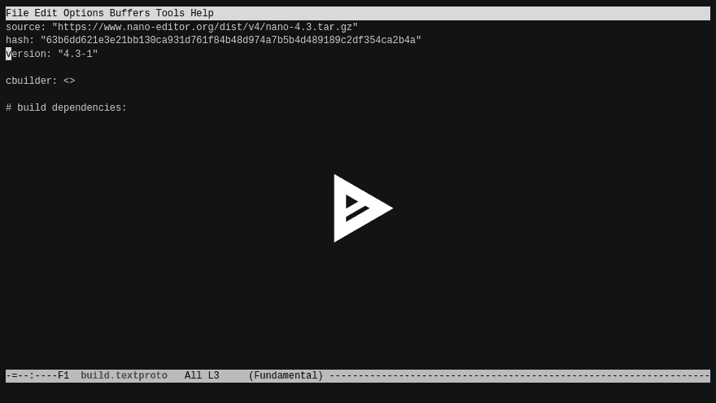

# Azure 上的发行版入门

> 原文：<https://dev.to/bureado/getting-started-with-distri-on-azure-1kik>

你可能会在本月早些时候读到迈克尔·斯坦伯格的文章《Linux 软件包管理器很慢》。他的假设是，索引、挂钩/触发器和归档操作是传统 Linux 包管理器问题的主要来源。

与此同时，[迈克尔发布了**发行版**](https://michael.stapelberg.ch/posts/2019-08-17-introducing-distri/) ，这是一个 Linux 发行版，旨在这些领域尝试不同的方法。在 Azure 上安装并运行了 [**发行版**](https://github.com/distr1/distri) 之后，我一直在玩它。以下是我学到的。

## 里面有什么？

在其当前版本中，`jackherer`、**发行版**发布了 Linux 5.1.9、systemd 和 170 多个其他包，包括 Python 2.7、Python 3、Perl、Golang 和 Docker，一直到 Xorg 和 i3。

`distri`也是一个命令行工具，用于构建包和发行版(映像、仓库)本身。[在线回购](https://repo.distr1.org/distri/jackherer/)包含上述图像和二进制包。二进制包是 SquashFS 文件，带有元数据。

## 是什么让它独一无二？

除了用于 400 多个包的`distri`工具和[打包定义](https://github.com/distr1/distri/tree/master/pkgs)之外， [GitHub repo](https://github.com/distr1/distri) 包含 FUSE 文件系统的代码(Go ),该文件系统将来自本地软件商店的映像组装为运行实例的工作只读文件系统。

因此，如果您检查文件系统的根目录，您会注意到`/bin`、`/share`和`/lib`(以及它们的`/usr`对应项)指向`/ro`。而且，你猜对了，`/ro`就是由这个保险丝组件处理的。

每个包:版本对都在`/ro`下的一个单独的目录中。[交换目录](https://distr1.org/#exchange-directories)用于每个包预期贡献文件的地方，比如`/usr/include`。

让**发行版**与众不同的地方在于，这个 FUSE 组件可以根据需要延迟加载映像。SquashFS 镜像，大致相当于 debs 和 rpm 这样的二进制包，存在于`/roimg`下的一个独立的*存储*中。

所有这些意味着包管理器操作非常快，因为它们涉及到将 SquashFS 文件(和`textproto`元数据)传输到本地软件商店，然后让 FUSE 组件通过在文件系统“视图”中组装它来发挥它的魔力。这里是[迈克尔展示如何工作](https://asciinema.org/a/cwHaOq7LnY01lFB7kpQbAOVua)

每个包一个文件夹的概念，甚至 FUSE 的延迟加载概念都不是新的(Nix， [AppFS](http://appfs.rkeene.org/web/index) )，但我不认为我见过以现代的方式将两者放在一起。Michael 说这种方法为第三方应用程序(如 Chrome 或 Visual Studio 代码)提供了足够的 FHS 兼容性(T3)。

## 幕后

**发行版**回购中大约 80%的包使用`cbuilder`构建方法，但其他可用和流行的方法包括`gomodbuilder`和`perlbuilder`。

迈克尔感兴趣的话题之一是[钩子和触发器](https://michael.stapelberg.ch/posts/2019-07-20-hooks-and-triggers/)，他认为这使得反序列化、等幂、上游标准化等成为可能。，难多了。`distri`中只有一个包有触发器，那就是用于主机密钥生成的`openssh`。

打包非常精简(相对于上游)，只有大约 60 个补丁、130 个手动额外构建标志、115 个手动声明的运行时依赖项和 295 个跨 400 多个包的定制构建步骤。

你可能想要比较的概念上类似的回购协议包括 [nixpkgs](https://github.com/NixOS/nixpkgs) 、 [Spack](https://github.com/spack/spack/tree/develop/var/spack/repos/builtin/packages) 、[家酿公式](https://formulae.brew.sh/formula/)或[光子](https://github.com/vmware/photon/tree/master/SPECS)规格。

这是我在 distri 建造的`nano`。我使用`distri scaffold`工具创建一个`textproto`文件，声明我的两个构建依赖项，然后运行:

[](https://asciinema.org/a/266011)

...这将以类似于:
的内容结束

```
2019/09/04 16:59:04   step 0: 2m31.51560212s (command: [${DISTRI_SOURCEDIR}/configure --host=x86_64-pc-linux-gnu --prefix=${DISTRI_PREFIX} --sysconfdir=/etc --disable-dependency-tracking])
2019/09/04 16:59:04   step 1: 18.112800177s (command: [make -j8 V=1])
2019/09/04 16:59:04   step 2: 2.581871913s (command: [make install DESTDIR=${DISTRI_DESTDIR} PREFIX=${DISTRI_PREFIX}])
[...]
2019/09/04 16:59:05 nano runtime deps: ["file-amd64-5.34-3" "glibc-amd64-2.27-3" "zlib-amd64-1.2.11-3" "ncurses-amd64-6.1-5"]
[...]
2019/09/04 16:59:05 package successfully created in /root/distri/build/distri/pkg/nano-amd64-4.3-1.squashfs 
```

然后你可以把这个包放在你的本地商店里，在那里 FUSE 组件会拿起它，使`nano`命令在你的`$PATH`中可用。整洁！

## 超越包装

**distri** 几乎可以开箱即用地在 Azure 上运行。图像可以被转换为 VHD 格式，串行控制台可以被可选地启用，但是因为它默认情况下不允许`root` SSH 进入(这是好的),你可能想要[考虑我记录的步骤](https://github.com/distr1/distri/issues/29#issuecomment-524669776),包括上传磁盘和用 Azure CLI 创建 VM。

我还为 **distri** 写了一个基本的`/etc/os-release`，因为有一个是[目前不包含](https://github.com/distr1/distri/issues/33)。下面是它的样子:

```
root@distri0:~# hostnamectl 
   Static hostname: distri0
         Icon name: computer-vm
           Chassis: vm
        Machine ID: 201aa7a551c14f299bb973f1ce206503
           Boot ID: e511d5411c804a7e8f24288025219796
    Virtualization: microsoft
  Operating System: distri (jackherer)
            Kernel: Linux 5.1.9
      Architecture: x86-64 
```

GitHub repo 上有更多的演示和值得尝试的酷东西。如果你对**发行版**感兴趣，我建议你加入[邮件列表](https://www.freelists.org/list/distri)或者加入关于 [GitHub 问题的对话](https://github.com/distr1/distri/issues)进行回购。

如果你在欧洲参加 [All Systems Go](https://all-systems-go.io/) 的话，我很乐意与你见面并讨论更多关于 Linux 和软件包管理的问题。如果你在美国参加[万物开放](https://allthingsopen.org/)，请和我一起参加 2019 年 10 月 14 日在罗利举行的关于[云中 Linux 发行版的未来](https://allthingsopen.org/talk/2-for-1-the-future-of-linux-distros-in-the-cloud/)的会议。