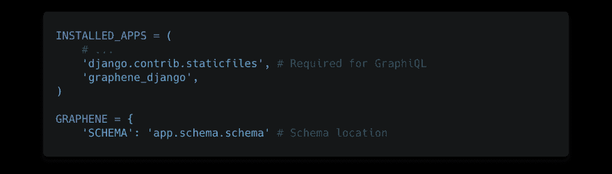
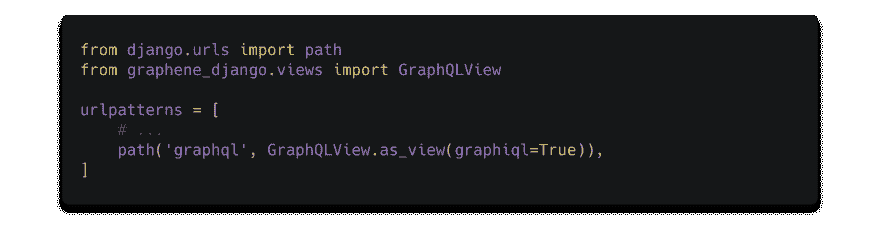
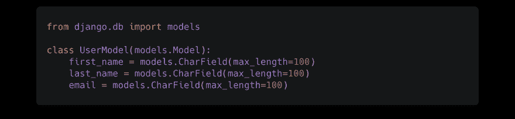
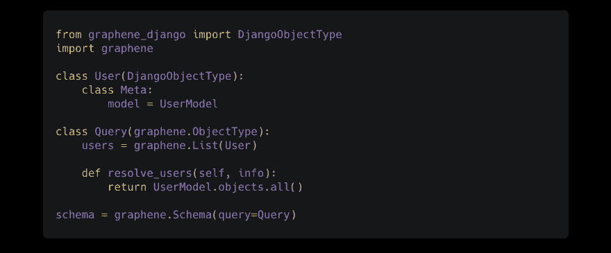
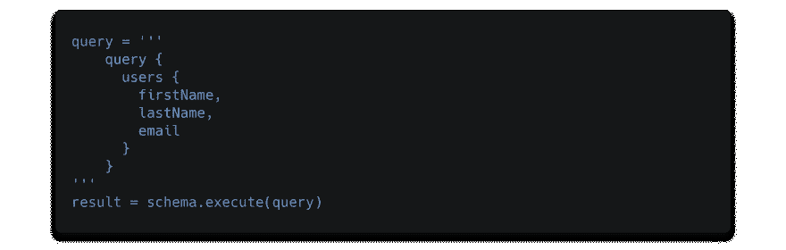

# Python 中的 GraphQL 入门

> 原文：<https://dev.to/graphqleditor/getting-started-with-graphql-in-python-4mgf>

现代框架来来去去。其中一些设法成为新的标准。随着像 [React](https://reactjs.org/) 这样的现代 JavaScript 库的兴起，像 GraphQL APIs 这样的新的数据获取方法变得越来越流行。虽然 [Node.js](https://nodejs.org/en/) 仍然是基于 [GraphQL](https://graphql.org/) 的后端最受欢迎的技术，但还有许多其他选择。

如果 Python 是你的首选，你会非常渴望听到 Django 对 GraphQL 的良好支持。更具体地说 [Graphene](https://graphene-python.org/) ，一个旨在通过提供用于构建 GraphQL APIs 的库来减轻开发人员负担的产品。在我们继续之前，让我们看看这一切是如何开始的。

#### 需要新的方法

在 2010 年初，IT 行业不得不面对一个新的挑战。移动使用的显著增长显示了架构的弱点许多大型社交服务的数据结构采用图表的形式。移动使用的显著增加导致了许多性能问题，如低功率设备和松散的网络，开发团队发现 REST 不是处理这类问题的最佳方法。

***【适应或死亡】***

脸书意识到这是移动应用性能的一个关键部分，于是开始研究一个解决方案来满足他们的新闻订阅的数据管理需求，这个解决方案后来以 GraphQL 的名字开源。与此同时，其他几家公司也发现了他们的数据获取模型存在同样的问题。在 GraphQL 公开后，他们中的许多人放弃了他们的项目，决定采用这项伟大的技术。不像其他人，网飞继续致力于他们自己的 REST 替代品 [Falcor](https://github.com/Netflix/falcor) ，他们也决定开源。

#### 什么是 GraphQL

GraphQL 是一种用于 API 的查询语言。它变得越来越流行，因为与 REST 不同，它提供了更智能&更有弹性的数据获取。

让我们来看看简单的 GraphQL 查询:

```
query {
  user {
    name
  }
} 
```

它将返回一个服务器响应:

```
{
  "user": {
    "name": "Tomek Poniatowicz",
   }
} 
```

现在假设您正在为脸书提要获取数据，其中有一个用户、该用户朋友的帖子、其他用户对这些帖子的评论等。有很多数据需要被请求，这可能会导致 REST 中的上取/下取问题。由于 GraphQL 赋予了客户端获取所需数据的能力，因此不会降低速度。向查询中添加一个新字段也非常简单。

#### Django 集成为石墨烯

我们需要安装`graphene-django`库，并将其包含在我们的`settings.py`文件
中

```
pip install "graphene-django>=2.0" 
```

[](https://res.cloudinary.com/practicaldev/image/fetch/s--KuCAaJJB--/c_limit%2Cf_auto%2Cfl_progressive%2Cq_auto%2Cw_880/https://thepracticaldev.s3.amazonaws.com/i/zd8c0qksuhntdt6we1iw.png)

并在 Django app 中设置一个 GraphQL 端点

[](https://res.cloudinary.com/practicaldev/image/fetch/s--HrvLdcWv--/c_limit%2Cf_auto%2Cfl_progressive%2Cq_auto%2Cw_880/https://thepracticaldev.s3.amazonaws.com/i/pg38bka6fn0q2cpavdls.png)

现在让我们在`app/models.py`文件
中准备一个简单的 Django 数据模型，并在`app/schema.py`中定义我们的模式:

[](https://res.cloudinary.com/practicaldev/image/fetch/s--vb4ALC_Y--/c_limit%2Cf_auto%2Cfl_progressive%2Cq_auto%2Cw_880/https://thepracticaldev.s3.amazonaws.com/i/80y7b1ckh2r09dp4xhbi.png) 
和

[](https://res.cloudinary.com/practicaldev/image/fetch/s--HiqK4rae--/c_limit%2Cf_auto%2Cfl_progressive%2Cq_auto%2Cw_880/https://thepracticaldev.s3.amazonaws.com/i/9n9dnqydvg1xzmsz8ops.png)

我们都准备好了。现在您可以查询您的简单模式:

[](https://res.cloudinary.com/practicaldev/image/fetch/s--U7H5Ptoz--/c_limit%2Cf_auto%2Cfl_progressive%2Cq_auto%2Cw_880/https://thepracticaldev.s3.amazonaws.com/i/g2xcnagguc9cgj5k1utb.png)

#### 使用 GraphQL 的主要好处

关于 GraphQL 有很多炒作，关于 [GraphQL vs REST](https://blog.graphqleditor.com/graphql-vs-rest-performance/) 有很多争论。
使用 GraphQL 的主要好处是它在获取数据方面比 REST 更有弹性，从而减少了到服务器的往返次数。GraphQL 解决了 T4 下的过度提取问题。
由于 GraphQL 处于采用的早期阶段，它有一些弱点(例如缓存)，但它正在获得很大的动力&成为一股值得考虑的力量。