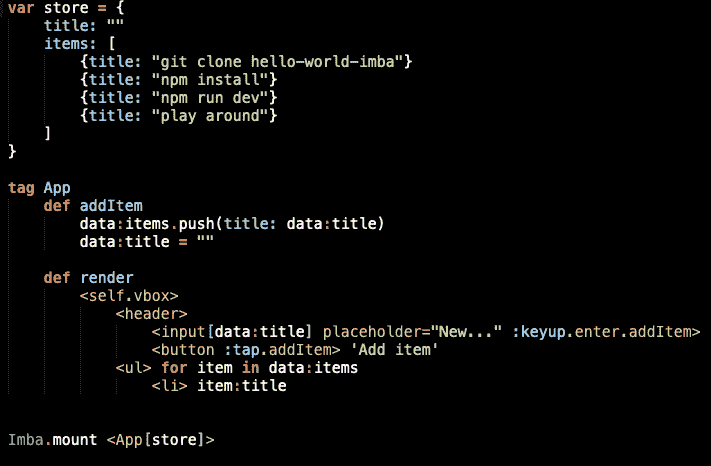
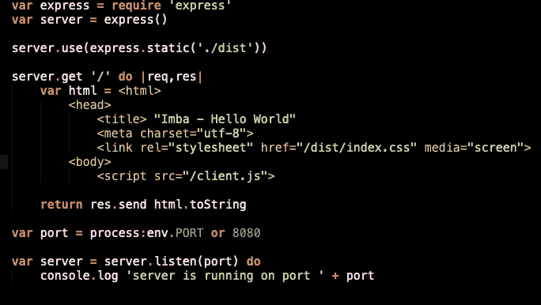

# Imba 入门

> 原文：<https://dev.to/alexanderalemayhu/getting-started-with-imba-l3f>

如果你错过了，有一种新的语言可以用来做网页开发。如果您对当前的框架选择不满意，想尝试一些新的东西。试试 [Imba](http://imba.io) ！

## Imba 是什么？

Imba 是一种编译成 Javascript 的高级语言。它可以让你通过一个基于组件的系统编写简洁的 HTML，在 Imba 的说法中，这个系统也被称为[标签](http://imba.io/guides/language/tags)。来自[的自述](https://github.com/imba/imba/blob/master/readme.md)文件:

> 如果 ruby 和 react 有一个基于缩进的子元素，它会是什么样子？

这是我喜欢 Imba 的原因之一。您可以享受用类似 Ruby 的语言编写的乐趣，同时享受部署 Javascript 的好处。

要了解更多关于性能改进的信息，请查看官方文档。更具体地说，是关于[高级/性能](http://imba.io/guides/advanced/performance#performance)的页面。

## 安装它

Imba 项目提供了一个你可以通过 yarn 或 npm
轻松安装的包

```
# Yarn
yarn global add imba

# NPM
npm install -g imba

# Check Imba is installed
$ imba --version
1.4.4
$ imbac --version
1.4.4
$ imbapack --version
3.12.0 
```

Enter fullscreen mode Exit fullscreen mode

Imba 自带三个命令`imba`、`imbac`和`imbapack`。让我们看看他们。

### imba

`imba` cli 工具负责读取源代码，然后它
将其传递给编译器实例。

```
$ imba --help

Usage: imba [options] [ -e script | script.imba ] [arguments]

  -e, --eval script      evaluate script
      --es5              evaluate without native let/var/await
  -h, --help             display this help message
  -v, --version          display the version number 
```

Enter fullscreen mode Exit fullscreen mode

### imbac

`imbac`是编译器的包装器。在以后的文章中，我可能会探索所有的选项，但是现在你只需要知道向它传递一个 Imba 文件会产生一个 Javascript 文件。

```
Usage: imbac [options] path/to/script.imba

  -a, --analyze          print out the scopes and variables of your script
      --es5              compile without native let/var/await
  -h, --help             display this help message
  -m, --source-map       generate source map and add inline to .js files
      --inline-helpers   inline helpers to not depend on imba.js
  -o, --output [dir]     set the output directory for compiled JavaScript
  -p, --print            print out the compiled JavaScript
  -s, --stdio            listen for and compile scripts over stdio
  -t, --tokenize         print out the tokens that the lexer/rewriter produce
      --target [target]  explicitly compile for node/web/webworker
  -v, --version          display the version number
      --silent           only print out errors (skip warnings)
  -w, --watch            recompile files on change
      --wrap             compile with top-level function wrapper 
```

Enter fullscreen mode Exit fullscreen mode

### imba CK

`imbac`是围绕`webpack` CLI 的包装器，它处理 imba 文件所需的
配置和处理。为简洁起见，下面的输出已被删减

```
webpack 3.12.0
Usage: https://webpack.js.org/api/cli/
Usage without config file: webpack <entry> [<entry>] <output>
Usage with config file: webpack

Config options:
  --config       Path to the config file
                         [string] [default: webpack.config.js or webpackfile.js]
  --config-name  Name of the config to use                              [string]
  --env          Environment passed to the config, when it is a function
[...] 
```

Enter fullscreen mode Exit fullscreen mode

## 你好世界

Imba 组织提供了一个 [hello world](https://github.com/imba/hello-world-imba) 的例子，你可以查看

```
# Get the source code
git clone https://github.com/imba/hello-world-imba.git
cd hello-world-imba
# Install the dependencies
npm install
# Run the app
npm run dev 
```

Enter fullscreen mode Exit fullscreen mode

该示例现在应该在 [http://localhost:8080/](http://localhost:8080/) 上运行。

这个例子是一个简单的 todo 应用程序，允许您添加项目。有趣的部分在`src/`目录中，这里有两个文件

```
src/
├── client.imba
└── server.imba 
```

Enter fullscreen mode Exit fullscreen mode

### 客户端

在客户端示例中，代码依赖 webpack 来构建到
`dist/client.js`的站点。Imba 代码如下所示

[](https://res.cloudinary.com/practicaldev/image/fetch/s--2CmUBHwe--/c_limit%2Cf_auto%2Cfl_progressive%2Cq_auto%2Cw_880/https://i.imgur.com/irFomkV.png)

编译后的 Javascript 输出有点长，所以我不会在这里添加，但是你可以在 [gist/client.js](https://gist.github.com/scanf/ea1cdcdbdbd50152f3abc3cd254d8e29) 上阅读。

加载应用的实际 HTML 很短:

```
<!doctype html>
<html lang="en">
  <head>
    Hello World
    <meta charset="utf-8">
    <link rel="stylesheet" href="index.css" media="screen">
  </head>
  <body>
    <script src="client.js"></script>
  </body>
</html> 
```

Enter fullscreen mode Exit fullscreen mode

## 服务器

与客户端示例相反，您不需要 webpack 来运行它，并且可以将文件传递给`imba`

```
$ imba src/server.imba
server is running on port 8080 
```

Enter fullscreen mode Exit fullscreen mode

为什么会这样？服务器示例使用了 express，这是一个很好的例子，说明 Imba 并没有重新发明一切，而是允许您重用现有的 Javascript 代码，同时仍然使用经典的 Imba 语法进行编写😃

[](https://res.cloudinary.com/practicaldev/image/fetch/s--yffPwGpc--/c_limit%2Cf_auto%2Cfl_progressive%2Cq_auto%2Cw_880/https://i.imgur.com/2WiUJBL.png)

注意，虽然上面的例子是在客户端加载一个 Javascript 文件，但是您可以在服务器上呈现页面，就像我在下面的玩具项目 [xiyo.no](https://xiyo.no) 中所做的那样。如果你感兴趣，代码可以在这里找到 [scanf/xiyo.imba](https://github.com/scanf/xiyo.imba)

[](https://res.cloudinary.com/practicaldev/image/fetch/s--yHTlb8tX--/c_limit%2Cf_auto%2Cfl_progressive%2Cq_auto%2Cw_880/https://i.imgur.com/dGJBysc.png)

## 工装

虽然 Javascript 生态系统可以用于你在 npmjs.org 找到的各种东西，但 Imba 生态系统中的工具仍然非常年轻，还在不断发展。如果你想用类似 create-react-app 和 vue-cli 的工具开始一个新项目，那么试试 [athif23/start-imba](https://github.com/athif23/start-imba)

### 入门-imba

```
$ git clone https://github.com/athif23/start-imba
$ npm install -g ./start-imba/ 
```

Enter fullscreen mode Exit fullscreen mode

### 开始一个新项目

```
$ start-imba my-cool-project 
```

Enter fullscreen mode Exit fullscreen mode

`start-imba`然后为你生成如下结构

```
my-cool-project/
├── dist
│   ├── imba-logo.png
│   ├── index.css
│   └── index.html
├── package.json
├── src
│   ├── components
│   │   └── App.imba
│   ├── index.imba
│   └── styles
│       ├── App.scss
│       └── index.scss
└── webpack.config.js

4 directories, 9 files 
```

Enter fullscreen mode Exit fullscreen mode

安装完依赖项并启动 webpack 服务器后，您就可以开始编码了

```
$ yarn
[...]
$ yarn run start
[...]
ℹ ｢wds｣: Project is running at http://localhost:8080/
[...] 
```

Enter fullscreen mode Exit fullscreen mode

## 总结

Imba 已准备好投入生产使用，并使构建 web 应用程序变得更加有趣。类似于 Ruby，你可以获得的生产力提升是真实的。您可以从今天开始部署它😉

令人惊叹的学习平台 [Scrimba](http://scrimba.com) 由 imba 打造。这也是一个实验的好地方，因为 Scrimba 有 imba 操场，你可以互动地跑步。[Imba 的作者辛德雷·阿萨瑟](https://github.com/somebee)，你可以通过搜索 [`Imba`](https://scrimba.com/search?q=imba) 找到几个很棒的视频。

## 挑战

如果你想开始写作，但不知道从哪里开始。您可以添加到 hello world 应用程序的几个改进是

*   [ ]在客户端上保留项目。
*   [ ]将项目标记为已完成。
*   [ ]删除所有已完成的项目。
*   [ ]删除项目。

如果你被卡住了，看看[要点/示例](http://imba.io/guides/essentials/examples#simple-todo-list)上的示例。你能做到的！如果你最终用 hello world 的例子做了一些很酷的事情，请在评论中分享链接。

感谢阅读和快乐编码。

这个帖子的灵感来自于[入门 Deno](https://dev.to/wuz/getting-started-with-deno-e1m) 。