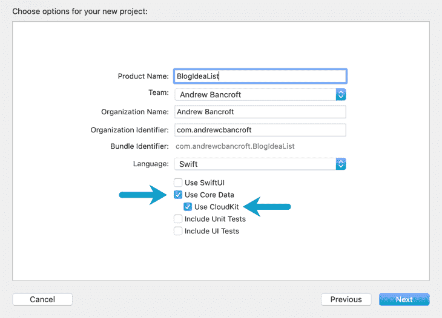
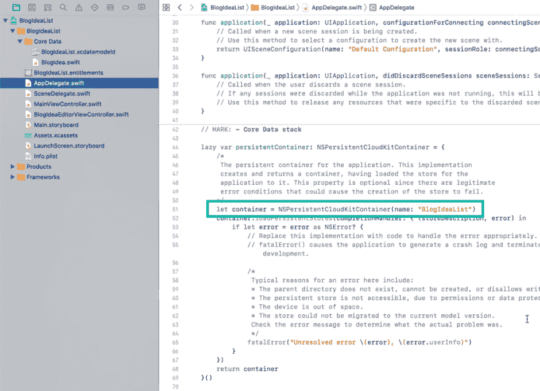
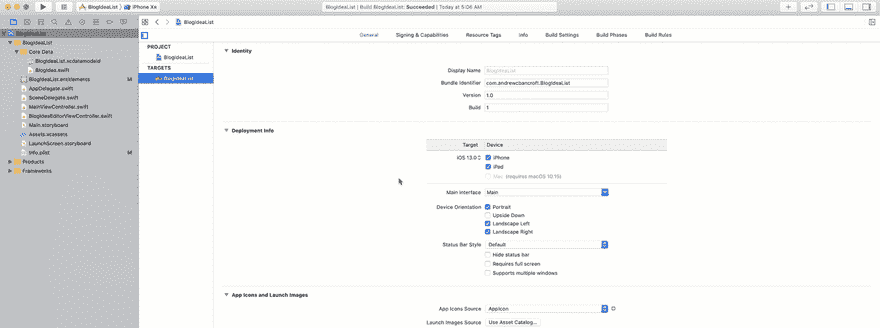
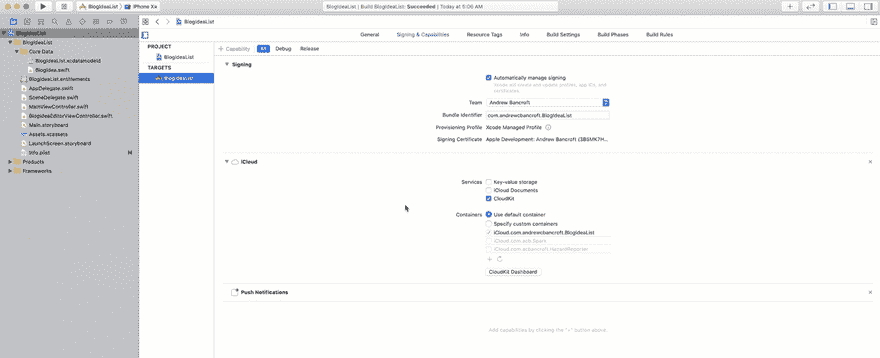
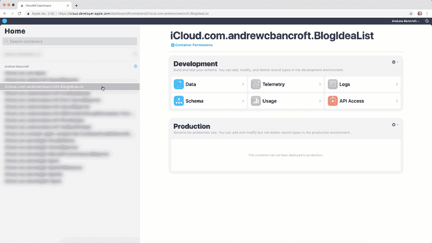
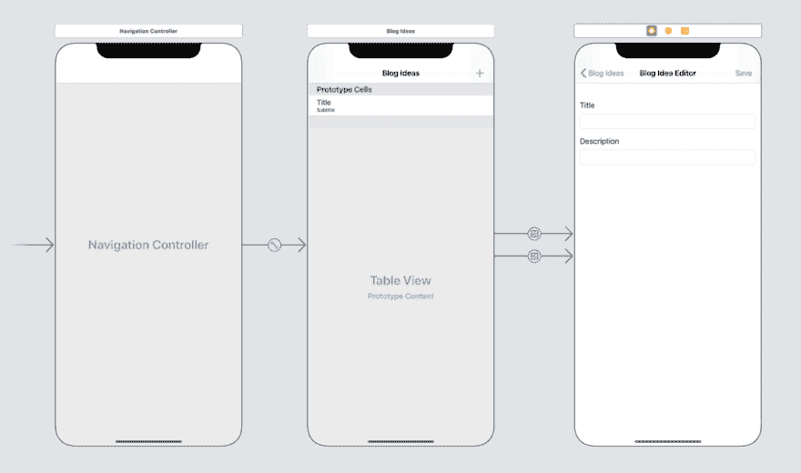
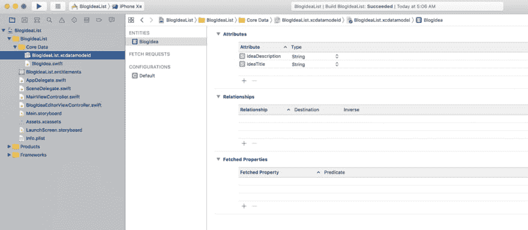
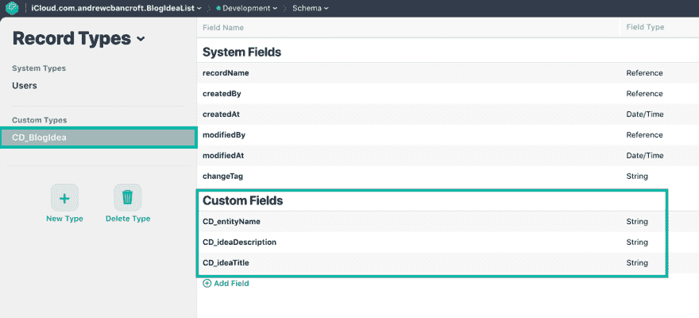

# NSPersistentCloudKitContainer 入门

> 原文：<https://dev.to/andrewcbancroft/getting-started-with-nspersistentcloudkitcontainer-5c73>

## 先做第一件事

*   为了在你的应用中使用`NSPersistentCloudKitContainer`，你需要瞄准 iOS 13+。
*   CloudKit 同步部分仅在物理设备上工作(不在模拟器中)。在这种情况下，你需要两台或更多设备运行该应用程序，并使用同一个 iCloud 帐户来全面测试，并确保同步和数据合并行为如你所愿。

本演练的目标是为您提供一个使用`NSPersistentCloudKitContainer`执行和同步创建、读取、更新和删除操作的完整工作示例。

这是一个我希望引用基础知识的项目……一些超越了开箱即用的东西，保存了一个主-细节应用程序预实现的时间戳列表，但是一些没有 T4 苹果的示例项目复杂的东西，比如数据模型中涉及的几个关系，持久化容器上配置的额外特性等等。

我也把它作为参考提供给你——我希望它能有所帮助！

资源

*   [博客创意列表示例 Xcode 项目](https://github.com/andrewcbancroft/BlogIdeaList)
*   [使用 CloudKit 的核心数据- WWDC 2019 会议 202](https://developer.apple.com/videos/play/wwdc2019/202)

## 设置

开始使用`NSPersistentCloudKitContainer`最简单的方法是在开始新项目时启用核心数据和 CloudKit。

[](https://res.cloudinary.com/practicaldev/image/fetch/s--rrCG8btV--/c_limit%2Cf_auto%2Cfl_progressive%2Cq_auto%2Cw_880/https://www.andrewcbancroft.com/blog/ios-development/data-persistence/getting-started-with-nspersistentcloudkitcontainer/enable-core-data-cloudkit.png)

### 核心数据+ CloudKit 堆栈

Xcode 在通常的位置提供了您需要的核心数据栈代码:在 AppDelegate.swift 文件中。

不过有一个显著的区别。Xcode 没有初始化一个普通的`NSPersistentContainer`，而是使用了新的`NSPersistentCloudKitContainer`(这就是为什么在创建应用程序时选中 CloudKit 框很重要)。

[](https://res.cloudinary.com/practicaldev/image/fetch/s--5tjD1UQY--/c_limit%2Cf_auto%2Cfl_progressive%2Cq_auto%2Cw_880/https://www.andrewcbancroft.com/blog/ios-development/data-persistence/getting-started-with-nspersistentcloudkitcontainer/nspersistentcloudkitcontainer-code.png)

### 现有的 app 呢？

如果你已经有了一个使用“常规”`NSPersistentContainer`的现有应用，你可以将其更改为`NSPersistentCloudKitContainer`并从那里继续！

如果你还没有在你的应用中使用`NSPersistentContainer`，我的关于如何迁移的指南[可能会有所帮助！](https://dev.to/andrewcbancroft/using-an-existing-sqlite-store-with-nspersistentcontainer-1o09-temp-slug-1652245)

### 添加功能

虽然 Xcode 会为您自动生成核心数据+ CloudKit 堆栈，但它不会为您启用 iCloud。

要启用全部功能，您需要前往您的 **Xcode 项目设置**。

然后点击**签约&能力**部分，添加 **iCloud** 和**后台模式**能力。

勾选 **CloudKit 复选框**，以及**远程通知复选框**。

#### 添加 iCloud + CloudKit

[](https://res.cloudinary.com/practicaldev/image/fetch/s--MCuh9j7B--/c_limit%2Cf_auto%2Cfl_progressive%2Cq_66%2Cw_880/https://www.andrewcbancroft.com/blog/ios-development/data-persistence/getting-started-with-nspersistentcloudkitcontainer/add-icloud.gif)

#### 添加后台模式+远程通知

[](https://res.cloudinary.com/practicaldev/image/fetch/s--cP9gBxbr--/c_limit%2Cf_auto%2Cfl_progressive%2Cq_66%2Cw_880/https://www.andrewcbancroft.com/blog/ios-development/data-persistence/getting-started-with-nspersistentcloudkitcontainer/add-background-modes.gif)

### 注册远程通知怎么样？

`NSPersistentCloudKitContainer`的美妙之处在于它处理了监听和响应远程通知所需的所有工作。

这意味着本地保存在一个设备上的数据会自动上传到 iCloud 并同步回*另一个*设备。

### 我在 iCloud 的数据模型怎么样？

当您为应用程序启用 iCloud 功能时，Xcode 会自动在 CloudKit Dashboard 中为您的应用程序创建一个容器。

然而，它不会*而不是*创建一个与您的核心数据模型相匹配的模式……这是一个您可以切换的设置，但是默认行为是在人们创建对象并将它们保存到您的持久性存储时“延迟”创建模式。

[](https://res.cloudinary.com/practicaldev/image/fetch/s--MVa1VqT---/c_limit%2Cf_auto%2Cfl_progressive%2Cq_66%2Cw_880/https://www.andrewcbancroft.com/blog/ios-development/data-persistence/getting-started-with-nspersistentcloudkitcontainer/empty-schema.gif)

## 走完范例项目

WWDC 总是能从我的大脑中获得博客想法，所以这个小应用的主题是“保存博客想法列表”，既可以在本地保存，也可以通过`NSPersistentCloudKitContainer`在我的设备上*保存。*

### 用户界面

用户界面允许您执行数据驱动应用程序的基本操作:创建、读取、更新和删除对象。

[](https://res.cloudinary.com/practicaldev/image/fetch/s--l-rHrM32--/c_limit%2Cf_auto%2Cfl_progressive%2Cq_auto%2Cw_880/https://www.andrewcbancroft.com/blog/ios-development/data-persistence/getting-started-with-nspersistentcloudkitcontainer/user-interface.png)

### 数据模型

其数据模型是基本的:一个具有两个属性`String`的单个`BlogIdea`实体:`ideaTitle`和`ideaDescription`。

[](https://res.cloudinary.com/practicaldev/image/fetch/s---0-w38ZY--/c_limit%2Cf_auto%2Cfl_progressive%2Cq_auto%2Cw_880/https://www.andrewcbancroft.com/blog/ios-development/data-persistence/getting-started-with-nspersistentcloudkitcontainer/data-model.png)

没有关系或额外的配置选项…只有一个实体来保持它是一个基本的可引用项目。

NSManagedObject 子类是这样实现的:

```
 public class BlogIdea: NSManagedObject {

  @NSManaged public var ideaTitle: String?
  @NSManaged public var ideaDescription: String?

  static var entityName: String { return "BlogIdea" }
 } 
```

### 查看控制器

该示例附带了两个视图控制器:

**广告查看控制器**

```
 class MainViewController: UIViewController, 
   NSFetchedResultsControllerDelegate, 
   UITableViewDataSource, 
   UITableViewDelegate {
   // Responsible for listing out BlogIdeas in a table view

   // Holds a reference to an NSManagedObjectContext instance
   // which gets initialized in the SceneDelegate.swift file
   // and passed to this view controller when the scene gets "connected"

   // Uses NSFetchedResultsController to keep the table view in sync
   // with the Core Data managed object context

   // Implements swipe-to-delete with delete confirmation

   // Navigates to editor when someone taps on a table view row
   // and passes its NSManagedObjectContext instance along
  } 
```

**BlogIdeaEditorViewController**

```
 class BlogIdeaEditorViewController: UIViewController {
  // Responsible for creating new BlogIdeas

  // Holds a reference to an NSManagedObjectContext instance
  // which gets passed along in MainViewController's prepare for segue method

  // Able to edit existing BlogIdeas
 } 
```

## 了解默认同步行为

在这一点上，没有发生额外的配置。核心数据堆栈是未经修改的 Xcode 生成的代码，提取结果控制器连接到应用程序的托管对象上下文，准备好提取博客想法并帮助它们进入表格视图。

如果您打开项目，在两台设备上构建并运行，并开始添加、更新、删除博客想法，等等。会发生什么？

第一个观察是…事情…不…似乎在工作…

[https://www.youtube.com/embed/DLAwrSCl3Cc](https://www.youtube.com/embed/DLAwrSCl3Cc)

…至少不是我想象的那样。

我*期望*我的博客列表视图会自动更新，以响应我另一台设备上的更改，但是……没有。谢天谢地，这是一个“简单”的修复。

## 反映用户界面的变化

无论您在哪里访问应用程序的持久化 CloudKit 容器来获取`viewContext`，您都需要将`automaticallyMergesChangesFromParent`属性设置为`true`。

我在`SceneDelegate`中初始化了容器，所以看看下面的代码 exerpt，看看它是在哪里设置的。

**SceneDelegate.swift**

```
 func scene(_ scene: UIScene, willConnectTo session: UISceneSession, options connectionOptions: UIScene.ConnectionOptions) {
   // Use this method to optionally configure and attach the UIWindow `window` to the provided UIWindowScene `scene`.
   // If using a storyboard, the `window` property will automatically be initialized and attached to the scene.
   // This delegate does not imply the connecting scene or session are new (see `application:configurationForConnectingSceneSession` instead).
   guard let _ = (scene as? UIWindowScene) else { return }

   let navigationController = self.window?.rootViewController as! UINavigationController
   let mainVC = navigationController.viewControllers[ ] as! MainViewController

   let viewContext = (UIApplication.shared.delegate as! AppDelegate).persistentContainer.viewContext
   viewContext.automaticallyMergesChangesFromParent = true

   mainVC.managedObjectContext = viewContext
  } 
```

进行这一行更改将使应用程序(由`NSFetchedResultsController`支持)能够更新 UI 以响应远程数据更改…

**最终**

它可以很慢(从 5 到 15 秒)。但最终还是会更新的。

## 重访 iCloud 模式

保存对象后，iCloud Dashboard 中的模式将会更新，以反映您在核心数据模型中设计的属性。

[](https://res.cloudinary.com/practicaldev/image/fetch/s--5zujjJLw--/c_limit%2Cf_auto%2Cfl_progressive%2Cq_auto%2Cw_880/https://www.andrewcbancroft.com/blog/ios-development/data-persistence/getting-started-with-nspersistentcloudkitcontainer/revisit-schema.png)

## 我的数据呢？

如果您尝试在为您的应用程序提供的任何 iCloud 数据库中查询 BlogIdea 记录，您将找不到任何记录。

为什么？

那是因为苹果完全为你的核心数据+ CloudKit 数据管理了一个隐藏区。在 [WWDC 2019 展示](https://developer.apple.com/videos/play/wwdc2019/202)(如果你在看的话，大约是 10:50)中，每个人都简要地提到了它。

## 包装完毕

我希望为您提供一个使用`NSPersistentCloudKitContainer`执行和同步创建、读取、更新和删除操作的完整工作示例。

查看 [GitHub repo](https://github.com/andrewcbancroft/BlogIdeaList) ，发表评论，或者在 Twitter 上 [@我](https://twitter.com/andrewcbancroft)从这里继续对话！