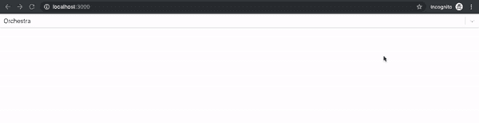
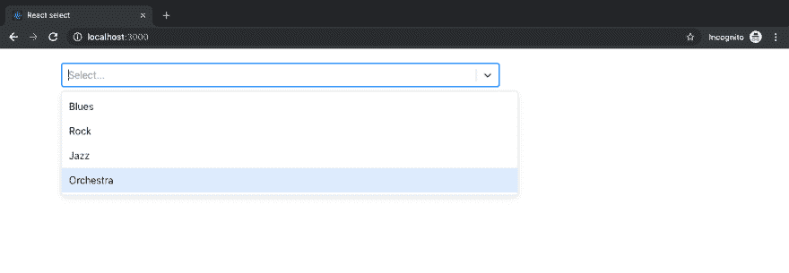
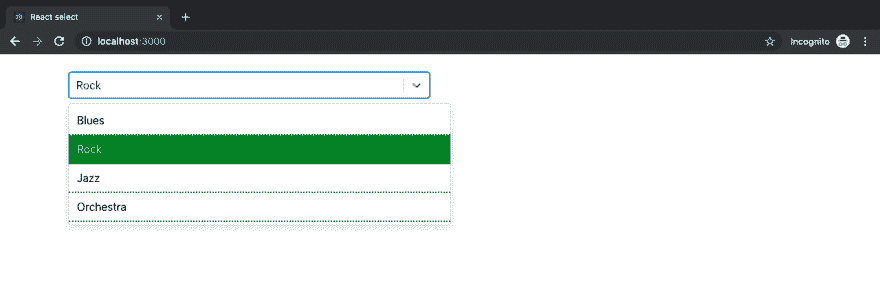
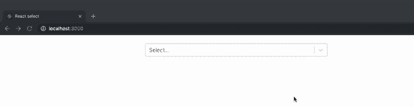
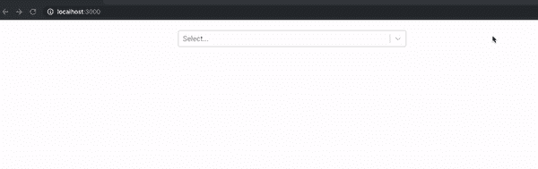

# react-select 入门

> 原文：<https://dev.to/bnevilleoneill/getting-started-with-react-select-33n8>

[](https://res.cloudinary.com/practicaldev/image/fetch/s--mm-zbCcY--/c_limit%2Cf_auto%2Cfl_progressive%2Cq_auto%2Cw_880/https://thepracticaldev.s3.amazonaws.com/i/kmujndd51cs0wp0rrd7f.png)

## 简介

三四年前，构建 select 元素曾经是处理 web 项目时最容易构建的东西之一。现在，有太多的东西被用来构建选择元素，尤其是当用户界面/UX 是一个高优先级时。

人们不得不考虑一些特性，比如聚焦的特性、选择元素的样式、从远程数据源获取数据等等。您可能在从事 React 项目时有过这种想法，并希望在多元宇宙的某个地方存在一个可重用的组件。嗯，幸运的是，[杰德·沃森](https://github.com/JedWatson)开始了一个开源项目，由 [Thinkmill](https://www.thinkmill.com.au/) (他的公司)和 [Atlassian](https://atlaskit.atlassian.com/) 资助，名为 [react-select](https://react-select.com/home) 。

react-select 的第一版有几个限制，这就产生了 v2。在本文中，我们将回顾 react-select v2 中包含的令人惊叹的功能，并通过启动板向我们介绍 react-select v2 以及如何开始。

## 安装及基本用法

**先决条件**

1.  [纱线](https://yarnpkg.com/en/docs/install) / [npm](https://www.npmjs.com/get-npm) 安装完毕
2.  [创建 react 应用程序](https://facebook.github.io/create-react-app/docs/getting-started)安装 CLI 工具
3.  对 HTML、JavaScript (ES6)和 CSS 有基本的了解
4.  对 React JS 和使用 create react app 有基本的了解
5.  对命令行终端的基本了解

[](https://logrocket.com/signup/)

### **安装**

所有这些需求都已解决，是时候将 react-select 包添加到我们现有的 react 应用程序中了。在本教程中，我们将使用 create react-app CLI 工具。如果您还没有一个现有的项目，您可以像这样提供一个:

```
$ yarn create react-app react 
```

Enter fullscreen mode Exit fullscreen mode

完成之后，我们将从 npm:
安装 react-select 包

```
$ yarn add react-select 
```

Enter fullscreen mode Exit fullscreen mode

现在，我们来看看如何在 react 应用程序中导入和使用 react-select 包。

### 基本用法

在`App.js`文件中，我们在文件的顶部导入两个项目，react 和 react-select 包分别如下:

```
//App.js

import React from 'react';
import Select from 'react-select';

... 
```

Enter fullscreen mode Exit fullscreen mode

导入这两个包后，我们将能够访问 react-select()并扩展`React.Component`类。在传统的 HTML 中，标签包含多个选项和值。我们的 react-select 组件遵循相同的约定，但是选项和值作为 props 传入。

```
//App.js

//Import React and Select 

const options = [
  { value: 'blues', label: 'Blues' },
  { value: 'rock', label: 'Rock' },
  { value: 'jazz', label: 'Jazz' },
  { value: 'orchestra' label: 'Orchestra' } 
];

class App extends React.Component {
  render(){
    return (
      <Select options = {options} />
    );
  }
}

export default App; 
```

Enter fullscreen mode Exit fullscreen mode

在上面的代码片段中，我们将选择选项作为音乐流派，并将其作为道具传递给选择组件。类`App`被导出，这样它就可以呈现给 DOM 中的`App`组件。当我们运行这个应用程序时，我们应该看到一个 select 元素从屏幕的一端跨越到另一端。

[](https://res.cloudinary.com/practicaldev/image/fetch/s--Ke56lPtn--/c_limit%2Cf_auto%2Cfl_progressive%2Cq_66%2Cw_880/https://paper-attachments.dropbox.com/s_F9F0BEA2606EC0FEDAC450A16F9976CC05FBD81BB424031DAF1E91C33340520A_1555273901479_react-select-basic-usage.gif) 如果您在运行 react 应用程序时得到了这个输出，那就太棒了。在接下来的几节中，我们将研究如何设计 select 组件的样式，以扩展其功能并使其在视觉上令人愉悦。

## 定制您选择的组件样式

在本节中，我们将讨论如何为我们选择的组件增添美感。首先，我们将利用 [bootstrap CSS](https://getbootstrap.com/docs/3.4/css/) 来调整 select 组件的大小，这样它就不会占据整个网页的宽度。我们将在我们的项目中安装引导程序，如下所示:

```
$ yarn add boostrap@4.31 
```

Enter fullscreen mode Exit fullscreen mode

安装 bootstrap 后，我们将把我们的样式添加到我们选择的组件中。

```
//App.js

import 'bootstrap/dist/css/bootstrap.css';
//Import react and select 

return(
  <Select className="mt-4 col-md-8 col-offset-4"
    options = { options }
  />
);

... 
```

Enter fullscreen mode Exit fullscreen mode

为了获得更好的结果，我们将把根 DOM 元素放在引导容器的`index.html`中。

```
<!-- index.html -->
...

<div class="container">
    <div id="root"></div>
</div>

... 
```

Enter fullscreen mode Exit fullscreen mode

这将为我们提供一个与下图一模一样的选择元素:

[](https://res.cloudinary.com/practicaldev/image/fetch/s--oZbgeUWo--/c_limit%2Cf_auto%2Cfl_progressive%2Cq_auto%2Cw_880/https://paper-attachments.dropbox.com/s_F9F0BEA2606EC0FEDAC450A16F9976CC05FBD81BB424031DAF1E91C33340520A_1555375874428_Screenshot%2B2019-04-16%2Bat%2B01.43.33.png)

**样式和状态**

在这一节中，我们将研究如何扩展开箱即用的默认样式，以及如何设计整个组件的样式。上面我们添加了一些引导样式的代码块很好地演示了扩展 select 组件附带的默认样式。为了进一步说明，我们将调整选择组件的外观:

```
//App.js 
//Import react and select

const customStyles = {
  option: (provided, state) => ({
    ...provided,
    borderBottom: '2px dotted green',
    color: state.isSelected ? 'yellow' : 'black',
    backgroundColor: state.isSelected ? 'green' : 'white'
  }),
  control: (provided) => ({
    ...provided,
    marginTop: "5%",
  })
}

...

return(
  <Select className="col-md-8 col-offset-4"
    styles = { customStyles }
    options = { options }
  />
);

... 
```

Enter fullscreen mode Exit fullscreen mode

我们调整了两个组件属性(option 和 control)来扩展和定制 select 组件的外观。react-select 提供了许多特性，这为我们这些消费者提供了很大的空间来满足我们的需求和品味。我们将在本文的后面部分详细讨论定制组件。在本节中，我们将简要讨论上面提到的两个定制组件。

**选项:**这是负责显示选项的组件。通过定位该组件，我们能够获得下面的选择元素:

[](https://res.cloudinary.com/practicaldev/image/fetch/s--7LfuqUXg--/c_limit%2Cf_auto%2Cfl_progressive%2Cq_auto%2Cw_880/https://paper-attachments.dropbox.com/s_F9F0BEA2606EC0FEDAC450A16F9976CC05FBD81BB424031DAF1E91C33340520A_1555450345902_Screenshot%2B2019-04-16%2Bat%2B22.32.01.png)

在上面的图像中，我们可以将选中选项的背景设置为绿色，并将文本颜色改为黄色。这是通过将其扩展到所提供的变量`…provided`来扩展其默认样式而实现的

**控制:**这是负责`ValueContainer`和`IndicatorsContainer`的部件。这样，我们能够添加一个`5%`的`margin-top`属性，它将整个选择组件从页面顶部移开，如上图所示，而不是基本用法部分中选择组件的第一个图像。

## 道具

在这一节中，我们将了解一些用于定制 select 组件功能的主要工具。下面的例子说明了这些道具是如何派上用场的。

```
//App.js

//Import react and select

state = {
  selectedOption: null,
}
handleChange = (selectedOption) => {
  this.setState({ selectedOption });
  console.log(`Option selected:`, selectedOption);
}
render(){
  const { selectedOption } = this.state;
}

return (
  <Select className="mt-4 col-md-6 col-offset-4"
  onChange={this.handleChange}
  options={options}
  autoFocus={true}
  />
) 
```

Enter fullscreen mode Exit fullscreen mode

上面是状态管理器属性`onChange`,我们用它来获取当前选中项目的信息。假设我们选择`rock`作为控制台中的一个选项，我们将得到类似于`Option selected: {value:"rock", label: "Rock"}`的东西，当我们想要操作从选择组件中获得的数据时，这将会很方便。其他看到的道具是选项和`autoFocus`道具。options prop 用于将选择选项传递给选择组件。上面代码块中使用的选项有:

```
const options = [
  { value: 'blues', label: 'Blues' },
  { value: 'rock', label: 'Rock' },
  { value: 'jazz', label: 'Jazz' },
  { value: 'orchestra' label: 'Orchestra' } 
]; 
```

Enter fullscreen mode Exit fullscreen mode

数据类型为`boolean`的自动对焦属性用于在页面加载时将自动对焦添加到选择组件中。要了解可用的道具，你可以查看反应选择的道具文档。

## 自定义组件

在**样式和状态**下，我们讨论了用于扩展选择样式的两个定制组件(选项和控件)。在这一节中，我们将看看另一个名为`Custom SingleValue`的定制组件。这个自定义组件做我们的常规选择组件做的事情，但是我们将增加一点技巧。在我们的`App.js`文件中，我们将分别从`react`和`react-select`导入`React`和`Select`包，如下:

```
//App.js

import React, { type ElementConfig } from 'react';
import Select, { components } from 'react-select';
... 
```

Enter fullscreen mode Exit fullscreen mode

当我们完成时，我们就有了一个看起来像这样的成品:

[](https://res.cloudinary.com/practicaldev/image/fetch/s--C_2zYFbi--/c_limit%2Cf_auto%2Cfl_progressive%2Cq_66%2Cw_880/https://paper-attachments.dropbox.com/s_F9F0BEA2606EC0FEDAC450A16F9976CC05FBD81BB424031DAF1E91C33340520A_1555501514723_select-colour.gif)

在下面的代码块中，我们将自定义组件`SingleValue`定义为扩展`react-select`包中基本组件的方法。在我们的 App 类中，我们有几个对功能有贡献的道具和函数(如上图所示),例如:

**handleChange:** 这个方法由一个名为`onChange`的状态管理器道具触发。这个方法负责在我们的状态对象`selectedOption`中存储所选选项的值

**样式:**在这个道具中，我们扩展了样式修改器方法`singleValue`，通过将默认样式扩展到基本对象中，我们修改了默认情况下已经可用的样式。负责为每个选中的选项添加背景颜色的行是`background: this.state.selectedOption.value`,在这里我们从状态中获取当前选中的选项，并使用它来更新背景

**components:** 在组件 prop 中我们传入了单值组件，该组件的主要功能是显示在单个选择的输入中。

选项:我们现在都知道的选项属性是我们如何传入选择项目的数组对象，在本例中是这样的颜色。

在这个道具中，我们添加了 bootstrap 样式，使我们选择的组件远离上边距，并很好地集中我们选择的组件。

```
//App.js 

 const SingleValue = ({ children, ...props }) => (
   <components.SingleValue {...props}>
     {children}
   </components.SingleValue>
 );

 class App extends React.Component {
   state = {};
   state = {
     selectedOption: null,
   }
   handleChange = (selectedOption) => {
     this.setState({ selectedOption });
   }
   render() {
     return (
       <Select
           className="mt-4 col-md-6 col-offset-4"
           onChange={this.handleChange}
           styles={{ singleValue: (base) => ({ ...base, padding: 5, borderRadius: 5, background: this.state.selectedOption.value, color: 'white', display: 'flex' }) }}
           components={{ SingleValue }}
           options={colourOptions}
         />
     );
   }
 }
 export default App; 
```

Enter fullscreen mode Exit fullscreen mode

## 使用内置动画组件

在这一节中，我们将看看如何向 react select 组件添加一点动画。我们需要添加动画到我们选择的组件是导入动画组件，在这种情况下被命名为`makeAnimated`，然后在我们的组件的道具中引用`makeAnimated`，像这样:

```
//App.js

import React from 'react';
import Select, { components } from 'react-select';
import makeAnimated from 'react-select/lib/animated';
import 'bootstrap/dist/css/bootstrap.css';

const colourOptions = [] //our array of colours

class App extends React.Component {
  render(){
    return (
      <Select
        className="mt-4 col-md-6 col-offset-4"
        components={makeAnimated()}
        isMulti
        options={colourOptions}
        />
    );
  }
}

export default App; 
```

Enter fullscreen mode Exit fullscreen mode

`isMulti`道具用于让我们一次选择多个选项，如下图所示:

[](https://res.cloudinary.com/practicaldev/image/fetch/s--PqeQwaHz--/c_limit%2Cf_auto%2Cfl_progressive%2Cq_66%2Cw_880/https://paper-attachments.dropbox.com/s_F9F0BEA2606EC0FEDAC450A16F9976CC05FBD81BB424031DAF1E91C33340520A_1555514400578_react-select-animated-component.gif)

## 其他概念

关于使用 react-select 组件，还有一些重要的概念需要了解。其中之一是[异步组件](https://react-select.com/async)，它是这样导入的:

```
import Async from 'react-select/lib/Async'; 
```

Enter fullscreen mode Exit fullscreen mode

当我们想从 API 或数据库查询中请求选择值或选项时，这个组件就派上了用场。该组件有助于将`Async`属性添加到我们的 select 组件中，该组件由助手属性引导，如用于缓存选项的

`cacheOptions`以及事件监听器属性`onInputChange`。这个组件可以通过使用回调或承诺来实现。

另一个可能派上用场的组件是[固定选项组件](https://react-select.com/home#fixed-options)。该组件使固定选项成为可能，因为已经选择了不能删除的值。

## 结论

在这篇文章中，我们学习了 react-select 组件的一些常见用例，如何开始使用，以及如何扩展一些预定义的组件来满足我们的需求。react-select 包中内置了大量的功能，其中一些功能将满足您的需求，另一些功能您需要进行定制以适应您的使用情况。这里有一个[官方文档](https://react-select.com/home)的链接，让你的手脏起来。如果你有问题或遇到困难，请随时留下评论，我会伸出援助之手。【T2

* * *

## Plug: [LogRocket](https://logrocket.com/signup/) ，一款适用于网络应用的 DVR

[](https://logrocket.com/signup/)

[log rocket](https://logrocket.com/signup/)是一个前端日志工具，让你重放问题，就像它们发生在你自己的浏览器中一样。LogRocket 不需要猜测错误发生的原因，也不需要向用户询问截图和日志转储，而是让您重放会话以快速了解哪里出错了。它可以与任何应用程序完美配合，不管是什么框架，并且有插件可以记录来自 Redux、Vuex 和@ngrx/store 的额外上下文。

除了记录 Redux 动作和状态，LogRocket 还记录控制台日志、JavaScript 错误、stacktraces、带有头+体的网络请求/响应、浏览器元数据、自定义日志。它还使用 DOM 来记录页面上的 HTML 和 CSS，甚至为最复杂的单页面应用程序重新创建像素级完美视频。

[免费试用](https://logrocket.com/signup/)。

* * *

帖子[开始使用 react-select](https://blog.logrocket.com/getting-started-with-react-select/) 首先出现在[博客](https://blog.logrocket.com)上。