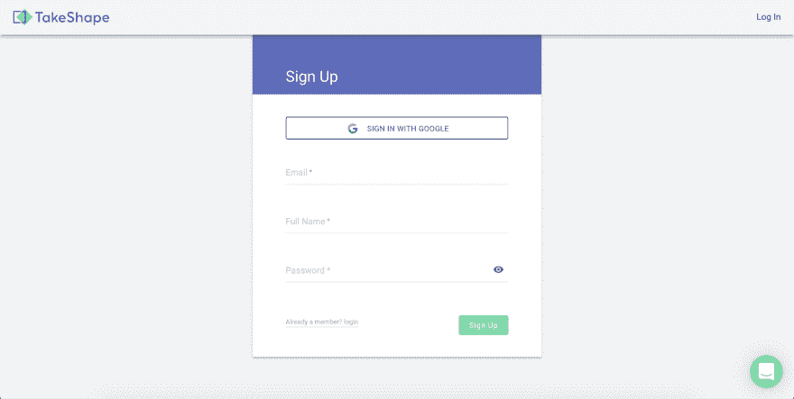
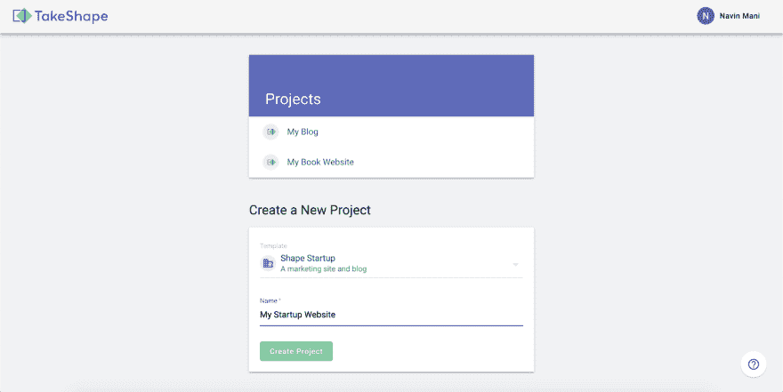
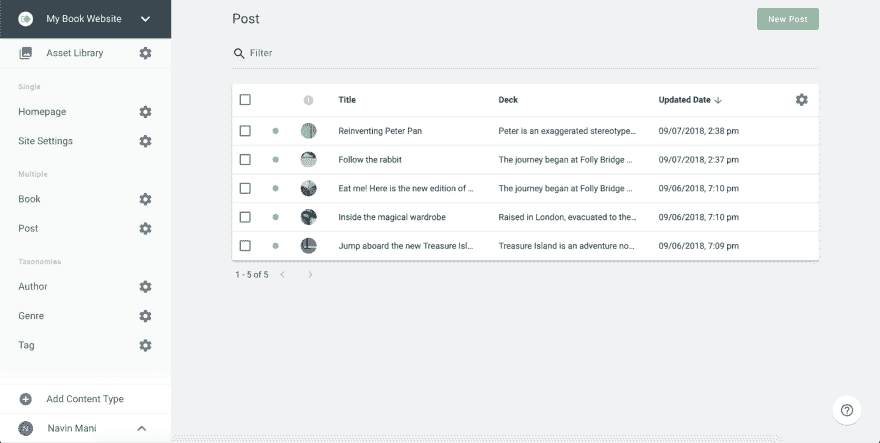
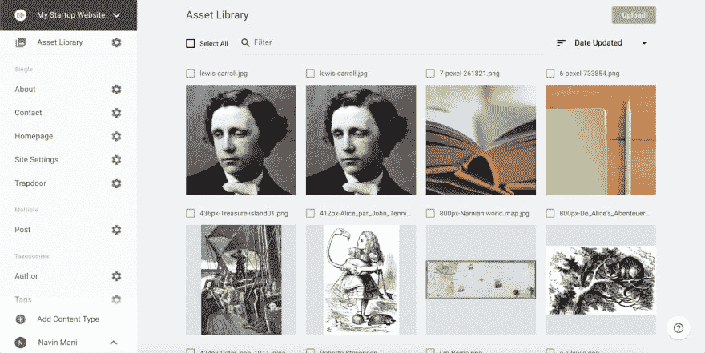
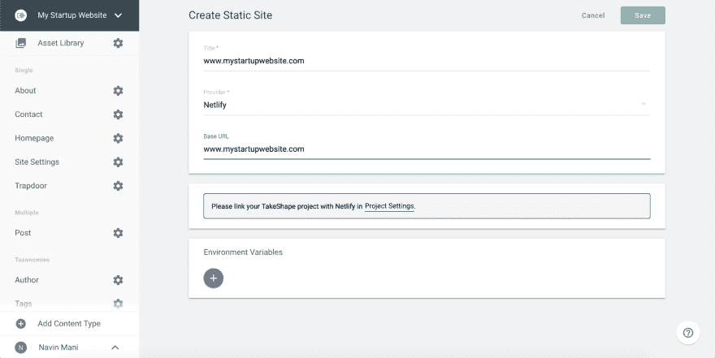
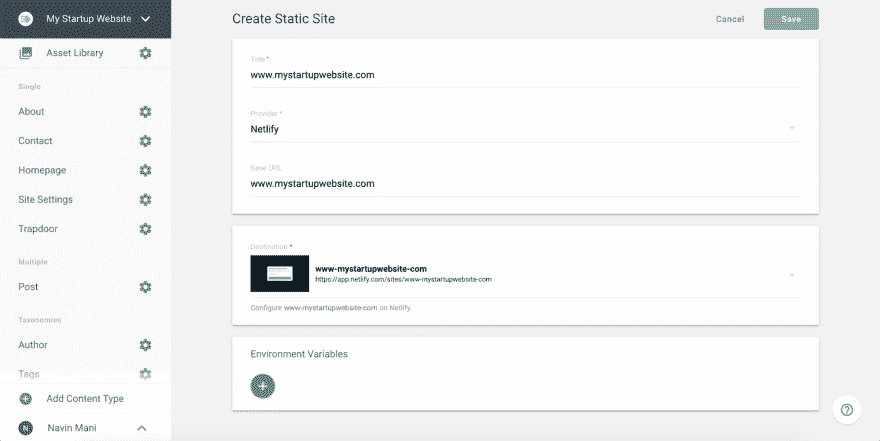
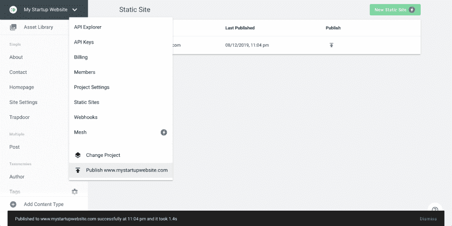
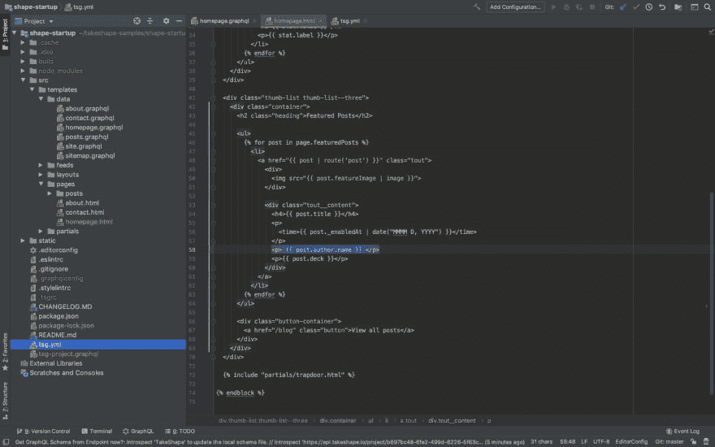
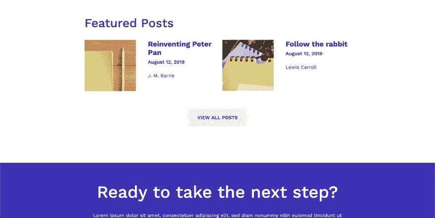

# 开始使用启动模板！

> 原文：<https://dev.to/takeshape/getting-started-with-the-startup-template-44ia>

### 让我们来看看使用 TakeShape 通过几个简单的步骤为你的创业公司创建一个[网页。这个模板可以作为你的主要产品网站🖥，🛬的登陆页面，或之间的任何东西。](https://shape-startup.takeshapesampleproject.com/)

1.  在[app.takeshape.io/signup](http://app.takeshape.io/signup)注册账户。通过 TakeShape 的 G-Suite 集成，这一过程只需点击两次鼠标即可完成。
    T3T5】

2.  有许多模板可以帮助你设计网页，我们很快就会用到它们。对于这个例子，让我们点击“形状启动”然后我们可以命名我们的项目，并单击“创建项目”
    [T3】](https://res.cloudinary.com/practicaldev/image/fetch/s--ylBk_uvx--/c_limit%2Cf_auto%2Cfl_progressive%2Cq_auto%2Cw_880/https://thepracticaldev.s3.amazonaws.com/i/8lxorxoz0yppoizzpx2t.png)

3.  如果我们前往左边的导航栏，我们可以点击“文章”并浏览已经与模板集成的文章。你也可以点击右上角的“新帖子”来添加更多的帖子。
    [T3】](https://res.cloudinary.com/practicaldev/image/fetch/s--GpZ4B6aY--/c_limit%2Cf_auto%2Cfl_progressive%2Cq_auto%2Cw_880/https://thepracticaldev.s3.amazonaws.com/i/csk8moi9503yzlzv0xav.png)

4.  我们还可以通过单击导航栏顶部的“资源库”来浏览图片、视频和其他资源。我们可以通过简单地从桌面拖动或点击右上角的“上传”来上传更多资产。
    [T3】](https://res.cloudinary.com/practicaldev/image/fetch/s--zRglhcSQ--/c_limit%2Cf_auto%2Cfl_progressive%2Cq_auto%2Cw_880/https://thepracticaldev.s3.amazonaws.com/i/0cj8gzxeepexil2upazs.png)

5.  我们有一个好看的网站，让我们让世界看到它。TakeShape 可以将你的网站部署到亚马逊 S3、谷歌云存储、FTP 和 Netlify。对于本例，我们将使用一键式集成部署到 [Netlify](https://www.netlify.com/) 。让我们导航到左上方的项目名称下拉菜单→“静态站点”→“新静态站点”。在这里，我们可以将我们的 TakeShape 项目链接到 Netlify。
    T3T5】

6.  这是它与 Netlify 连接时的样子。
    [T3】](https://res.cloudinary.com/practicaldev/image/fetch/s--u9_Rbb41--/c_limit%2Cf_auto%2Cfl_progressive%2Cq_auto%2Cw_880/https://thepracticaldev.s3.amazonaws.com/i/7au2ntn78exemlqvytki.png)

7.  现在让我们点击“保存”并发布！
    [T3】](https://res.cloudinary.com/practicaldev/image/fetch/s--ohFBLbfn--/c_limit%2Cf_auto%2Cfl_progressive%2Cq_auto%2Cw_880/https://thepracticaldev.s3.amazonaws.com/i/dsymh0v0o2i7zl5kkn07.png)

8.  看看你的超赞网站！

9.  既然模板已经建立并运行了，是时候进行定制了。让我们克隆 Github 库，这样我们就可以个性化它了！

    ```
    git clone https://github.com/takeshape/takeshape-samples.git takeshape-samples && cd takeshape-samples/shape-startup 
    ```

10.  要安装所有依赖项，让我们运行`npm install`。仔细检查您的节点版本`node -v`，确保您使用的是`v10.16.2`。

11.  运行`npx tsg init`并按照命令提示设置本地环境和 TakeShape 之间的通信。

12.  运行`npm start`启动服务器。它将默认运行在 [http://localhost:5000](http://localhost:5000) 上。

13.  现在我们可以进行大量的定制来使用这个模板。我想在页面底部添加每个特色帖子的作者。我们可以很容易地在`homepage.html`文件中模拟它的样子。这些变化可以立即在本地站点上看到！
    [](https://res.cloudinary.com/practicaldev/image/fetch/s--jdx2YdE1--/c_limit%2Cf_auto%2Cfl_progressive%2Cq_auto%2Cw_880/https://thepracticaldev.s3.amazonaws.com/i/nuonzoef4bt9ch1q5jm7.png)

14.  运行`npx tsg deploy`将您的更改部署到 Netlify 上托管的站点。

15.  导航到该网站并实时查看您的更新！
    [T3】](https://res.cloudinary.com/practicaldev/image/fetch/s--uZ5dtg_x--/c_limit%2Cf_auto%2Cfl_progressive%2Cq_auto%2Cw_880/https://thepracticaldev.s3.amazonaws.com/i/xnfahfqlk38v66shg8hr.png)

在这几个步骤中，我们建立了一个初具规模的网站🆙和跑步🏃‍♀️and:我们做了一些改动，可以在网站上看到。从这里开始，♾.的可能性是无限的我们很想看看你们用这个模板创建的网站！🤩