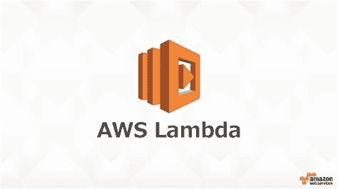

# 了解 AWS Lambda - FaaS

> 原文：<https://dev.to/kambanthemaker/getting-to-know-aws-lambda-faas-1ec2>

AWS Lambda 是一种 FaaS (Function as a Service)，一种编码单元的无服务器方法。我使用 AWS Lambda 已经有一段时间了，我对它的功能印象深刻。让我写一篇关于基本原理、优点和缺点的文章。

## 引擎盖下

在幕后，Lambda 使用 docker 容器来运行您的代码。容器是短暂的，因为它可能只持续一次调用或几次调用，这取决于调用的频率。这里的功能即服务并不意味着你只能运行单一的功能。我有我的大 Python 项目，包括 lambda 中的依赖库。

## 重要特征

*   容错——因为您的代码是在多个实例中维护的
*   可扩展性——AWS 根据传入的请求扩展计算能力，无需任何配置
*   与其他 AWS 服务集成，如 S3、API 网关、SNS、CloudFront、DynamoDB
*   随叫随到-如果没有被调用，您将不会被收费。相当酷！
*   从一个 lambda 调用其他 lambda 函数的能力
*   支持 Java、Python、Node.js、C#、Go 等多种编程语言。
*   免费层每月 1，000，000 个免费请求

## 限制&告诫

*   最长执行时间为 15 分钟(之前为 5 分钟)
*   临时目录的大小是 512 MB，所以下载大文件时需要小心
*   默认情况下，一个 AWS 帐户最多可以并发执行 1000 次。这是为了保护意外成本。所以，对于生产系统，用 AWS 提出要求增加限制。

## 工具

虽然您可以从 AWS 控制台管理 Lambda，但是建议使用其他工具来管理开发和部署。一些选项是，

*   [AWS 命令行工具](https://aws.amazon.com/cli/)

例如:

> AWS lambda create-function-function-name test-runtime nodejs 8.10-role arn:AWS:iam::XXXXXXXXXXXX:role/my-role-handler tensorml-region AP-south-1-zip-file fileb://。/Test.zip

*   [AWS 云组](https://aws.amazon.com/cloudformation/)

AWS CloudFormation 为您提供了一种通用语言来描述和配置您的云环境中的所有基础设施资源

*   [无服务器](https://serverless.com/framework/docs/providers/aws/guide/intro/)

无服务器框架帮助您开发和部署 AWS Lambda 功能，以及它们所需的 AWS 基础设施资源。

谢谢大家！