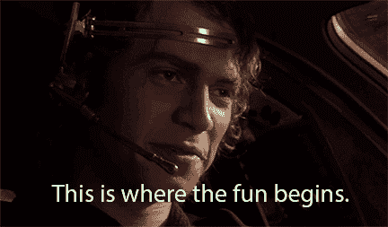

# Git 平分很容易(如何发起机器人起义)

> 原文：<https://dev.to/jacobherrington/git-bisect-is-easy-44ol>

当我们在应用程序中发现一个新的 bug，或者在 CI 中随机测试失败时，这个 bug 经常作为另一个变更的意外副作用而存在。

有很多关于避免这些意外后果的博客文章和文档，但是因为我们没有人是完美的，所以知道如何诊断和定位这类错误的根源是很重要的。

好消息是，如果你使用 git，这很容易。如果你没有使用 git，停止阅读这篇文章，在你的项目目录中运行`git init`。

因为开发人员经常需要找到引入不希望的行为的变更，所以有一个 git 命令叫做`bisect`。平分的意思是，“把…切成或分成两个相等或几乎相等的部分。”这差不多就是这个命令所做的。

> 平分的意思是，“把…切成或分成两个相等或几乎相等的部分。”

在进入`git bisect`之前，我们先设置一个基础项目来说明这个问题。我将用 Ruby 来做这件事，但是这个例子用什么语言并不重要。

如果您对本文中的代码感到困惑，请跳过它。我只是用它来解释为什么你可能需要使用`git bisect`。

我将创建一个目录并运行`git init`，然后我将编写一个函数并测试该函数。那是我们的起点。

```
mkdir bisect-example && $_
git init
vim main.rb 
```

Enter fullscreen mode Exit fullscreen mode

```
# main.rb

def square(number)
  number * number
end

# Testing Code

def assert_equal(actual, expected)
  unless actual == expected
    raise "Assertion failed: #{actual} does not match expected #{expected}"
  end
end

def test_square
  assert_equal(square(2), 4)
end

test_square 
```

Enter fullscreen mode Exit fullscreen mode

因此，我们有一个名为`square`的函数，它有一个参数，它做你认为它做的事情(将传递给它的参数乘以自身)。我们有几个不同的函数来测试`square`函数。

一切都好，所以我们做出承诺。

```
git add .
git commit -m "Add square function" 
```

Enter fullscreen mode Exit fullscreen mode

这个世界一直处于完美的平衡状态，直到我们意识到数学已经改变，所以我们的利益相关者来找我们说，“有了这个*新数学*当你平方某个东西时，你不被允许乘以它本身，你需要使用加法来代替。”

所以我们重构我们的函数。

```
# main.rb

def square(number)
  result = 0
  number.times do
    result += number
  end
  result
end

... 
```

Enter fullscreen mode Exit fullscreen mode

现在我们有了这个总的实现，但是我们的涉众很高兴，测试也通过了。所以我们承诺了。

```
git commit -am "Refactor square function to meet requirements" 
```

Enter fullscreen mode Exit fullscreen mode

这种情况发生了十几次(我们的同事没有看到好的提交消息的价值，他做了一些工作)，然后添加了一些新功能来帮助我们获得额外的 VC。现在这个项目真的很难让我们理解，但是因为我们是聪明的开发者，所以我们写了测试！当出现问题时，我们可以依靠这些来帮助我们识别。

有一天，我们愉快地在我们的`main.rb`文件中工作，我们运行测试，发现不知何故我们的`square`函数不再像我们的测试期望的那样工作！哦不！

```
main.rb:15:in `assert_equal': Assertion failed: 5 does not match expected 4 (RuntimeError) 
```

Enter fullscreen mode Exit fullscreen mode

我们目前的改变甚至没有触及`square`函数，我们正在开发一个全新的函数`overthrow_humanity`，它甚至没有使用`square`。因为我们是聪明的开发人员，所以我们决定查看 git 历史来了解这是如何发生的:

```
git log --oneline --no-merges

f25411d9e9 Add README
9a8225f6b3 Remove unused code in RobotOverlord#simulate_mercy
708a4955e0 workaround for legacy T-800 model
9a2f2805f6 this probably works
360689a0ec Add missing tests for AI features
cfcb762e91 fix whitespace
32ca0fa720 implement features because PO said to
26dd1ab393 Fix bug in cube function
11e118d981 Fix bug in square function that causes hostility
01da7be780 Add test coverage for RobotOverlord#enslave
59415871b2 Add dependency on skynet
31bb9ac6c2 do some work
92f4123391 Add RobotOverlord class
a1e8a90763 Improve test coverage for math functions
069ab50172 Refactor square_root? function
18512a7fef Add square_root? function
a15700afb3 Add cube function
c25f8ef431 Refactor square function to meet requirements
12e4ebffce Add square function 
```

Enter fullscreen mode Exit fullscreen mode

最近的四五次提交似乎对诊断问题没有太大帮助，事实上，一眼看去，它们甚至都没有接触到`main.rb`文件。这并不意味着这些变化不会有意想不到的副作用，所以我们需要确定哪个变化实际上破坏了测试。

我们终于到了`git bisect`。

修复破坏这个测试的代码的第一步(我们假设测试是正确的)，是识别它是如何被破坏的。在其中一次提交中，一段代码被添加到项目中，破坏了这个测试。我们如何确定哪个提交包含代码？很简单，对每个提交进行测试，直到我们找到它！如果是 200 次提交呢？没那么容易。

命令`git bisect`利用二分搜索法快速找到引入给定 bug 的提交。让我们在这个项目上测试一下。

```
git bisect start 
```

Enter fullscreen mode Exit fullscreen mode

我们已经开始了我们的`bisect`，但是我们需要告诉 git，项目的当前状态并没有像预期的那样工作。为此，我们将当前提交标记为`bad`。

```
git bisect bad 
```

Enter fullscreen mode Exit fullscreen mode

git 需要的下一条信息是提交，我们知道我们的代码按预期运行。好吧，我们记得运行测试，第一次重构`square`函数时我们很满意，所以让我们继续提交 where do that:`c25f8ef431 Refactor square function to meet requirements`。我们需要告诉 git，`c25f8ef431`是好的。

```
git bisect good c25f8ef431 
```

Enter fullscreen mode Exit fullscreen mode

[](https://res.cloudinary.com/practicaldev/image/fetch/s--zvxmu5R0--/c_limit%2Cf_auto%2Cfl_progressive%2Cq_66%2Cw_880/https://thepracticaldev.s3.amazonaws.com/i/gozx56qs7117kk5sryo6.gif)

您应该会看到类似这样的响应:

```
Bisecting: X revisions left to test after this (roughly Y steps)
[some_commit_hash] Some commit message 
```

Enter fullscreen mode Exit fullscreen mode

现在，它就像遍历每个修订版、运行我们的测试，并将那些提交标记为`good`或`bad`一样简单。

当您运行了您的测试并确定您正在进行的提交是好的时，只需键入:`git bisect good`。当您发现一个错误的提交时，键入:`git bisect bad`。该软件将做艰苦的工作来找到实际上破坏了我们的测试的提交。

在我们的示例项目中，我们将经历几次修改，我们将发现在我们的一次提交(`11e118d981 Fix bug in square function that causes hostility`)中，有人篡改了`square`函数。

```
Bisecting: 0 revisions left to test after this (roughly 0 steps)
[11e118d981] Fix bug in square function that causes hostility 
```

Enter fullscreen mode Exit fullscreen mode

当我们更深入地看一看这个提交中发生了什么变化时，我们会看到一些开发人员(可能是我们)试图通过修改我们的`square`函数来修复项目中其他地方的一个 bug。

```
# main.rb

def square(number)
  result = 1          # 🚨 This is the bug!
  number.times do
    result += number
  end
  result
end

... 
```

Enter fullscreen mode Exit fullscreen mode

现在我们确切地知道是什么导致了我们的错误。我们可以通过键入:
让 git 带我们回到开始二等分的地方

```
git bisect reset 
```

Enter fullscreen mode Exit fullscreen mode

现在我们只需修复错误并提交更改。

这就是你如何使用`git bisect`来利用二分搜索法并找到一个引入 bug 的提交！这是一个人为的例子，但是真的很简单。

您需要编写允许您以这种方式利用`git bisect`的测试。