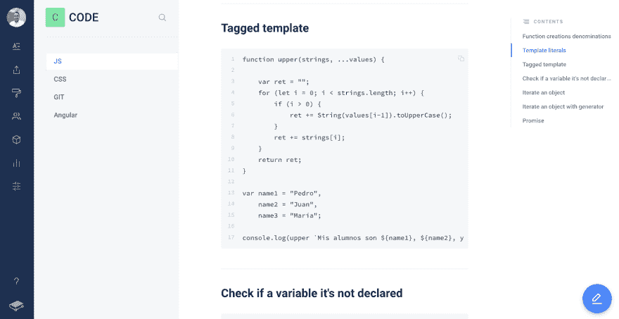

# GitBook:我的 Dev Moleskine。

> 原文：<https://dev.to/pedrojimenez73/gitbook-my-dev-moleskine-5f9a>

今天我要给大家展示一个非常有用的写文档和整理代码注释或者链接的工具: [GitBook](https://www.gitbook.com/) 。

可以想象，GitBook 是 Git 的*衍生产品*，有着漂亮的 UX，基于类似的 Git 概念。它有一个免费层，可以使用相同的 Git 凭证创建一个帐户。

GitBook tool 旨在用于开发团队通过所谓的 spaces 编写和交付应用程序文档，spaces 是一组自动生成 TOC 索引并包含搜索字段的页面。高级版本允许团队合作，与 Slack 和其他强大的功能集成。

我将 GitBook 作为我的个人开发笔记本，在一个名为“猜猜怎么着，代码”的空间中写下任何代码片段、注释等。此外，我用它来存储我在喝咖啡休息时发现的文章链接，我稍后会阅读或我想存储它，当然主要是开发人员的文章。

你还用它做什么？