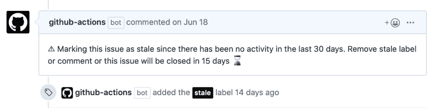
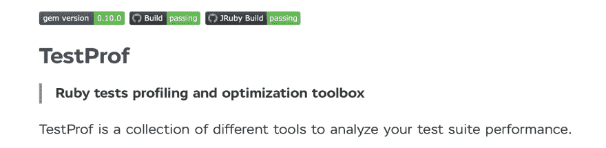

# GitHub 操作:第一印象

> 原文：<https://dev.to/evilmartians/github-actions-first-impressions-4ce8>

GitHub 的动作越来越强劲——在我的团队中，几乎所有申请测试程序的人，包括我在内，最近都获得了 GitHub 的最新“杀手级功能”，这可能会让 Travis CI 和 CircleCI 的日子更难过:与 GitHub [Actions](https://github.com/features/actions) 的持续集成。以下是我的第一印象。

> 弗拉基米尔·德门捷耶夫[@帕尔坎 _ 图拉](https://dev.to/palkan_tula)🎉让我们“创造伟大的东西”
> ！2019 年 8 月 21 日 22 点 22 分[](https://twitter.com/intent/tweet?in_reply_to=1164301670429409281)[](https://twitter.com/intent/retweet?tweet_id=1164301670429409281)0[](https://twitter.com/intent/like?tweet_id=1164301670429409281)0

为了最终的测试，我决定重用我上一篇文章中的文档生成器设置:[“用 Docsify、Lefthook 和 friends 保存 OSS 文档”](https://dev.to/evilmartians/keeping-oss-documentation-with-docsify-lefthook-and-friends-11e5)。为了给 [AnyCable](https://anycable.io/) 做一个文档网站，我在本地使用了 [Lefthook](https://evilmartians.com/chronicles/lefthook-knock-your-teams-code-back-into-shape) 并在 CircleCI 进行制作。对于我的下一个文档项目，即 [TestProf](https://test-prof.evilmartians.io/) 的项目，我决定将所有 CI 功能转移到 GitHub Actions(对不起，Travis 和 CircleCI，[当然我仍然爱你们](https://en.wikipedia.org/wiki/Autonomous_spaceport_drone_shiphttps://en.wikipedia.org/wiki/Autonomous_spaceport_drone_ship))。

> 检查最终实现的 PR:[pal Kan/test-prof # 156](https://github.com/palkan/test-prof/pull/156)

## 热身:处理陈旧的问题

我对 GitHub 动作印象深刻的第一件事是，它们不仅可以用于处理代码推送和请求，还可以对其他 [GitHub 事件](https://help.github.com/en/articles/events-that-trigger-workflows)做出反应或按计划运行！

当你第一次打开项目的“actions”标签时，GitHub 提供给你的*动作*之一是[陈旧](https://github.com/actions/stale):它允许你用“陈旧”标签标记问题和拉请求并关闭它们。这是我通常手工做的事情(并且希望在[陈旧的](https://github.com/apps/stale) GitHub 应用的帮助下实现自动化)。

加这个动作花了我几分钟:

```
# .github/workflows/stale.yml
name: Mark stale issues

on:
  schedule:
  - cron: "0  *  *  *  *"

jobs:
  stale:
    runs-on: ubuntu-latest
    steps:
    - uses: actions/stale@v1
      with:
        repo-token: ${{ secrets.GITHUB_TOKEN }}
        stale-issue-message: >
          ⚠ Marking this issue as stale since there has been no activity in the last 30 days.
          Remove stale label or comment or this issue will be closed in 15 days ⌛️
        stale-issue-label: stale
        days-before-stale: 30
        days-before-close: 15 
```

过了一段时间，我收到了很多通知——该行动的行动了:

[](https://res.cloudinary.com/practicaldev/image/fetch/s--VxFwgtMI--/c_limit%2Cf_auto%2Cfl_progressive%2Cq_auto%2Cw_880/https://thepracticaldev.s3.amazonaws.com/i/qlr9sbagvo4r9pdf4x1j.png)

我很快意识到这不是一个好主意:GitHub 将所有有意保持开放(供讨论)的问题标记为陈旧，并向所有参与者发送评论通知。对不起，伙计们😿。

事实证明，不存在忽略机制(例如，通过标签)。[现在有一个](https://github.com/actions/stale/pull/11)，但还是要小心:很容易被烫伤。

## 迁移降价棉绒

重新实现我在 CircleCI 已经有的降价[林挺配置](https://github.com/palkan/docs-example/blob/master/.circleci/config.yml)是一个非常简单的任务:

```
name: Lint Docs

on:
  push:
    branches:
    - master
    paths:
    - "**/*.md"
  pull_request:
    paths:
    - "**/*.md"

jobs:
  markdownlint:
    runs-on: ubuntu-latest
    steps:
    - uses: actions/checkout@v1
    - name: Set up Ruby 2.6
      uses: actions/setup-ruby@v1
      with:
        ruby-version: 2.6.x
    - name: Run Markdown linter
      run: |
        gem install mdl
        mdl docs
  rubocop:
    runs-on: ubuntu-latest
    steps:
    - uses: actions/checkout@v1
    - name: Set up Ruby 2.6
      uses: actions/setup-ruby@v1
      with:
        ruby-version: 2.6.x
    - name: Lint Markdown files with RuboCop
      run: |
        gem install bundler
        bundle install --gemfile gemfiles/rubocop.gemfile --jobs 4 --retry 3
        bundle exec --gemfile gemfiles/rubocop.gemfile rubocop -c .rubocop-md.yml
  forspell:
    runs-on: ubuntu-latest
    steps:
    - uses: actions/checkout@v1
    - name: Install Hunspell
      run: |
        sudo apt-get install hunspell
    - name: Set up Ruby 2.6
      uses: actions/setup-ruby@v1
      with:
        ruby-version: 2.6.x
    - name: Run Forspell
      run: |
        gem install forspell
        forspell docs/
  liche:
    runs-on: ubuntu-latest
    steps:
    - uses: actions/checkout@v1
    - name: Set up Go
      uses: actions/setup-go@v1
      with:
        go-version: 1.12.x
    - name: Run liche
      # see https://github.com/actions/setup-go/issues/14
      run: |
        export PATH=$PATH:$(go env GOPATH)/bin
        go get -u github.com/raviqqe/liche
        liche -r docs -d docs 
```

与 [CircleCI 配置](https://github.com/palkan/docs-example/blob/master/.circleci/config.yml)相比，有几个明显的区别:

*   只有当匹配文件已经改变时才能够触发动作*(参见`paths: ["**/*.md"]`声明)。*
*   无法在来自同一动作的作业之间共享设置(签出、依赖性安装);**没有[缓存](https://stackoverflow.com/questions/55110729/how-do-i-cache-steps-in-github-action)** ，或者任何类似 CircleCI 的“工作区”。

## 为 RSpec 添加 Neo 和 Trinity

添加“Lint Docs”动作进展顺利，所以我决定继续迁移 RSpec 测试。

我正在针对多个 Ruby 和框架版本运行 gems 测试，以确保覆盖大多数用户。多年来，我一直在用 Travis 的[构建矩阵](https://docs.travis-ci.com/user/build-matrix/)功能:
成功地做到这一点

```
matrix:
  fast_finish: true
  include:
    - rvm: 2.6.3
      gemfile: gemfiles/railsmaster.gemfile
    - rvm: jruby-9.2.7.0
      gemfile: gemfiles/jruby.gemfile 
    - rvm: 2.6.3
      gemfile: gemfiles/activerecord6.gemfile
    - rvm: 2.6.3
      gemfile: Gemfile
    - rvm: 2.5.3
      gemfile: Gemfile
    - rvm: 2.4.2
      gemfile: gemfiles/default_factory_girl.gemfile
    - rvm: 2.4.2
      gemfile: gemfiles/rspec35.gemfile
    - rvm: 2.4.2
      gemfile: gemfiles/activerecord42.gemfile
   allow_failures:
    - rvm: 2.6.2
      gemfile: gemfiles/railsmaster.gemfile
    - rvm: jruby-9.2.7.0
      gemfile: gemfiles/jruby.gemfile 
```

GitHub 动作有一个类似的特性——[`strategy.matrix`](https://help.github.com/en/articles/workflow-syntax-for-github-actions#jobsjob_idstrategy)。文档中甚至指出，只有`include`的变体与 Travis 的工作方式相同。然而，这并不完全正确。

所以，我不得不绕道使用`exclude`选项:

```
strategy:
  matrix:
    ruby: ["2.5.x", "2.6.x", "2.4.x"]
    gemfile: [
       "gemfiles/railsmaster.gemfile",
       "gemfiles/activerecord6.gemfile",
       "gemfiles/activerecord42.gemfile",
       "gemfiles/default_factory_girl.gemfile",
       "gemfiles/rspec35.gemfile"
    ]
    exclude:
    - ruby: "2.6.x"
      gemfile: "gemfiles/activerecord42.gemfile"
    - ruby: "2.6.x"
      gemfile: "gemfiles/rspec35.gemfile"
    - ruby: "2.6.x"
      gemfile: "gemfiles/default_factory_girl.gemfile"
    - ruby: "2.5.x"
      gemfile: "gemfiles/railsmaster.gemfile"
    - ruby: "2.5.x"
      gemfile: "gemfiles/activerecord42.gemfile"
    - ruby: "2.5.x"
      gemfile: "gemfiles/rspec35.gemfile"
    - ruby: "2.5.x"
      gemfile: "gemfiles/default_factory_girl.gemfile"
    - ruby: "2.4.x"
      gemfile: "gemfiles/railsmaster.gemfile"
    - ruby: "2.4.x"
      gemfile: "gemfiles/activerecord6.gemfile" 
```

这个配置与 Travis 的配置完全一样(除了缺少 JRuby，我们将在后面讨论)，但不幸的是可读性要差得多。

我想指出的另一件事是，使用 GitHub Actions(与 Travis 相比),您必须自己建立一个正确的 Gemfile:

```
- name: Configure Gemfile
  run: |
    bundle config --global gemfile ${{ matrix.gemfile }} 
```

还有，没有`allow_failures`选项。有一个 [`steps.continue-on-failure`](https://help.github.com/en/articles/workflow-syntax-for-github-actions#jobsjob_idstepscontinue-on-error) 切换可以用来实现类似的东西，但与战略矩阵。

### 处理 JRuby

你不能将 JRuby 与`actions/setup-ruby`动作一起使用(或者你可以，但我找不到方法？).它需要特殊处理。

这里我应用了 GitHub 的另一个动作特性——使用 Docker 容器执行动作的能力。这使得它的工作方式非常类似于 CircleCI。

我拿了[官方 JRuby 镜像](https://hub.docker.com/_/jruby)加了一个单独的工作:

```
rspec-jruby:
  runs-on: ubuntu-latest
  container:
    image: jruby:9.2.8
    env:
      BUNDLE_GEMFILE: gemfiles/jruby.gemfile
  steps:
  - uses: actions/checkout@v1
  # I need git 'cause I use `git ls-files` in my .gemspec
  # to generate the list of the gem's files
  - name: Install git
    run: |
      apt-get update
      apt-get install -y --no-install-recommends git
  - name: Install deps and run RSpec
    run: |
      gem install bundler
      bundle install --jobs 4 --retry 3
      bundle exec rspec 
```

它就这样工作了！

## 奖励:多个徽章

在合并了 PR 之后，我开始寻找一种方法来给 Readme 添加一个构建状态标记(因为我已经从 Travis 中删除了旧的标记)。

答案很快在 [Reddit](https://www.reddit.com/r/github/comments/csehoc/github_actions_official_status_badges/) 上找到了:`https://github.com/{github_id}/{repository}/workflows/{workflow_name}/badge.svg`。

有趣的是，每个工作流都有一个单独的徽章。这意味着，举例来说，你不应该因为另一个较小的 RuboCop 版本而害怕“红色”状态。

这个“特性”的另一个有用的应用是能够显示您的库支持特定的运行时。例如，我将`rspec`工作流分成两部分:一部分用于不同的 MRI 版本，另一部分用于 JRuby。现在从自述文件中可以清楚地看到，TestProf 已经在 JRuby 上测试过了，它(希望)是绿色的！

[](https://res.cloudinary.com/practicaldev/image/fetch/s--jDhmiUmS--/c_limit%2Cf_auto%2Cfl_progressive%2Cq_auto%2Cw_880/https://thepracticaldev.s3.amazonaws.com/i/rljeqyj1f935jkd54ro7.png)

* * *

GitHub 动作看起来很有前途，尤其是对于开源项目。某些特性(例如缓存)的缺乏会阻止它作为商业项目的主要 CI/CD 工具。

但这仅仅是开始；我们将在最终版本中看到什么！

* * *

阅读更多关于 https://evilmartians.com/chronicles 的文章！