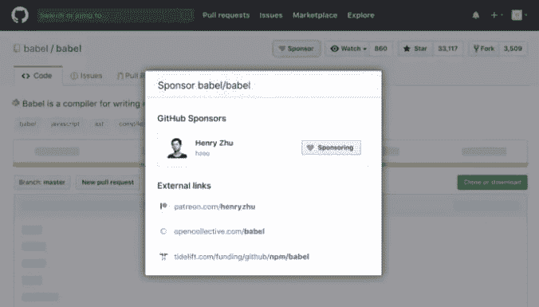

# GitHub 将增加一个“赞助商”按钮，用于向开发者捐款

> 原文：<https://dev.to/prathaprathod/github-will-add-a-sponsor-button-for-donations-to-developers-2f8j>

GitHub 宣布了赞助商工具的测试版本。根据该项目网站，它将允许对开发商的财政支持。

任何在 GitHub 上拥有账户的用户都可以成为赞助商。在运营的第一年，赞助商服务将不会收取接受付款的百分比——开发者将能够收到寄给他们的全部款项。

该公司还推出了一项基金，在第一年，它将把每次捐赠的金额增加一倍。该基金的数额是每个开发商 5000 美元。

用户可以选择一种吸引模式:通过 Patreon、Tidelift、Ko-fi 和 Open Collective 等服务进行一次性捐赠或订阅。不仅开发者，社区的其他成员，如导师，也将能够吸引资金。

GitHub 还宣布购买 Dependabot 服务，该服务可以更新项目的依赖关系，并有助于跟踪库的更新。交易金额没有披露。

微软在 2018 年夏天以 75 亿美元收购了 GitHub。该公司承诺在整个开发周期中为用户赋权，并保持平台开放。