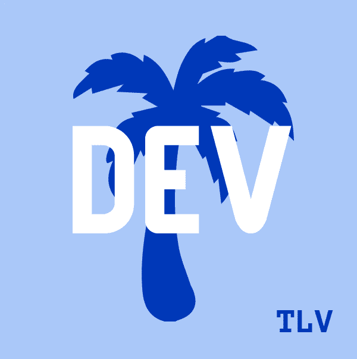

# 在特拉维夫的 DEV IRL 做一个闪电演讲！

> 原文：<https://dev.to/bengreenberg/give-a-lightning-talk-at-dev-irl-tel-aviv-9i1>

你有什么想表达的想法、学到的东西或想分享的故事吗？来 TLV 的 [DEV IRL 上展示它吧🌴九月聚会](https://www.meetup.com/DEV-Community-IRL-Tel-Aviv/)！

第一次[特拉维夫发展 IRL 聚会](https://www.meetup.com/DEV-Community-IRL-Tel-Aviv/)将于**9 月 18 日**在 Alon Towers 顶部的 Vonage R & D 中心举行，在那里可以看到特拉维夫的壮观景色。我们正在寻找人们与社区分享他们热衷的事情！

我们正在考虑就各种主题做几个十分钟的简短发言。所以*亚拉*！你还在等什么？

## 👉[填写这张谷歌表格](https://forms.gle/ZpdM5TCW2GF4kQSu8)！👈

想了解更多关于 TLV 的信息吗🌴团体？

## 👉[加入我们的 Meetup](https://www.meetup.com/DEV-Community-IRL-Tel-Aviv/) ！👈

回头见！👋

## [阿维塔尔·祖贝利](/avitaltzubeli) <button name="button" type="button" data-info="{&quot;className&quot;:&quot;User&quot;,&quot;style&quot;:&quot;full&quot;,&quot;id&quot;:193834,&quot;name&quot;:&quot;Avital Tzubeli&quot;}" class="crayons-btn follow-action-button whitespace-nowrap c-btn--secondary fs-base " aria-label="Follow user: Avital Tzubeli" aria-pressed="false">跟随</button>

[I love bringing ideas to life, which means I generally have too many hobbies... but it also oftentimes leads to some really great things!! I'm Backend Developer turned DevRel, living in magical TLV.](/avitaltzubeli)
![[deleted user] image](img/56fbc1337a9836e0802365a3a3022a53.png)

## [已删除的用户]