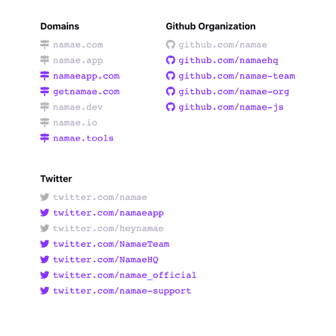

# 用 namae.dev 给你的应用起一个漂亮的名字

> 原文：<https://dev.to/uetchy/give-your-app-slick-name-with-namae-dev-5c4h>

你曾经为给你的新 OSS 项目或网络应用命名而挣扎过吗？虽然希望没有人在 GitHub、npm、Homebrew、PyPI、Domains 等网站上声称你想要的名字，但是选择最好的名字是一项令人厌倦的工作。

这就是为什么我创造了 [namae](https://namae.dev) 。

# namae

namae 是一个面向开发者和企业家的跨平台名称可用性检查器。

一旦你在表格上填写了你想用的名字，namae 就会检查各个注册中心，看看这个名字是否已经被使用。

# 支持的平台

namae 支持 15 个包注册中心和网络平台，并且还在增长。

*   域
*   GitHub 组织
*   npm / npm 组织
*   好吧
*   RubyGems
*   生锈(板条箱. io)
*   自制/自制桶
*   Linux (Launchpad 和 APT)
*   推特
*   范围
*   松弛的
*   Heroku
*   现在时代
*   AWS S3
*   js.org

此外，搜索结果还附带了一个项目列表，这些项目在 **GitHub** 和 **App Store** 上有相似的名称。

# 命名建议

namae 还有一个独特的功能叫做**命名建议**。它建议自动生成由常见前缀/后缀和同义词组成的名称。看一些例子。

点击建议，namae 用它完成表格，并开始在注册表中搜索。

# 开源

namae 是完全开源的，完整的源代码可以在 [GitHub](https://github.com/uetchy/namae) 获得。它由用于 API 的 Node.js Lambda 和用于 web 前端的 React app 组成，现在运行在[ZEIT](https://now.sh)上。

# 结论

namae 可以节省您在一系列主机提供商和包注册中心中搜索通用名称的时间。

前往 [namae.dev](https://namae.dev/) 获取一份关于您未来产品名称可用性的报告。如果有什么建议，请在推特( [@uechz](https://twitter.com/uechz) )上留言或戳我。