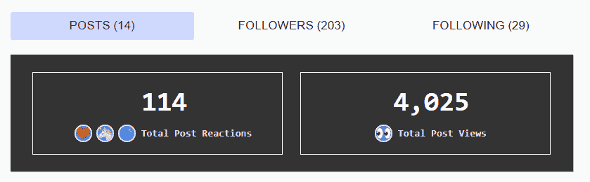

# 赠品:3 个免费 CPANEL 付费账户

> 原文：<https://dev.to/th3n00bc0d3r/giveaway-3-free-cpanel-paid-accounts-1ji0>

## 200 +关注者

哇！这是一个非常短的旅程 200 名追随者，我有权回馈社区，然后我想到，我在数字海洋的一些网站上有一个服务器，我用 CPANEL 许可证支付，至少我可以给我的追随者一年 3 个免费帐户；

### 必填:

*   你需要有自己的领域

### 你需要做什么？

*   在评论中回答以下问题

# 为什么有人要成为 dev.to 的成员？

拥有最多红心的前 3 个帖子，获得帐户。

结果将在 3 天后公布。