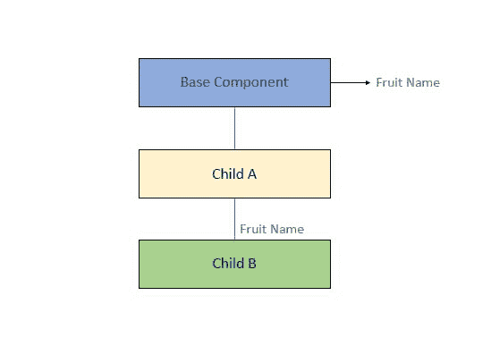
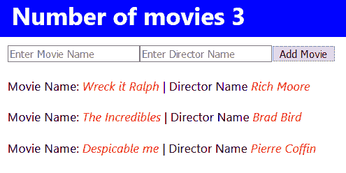

# 使用 React usestate、useContext 挂钩和上下文 API 进行全局状态管理。

> 原文：<https://dev.to/kiani0x01/global-state-management-with-react-usestate-usecontext-hooks-and-context-api-3emk>

[](https://res.cloudinary.com/practicaldev/image/fetch/s--nekGcIUI--/c_limit%2Cf_auto%2Cfl_progressive%2Cq_auto%2Cw_880/https://milddev.com/wp-content/uploads/2019/08/state-management-300x157.jpg)

react 在其 16.3.0 版本中宣布了一个稳定版本的上下文 API 已经有一段时间了。在此之前，像 Redux、MobX 这样的库是用于状态管理的。在这篇文章中，我将用一些例子来解释我们如何通过使用上下文 API 和钩子来管理组件的状态。

让我们从这样一个非常简单的场景开始:

[](https://res.cloudinary.com/practicaldev/image/fetch/s--_RdEXYuH--/c_limit%2Cf_auto%2Cfl_progressive%2Cq_auto%2Cw_880/https://milddev.com/wp-content/uploads/2019/08/context-simple-scenario.jpg) 

<figcaption>一个简单的上下文 API 用例</figcaption>

我们有一个 Basecomponent，它有一个名为 ChildComponentA 的子组件，该子组件又有一个名为 ChildComponentB 的子组件。现在我们想把一个常量从我们的 BaseComponent 传递给 ChildComponentB，我们可以很容易地把这个常量作为 prop 从我们的 BaseComponent 传递给 ChildComponentA，然后传递给 ChildComponentB。我们必须从 BaseComponent 一直向下钻取到所有子组件，直到到达 ChildComponentB。这显然不是正确的方法，为了避免这个问题，我们使用了上下文 API。

## 上下文 API 是如何工作的？

上下文 API 的工作方式是，我们使用 React.createContext()创建一个上下文，并通过使用<context.provider>在组件树的顶部提供它。一旦我们在组件树的顶部提供了上下文，就可以在树内的每个级别访问它。然后我们可以用<context.consumer>消费它的值，或者使用上下文钩子。这听起来可能很复杂，但你会发现它很简单，因为你会看到下面的例子。</context.consumer></context.provider>

## 例 1(消耗上下文的值)

这个例子是针对上述场景的，有三个组件。

```
import React, { useContext } from 'react'

const FruitContext = React.createContext()

const BaseComponent = () => {
  return (
    <FruitContext.Provider value={'Apple'}>
        <ChildComponentA />
    </FruitContext.Provider>
  )
}

const ChildComponentA = () => {
  return (
    <div>
      <ChildComponentB />
    </div>
  )
}

const ChildComponentB = () => {
  const fruitName = useContext(FruitContext)

  return (
    <h1>
      {fruitName}
    </h1>
  )
}

export { BaseComponent } 
```

除了使用<context.consumer>,我们还可以像这样使用 useContext 钩子。</context.consumer> 

```
const ChildComponentB = () => {
  const fruitName = useContext(Context)

  return (
    <h1>{fruitName}</h1>
  )
} 
```

示例 2(使用多个上下文)

这个例子类似于前一个例子，除了我们使用多个上下文而不是单个上下文。在我们的 BaseComponent 中，我们为两个上下文 name 和 age 提供了值，然后像前面一样在 ChildComponentB 中使用这些值。

```
import React, { useContext } from 'react'

const Name = React.createContext()
const Age = React.createContext()

const BaseComponent = () => {
  return (
    <Name.Provider value={'Mateen'}>
      <Age.Provider value={'20'}>
        <ChildComponentA />
      </Age.Provider>
    </Name.Provider>
  )
}

const ChildComponentA = () => {
  return (
    <div>
      <ChildComponentB />
    </div>
  )
}

const ChildComponentB = () => {
  const name = useContext(Name)
  const age = useContext(Age)

  return (
    <h1>
      I am {name} and I am {age} years old.
    </h1>
  )
}

export { BaseComponent } 
```

## 示例 3(带有 useState 钩子的上下文 API)

你应该认为我们没有做任何状态管理，在这个例子中，我们将结合上下文 API 和 useState 钩子来管理我们的应用程序的状态。现在，每当我们的上下文的值被更新时，使用它的每个组件也将被重新渲染，以同步所有组件的状态。如果您不熟悉 useState 钩子，可以考虑这个例子:

```
Const [state, setState] = useState(‘initial value’) 
```

> State 是被赋值为“初始状态”的变量，setState 是一个回调函数，用于更新状态变量的值。要更新状态变量的值，我们必须调用 setState，每当状态变量的值改变时，使用它的每个组件都会重新呈现。这足以让我们理解这个 useState 钩子。
> 
> <cite>useState()钩子</cite>

```
import React, { useContext, useState } from 'react'

const Theme = React.createContext()

const BaseComponent = () => {
  const [theme, setTheme] = useState('Light')

  const toggleTheme = () => {
    setTheme(theme === 'Light' ? 'Dark' : 'Light')
  }

  return (
    <Theme.Provider value={theme}>
      <ChildComponentA />
      <button onClick={toggleTheme}>Change Theme</button>
    </Theme.Provider>
  )
}

const ChildComponentA = () => {
  return (
    <div>
      <ChildComponentB />
    </div>
  )
}

const ChildComponentB = () => {
  const theme = useContext(Theme)

  return (
    <h1>
      current theme is {theme}.
      </h1>
    )
}

export { BaseComponent } 
```

想了解更多关于 react 主题化的信息，请看这篇文章。

## 例 4(通过传递回调函数作为上下文值的全局状态管理)

这个例子有点复杂，因为它属于全局状态管理的范畴。全局管理组件状态(从提供者内部的任何地方更新组件状态)的最简单方法之一是将回调函数作为上下文值传递，这样我们就可以在任何想要更新状态变量的地方调用它。在这个例子中，我们有一个带有电影名称和导演姓名的电影列表，我们可以向列表中添加更多的电影，获取列表中电影的数量，每次我们向列表中添加电影时，我们的组件都会更新 UI。

电影提供者持有初始列表，当我们用这个提供者包装我们的组件时，我们可以访问和更新电影列表。Header 组件显示列表中电影的数量。添加电影组件使用表单将电影添加到列表中。电影组件在用户界面中显示电影列表。

#### MovieProvider.js

```
import React, { useState } from 'react'

export const MovieContext = React.createContext();

export const MovieProvider = (props) => {
  const [movies, setMovies] = useState([
    {
      name: 'Wreck it Ralph',
      director: 'Rich Moore',
      id: 432
    },
    {
      name: 'The Incredibles',
      director: 'Brad Bird',
      id: 234
    },
    {
      name: 'Despicable me',
      director: 'Pierre Coffin',
      id: 542
    }
  ])

  return (
    <MovieContext.Provider value={[movies, setMovies]} >
      {props.children}
    </MovieContext.Provider>
  )

} 
```

#### [T1】add movie . js](#addmoviejs)

```
import React, { useContext, useState } from 'react'
import { MovieContext } from './MovieProvider'

const AddMovie = () => {
  const [movies, setMovies] = useContext(MovieContext)

  const [movieName, setMovieName] = useState('')
  const [directorName, setDirectorName] = useState('')

  const handleSubmit = event => {
    event.preventDefault()
    const rand = Math.random()
    setMovies(movies => [
      ...movies,
      { name: movieName, director: directorName }
    ])
  }

  return (
    <form onSubmit={handleSubmit} style={{ padding: '10px' }}>
      <input
        type='text'
        value={movieName}
        placeholder='Enter Movie Name'
        onChange={e => setMovieName(e.target.value)}
      />
      <input
        type='text'
        value={directorName}
        placeholder='Enter Director Name'
        onChange={e => setDirectorName(e.target.value)}
      />
      <input type='submit' value='Add Movie' />
    </form>
  )
}

export default AddMovie 
```

#### Header.js

```
import React, { useContext } from 'react'
import { MovieContext } from './MovieProvider'

const Header = () => {

  const header = {
    paddingLeft: '15px',
    backgroundColor: 'blue',
    color: 'white',
    fontStyle: 'light',
    width: '100%',
    height: '50px',
  }

  const [movies] = useContext(MovieContext)

  return (
    <div style={header}>
      <h1>Number of movies {movies.length}</h1>
    </div>
  )
}

export default Header 
```

#### [T1】movies . js](#moviesjs)

```
import React, { useContext } from 'react'
import { MovieContext } from './MovieProvider'

const Movies = () => {
  const [movies] = useContext(MovieContext)

  return (
    <div>
      {movies.map(movie => (
        <div key={movie.id} style={{padding:'10px'}}>
          Movie Name:{'  '}
          <span style={{ color: 'red', fontStyle: 'italic' }}>
            {movie.name}
          </span>{' '}
          | Director Name{'  '}
          <span style={{ color: 'red', fontStyle: 'italic' }}>
            {movie.director}
          </span>
        </div>
      ))}
    </div>
  )
}

export default Movies 
```

#### App.js

```
import React from 'react'
import {MovieProvider} from './components/MovieProvider'
import Header from './components/Header';
import Movies from './components/Movies'
import AddMovie from './components/AddMovie'

function App() {
  return (
    <MovieProvider>
      <Header />
      <AddMovie />
      <Movies />
    </MovieProvider>
  )
}

export default App 
```

这是最终输出的样子:

[](https://res.cloudinary.com/practicaldev/image/fetch/s--Iz8B1OCf--/c_limit%2Cf_auto%2Cfl_progressive%2Cq_auto%2Cw_880/https://milddev.com/wp-content/uploads/2019/08/state-management-react-create-context.png) 

<figcaption>最终输出</figcaption>

使用上下文 Api、UseState 和 useContext 挂钩的 post [状态管理–React create Context。](https://milddev.com/react/react-createcontext/)最早出现在[轻度开发](https://milddev.com)。

不要忘记喜欢、分享和关注，因为这很有帮助。如果你有任何问题，请在评论区告诉我。