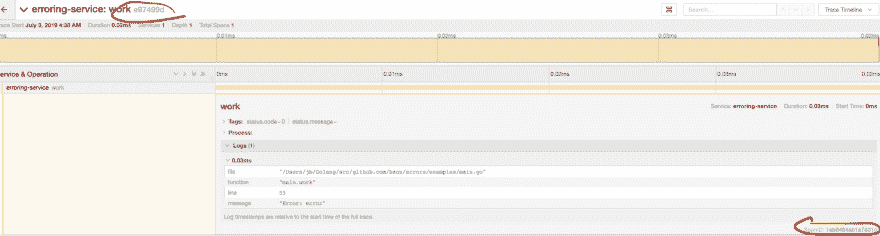

# Go:使用 OpenCensus 支持的平台进行错误处理和跟踪

> 原文：<https://dev.to/bzon/go-error-handling-with-opencensus-tracing-5b79>

[](http://godoc.org/github.com/bzon/errors)

# 错误

我想分享一下我代替`github.com/pkg/errors`的顺风车。

我创建这个包是为了帮助我当前的团队用 Stackdriver 日志查看我的 Stackdriver 跟踪的细节。

*   [https://cloud.google.com/trace/docs/viewing-details](https://cloud.google.com/trace/docs/viewing-details)
*   [https://cloud . Google . com/logging/docs/reference/v2/rest/v2/log entry](https://cloud.google.com/logging/docs/reference/v2/rest/v2/LogEntry)
*   [https://cloud . Google . com/logging/docs/reference/v2/rest/v2/log entry # LogEntrySourceLocation](https://cloud.google.com/logging/docs/reference/v2/rest/v2/LogEntry#LogEntrySourceLocation)

## 目标

创建新错误时添加 OpenCensus 跟踪属性。

## 基本用法

顺便更换。产生一个错误。

```
err := errors.New("msg") // Wrap .. Wrapf .. Errof .. 
```

创建一个有助于监控的错误。

```
func main() {
    _, span := trace.StartSpan(context.Background(), "ExampleNewT")
    defer span.End()

    err := errors.NewT(span, "error")
    fmt.Println(err)

    if erctx, ok := err.(errors.Error); ok {
        fmt.Println(erctx.SourceLocation().Function)
        fmt.Println(erctx.SourceLocation().File)
        fmt.Println(erctx.SourceLocation().Line)
        fmt.Println(erctx.TraceContext().TraceID)
        fmt.Println(erctx.TraceContext().SpanID)
    }
} 
```

输出

```
main.main
/Users/jb/Golang/src/github.com/bzon/errors/examples/main.go
15
d2d2b126d0474947821106525e32b6e0
1644b4b9be26c929 
```

## 我如何使用它

```
package main

import (
    "context"
    "flag"
    "fmt"
    "os"
    "time"

    "contrib.go.opencensus.io/exporter/jaeger"
    "contrib.go.opencensus.io/exporter/stackdriver"
    "github.com/bzon/errors"
    "github.com/go-kit/kit/log"
    "go.opencensus.io/trace"
)

func main() {
    var useStackDriver = flag.Bool("stack-driver", false, "Use stackdriver instead of jaeger.")
    flag.Parse()

    // logging
    var logger log.Logger
    {
        logger = log.NewJSONLogger(log.NewSyncWriter(os.Stdout))
        logger = log.With(logger, "ts", log.DefaultTimestamp, "caller", log.DefaultCaller)
    }

    // tracing
    switch {
    case *useStackDriver:
        // stackdriver
        sd, err := stackdriver.NewExporter(stackdriver.Options{
            ProjectID: os.Getenv("GCP_PROJECT"),
        })
        if err != nil {
            panic(fmt.Sprintf("Failed to create the stackdriver exporter: %v", err))
        }
        defer sd.Flush()
        trace.RegisterExporter(sd)
    default:
        je, err := jaeger.NewExporter(jaeger.Options{
            AgentEndpoint:     "localhost:6831",
            CollectorEndpoint: "http://localhost:14268/api/traces",
            ServiceName:       "erroring-service",
        })
        if err != nil {
            panic(fmt.Sprintf("Failed to create the Jaeger exporter: %v", err))
        }
        trace.RegisterExporter(je)
    }

    trace.ApplyConfig(trace.Config{DefaultSampler: trace.AlwaysSample()})

    for {
        workerr := work(context.Background(), logger)
        if ec, ok := workerr.(errors.Error); ok {
            logger.Log(
                "message", ec.Error(),
                "logging.googleapis.com/spanId", ec.TraceContext().SpanID,
                "logging.googleapis.com/trace", ec.TraceContext().TraceID,
                "logging.googleapis.com/sourceLocation", ec.SourceLocation(),
            )
        }
        time.Sleep(3 * time.Second)
    }

}

func work(ctx context.Context, logger log.Logger) error {
    _, span := trace.StartSpan(ctx, "work")
    defer span.End()

    // error with context
    err := errors.NewT(span, "error")
    return err
} 
```

还可以在 [github](https://github.com/bzon/errors/blob/master/examples/main.go) 中看到示例服务器的源代码。

用于记录跟踪上下文的错误。

```
$  go run main.go | jq '.'
 {
  "caller": "main.go:38",
  "logging.googleapis.com/sourceLocation": {
    "function": "main.work",
    "file": "/Users/jb/Golang/src/github.com/bzon/errors/examples/main.go",
    "line": 55
  },
  "logging.googleapis.com/spanId": "1eb9494ab1a7831c",
  "logging.googleapis.com/trace": "e97499da53ef2a8fdf9681beddbe3d64",
  "message": "error",
  "ts": "2019-07-15T09:37:06.885078+02:00"
} 
```

自动注释将应用于 OpenCensus 支持的跟踪平台。

[](https://res.cloudinary.com/practicaldev/image/fetch/s--OKXw-4HE--/c_limit%2Cf_auto%2Cfl_progressive%2Cq_auto%2Cw_880/https://github.com/bzon/errors/raw/master/jaeger-error-trace.png)