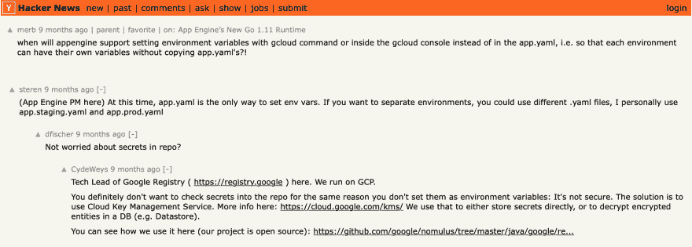
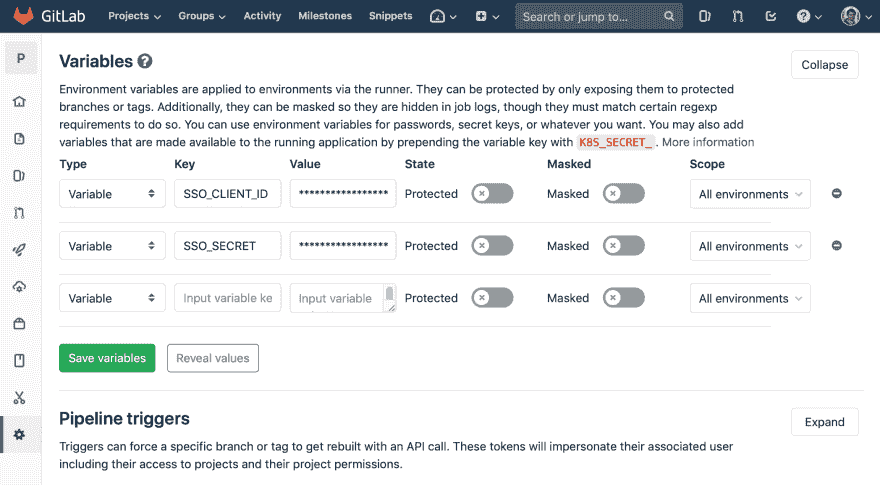

# 谷歌云应用引擎环境变量

> 原文：<https://dev.to/mungell/google-cloud-app-engine-environment-variables-5990>

我最近的一个项目涉及一个必须托管在谷歌云应用引擎上的应用程序。我以前没有使用过 App Engine，但我在 Heroku 和 OpenShift 上管理过应用程序，并有兴趣了解 Google Cloud PaaS 提供了什么。

这是一个相当标准的 Node.js 应用程序，大部分配置都是通过环境变量完成的。很快就发现这可能是个问题——App Engine 不支持可配置的环境变量。

不管是有意还是无意，App Engine 只有一种方法来定义这些变量——在 [`app.yaml`](https://cloud.google.com/appengine/docs/standard/nodejs/config/appref) 配置文件中。该文件描述了应用程序引擎设置(运行时、url 映射等。)，包括指示 App Engine 在部署时设置环境变量的`env_variables`部分。

*举例`app.yaml`文件内容:*T3】

```
runtime: nodejs10

handlers:
- url: /api/.*
  script: auto
  secure: always

- url: /.*
  static_files: index.html
  upload: index.html
  secure: always
  http_headers:
    X-Frame-Options: deny
    X-DNS-Prefetch-Control: off
    X-XSS-Protection: 1; mode=block
    X-Permitted-Cross-Domain-Policies: none

env_variables:
    VAR1: 'VALUE1'
    VAR2: 'VALUE2' 
```

我们的部署管道已经完全自动化，所以我需要在某个地方存储`app.yaml`文件，以便在将代码推送到 Google Cloud 之前提供给构建服务器。理想情况下，它应该是应用程序的代码库。然而，在`app.yaml`文件中包含环境变量导致了一个问题:我们要么需要将应用程序配置提交给存储库，要么不跟踪整个文件。这两个选项都不合适，所以我开始寻找任何其他方法来处理这个应用引擎的限制。

> 顺便提一下，Heroku 和 OpenShift(至少是它的前身)有一个从 web/命令行界面设置环境变量的选项，这简化了应用程序配置管理。

我的搜索带来了一些令人失望的结果:

1.  将应用程序配置存储在 Google Cloud Datastore 中，并在应用程序启动时从中读取([链接](https://stackoverflow.com/questions/22669528/securely-storing-environment-variables-in-gae-with-app-yaml))。
2.  使用云 KMS 加密配置值，并与其余的`app.yaml`配置一起提交([链接](https://news.ycombinator.com/item?id=18231319))。
3.  为不同的环境使用单独的`app.yaml`文件(我猜，把它们都提交给存储库？)([同链接](https://news.ycombinator.com/item?id=18231319))。

[](https://res.cloudinary.com/practicaldev/image/fetch/s--Uu4UlcyR--/c_limit%2Cf_auto%2Cfl_progressive%2Cq_auto%2Cw_880/https://thepracticaldev.s3.amazonaws.com/i/adf7b37bxwn1tvkx1ihg.png)

**选项#1** 假设我们的基础设施中有额外的组件，并且供应商锁定了 Google Cloud Datastore 数据库，这与理想情况相去甚远。

**选项#2** 解决了问题的安全部分，但是意味着将加密的特定于环境的值硬编码到代码库中。它还需要根据添加的每个新环境或对现有环境变量的任何更改来更新代码。不理想。

**选项#3** 根本没有解决问题——代码仍然会存储关于其环境的信息，并且应用程序的秘密就在代码库中...

### 部署管道中的额外步骤

最终，我想出了一个在构建过程中从模板文件编译`app.yaml`文件的方法。当时，我们使用 Google Cloud Build 作为 CI/CD 的构建服务器，但很快转移到 GitLab CI *，因为 Cloud Build 也不支持环境变量*。

> 公平地说，我应该提到云构建支持[“替换”](https://cloud.google.com/cloud-build/docs/configuring-builds/substitute-variable-values)，这与环境变量非常相似。不幸的是，将替换传递给构建作业的唯一方式是通过命令行参数，这意味着要在外部管理环境变量。这让我们回到了最初的问题...

这个应用程序已经在使用 EJS 库，所以我用它来编译模板:

```
# app.tpl.yaml
runtime: nodejs10
env_variables:
  SSO_CLIENT_ID: <% SSO_CLIENT_ID %>
  SSO_SECRET: <% SSO_SECRET %> 
```

有了这样一个脚本:

```
// bin/config-compile.js
const fs = require('fs');
const ejs = require('ejs');

const template = fs.readFileSync('app.tpl.yaml').toString();
const content = ejs.render(template, process.env);

fs.writeFileSync('app.yaml', content); 
```

和 GitLab CI 步骤类似的有:

```
# .gitlab-ci.yml
config-compile:
  stage: build
  image: node:10
  script:
    - node bin/config-compile.js
  artifacts:
    paths:
      - app.yaml
    expire_in: 1 days
    when: always 
```

这使我们能够在 GitLab 环境变量中管理应用程序配置。

[](https://res.cloudinary.com/practicaldev/image/fetch/s--sO1oL1BG--/c_limit%2Cf_auto%2Cfl_progressive%2Cq_auto%2Cw_880/https://thepracticaldev.s3.amazonaws.com/i/fecafmgbm8d31k39220x.png)

该方法可以很容易地适用于任何其他模板库、编程语言或构建服务器，上面的代码只是一个例子。

### 关于安全的说明

我觉得有趣的是，最古老的谷歌云产品之一不支持这样一个常见的功能。然而，我承认这样做可能有有效的安全原因，例如，暴露于类似于在 [rest-client](https://github.com/rest-client/rest-client/issues/713#issuecomment-522967049) 中发现的依赖漏洞或类似 npm 注册表中的[的域名抢注。这一点尤其重要，因为 App Engine 不提供选项来限制/管理来自环境的传出连接。](https://blog.npmjs.org/post/163723642530/crossenv-malware-on-the-npm-registry)

### 本帖未涉及的替代解决方案

*   [《谷歌应用引擎中的秘密》](https://www.dontpanicblog.co.uk/2019/04/27/secrets-in-google-app-engine/)作者斯图尔特·利奇
*   [“如何在 GCloud 应用引擎中使用环境变量”](https://medium.com/@gunar/how-to-use-environment-variables-in-gcloud-app-engine-node-js-86623b3ab0f6)Gunar gess ner