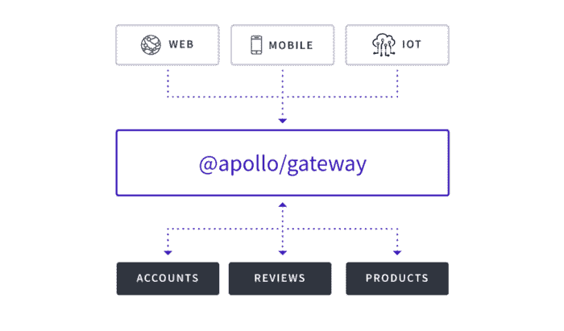

# GraphQL 代码优先和 SDL 优先，2019 年年中的当前形势

> 原文：<https://dev.to/novvum/graphql-code-first-and-sdl-first-the-current-landscape-in-mid-2019-547h>

最近，在 GraphQL 社区中有很多关于代码优先或 SDL 优先模式开发的讨论。这个博客的目的是揭示生态系统的现状，帮助团队决定哪种方法最适合他们。

为了理解我们今天的处境，回顾一下我们是如何走到这一步的会有所帮助。

## 代码优先:构建 graphql 模式的原始方式

脸书最初发布 [graphql-js](https://github.com/graphql/graphql-js) 作为 graphql 规范的参考实现。该模式被定义为一个普通的 javascript 对象:

```
const { GraphQLSchema, GraphQLObjectType, GraphQLString } = require('graphql')

const schema = new GraphQLSchema({  
  query: new GraphQLObjectType({  
    name: 'Query',  
    fields: {  
      hello: {  
        type: GraphQLString,  
        args: {  
          name: { type: GraphQLString },  
        },  
        resolve: (_, args) =&gt; `Hello ${args.name || 'World!'}`,  
      },  
    },  
  }),  
}) 
```

社区中的许多人认为以这种方式编写模式非常冗长，并且在实现模式时拥有一个模式的心理模型是一个挑战。

## Enter SDL

Apollo 团队发布了 graphql-tools，它普及了模式定义语言(SDL)。下面是上面的相同模式在 SDL 定义的样子:

```
type Query {  
  hello(name: String): String  
} 
```

使用 SDL 更容易理解模式的结构，并最终使模式设计过程更加直观。阿波罗团队还提出了伴随 SDL 的模式指令。

SDL 优先方法的一个重要缺点是解析器需要与模式定义分开实现。因此，各种新的挑战随之而来。指令也[不是](https://github.com/graphql/graphql-js/issues/1343)核心 GraphQL 规范的一部分。

## 钟摆先回码

像 [TypeGraphQL](http://typegraphql.ml/) 和 [GraphQL Nexus](https://nexus.js.org/) 这样的工具被发布，以减少 graphql-js 的冗长，并提供比 SDL 方法更简单的模式开发方法。这些工具是以 graphql-js 为核心构建的，因此它们不支持模式指令——以下是在 [TypeGraphQL](https://github.com/19majkel94/type-graphql/issues/77) 和 [GraphQL Nexus](https://github.com/prisma/nexus/issues/53) 中请求支持它们的问题。

## 联邦模式…

Apollo 团队最近引入了用于构建分布式图的[模式联盟](https://blog.apollographql.com/apollo-federation-f260cf525d21)规范。它极大地改进了模式拼接的许多缺陷，实现了真正的分布式架构。该规范利用模式指令，因此各个模式可以向网关服务器提供关于它们如何相互关联的提示。

[](https://res.cloudinary.com/practicaldev/image/fetch/s--KViK5jJU--/c_limit%2Cf_auto%2Cfl_progressive%2Cq_auto%2Cw_880/https://miro.medium.com/max/700/1%2AtKMI6wsfV4IGdBudipOK7g.png)

这里的主要问题是代码优先的库不能支持模式联合，因为它们不支持指令。已经有针对 [TypeGraphQL](https://github.com/19majkel94/type-graphql/issues/351) 和 [GraphQL Nexus](https://github.com/prisma/nexus/issues/148) 的问题提交请求支持，但截至目前还没有太多进展。

## 那么，代码优先还是 SDL 优先？

创新会带来相应的破坏，GraphQL 生态系统也不例外。在选择任何工具集时都有风险和权衡，团队必须仔细观察他们的环境，以了解哪种方法适合他们的需求。

### 这里有一些建议:

*   如果您的团队需要模式联合或指令，那么最好采用 SDL 优先的方法，直到生态系统跟上。
*   如果您的团队不需要模式联合或指令，那么最好是代码优先——特别是如果您有一个大的模式。这将有助于你的团队保持你的代码库组织有序并快速移动。

### 如果选择错了怎么办？

这里的一线希望是，你不必拘泥于你的团队现在做出的决定。因为两种方法本质上是相同的(您定义了一个模式和解析器)，所以当从一种方法切换到另一种方法时，重用大部分(如果不是全部)业务逻辑并不困难。需要注意的一点是，目前从代码优先开始，然后切换到 SDL 优先要容易得多，因为在代码优先中缺乏模式指令支持。

我希望这能对那些努力在 GraphQL 生态系统中保持领先的团队有所帮助。您可以随时致电[novum](https://www.novvum.io/contact-us)向我们寻求帮助！

###### 关于我们: [Novvum](https://novvum.io) 是一家专业从事工程、战略、&设计的现代软件开发机构。