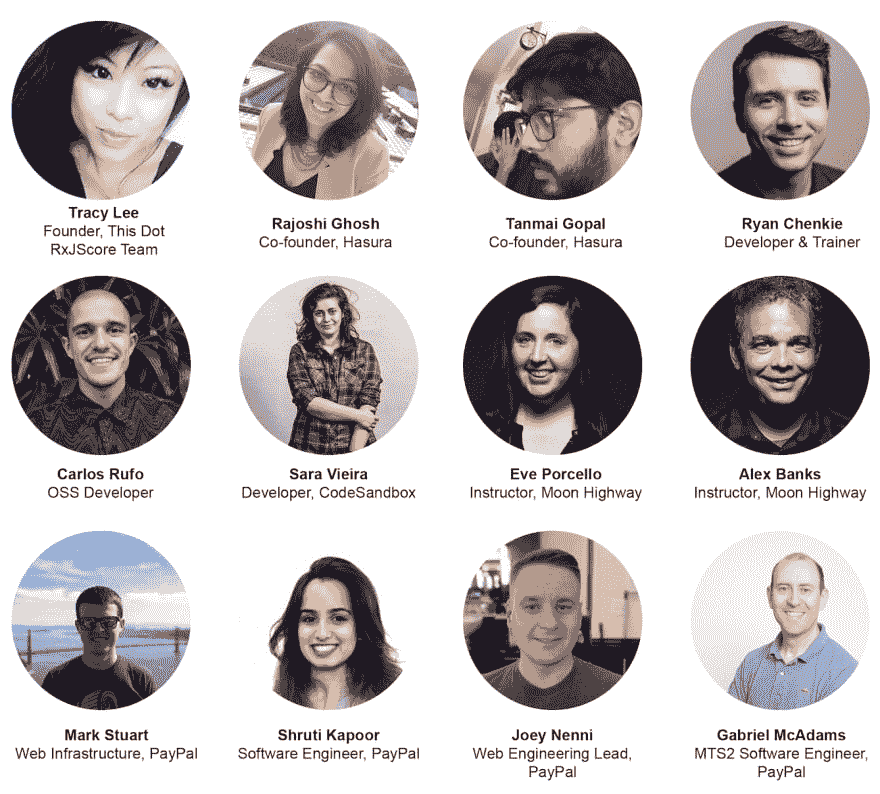

# GraphQL 贡献者日-前端框架版 2019 年 8 月 8 日

> 原文：<https://dev.to/thisdotmedia/graphql-contributor-days-front-end-framework-edition-august-8th-2019-d1n>

GraphQL 贡献者的日子又回来了，我们为你准备了一个特别的前端框架聚焦版！

该活动将于 2019 年 8 月 8 日上午 9 点至下午 1 点(太平洋标准时间)举行。欲知详情和注册信息，请点击此处。

与 Hasura 合作，这个活动欢迎所有对 GraphQL 感兴趣的人加入对话！

来自 React、Angular、Ember 等各种框架的小组成员和演讲者将讨论他们如何将 GraphQL 集成到他们的工作中。

这是第二个 GraphQL 贡献者日，完全在线，所有人都可以加入。我们希望能够举办一场任何人都可以参加的活动，无论你住在世界的哪个角落！

我们的特色嘉宾是:

*   李美玲:创始人，这个 Dot & RxJS 核心团队
*   拉乔希·戈什:哈苏拉的联合创始人
*   坦迈·戈帕尔:哈苏拉创始人
*   Ryan Chenkie:开发人员/培训师
*   卡洛斯·鲁福:开放源码软件开发者
*   Sara Vieira:code sandbox 开发人员
*   马克·斯图尔特:网络基础设施，贝宝
*   shruti Kapoor:Paypal 软件工程师
*   Christina Yu:Paypal 软件工程师
*   joey Nenni:PayPal 网络工程主管
*   Gabriel McAdams:PayPal MTS 2 软件工程师
*   伊芙·波尔切洛:月球公路教练
*   亚历克斯·班克斯:月球公路教练

&更多内容有待公布！

我们将要讨论的一些话题:

*   GraphQL 入门
*   维护 GraphQL 应用程序的经验:
    *   赞成/反对
    *   复杂性权衡
*   GraphQL API:所有权、控制和维护
    *   你喜欢精确的 API，还是让你随心所欲的通用 API
*   API 生命周期:
    *   文档/勘探
    *   回归和测试
    *   贬值
    *   监控/使用-分析
    *   流程变更(围绕调试/性能)

有你想让我们谈论的话题吗？加入实时聊天，并让我们知道！

如果您有兴趣参加 2019 年 8 月 8 日的在线活动，[今天就注册](https://www.thisdot.co/events/graphql-contributor-days-frameworks-edition)！

需要 JavaScript 咨询、指导或培训帮助吗？在 [This Dot Labs](//thisdot.co) 查看我们的服务列表。