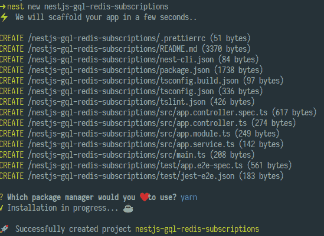
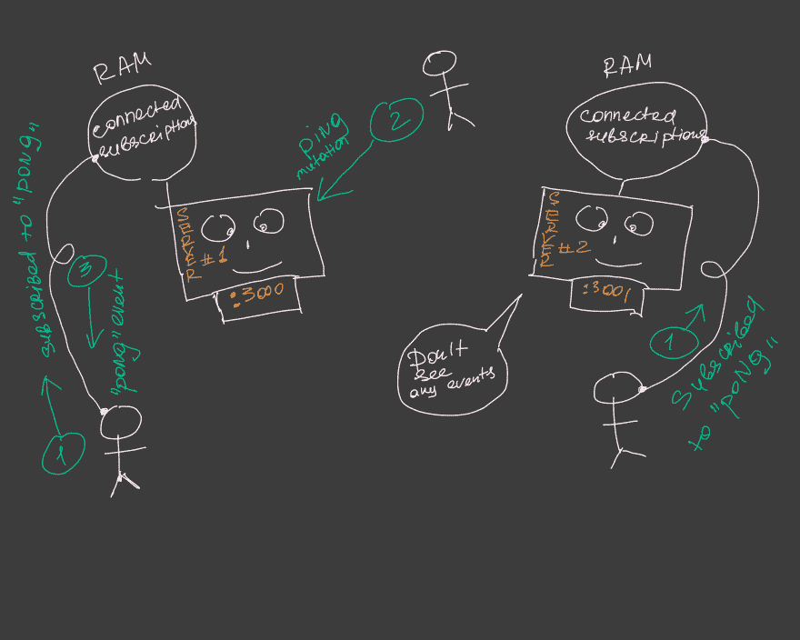
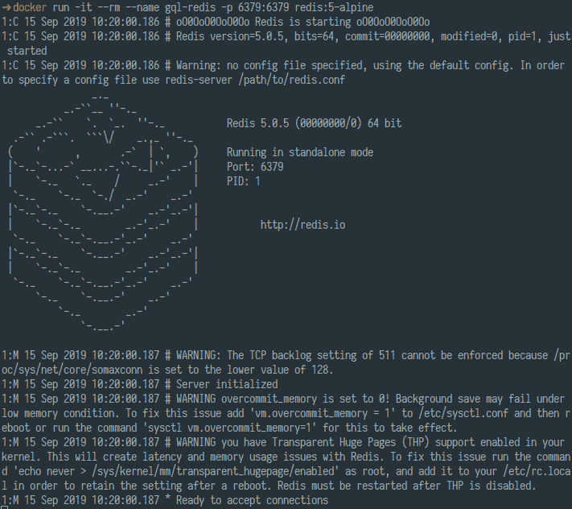
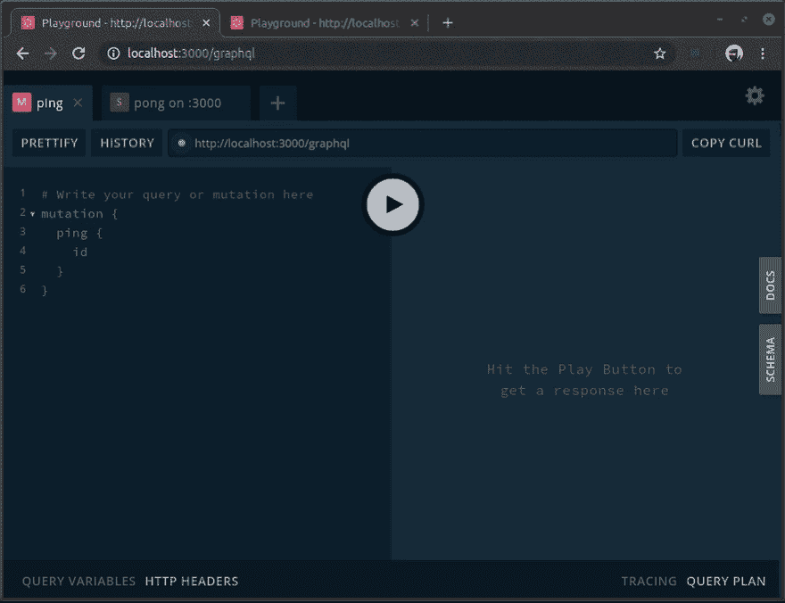
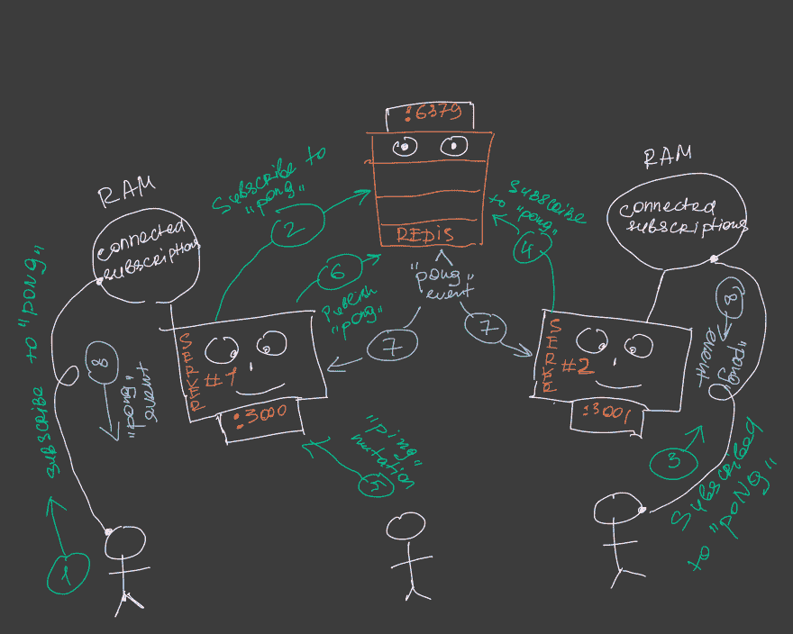

# 使用 Nest 的 GraphQL 订阅:如何跨多个运行的服务器发布

> 原文：<https://dev.to/thisdotmedia/graphql-subscriptions-with-nest-how-to-publish-across-multiple-running-servers-15e>

今天我们将学习如何使用 Redis 和 NestJS 设置 GraphQL (GQL)订阅。

本文的先决条件:

1.  在 [GraphQL](https://graphql.org/) 的一次体验
2.  NestJS 的一些基础知识(如果你不知道 NestJS 是什么，那么[试一试](https://nestjs.com/)之后再来。)
3.  安装在您机器上的 Docker 。

你可能会问自己，“我们到底为什么需要 Redis？”Apollo 提供的默认订阅实现开箱即用，对吗？

嗯，看情况。当您的服务器只有一个实例时，您不需要 Redis。

但是，当您扩展应用程序并产生额外的服务器实例时，您需要确保在一个实例上发布的事件将被另一个实例上的订阅者接收到。这是默认订阅无法为您做到的。

因此，让我们从使用默认(*内存中*)订阅构建一个基本的 GQL 应用程序开始。

首先安装`@nestjs/cli` :

```
npm i -g @nestjs/cli 
```

然后创建一个新的 NestJS 项目:

```
nest new nestjs-gql-redis-subscriptions 
```

[](https://res.cloudinary.com/practicaldev/image/fetch/s--M_vzh4l_--/c_limit%2Cf_auto%2Cfl_progressive%2Cq_auto%2Cw_880/https://thepracticaldev.s3.amazonaws.com/i/h21n5sya6vm418x2f8a5.png)

现在，打开`nestjs-gql-redis-subscriptions/src/main.ts`并改变

```
await app.listen(3000); 
```

致:

```
await app.listen(process.env.PORT || 3000); 
```

这允许我们在需要时通过 env 变量指定一个端口。

NestJS 有非常坚实的 GQL 支持，但是我们需要安装一些额外的依赖项来利用它:

```
cd nestjs-gql-redis-subscriptions
npm i @nestjs/graphql apollo-server-express graphql-tools graphql graphql-subscriptions 
```

我们还安装了`graphql-subscriptions`，为我们的应用带来订阅。

为了查看订阅的效果，我们将构建一个“乒乓”应用程序，其中`ping`通过 GQL `mutation`发送，`pong`通过 GQL `subscription`发送。

在`src`目录下，创建一个`types.graphql`文件，并将我们的模式:

```
type  Query  {  noop:  Boolean  }  type  Mutation  {  ping:  Ping  }  type  Subscription  {  pong:  Pong  }  type  Ping  {  id:  ID  }  type  Pong  {  pingId:  ID  } 
```

然后转到`app.module.ts`，导入`GraphQLModule`如下:

```
// ... other imports
import { GraphQLModule } from '@nestjs/graphql';
import { PubSub } from 'graphql-subscriptions';

@Module({
  imports: [
    GraphQLModule.forRoot({
      playground: true,
      typePaths: ['./**/*.graphql'],
      installSubscriptionHandlers: true,
    }),
  ],
  providers: [
    {
      provide: 'PUB_SUB',
      useValue: new PubSub(),
    },
  ],
})
export class AppModule {} 
```

让我们看一下传递给`GraphQLModule.forRoot`的选项:

*   `playground` -曝光`http:localhost:${PORT}/graphql`上的 [GQL 游乐场](https://github.com/prisma/graphql-playground)。我们将使用这个工具来订阅“乒乓”事件和发送“乒”突变。
*   `installSubscriptionHandlers` -启用订阅支持
*   `typePaths`-GQL 类型定义的路径。

另一个有趣的细节是:

```
{
  provide: 'PUB_SUB',
  useValue: new PubSub(),
} 
```

这是发布/订阅引擎的默认(内存中)实现，它允许我们发布事件和创建订阅。

现在，在我们配置了 GQL 服务器之后，是时候创建解析器了。在`src`文件夹下，创建一个文件`ping-pong.resolvers.ts`，在那里输入以下内容:

```
import { Resolver, Mutation, Subscription } from '@nestjs/graphql';
import { Inject } from '@nestjs/common';
import { PubSubEngine } from 'graphql-subscriptions';

const PONG_EVENT_NAME = 'pong';

@Resolver('Ping')
export class PingPongResolvers {
  constructor(@Inject('PUB_SUB') private pubSub: PubSubEngine) {}

  @Mutation('ping')
  async ping() {
    const pingId = Date.now();
    this.pubSub.publish(PONG_EVENT_NAME, { [PONG_EVENT_NAME]: { pingId } });
    return { id: pingId };
  }

  @Subscription(PONG_EVENT_NAME)
  pong() {
    return this.pubSub.asyncIterator(PONG_EVENT_NAME);
  }
} 
```

首先，我们需要用`@Resolver('Ping')`来装饰`PingPongResolvers`类。NestJS 官方文档很好地描述了它的用途:

你可以参考 Nest.js 官方文档中关于使用 GraphQL 的内容

> `@Resolver()`装饰器不影响查询或变异(既不是`@Query()`也不是`@Mutation()`装饰器)。它只通知 Nest 这个特定类中的每个`@ResolveProperty()`都有一个父类，在本例中是一个`Ping`类型。

然后，我们定义我们的`ping`突变。它的主要职责是发布`pong`事件。

最后，我们有订阅定义，它负责将适当的发布事件发送给订阅的客户端。

现在我们需要将`PingPongResolvers`添加到我们的`AppModule` :

```
// ...
@Module({
  // ...
  providers: [
    PingPongResolvers,
    {
      provide: 'PUB_SUB',
      useValue: new PubSub(),
    },
  ],
})
export class AppModule {} 
```

此时，我们已经准备好启动应用程序，并看看我们的实际实现。

实际上，为了理解内存订阅的问题，让我们运行我们应用程序的两个实例:一个在端口 *:3000* 上，另一个在 *:3001* 上

在一个终端窗口中，运行:

```
# port 3000 is the default port for our app
npm start 
```

之后，在另一个:

```
PORT=3001 npm start 
```

这是一个演示:

[](https://res.cloudinary.com/practicaldev/image/fetch/s--H_kpImSr--/c_limit%2Cf_auto%2Cfl_progressive%2Cq_66%2Cw_880/https://thepracticaldev.s3.amazonaws.com/i/9zghuddpcvortvd2vchk.gif)

正如您所看到的，在 *:3001* 上运行的实例没有得到在 *:3000* 实例上发布的任何事件。

看看下面的图片，从不同的角度来看:

[](https://res.cloudinary.com/practicaldev/image/fetch/s--NVhxty4S--/c_limit%2Cf_auto%2Cfl_progressive%2Cq_auto%2Cw_880/https://thepracticaldev.s3.amazonaws.com/i/2qj5undhbnay67evk5yv.jpg)

显然， *:3001* 无法看到 *:3000* 上发布的事件

现在，让我们稍微调整一下我们的应用程序来解决这个问题。首先，我们需要安装 Redis 订阅依赖项

```
npm i graphql-redis-subscriptions ioredis 
```

`graphql-redis-subscriptions`提供了`PubSubEngine`接口的 Redis 感知实现:`RedisPubSub`。您之前已经使用过这个接口，通过它的内存实现- `PubSub`。

`ioredis` -是 Redis 客户端，由`graphql-redis-subscriptions`使用。

要开始使用我们的`RedisPubSub`，我们只需要稍微调整一下`AppModule`。

改一下:

```
// ...
{
  provide: 'PUB_SUB',
  useValue: new PubSub(),
}
// ... 
```

对此:

```
// ...
import { RedisPubSub } from 'graphql-redis-subscriptions';
import * as Redis from 'ioredis';
//  ...

// ...
{
  provide: 'PUB_SUB',
  useFactory: () => {
    const options = {
      host: 'localhost',
      port: 6379
    };

    return new RedisPubSub({
      publisher: new Redis(options),
      subscriber: new Redis(options),
    });
  },
},
// ... 
```

我们将在 docker 容器中启动 redis，并使其在`localhost:6379`(对应于我们传递给上面的`RedisPubSub`实例的选项):

```
docker run -it --rm --name gql-redis -p 6379:6379 redis:5-alpine 
```

[](https://res.cloudinary.com/practicaldev/image/fetch/s--m8rCFbpB--/c_limit%2Cf_auto%2Cfl_progressive%2Cq_auto%2Cw_880/https://thepracticaldev.s3.amazonaws.com/i/cdi4l7re32u9hcbdre3z.png)

现在我们需要停止我们的应用程序，并再次重启它们(在不同的终端会话中):

```
npm start 
```

和

```
PORT=3001 npm start 
```

此时，订阅按预期工作，在应用程序的一个实例上发布的事件被订阅到另一个实例的客户端接收:

[](https://res.cloudinary.com/practicaldev/image/fetch/s--evJhtrSo--/c_limit%2Cf_auto%2Cfl_progressive%2Cq_66%2Cw_880/https://thepracticaldev.s3.amazonaws.com/i/4wahc456ikbes0cycwoz.gif)

下面是引擎盖下发生的事情:

[](https://res.cloudinary.com/practicaldev/image/fetch/s--IOR70zsB--/c_limit%2Cf_auto%2Cfl_progressive%2Cq_auto%2Cw_880/https://thepracticaldev.s3.amazonaws.com/i/4xk2q35iolr78pnbdftd.jpg)

总结:

在本文中，我们学习了如何使用 Redis 和 GQL 订阅跨 server 应用程序的多个实例发布事件。

我们还应该更好地理解 GQL 订阅事件发布/订阅流程。

源代码:

[https://github . com/rych gg/gql 重定向订阅-文章](https://github.com/rychkog/gql-redis-subscriptions-article)

喜欢这篇文章吗？前往[这个 Dot Labs](https://www.thisdot.co/labs) 看看我们吧！我们是一家技术咨询公司，做 javascript 和前端的所有事情。我们专注于开源软件，如 Angular，React 和 Vue。