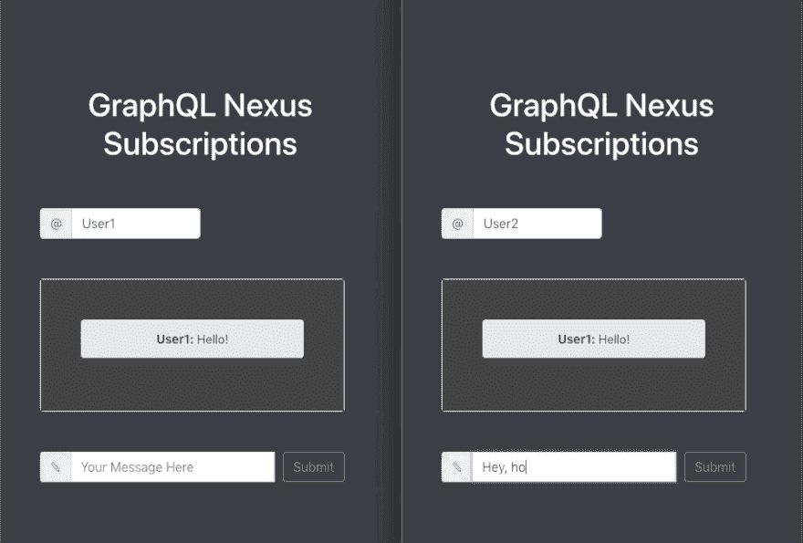
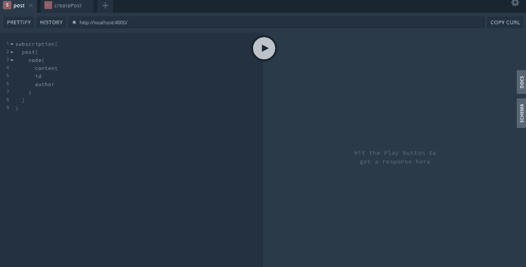

# Nexus 和 React Apollo 的 GraphQL 订阅

> 原文：<https://dev.to/novvum/graphql-subscriptions-with-nexus-and-react-apollo-2pdo>

#### 简介

订阅是 GraphQL 的一个非常强大的特性。它们允许您与数据库建立实时连接，在发生变化时通知和更新您的数据。订阅有大量的应用，比如实时聊天应用或者文章的实时评论。

在本教程中，我们将使用 GraphQL Nexus 和 React Apollo 创建一个最小的实时聊天应用程序。希望在本文结束时，你会成为使用订阅的专家。

[](https://res.cloudinary.com/practicaldev/image/fetch/s--lY0uLDIY--/c_limit%2Cf_auto%2Cfl_progressive%2Cq_auto%2Cw_880/https://cdn-images-1.medium.com/max/800/0%2ADne-esyq4HBFU25p)

#### 肉和土豆

##### 开始设置

要开始，请下载这个资源库:[https://github . com/hkyang 995/graph QL-nexus-subscription-starter-back end](https://github.com/hkyang995/graphql-nexus-subscription-starter-backend)

此项目包含一个带有单个

`Post`类型- `Post`有两个字段，`author`和`content`。我们将设置一个订阅来更新每个新帖子的实时聊天源。

如果您瞥一眼`src/schema.ts`，您会看到两个查询，

`post`和`posts`。`post`查询返回最近的一篇文章，而`posts`返回数据库中的每一篇文章。你可能已经猜到了，`createPost`突变创造了一个职位。

让我们从安装我们的工具开始:GraphQL Yoga、GraphQL Nexus 和 GraphQL。我们将使用 Prisma 的演示服务器来帮助进行设置，并方便地保存我们所有的信息。starter 文件使用 yarn 将我们的依赖关系联系在一起，所以我们需要做的就是:

`yarn`

要在本教程中随时启动服务器，请使用:

`yarn dev`

现在我们已经安装了所有的东西，我们可以用 Prisma 创建一个服务器，使用:

`prisma init`

该命令将引导我们完成服务器的创建。请随意选择任何适合您需求的选项，但是为了简单起见，以下选项就足够了:

*   演示服务器
*   选择欧盟还是美国
*   给你闪亮的新服务命名
*   为这个阶段选择一个名称(默认名称即可)
*   为我们选择的语言选择打字稿

运行完`prisma generate`后，您的服务器就可以运行了。

现在我们终于准备好开始订阅了！

##### 在后端创建订阅

现在我们已经设置好了，我们准备创建我们的订阅。因为每个订阅都需要返回一个有效负载(发送给您的信息包)，所以我们将在模式中添加一个有效负载类型。

```
const PostSubscriptionPayload = objectType({
 name: "PostSubscriptionPayload",
 definition(t) {
   t.field("node", {
     type: Post,
     nullable: true
   });
   t.list.string("updatedFields", { nullable: true });
 }
}); 
```

如上所述，这个有效负载类型是将从我们的订阅返回的对象类型。我们要关注的关键项目是`t.field(“node”)`。我们将它的类型设置为`Post`，这样它将返回我们所需要的东西，一个`Post`！

```
const messageSubscription = subscriptionField("post", {
 type: PostSubscriptionPayload,
 subscribe: (root, args, context) => {
   return context.prisma.$subscribe.post({ mutation_in: "CREATED" }) as any;
 },
 resolve: payload => {
   return payload;
 }
}); 
```

这是将要完成大部分工作的函数。你可能会想，“就这样？?"是的，就是这样！对于这个特定的应用程序，后端不需要任何其他东西。

下面是这段代码的工作原理。我们将类型设置为`PostSubscriptionPayload`来返回我们的帖子。您可以看到我们向帖子`mutation_in: ‘CREATED’`传递了一个参数，这意味着我们将只订阅新创建的帖子(而不是被编辑或删除的帖子)。最后，我们返回完成订阅的有效负载！

您可以通过使用`yarn dev`启动 GraphQL 来测试这一点。当您运行订阅时，它将开始监听新帖子。当你使用`createPost`变异创建一个新帖子时，你将能够在你的订阅标签中看到它。

[](https://res.cloudinary.com/practicaldev/image/fetch/s--2Z347FsZ--/c_limit%2Cf_auto%2Cfl_progressive%2Cq_auto%2Cw_880/https://cdn-images-1.medium.com/max/800/0%2AgwZc8WUltvUsKQgH)

您可以在这里查看并下载完整的后端代码:

[https://github . com/hkyang 995/graph QL-nexus-subscription-starter-back end/tree/completed](https://github.com/hkyang995/graphql-nexus-subscription-starter-backend/tree/completed)

##### 在前端创建订阅

我们的订阅在后台工作，但是我们还没有脱离困境。下一步是让订阅在前端工作，这样我们就可以实时看到我们闪亮的新`Posts`。

首先，让我们设置一个简单的 UI，并将我们的前端连接到后端。要开始，下载前端代码的报告:

[https://github . com/hkyang 995/graph QL-nexus-subscription-starter-frontend](https://github.com/hkyang995/graphql-nexus-subscription-starter-frontend)

要随时运行应用程序，请在前端文件夹的命令行中使用`yarn start`。

```
const wsLink = new WebSocketLink({
 uri: `ws://localhost:4000/`,
 options: {
   reconnect: true
 }
});

const httpLink = createHttpLink({
 uri: "http://localhost:4000/"
});

const link = split(
 ({ query }) => {
   const { kind, operation } = getMainDefinition(query);
   return kind === "OperationDefinition" && operation === "subscription";
 },
 wsLink,
 httpLink
);

const client = new ApolloClient({
 link,
 cache: new InMemoryCache()
}); 
```

如果你看一下`src/App.js`，你会发现我们正在使用 Apollo 连接我们的前端和后端。后端服务器被设置为`localhost:4000`，如果您的服务器被托管在其他地方，这个值可以更改。我们还将一个 WebSocket 连接到所有这些，这样我们就能够实时获得我们的订阅。

大部分的跑腿工作都是在我们的组件函数`src/AppContents.js`中完成的。在这个文件中，有一个函数接受输入并进行变异，将帖子推送到我们的服务器。在`src/ChatBox.js`中，我们查询已经存在的`Posts`，并将它们显示给用户。

现在，我们可以写出消息并提交它们，但是除非我们刷新，否则聊天框不会更新。为了解决这个问题，我们将在前端设置我们的订阅。

使用我们的一个导入包，`graphql-tag` ( `gql`)，我们可以像这样在前端设置一个订阅:

```
const NEW_POST_SUBSCRIPTION = gql`
 subscription PostSubscription {
   post {
     node {
       content
       id
       author
     }
   }
 }
`; 
```

因为我们在后端定义了订阅，所以我们只需要在前端指定我们想要获取的内容。这里我们得到了内容、id 和作者。

```
<Query query={GET_EXISTING_POSTS}>
               {({ subscribeToMore, loading, error, data }) => { 
```

`subscribeToMore`函数打包在 Apollo GraphQL 中，将成为我们在前端最好的朋友，因为它将使我们的订阅工作。我们可以在查询函数中传递它。

```
<ChatView
  data={data}
  subscribeToMore={() =>
    subscribeToMore({
      document: NEW_POST_SUBSCRIPTION,
      updateQuery: (prev, { subscriptionData }) => {
        if (!subscriptionData.data) return prev;
        const { node } = subscriptionData.data.post;
        return Object.assign({}, prev, {
          posts: [...prev.posts, node]
        });
      }
    })
   }
/> 
```

这里，我们将把`subscribeToMore`函数传递给我们的`ChatView`组件。让我们来分析一下这一切是如何工作的。

我们将订阅传递到`document`字段，而`updateQuery`是一个在每次查询更新时运行的函数。

```
const { node } = subscriptionData.data.post; 
```

我们可以从订阅数据中提取节点，该节点包含关于帖子的所有信息:内容、帖子 id 和帖子的作者。

```
return Object.assign({}, prev, {
  posts: [...prev.posts, node]
}); 
```

最后，我们通过将`posts`设置为之前的值来更新它，同时更新我们从订阅中获得的新节点。

```
 componentDidMount() {
    this.props.subscribeToMore();
  } 
```

我们需要做的最后一件事是将`subscribeToMore`函数添加到`ChatView`组件的`componentDidMount`函数中。这将允许它在需要时随时更新。

现在你知道了！现在，无论何时发送消息，您的订阅都会更新前端。

完整的代码可以在这里找到。

[https://github . com/hkyang 995/graph QL-nexus-subscription-starter-frontend/tree/completed](https://github.com/hkyang995/graphql-nexus-subscription-starter-frontend/tree/completed)

#### 结论

在本教程中，我们使用 GraphQL 订阅构建了一个实时聊天应用程序。有了这一点，对于更复杂的应用程序来说，订阅就不那么令人生畏了。

如果你有任何问题，评论，担心，或者只是想告诉我你的一天，请随时留下评论。更多类似的内容，请随时关注 Twitter 上的[novum](https://twitter.com/novvumio)。谢谢大家！