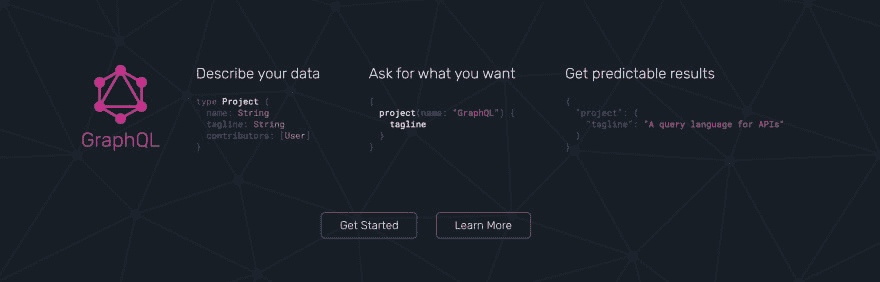
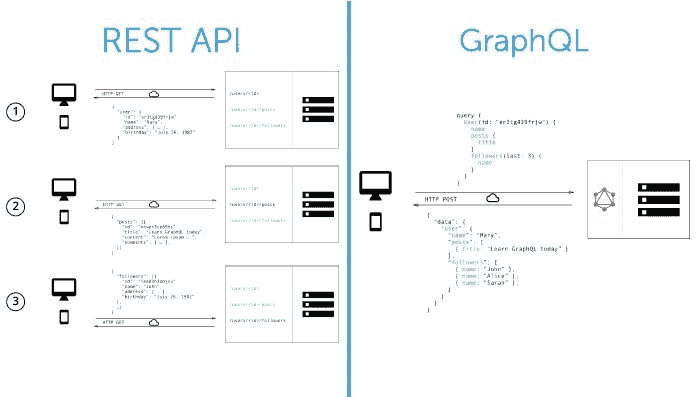
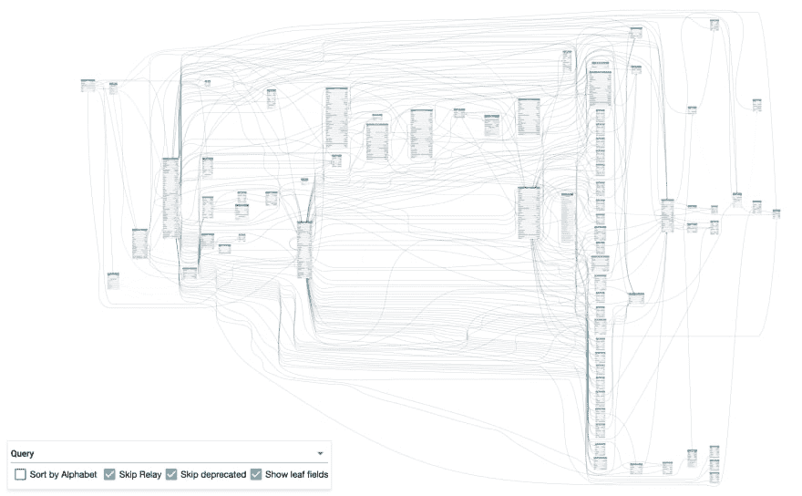
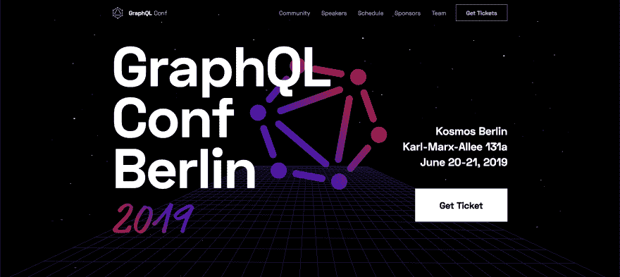
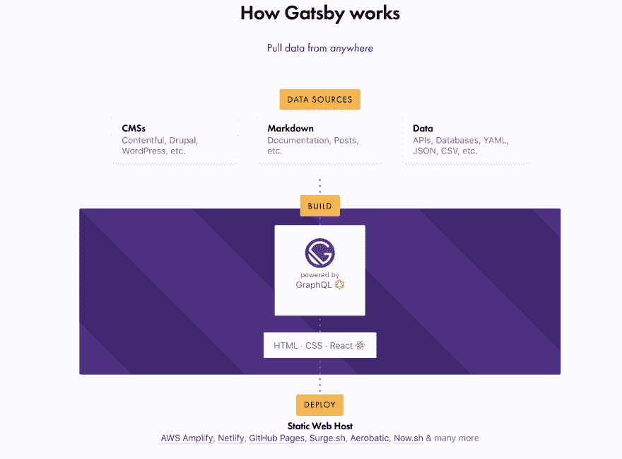

# GraphQL -其余的都结束了

> 原文：<https://dev.to/colaru/graphql-the-rest-is-over-1a4h>

**概述**

在过去的几年里，我非常乐意公开 Angular JS 客户端使用的 REST Web 服务(并使用 Swagger 来记录 API)。但这是去年的情况，当时我们有一个庞大的数据模型，其中数百个实体作为 REST 资源公开。那样的话，**休息不够**。因此，**我的休息结束了**——我开始寻找一种更好的方式来公开和消费 web 服务，我发现了一个名为 [GraphQL](https://graphql.org/) 的东西。

这并不意味着休息结束了。GraphQL API 可以位于 REST API 之前，或者 tho APIs 可以同时共存。这个想法是有一种新的消费/公开 API 的方式。如果我们在服务器端有一个模式，那就更好了。对于我们其余的人来说有[graph QL](https://apifacade.com/graphql-for-the-rest-of-us)

 
形象信用【http://howtographql.com】T4

**应用案例**

该应用程序是一个经典的客户端-服务器应用程序，后端有 Java/EJB，向 Angular 客户端公开一组 JAX-RS REST web 服务。我们使用 JPA 实现持久性，并使用 JPA 注释对整个实体图进行建模。

我们将域分割成几十个类和一个聚合根的聚合——主要使用 id 作为字段，而不是外键。我们暴露了一些聚合根的端点——在一个 **rest-full way** 中。该项目的需求是在我们的端点中只暴露 CRUD 操作(当然，没有 CRUD 是不够的),因为业务流是客户端应用程序的一部分。这很好，因为我们可以尊重 REST 原则，让资源(名词)的状态由 HTTP 命令(动词)修改。

我们使用 Swagger 来记录 API——前端团队能够从 Swagger UI 实时调用我们的 API。Swagger/ [Open API](https://www.openapis.org/) 文档是从带注释的端点动态生成的。Angular 前端使用其代码生成工具从 Swagger 生成 TypeScript 客户端。一切似乎都很好。

但是有些事情不太对劲。我们的 JPA 实体也是我们的 REST 资源。在 JPA 中，实体根据数据库模式在图中链接在一起。当我们得到聚合根时，我们得到了包含所有字段的实体的整个图。因为实体是资源，所以客户端每次都会收到一个巨大的 JSON 文件。通常，在角组件中，不需要整个图，也不需要所有的资源字段。

如果我们有一个像这个故事中的数据模型，一个公司投资数年创建的数据模型，我们会做什么。如果我们有一个像[这个 **GitHub 数据模型**](https://apis.guru/graphql-voyager/) 这样的模型，我们会怎么做:

 
形象功劳:【howtographql.com】T4

**有几个补丁**

一种是在我们的实体上使用来自封送/解封送框架@JsonIgnore，@XmlTransient 的一些注释来简化客户端接收到的 JSON。这是有问题的，因为在一些端点中，我们需要向客户端发送资源的一些字段，在其他情况下是不同的字段——注释实体/资源将会抑制所有客户端调用的字段。

另一个解决方案是创建不同的 WS 端点，并在我们向客户端发送响应时隐藏一些字段。例如，使用不同于域实体的不同资源包，并在我们发回响应时从实体中填充它们。这也是有问题的，因为我们引入了更多的复杂性——我们的 API 将更多地采用 RPC 风格(而不是 REST ),并且我们将有额外的工作来填充来自实体的资源。我们必须编写命名查询或标准查询来从数据库中获取正确的数据，而不仅仅是 CRUD 操作。

我所知道的最后一个解决方案是拥有真正隔离的资源，而不是在服务器端公开对象的图形。在这种情况下，在集合的情况下，我们将有多个调用，可能是 **1+n 个调用**。这也是一个问题，因为我们要做大量的调用。

**剩下的不够**

previews 故事中的这种项目展示了其他项目的缺点——当我们在服务器端有一个丰富的域时，这种情况不好——对象图。在这种情况下，生成的 JSON 是巨大的，并且富含不必要的信息。解决这个问题的方案将把我们从 REST 风格引向远程过程调用(RPC)。或者使用一些额外的代码使后端变得复杂——而不仅仅是使用简单的 ORM CRUD 操作。

对于这些情况，GraphQL 似乎是解决方案。我们将向服务器请求我们需要的信息。因为我们不想要整个模式。当我们分离出系统消息、通知等信息时，REST 就很好了。但是对于我们有一个大的模式的情况是不好的。

模式无处不在——文档(XML、PDF、JSON)、文件/文件夹文件系统、关系数据库(即使是强制模式)、DOM 等等。REST 适用于非关系数据库(MONGO-DB ),其中有实体集合。但在关系数据库中，我们存储的是对象图(即使我们是以强迫的方式)。这就是我们如何存储现有的大部分数据。

**介绍 GraphQL**

GraphQL 诞生于脸书团队适应现代移动世界的努力。它与 React 或 Jest 等其他技术一起在脸书使用，这些技术也是由该公司发明的。完整的故事可以在这个由该技术的开发者呈现的 [GraphQL 原创纪录片](https://youtu.be/783ccP__No8)中找到。

GraphQL 最初只是一个关于如何以声明的方式从客户端角度与数据进行交互的规范。首先，为 Java 脚本创建了一个参考实现，其他开发人员开始在其他编程语言上实现它。它不是一种在服务器端公开 API 的方法，而是一种从客户端消费数据的方法。它没有指定公开的数据集是数据库还是 REST API。它没有指定使用的通信协议——是否是 HTTP！

GraphQL 提供了一种记录 API 的方法，一种指定名为 **Schema** 的 API 功能的方法。从历史上来说，我们有 GraphQL/Schema，就像我们有 SOAP/WSDL、REST/Swagger-OpenAPI 一样。我们可以从这个模式开始，以与处理其他类型的 web 服务 API(REST 或 SOAP)相同的方式来生成客户端或服务器。

**学习步骤** GraphQL

1.  首先观看名为 [GraphQL 的视频——纪录片](https://www.youtube.com/watch?v=783ccP__No8&feature=youtu.be),了解这项技术是如何、何时以及为何诞生的
2.  尽可能从这些 [GraphQL 视频教程](https://www.howtographql.com/)中学习匹配
3.  使用现有的 UI 客户端和[真实在线 API](https://www.graphqlhub.com/)进行一些真实的调用
4.  研究您喜欢的编程语言对 GraphQL 的支持
5.  在简单模式上实现 API
6.  阅读 [GraphQL 规范](https://graphql.github.io/graphql-spec/June2018/)
7.  看看 [Gatsby.js](https://www.gatsbyjs.org/) 如何实现源代码和变形金刚插件

**Gatsby.js 愿景**

不说说 [Gatsby.js](https://www.gatsbyjs.org/) 我就完不了这篇文章。为什么我可以把它命名为**下一个 WordPress** ？因为它什么都有，Wordpress 有一个可插入的主题系统，开发者基于正确的抽象很容易扩展。这是一种结合 React 组件和 GraphQL 模式来创建微前端的方法。

老实说，我梦想以 Web 组件和微服务的组合形式实现这一点已经很久了——但是当你读到这里的时候，React/GraphQL 似乎正在 Gatsby.js 的保护伞下提供这一功能。

盖茨比提供了一个创建静态渐进式网络应用的好选择。对于 GraphQL 部分，Gatsby 提供了一组[源和 transformers 插件](https://www.gatsbyjs.org/plugins/)，可以让你从 headless CMSs、SaaS 服务、API、数据库、你的文件系统或任何其他源提取数据。

**励志资源链接**

GraphQL 文档

*   GraphQL 纪录片-[https://youtu.be/783ccP__No8](https://youtu.be/783ccP__No8)
*   科技网站-[https://graphql.org/](https://graphql.org/)
*   how to graph QL-[https://www . howtograph QL . com/](https://www.howtographql.com/)
*   GraphQL 介绍-[https://graphql.org/learn/](https://graphql.org/learn/)
*   玩在线 graph QL API-[https://www.graphqlhub.com/](https://www.graphqlhub.com/)
*   用 React、GraphQL 和 Relay 构建 FB-[https://www.youtube.com/watch?v=WxPtYJRjLL0](https://www.youtube.com/watch?v=WxPtYJRjLL0)
*   https://www.graphqlconf.org/
*   真棒 GraphQL GitHub-[https://github.com/chentsulin/awesome-graphql](https://github.com/chentsulin/awesome-graphql)

客户支持

*   阿波罗客户端-[https://github.com/apollographql/apollo-client](https://github.com/apollographql/apollo-client)
*   中继客户端-[https://relay.dev/](https://relay.dev/)

服务器支持

*   Spring Boot 服务器支持-[https://www . plural sight . com/guides/building-a-graph QL-Server-with-spring-boot](https://www.pluralsight.com/guides/building-a-graphql-server-with-spring-boot)
*   Grails Gorm 服务器支持-[https://grails . github . io/Gorm-graph QL/snapshot/guide/index . html](https://grails.github.io/gorm-graphql/snapshot/guide/index.html)

IDE/UI 客户端

*   旅行者客户端-[https://apis.guru/graphql-voyager/](https://apis.guru/graphql-voyager/)
*   图形客户端-[https://github.com/graphql/graphiql](https://github.com/graphql/graphiql)
*   GraphiQL 客户端电子封装-[https://electronjs.org/apps/graphiql](https://electronjs.org/apps/graphiql)
*   操场用户端-https://github . com/prisma/graph QL 操场
*   牛郎星客户端-[https://altair.sirmuel.design/](https://altair.sirmuel.design/)

微前端

*   微前端-[https://micro-frontends.org/](https://micro-frontends.org/)
*   微前端马丁·福勒-[https://martinfowler.com/articles/micro-frontends.html](https://martinfowler.com/articles/micro-frontends.html)

盖茨比（姓）

*   盖茨比静态网站生成器-[https://www.gatsbyjs.org/](https://www.gatsbyjs.org/)
*   盖茨比源码插件-[https://www.gatsbyjs.org/plugins/?=source](https://www.gatsbyjs.org/plugins/?=source)

其他人

*   rest components-[https://github . com/brillout/awesome-react-components/blob/master/readme . MD](https://github.com/brillout/awesome-react-components/blob/master/README.md)