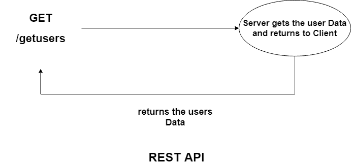
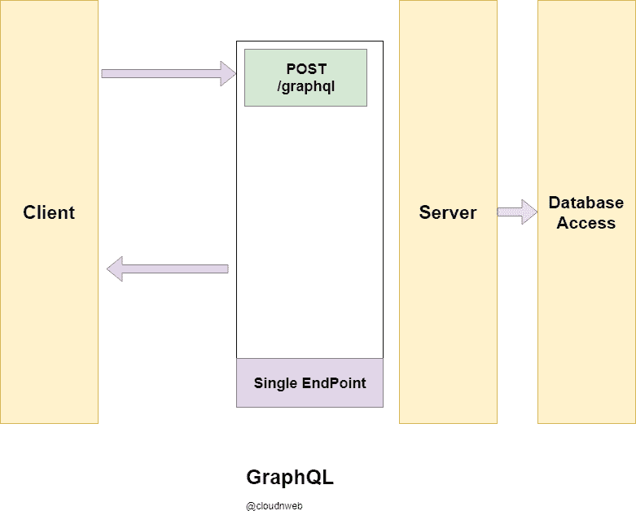
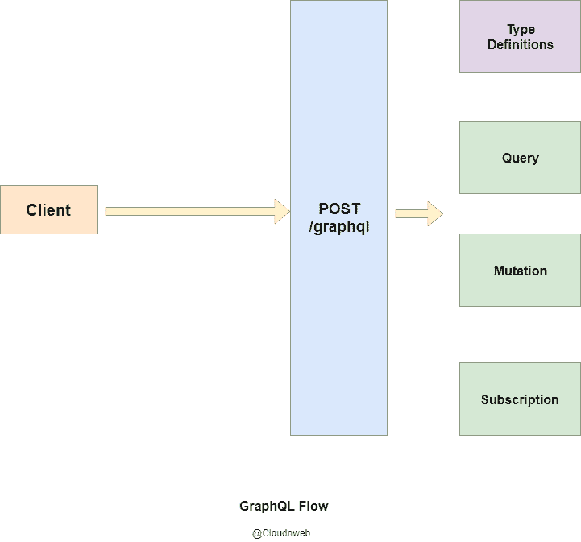
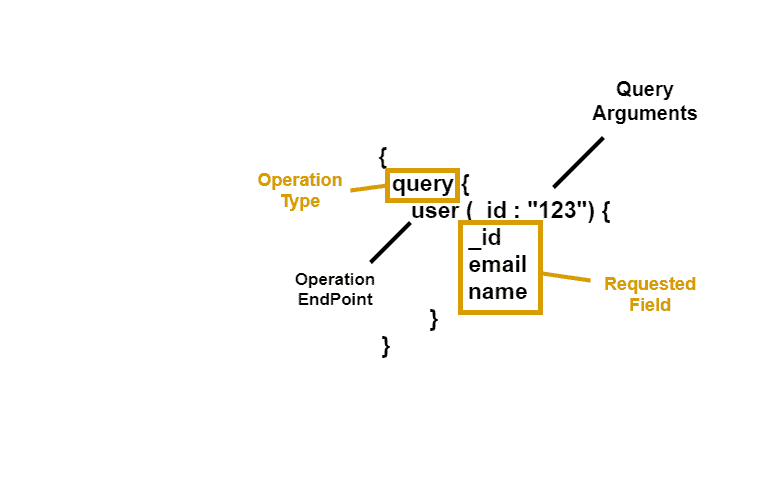
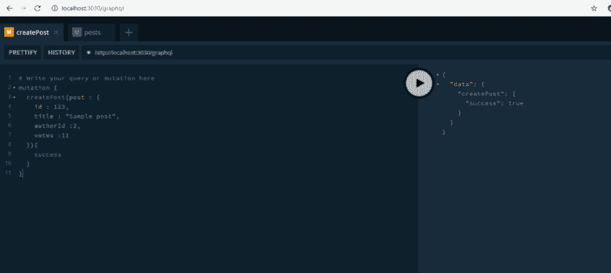
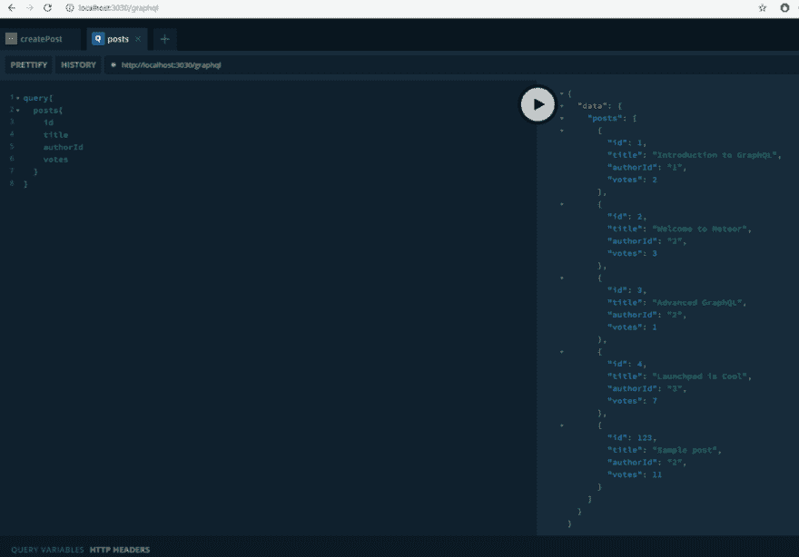

# 带有 Apollo Server 和 Express 的 graph QL-graph QL 系列-第 1 部分

> 原文：<https://dev.to/ganeshmani/graphql-with-apollo-server-and-express-graphql-series-part-1-40jp>

在这一系列文章中，我们将看到如何用 Apollo Server 和 Express 实现 graph QL——graph QL 系列——第 1 部分

在进入 graphql 的话题之前，让我问你几个关于 web 如何工作的问题？

*   浏览器中的网页(客户端)和服务器如何通信？
*   什么是客户端和服务器之间的无状态和有状态通信？
*   什么是 HTTP/1.1？为什么会存在？

你可以问我，我为什么要先知道这些。在你每次学习新东西之前，这是一个很好的问题。

如果你能回答这些问题，你就能理解为什么我们需要像 GraphQL 这样的东西。

让我给你一些场景，让它变得简单一些。首先，我们都知道我们使用 **REST** **API** 进行网页(客户端)和服务器(服务器)通信。

REST API 只不过是一个 API 端点，当我们到达一个特定的路径时，它会给出数据。

[](https://res.cloudinary.com/practicaldev/image/fetch/s--RLKdHfmE--/c_limit%2Cf_auto%2Cfl_progressive%2Cq_auto%2Cw_880/https://cloudnweb.dev/wp-content/uploads/2019/06/Untitled-Diagram-1.png)

现在，你可以问我，它像我们预期的那样工作得很好，那么它有什么问题。假设您只需要从包含成百上千数据的特定 API 的结果中获取电子邮件地址。

很难在 web 浏览器中循环数据并只显示电子邮件地址。它会影响应用程序的性能。

这就是 GraphQL 的用武之地

### GraphQL 是什么？

GraphQL 是 REST API 的替代品。与 REST API 不同，GraphQL 只获取应用程序客户端所需的内容。

GraphQL 不是从服务器返回所有数据，而是只返回客户机寻找的数据。

假设您需要 users 表中的电子邮件和密码。GraphQL 查询只能从服务器获取这些细节。

GraphQL 在数据处理方面提供了很大的灵活性，解决了在客户端加载大量不必要数据的问题。

### GraphQL works 如何工作？

[](https://res.cloudinary.com/practicaldev/image/fetch/s--nPRPLcHS--/c_limit%2Cf_auto%2Cfl_progressive%2Cq_auto%2Cw_880/https://cloudnweb.dev/wp-content/uploads/2019/06/GraphQL.png)

最重要的是，GraphQL 只有一个端点，它将请求作为查询发送，并从服务器获得响应。

*   客户端通过查询点击 **/graphql** 端点。
*   graphql 将请求正文中的请求细节发送给服务器。
*   服务器用数据响应请求。

### GraphQL 构建模块

主要有两种方法可以将数据从服务器传送到客户端。

*   **查询**——类似于 REST API 中的**获取**请求。通过**查询**，我们可以从服务器获取数据。
*   **突变**-graph QL 中的突变用于更新服务器中的数据。它类似于服务器中的 **POST** 请求。
*   **订阅**——用于使用 [web sockets](https://cloudnweb.dev/2019/06/what-are-web-sockets-implementing-web-sockets-in-node-js/) 处理客户端和服务器之间的实时通信。
*   **类型定义**——类型定义就是定义特定查询的请求和响应格式

[](https://res.cloudinary.com/practicaldev/image/fetch/s--VixFy3Br--/c_limit%2Cf_auto%2Cfl_progressive%2Cq_auto%2Cw_880/https://cloudnweb.dev/wp-content/uploads/2019/06/graphQL_big_picture.png)

### GraphQL 查询结构

[](https://res.cloudinary.com/practicaldev/image/fetch/s--4Kv1iPp2--/c_limit%2Cf_auto%2Cfl_progressive%2Cq_auto%2Cw_880/https://cloudnweb.dev/wp-content/uploads/2019/06/graphQL_Structure.png)

*   **操作类型** -我们需要定义我们需要执行哪种操作。例如，为了获取数据，我们需要将其定义为一个**查询**
*   **操作端点** -它定义了您将要执行的操作，无论是查询还是变异
*   **查询参数**——它有点像查询参数。
*   **请求字段**——它定义了我们需要从服务器获取的数据

### 实现 GraphQL

我假设你熟悉 Node.js 和 [Express](https://expressjs.com/en/starter/installing.html) 框架。

创建一个文件夹并安装以下依赖项

```
$ mkdir graphql-demo
$ cd graphql-demo
$ npm init --yes
$ npm install express body-parser graphql apollo-server-express
```

主要是， **graphql** 库是运行 graphql 的核心库包。 **apollo-server-express** 用于连接 graphql 和 express 服务器

创建一个名为 **index.js** 的文件，并添加以下代码。

```
import express from 'express'
import bodyParser  from 'body-parser';
import { ApolloServer } from 'apollo-server-express';
import typeDefs from './typedef';
import resolvers from './resolver';
const app = express();

app.use(bodyParser.json());

const server = new ApolloServer({
    introspection : true,
    typeDefs,
    resolvers,
    formatError: error => {
        return error
    },
    context : ({req,res}) => {
        return {
            req,res
        }
    }
})

server.applyMiddleware({app,path : '/graphql'})

app.listen(3030,() => {
    console.log("app is listening to port 3030");
})
```

有两种方法可以配置 graphql 服务器。一个是 **Apollo 服务器**，另一个是 **express graphql** 。

在本教程中，我们将使用 **apollo 服务器**来配置 graphql。

在 **index.js** 中有两点需要注意。他们是**类型定义**和**解析器**。

*   **typeDefs** - **类型定义**定义请求和响应的格式
*   **解析器** - **解析器**是一个处理请求并从服务器返回数据的函数。

创建一个名为 **typeDefs.js** 的文件，并添加以下代码。

```
import {gql} from 'apollo-server-express';

const typeDefs = gql`

type Author {
    id : Int!
    firstName : String
    lastName : String
    posts : [Post]
}

type Post {
    id : Int!
    title : String
    authorId : ID!
    votes :Int
}

input PostData {
    id : Int!
    title : String
    authorId : ID!
    votes :Int
}

type Response {
    success: Boolean
}

type Query {

    posts : [Post]
    author(id : Int!): Author
}

type Mutation {
    createPost(post : PostData) : Response
}
`
export default typeDefs;
```

你需要在类型定义中定义**查询**和**变异**。前面说过，**查询**和**突变**类似于**获取**和**发布**。

*   **帖子**查询得到所有的帖子数据。
*   **Author** 查询获取特定作者 id 的所有数据
*   **Create Post** 变异从请求中获取 Post 数据，并在数据库中更新它

在 **resolver.js** 中创建一个名为的文件，并添加以下代码。

```
import { find, filter } from 'lodash';

const authors = [
    { id: 1, firstName: 'Tom', lastName: 'Coleman' },
    { id: 2, firstName: 'Sashko', lastName: 'Stubailo' },
    { id: 3, firstName: 'Mikhail', lastName: 'Novikov' },
  ];

  const posts = [
    { id: 1, authorId: 1, title: 'Introduction to GraphQL', votes: 2 },
    { id: 2, authorId: 2, title: 'Welcome to Meteor', votes: 3 },
    { id: 3, authorId: 2, title: 'Advanced GraphQL', votes: 1 },
    { id: 4, authorId: 3, title: 'Launchpad is Cool', votes: 7 },
  ];

export default {

    Query : {
        posts : () => posts,
        author : (_,{ id }) => find(authors,{ id })
    },

    Mutation : {
        createPost: (_,newPost) => {
            // console.log("new post",newPost.post.id);    
            posts.push(newPost.post);
            // console.log("posts",posts);
            let result = {
                success : true
            }
           return result;
        }
    }
}
```

这里我们使用模拟数据，而不是连接数据库。

解析器函数从服务器获取数据，并将其作为响应返回。您需要在解析器中编写所有的业务逻辑

完整源代码:[https://codesandbox.io/s/graphql-demo-hic8p](https://codesandbox.io/s/graphql-demo-hic8p)

综上所述，运行命令 **npm run start** ，在浏览器中访问网址**http://localhost:3030/graph QL**。你可以看到这样的东西。

[](https://res.cloudinary.com/practicaldev/image/fetch/s--s8Ll1dZA--/c_limit%2Cf_auto%2Cfl_progressive%2Cq_auto%2Cw_880/https://cloudnweb.dev/wp-content/uploads/2019/06/demo_page_1-1024x459.png)

[](https://res.cloudinary.com/practicaldev/image/fetch/s--bagM35aF--/c_limit%2Cf_auto%2Cfl_progressive%2Cq_auto%2Cw_880/https://cloudnweb.dev/wp-content/uploads/2019/06/demo_page_2-1024x714.png)

这是运行简单 graphql 服务器的最少代码。

在即将发布的文章中，GraphQL 与 Apollo Server 和 Express - GraphQL 系列。我们将看到如何使用 React、Express 和 GraphQL 构建完整的 web 应用程序。

在此之前，**快乐编码** :-)