# 初学者的贪婪算法

> 原文：<https://dev.to/brandonskerritt/greedy-algorithms-for-beginners-4pho>

贪婪算法的目标是在给定的时刻做出最佳选择。每一步它都选择最优的选择，而不知道未来。它试图用这种方法找到解决整个问题的全局最优方法。

## 贪婪算法为什么叫贪婪？

当算法利用贪婪特性时，它们被称为贪婪算法。贪婪的属性是:

> 在那个时刻，最佳选择是什么？

贪婪的算法是贪婪的。他们不会展望未来来决定全局最优解。他们只关心局部最优解。这意味着整体最优解可能不同于算法选择的解。

他们从不回头看他们做了什么，看看他们是否可以全局优化。这就是贪心和[动态编程](https://skerritt.blog/dynamic-programming/)的主要区别。

* * *

## 贪婪算法是用来干什么的？

贪婪算法非常快。比其他两种方法(分而治之和动态编程)快得多。它们被使用是因为它们速度快。

大多数使用贪婪算法的流行算法都表明贪婪算法每次都能给出全局最优解。其中包括:

*   [迪杰斯特拉算法](https://www.cs.cmu.edu/~deva/papers/tracking2011.pdf)
*   [克鲁斯卡尔算法](https://en.wikipedia.org/wiki/Kruskal%27s_algorithm)
*   [普里姆的算法](https://en.wikipedia.org/wiki/Prim%27s_algorithm)
*   [霍夫曼树](https://en.wikipedia.org/wiki/Huffman_tree)

我们将使用一个著名的例子——计数变化来探索贪婪算法。这个范例并没有太多内容。

* * *

## 如何创建贪婪算法？

您的算法需要遵循以下属性:

> 在那个时刻，最佳选择是什么？

仅此而已。这没什么大不了的。贪婪算法一般比[除法&征服](https://dev.to/brandonskerritt/a-gentle-introduction-to-divide-and-conquer-algorithms-1ga)或者[动态编程](https://skerritt.blog/dynamic-programming/)更容易编码。

* * *

# 清点零钱使用贪心

想象你是一台自动售货机。有人给你 1 英镑，花 0.70 便士买了一杯饮料。在[英镑](https://en.wikipedia.org/wiki/Pound_sterling)中没有 30 便士的硬币，你如何计算要归还多少零钱？

作为参考，这是英国每枚硬币的面值:

```
1p, 2p, 5p, 10p, 20p, 50p, £1 
```

贪婪算法从最高面额开始，反向工作。我们的算法从 1 开始。1 是 30p 以上，所以不能用。它做这个只需 50 便士。它达到 20 便士。20p < 30p，所以需要 1 20p。

该算法需要返回 10p 的变化。它再次尝试 20p，但是 20p > 10p。然后涨到 10 便士。它选择 1 10p，现在我们的收益是 0，我们停止算法。

我们返回 1x20p 和 1x10p。

这种算法在现实生活中非常有效。让我们再举一个例子，这一次我们有了机器中硬币数量旁边的面额，`(denomination, how many)`。

```
(1p, 10), (2p, 3), (5p, 1), (10p, 0), (20p, 1p), (50p, 19p), (100p, 16) 
```

要求算法再次返回 30p 的变化。100 便士(1 英镑)不算，50 便士也一样。20 便士，我们可以做到。我们选 1x 20p。我们现在需要返回 10 便士。20p 用完了，所以我们向下移动 1。

10p 用完了，所以我们下移 1。

我们有 5p，所以选择 1x5p。我们现在需要返回 5p。5p 用完了，所以我们下移一位。

我们选择 1 2p 硬币。我们现在需要返回 3p。我们选择另一个 2p 硬币。我们现在需要返回 1p。我们下移一位。

我们选择 1x 1p 硬币。

总之，我们的算法选择了这些硬币作为零钱返回:

```
# (value, how many we return as change) (10, 1)
(5, 1)
(2, 2)
(1, 1) 
```

让我们编码一些东西。首先，我们需要定义问题。我们从面额开始。

```
denominations = [1, 2, 5, 10, 20, 50, 100]
# 100p is £1 
```

现在来看核心函数。给定面值和找零金额，我们要返回硬币被返回的次数列表。

如果我们的`denominations`列表如上，那么`[6, 3, 0, 0, 0, 0, 0]`代表取 6 个 1p 币和 3 个 2p 币，但取其他所有币的 0。

```
denominations = [1, 2, 5, 10, 20, 50, 100]
# 100p is £1 
def returnChange(change, denominations):
    toGiveBack = [0] * len(denominations)
    for pos, coin in reversed(list(enumerate(denominations))): 
```

我们创建了一个清单，面值的长度，并用 0 填充。

我们想从最大到最小循环。反转 x，让我们向后循环。枚举意味着“遍历这个列表，但在另一个变量中保持位置”。在我们的例子中，当我们开始循环时。`coin = 100`和`pos = 6`。

我们的下一步是反复选择一枚硬币，只要我们能使用它。如果我们需要给`change = 40`我们希望我们的算法选择 20，然后再次选择 20，直到它不能再使用 20。我们使用 for 循环来实现这一点。

```
denominations = [1, 2, 5, 10, 20, 50, 100]
# 100p is £1 
def returnChange(change, denominations):
    # makes a list size of length denominations filled with 0
    toGiveBack = [0] * len(denominations)

    # goes backwards through denominations list
    # and also keeps track of the counter, pos.
    for pos, coin in enumerate(reversed(denominations)):
        # while we can still use coin, use it until we can't
        while coin <= change: 
```

当硬币仍能适应变化时，将硬币添加到我们的返回列表中，并将其从变化中移除。

```
denominations = [1, 2, 5, 10, 20, 50, 100]
# 100p is £1 
def returnChange(change, denominations):
    # makes a list size of length denominations filled with 0
    toGiveBack = [0] * len(denominations)

    # goes backwards through denominations list
    # and also keeps track of the counter, pos.
    for pos, coin in enumerate(reversed(denominations)):
        # while we can still use coin, use it until we can't
        while coin <= change:
            change = change - coin
            toGiveBack[pos] += 1
    return(toGiveBack)

print(returnChange(30, denominations))
# returns [0, 0, 0, 1, 1, 0, 0]
# 1x 10p, 1x 20p 
```

这个算法的[运行时间](https://skerritt.blog/you-need-to-understand-big-o-notation-now/)由 2 个循环支配，因此它是 O(n <sup>2)。</sup>

* * *

## 是贪优？贪心总管用吗？

它是局部最优的，但有时它不是全局最优的。在改变给定算法中，我们可以强制一个点，在这个点上它不是全局最优的。

这样做的算法是:

*   挑选 3 种面值的硬币。1p，x，小于 2x 但大于 x。

我们会选 1，15，25。

*   要求兑换 2 *秒面额(15)

我们将要求 30 英镑的零钱。现在，让我们看看我们的贪婪算法做什么。

```
[5, 0, 1] 
```

它选择 1x 25p 和 5x 1p。最优解是 2x 15p。

我们的贪婪算法失败了，因为它没有看 15p。它看着 25 便士，心想“是的，很合适。我们拿着吧。”

然后它看了看 15p，心想“那不合适，我们继续吧”。

这是贪婪算法失败的一个例子。

要解决这个问题，你要么在这种方法不起作用的地方创造货币，要么强行解决。或者使用动态编程。

贪婪算法有时是全局最优的。从前面，我们看到这些算法是全局最优的:

*   [迪杰斯特拉算法](https://www.cs.cmu.edu/~deva/papers/tracking2011.pdf)
*   [克鲁斯卡尔算法](https://en.wikipedia.org/wiki/Kruskal%27s_algorithm)
*   [普里姆的算法](https://en.wikipedia.org/wiki/Prim%27s_algorithm)
*   [霍夫曼树](https://en.wikipedia.org/wiki/Huffman_tree)

还有其他全局最优解，但是 Greedy 比这些解更快更容易编程。

* * *

# 迪杰斯特拉算法

Dijkstra 的算法寻找从一个节点到图中所有其他节点的最短路径。在我们的例子中，我们将使用一个[加权有向图](https://skerritt.blog/graph-theory/)。每条边都有方向，每条边都有权重。

Dijkstra 的算法有很多用途。在您需要找到到达某个地方的最快路线的道路网络中，它非常有用。该算法还用于:

*   [IP 路由](https://ieeexplore.ieee.org/document/5381955)
*   [A*算法](https://dev.to/brandonskerritt/a-primer-on-search-algorithms-1768-temp-slug-3978406)
*   [电话网络](https://www.sciencedirect.com/science/article/pii/S0020019006003498)

该算法遵循以下规则:

1.  每次我们要访问一个新的节点，都会选择已知距离最小的节点。
2.  一旦我们移动到该节点，我们检查它的每个相邻节点。我们通过对通向新节点的边的成本求和来计算从相邻节点到根节点的距离。
3.  如果到节点的距离小于已知距离，我们将更新最短距离。

[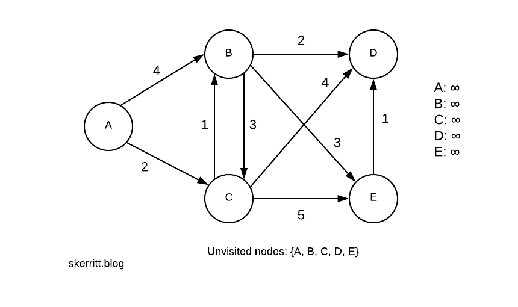](https://res.cloudinary.com/practicaldev/image/fetch/s--pjCdyD5o--/c_limit%2Cf_auto%2Cfl_progressive%2Cq_auto%2Cw_880/https://skerritt.blog/conteimg/2019/06/Blank-Diagram-33-.png)

我们的第一步是选择起始节点。让我们选择 a。所有的距离都从无穷大开始，因为我们不知道它们的距离，直到我们到达一个知道距离的节点。

[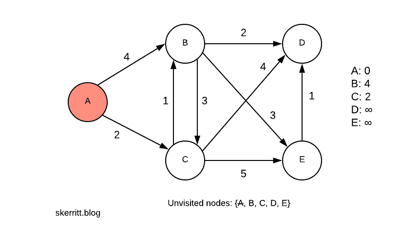](https://res.cloudinary.com/practicaldev/image/fetch/s--oXhOoYh_--/c_limit%2Cf_auto%2Cfl_progressive%2Cq_auto%2Cw_880/https://skerritt.blog/conteimg/2019/06/Blank-Diagram-35-.png)

我们在未访问节点列表中标记了一个。从 A 到 A 的距离是 0。从 A 到 B 的距离是 4。从 A 到 C 的距离是 2。我们更新了右侧的距离列表。

然后，我们选择没有选择顶点的最小的边。最小的边是 A -> C，我们还没选 C。我们拜访 c。

请注意，我们是如何选择从当前节点到尚未访问的节点的最小距离的。我们太贪婪了。在这种情况下，贪婪方法是全局最优解。

[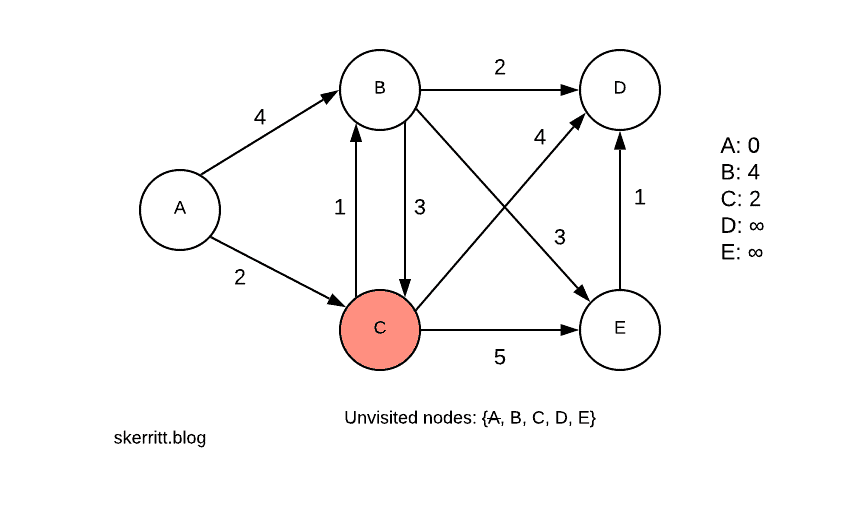](https://res.cloudinary.com/practicaldev/image/fetch/s--4aWBozH6--/c_limit%2Cf_auto%2Cfl_progressive%2Cq_auto%2Cw_880/https://skerritt.blog/conteimg/2019/06/Blank-Diagram-36-.png)

我们可以从 c 到 B。我们现在需要选择一个最小值。min(4，2 + 1) = 3。

[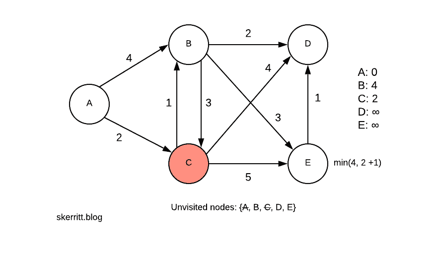](https://res.cloudinary.com/practicaldev/image/fetch/s--F69uLCim--/c_limit%2Cf_auto%2Cfl_progressive%2Cq_auto%2Cw_880/https://skerritt.blog/conteimg/2019/06/Blank-Diagram-37-.png)

由于 A -> C -> B 小于 A -> B，我们用这个信息更新 B。然后，我们加上我们现在可以到达的其他节点的距离。

[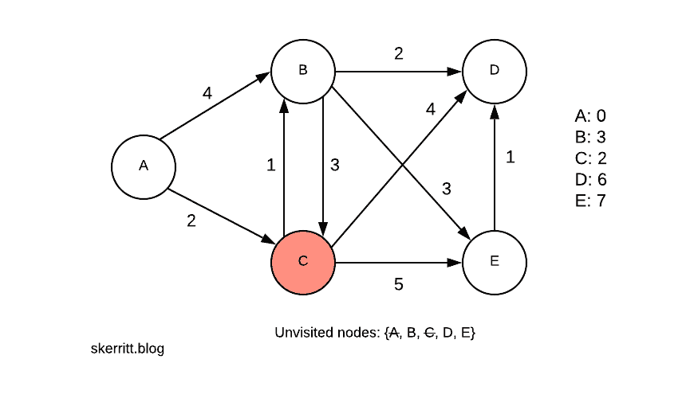](https://res.cloudinary.com/practicaldev/image/fetch/s--Q5phll_---/c_limit%2Cf_auto%2Cfl_progressive%2Cq_auto%2Cw_880/https://skerritt.blog/conteimg/2019/06/Blank-Diagram-40-.png)

我们的下一个最小的顶点是 B，它有一个我们还没有访问过的节点，是 3。我们拜访 b。

[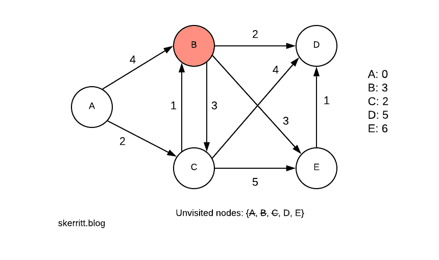](https://res.cloudinary.com/practicaldev/image/fetch/s--T1THiw3E--/c_limit%2Cf_auto%2Cfl_progressive%2Cq_auto%2Cw_880/https://skerritt.blog/conteimg/2019/06/Blank-Diagram-41-.png)

我们对 b 做同样的事情。然后我们选择我们还没有访问过的最小的顶点，d。

[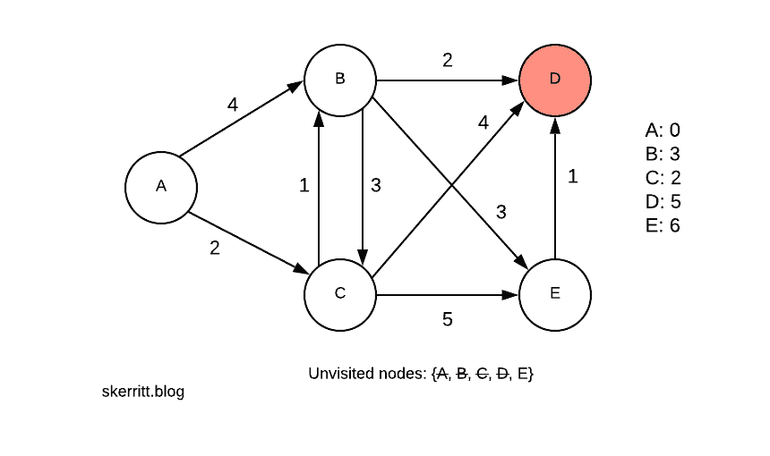](https://res.cloudinary.com/practicaldev/image/fetch/s--JbHSvQ1B--/c_limit%2Cf_auto%2Cfl_progressive%2Cq_auto%2Cw_880/https://skerritt.blog/conteimg/2019/06/Blank-Diagram-42-.png)

这次我们不更新任何距离。最后一个节点是 e。

[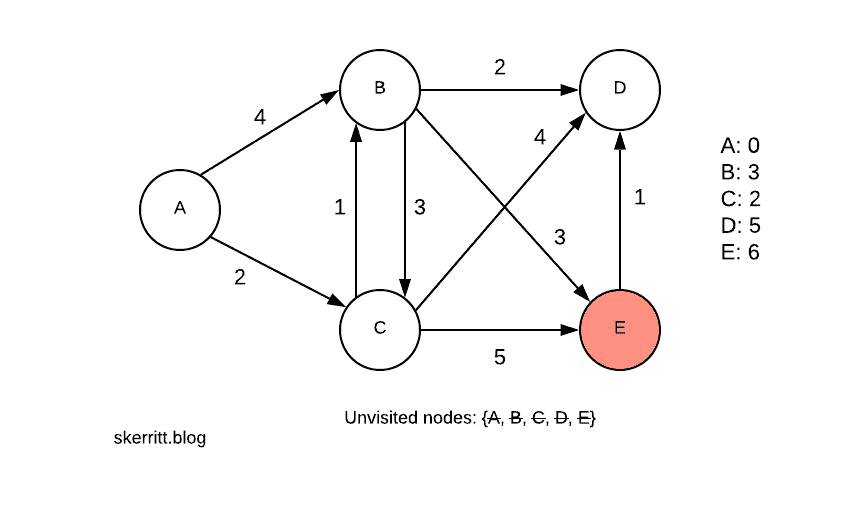](https://res.cloudinary.com/practicaldev/image/fetch/s---sid7lGU--/c_limit%2Cf_auto%2Cfl_progressive%2Cq_auto%2Cw_880/https://skerritt.blog/conteimg/2019/06/Blank-Diagram-43-.png)

又没有更新了。为了找到从 A 到其他节点的最短路径，我们回溯我们的图。

我们首先选择 A，然后 C，然后 b。如果你需要创建一个从 A 到所有其他节点的最短路径，你可以使用右边的表格来运行这个算法。

[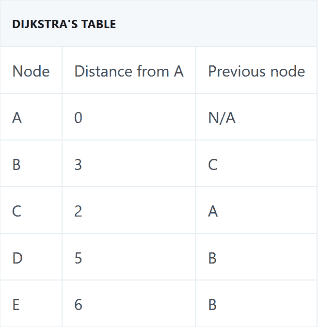](https://res.cloudinary.com/practicaldev/image/fetch/s--SIprxT36--/c_limit%2Cf_auto%2Cfl_progressive%2Cq_auto%2Cw_880/https://skerritt.blog/conteimg/2019/06/Screenshot_2019-06-23-Greedy-Algorithms.png)

使用此表很容易画出图中从 A 到所有其他节点的最短距离:

[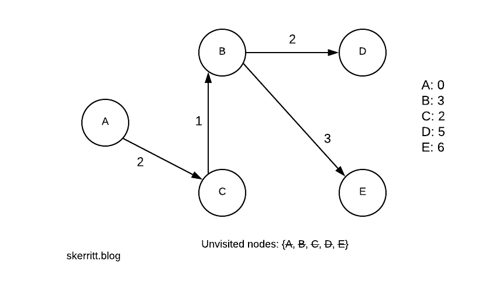](https://res.cloudinary.com/practicaldev/image/fetch/s--f4LQulX6--/c_limit%2Cf_auto%2Cfl_progressive%2Cq_auto%2Cw_880/https://skerritt.blog/conteimg/2019/06/Blank-Diagram-44-.png)

* * *

## 利用贪婪算法求解分数背包问题

想象你是一个小偷。你闯进了朱迪·霍利德的家——1951 年奥斯卡最佳女演员奖得主。朱迪是一个宝石贮藏者。朱迪的房子镶满了宝石。

你带了一个包——一个背包，如果你愿意的话。这个包的重量是 7 磅。你碰巧有一份保险单据上 Judy 所有物品的清单。这些项目读作:

！

解决分数背包问题的第一步是计算每件物品的价值/重量。

[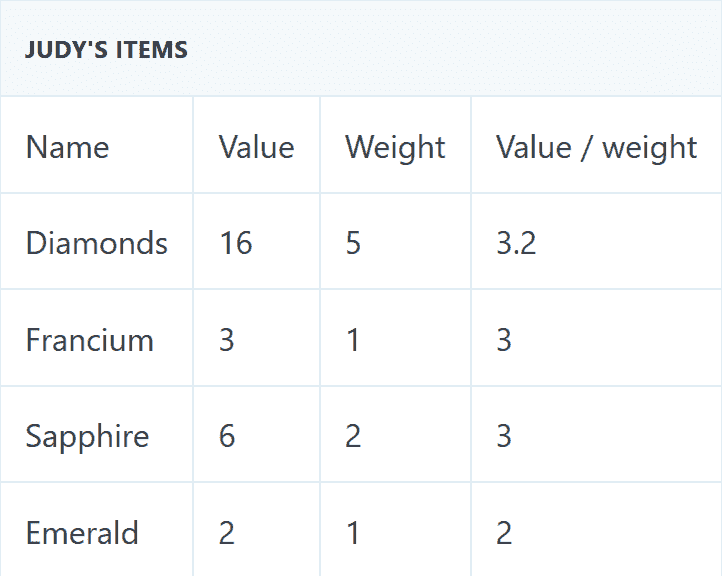](https://res.cloudinary.com/practicaldev/image/fetch/s--2GqnZ95v--/c_limit%2Cf_auto%2Cfl_progressive%2Cq_auto%2Cw_880/https://skerritt.blog/conteimg/2019/06/Screenshot_2019-06-23-Greedy-Algorithms-2-.png)

现在我们贪婪地选择最大的。为此，我们可以按照价值/重量}降序对它们进行排序。幸运的是，它们已经被分类了。最大的是 3.2。

```
knapsack value = 16
knapsack total weight = 5 (out of 7) 
```

然后我们选择钫(我知道这不是宝石，但朱迪有点奇怪😉)

```
knapsack value = 19
knapsack weight = 6 
```

现在，我们加入蓝宝石。但是如果我们加上蓝宝石，我们的总重量将达到 8。

在分数背包问题中，我们可以把物品切割成它们的分数。我们的袋子里还有 1 磅的重量。我们的蓝宝石重 2。我们计算的比率为:

背包重量/物品重量

然后用这个比率乘以物品的价值，就可以得出我们能拿走多少物品的价值。

1/2 * 6 = 3

```
knapsack value = 21
knapsack weight = 7 
```

贪婪算法可以优化求解分式背包问题，但不能优化求解{0，1}背包问题。在这个问题中，你可以选择{1}或{0}不拿，而不是拿一件物品的一小部分。要解决这个，你需要使用[动态编程](https://skerritt.blog/dynamic-programming/)。

这个算法的[运行时间](https://skerritt.blog/you-need-to-understand-big-o-notation-now/)是 O(n log n)。计算值/重量为 O(1)。我们的主要步骤是从最大值/权重开始排序，这需要 O(n log n)时间。

* * *

## 贪婪 vs 除法&征服 vs 动态规划

[](https://res.cloudinary.com/practicaldev/image/fetch/s--QOijg1AO--/c_limit%2Cf_auto%2Cfl_progressive%2Cq_auto%2Cw_880/https://skerritt.blog/conteimg/2019/06/image-10.png)

* * *

## 结论

贪婪算法非常快，但可能无法提供最优解。它们也比同类产品更容易编码。

[](https://pages.convertkit.com/90901878aa/2e1e72f089#becomebetterdev)