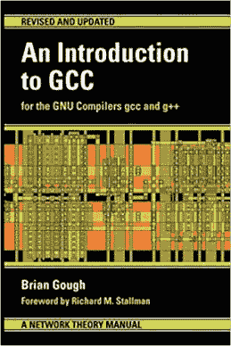
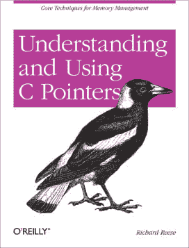
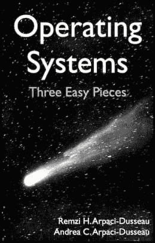
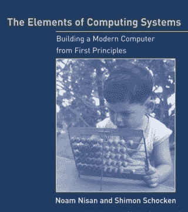
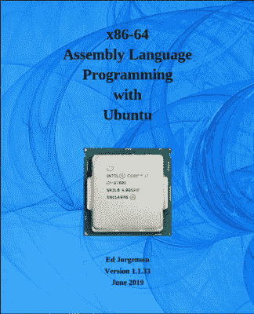
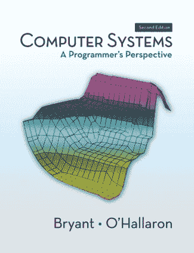
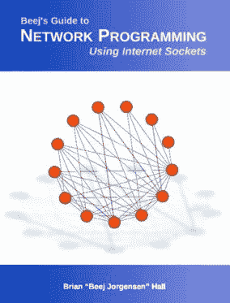
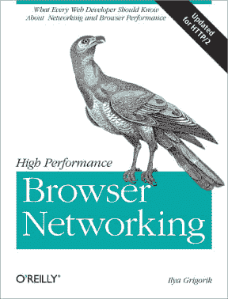

# 严肃的自学程序员参考书目

> 原文：<https://dev.to/emilledigital/guided-bibliography-for-the-serious-self-taught-programmer-34lp>

在本文中，我试图为自学现代计算机系统编程提供一个有见地的指导。

我希望你喜欢它！

## 从学习如何用 C 语言编程开始

c 是一个优秀的学习工具。这是做低级事情的高级方式。熟悉静态类型语言并牢固掌握指针和运行时系统必然会在您的头脑中提出正确的问题，并为您准备更仔细地研究操作系统奠定基础。

要学习 C，首先要了解 GCC——C 和 C++的标准编译器。读这本书。从头到尾读一遍。

它对编译器基础知识进行了漂亮而简洁的介绍。

对 GCC 的介绍不需要任何编程经验。

接下来，开始编写使用指针的 C 程序。在我看来，这是真正开始学习 C 语言的唯一方法——其他任何东西都只是语法。

完成那本书。我会等的。一旦你回来，是时候阅读操作系统了。

## 学习操作系统概念

操作系统是代码的集合，它们一起为计算机系统的用户提供直观的计算环境。

操作系统提供了抽象和这些抽象的接口，因此与计算机交互变得很容易。操作系统提供的最重要的工具之一是进程。

进程可以被看作是允许操作系统的用户控制正在执行的程序的数据结构和相关操作。

查看这本关于操作系统的书，了解更多信息。

请记住，您可能无法立即掌握并发性和事件循环等主题。这本书在大约 30 页长的简洁易懂的章节中清晰地解释了重要的事情，如调度程序、持久性和内存管理。

此外，操作系统每章末尾的参考书目:三个简单的部分为软件工程师和计算机科学家提供了令人难以置信的参考书目。

## 了解计算机是如何工作的

到目前为止，您已经编写了一些简单的程序，使用了一些基本的 C 数据结构，现在您知道您的操作系统有多重要了。您可能想更深入地了解您的计算机是如何工作的，不受操作系统或特定编程语言的影响。

这本书是一个很好的起点

这本书还附带了一个 Coursera 课程，以及一个充满活力的学习者社区，他们仍然受益于这本书所提供的内容。

为了保持你对硬件的热爱，用这本书学习汇编，并开始编程寄存器。

一旦你看到机器如何处理变量赋值和循环之类的事情，你对高级语言的理解肯定会有所提高。

计算中有些概念只能用汇编语言来很好地说明。

仅仅因为这个原因，就值得使用一些程序集。

让我们休息一下，回顾一下。

*   你从 C 开始
*   转到操作系统概念
*   计算机硬件入门
*   探索程序集

接下来，是这本书

阅读完本文后，您应该对程序如何与指令集架构、位、字节、内存和其他硬件内部结构相关联有了一套严谨的视觉隐喻。

## 了解网络和浏览器

我选择以网络编程作为本指南的结尾，因为网络应用程序是您可以构建的最有用的东西之一。事实上，在这一点上，你可能已经准备好向其他方向发展了，但是我仍然认为这些资源是值得的。

首先，看看

这是对套接字编程的简明介绍。最后，你就有了一个有用的小网络程序，并对大多数网络应用程序所基于的操作系统设施有了一个坚实的理解。

最后但同样重要的是

高性能浏览器网络从仔细解释 TCP 要素开始，逐步发展到全面了解 HTTP 和浏览器 API。这是一本关于现代网络及其底层技术的非常有趣且内容丰富的书。

## 结论

在我看来，如果你想改变职业，这是自学编程的正确方法。这些科目，按照规定的顺序，应该为你的下一步学习和行动提供坚实的完成感、方向甚至灵感。

我希望你喜欢我为严肃的自学程序员准备的参考书目。

* * *

如果你喜欢这篇文章，并且喜欢从头开始学习技术，你可能想看看我的博客了解更多的[开发者指南](https://egxdigital.wordpress.com)。我目前涵盖了 C，C++和其他基础教程。你可以期待在不久的将来看到 JavaScript 指南和 Python 指南，所以一定要订阅并在 DEV 上关注我。