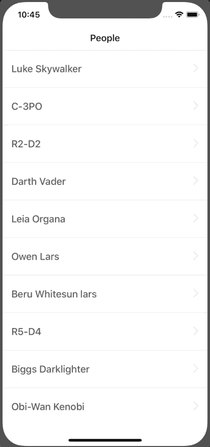
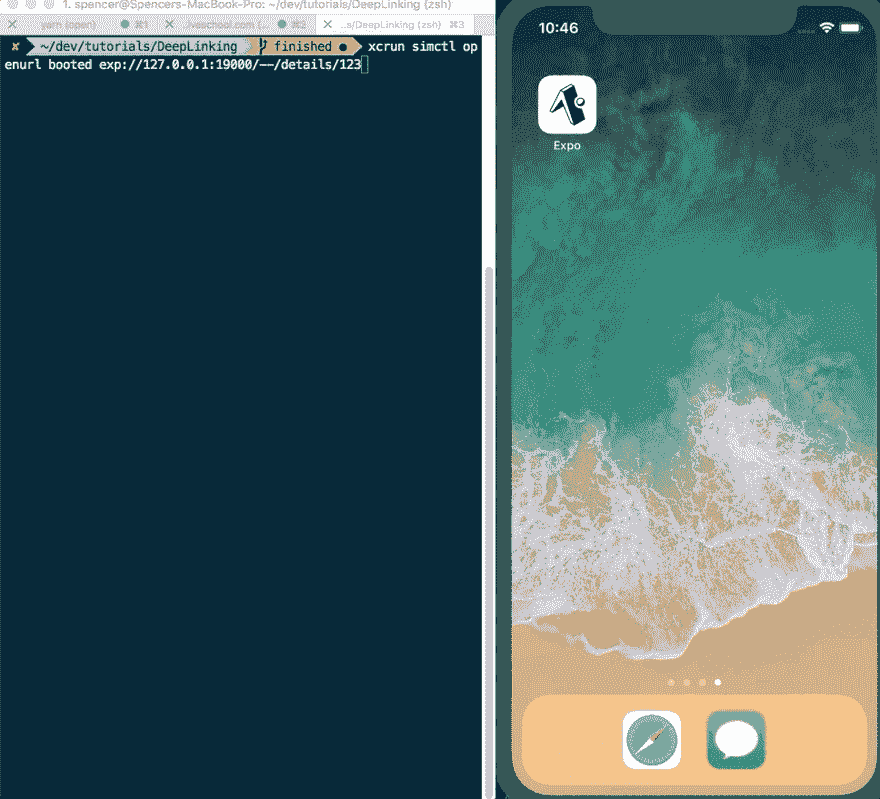
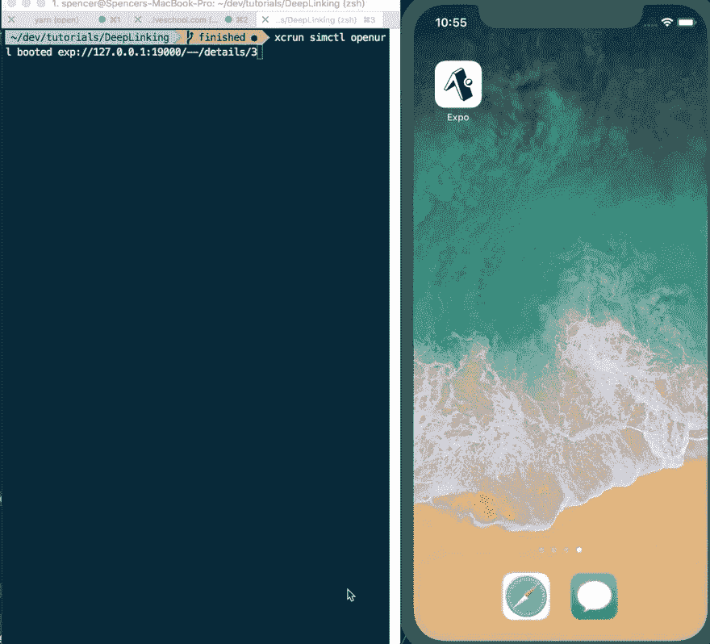

# 使用 React 导航处理深层链接

> 原文：<https://dev.to/spencercarli/handling-deep-links-with-react-navigation-nk0>

> 这一课最初发表在 React 本地学校。如果您有兴趣访问 110+ React 本地文章，请务必访问！

一旦你在你的应用中配置了深度链接，你可以在这里学习如何做( [Expo](https://reactnavigation.org/docs/en/deep-linking.html#set-up-with-expo-projects) ， [React Native CLI](https://reactnavigation.org/docs/en/deep-linking.html#set-up-with-react-native-init-projects) )，应用打开后会发生什么？

在这一课中，我们将配置一个应用程序，根据深度链接 url 自动导航到正确的屏幕。

我们开始使用的应用程序从星球大战 API 中抓取人员列表，并在详细信息屏幕上显示他们的详细信息。

[](https://res.cloudinary.com/practicaldev/image/fetch/s--mdYlePHO--/c_limit%2Cf_auto%2Cfl_progressive%2Cq_66%2Cw_880/https://thepracticaldev.s3.amazonaws.com/i/fj394u0wnqosvv0m6w46.gif)

[你可以在 Github](https://github.com/ReactNativeSchool/react-navigation-deep-linking) 上克隆这个 starter 项目。

我们希望设置我们的应用程序，以便它会自动打开一个详细的屏幕，并获得相关数据。

为此，我们需要做几件事

1.  在应用程序中启用深度链接(完成)
2.  在 React 导航中配置深度链接
3.  从我们的深层链接中传递的数据中请求个人信息

## 在 React 导航中配置深度链接

首先，我们需要为树中的每个导航器定义一个`path`。我的意思是，既然我们想要建立到`Details`屏幕的深度链接，我们也需要为它的父导航列表`MainApp`建立一个路径。

App/index.js

```
// ...

const MainApp = createStackNavigator({
  List: {
    screen: List,
    navigationOptions: {
      headerTitle: 'People',
    },
    path: 'list',
  },
  Details: {
    screen: Details,
    navigationOptions: {
      headerTitle: 'Details',
    },
    path: 'details',
  },
});

const App = createSwitchNavigator({
  Initializing,
  MainApp: {
    screen: MainApp,
    path: '',
  },
});

// ... 
```

我们还需要能够将变量传递给`/details`。我们可以通过添加一个以`:`为前缀的参数来指定。

```
// ...

const MainApp = createStackNavigator({
  List: {
    screen: List,
    navigationOptions: {
      headerTitle: 'People',
    },
    path: 'list',
  },
  Details: {
    screen: Details,
    navigationOptions: {
      headerTitle: 'Details',
    },
    path: 'details/:personId',
  },
}); 
```

这将允许我们传递一个动态值，比如`/details/3`。

接下来，我们需要告诉 React Navigation 我们的`uriPrefix`是什么。这是您在 Xcode 或`AndroidManifest.xml`中配置的内容。

如果你使用 Expo，那么前缀在开发和发布的应用之间会有所不同。幸好。世博会使建立正确的`uriPrefix`变得容易。

```
import { Linking } from 'expo';

// ...

const AppContainer = createAppContainer(App);

export default () => {
  const prefix = Linking.makeUrl('/');
  console.log(prefix);

  // if not using expo then prefix would simply be `swapi://`

  return <AppContainer uriPrefix={prefix} />;
};

// ... 
```

我正在记录`prefix`以便我们知道在打开 url 时使用什么。

该应用程序现在应该配置为接受和处理深度链接。要测试它，请运行以下命令:

末端的

```
# iOS
xcrun simctl openurl booted exp://127.0.0.1:19000/--/details/3

# Android
adb shell am start -W -a android.intent.action.VIEW -d "exp://127.0.0.1:19004/--/details/3" com.deeplinking 
```

如果您没有使用 expo，或者它是一个实时应用程序，它看起来会像:

末端的

```
# iOS
xcrun simctl openurl booted swapi://details/3

# Android
adb shell am start -W -a android.intent.action.VIEW -d "swapi://details/3" com.deeplinking 
```

[](https://res.cloudinary.com/practicaldev/image/fetch/s--YNTM0rbE--/c_limit%2Cf_auto%2Cfl_progressive%2Cq_66%2Cw_880/https://thepracticaldev.s3.amazonaws.com/i/kn7beuw0v60gzcs5zk8o.gif)

## 从深度链接传递的数据中请求人员信息

显然我们还没有任何数据。要解决这个问题，我们需要获取人员 id 并发出请求。要访问`personId`,我们只需要像获取任何其他参数一样使用`this.props.navigation.getParam('personId')`。

首先，我们将检查是否通过了一个完整的`item`。如果一个完整的项目没有通过，那么我们将尝试获取`personId`并发出请求。

应用程序/屏幕/详细信息

```
// ...

class DetailsScreen extends React.Component {
  // ...

  componentDidMount() {
    const item = this.props.navigation.getParam('item', {});

    if (Object.keys(item).length === 0) {
      const personId = this.props.navigation.getParam('personId', 1);
      fetch(`https://swapi.co/api/people/${personId}`)
        .then(res => res.json())
        .then(res => {
          const data = [];

          Object.keys(res).forEach(key => {
            data.push({ key, value: `${res[key]}` });
          });

          this.setState({ data });
        });
    } else {
      const data = [];

      Object.keys(item).forEach(key => {
        data.push({ key, value: `${item[key]}` });
      });

      this.setState({ data });
    }
  }

  // ...
}

// ... 
```

[](https://res.cloudinary.com/practicaldev/image/fetch/s--6np8MTHm--/c_limit%2Cf_auto%2Cfl_progressive%2Cq_66%2Cw_880/https://thepracticaldev.s3.amazonaws.com/i/4xkizfw2ipji1f4tevk0.gif)

现在你知道了！这就是你在 React 原生应用中配置深层链接并与之交互的方式。

你可以在 Github 上找到[最终代码。](https://github.com/ReactNativeSchool/react-navigation-deep-linking/tree/finished)

有没有反应本国的问题？让我知道！