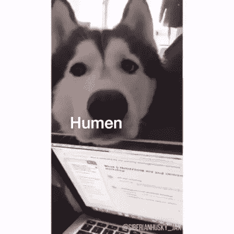

# 程序员节快乐！

> 原文：<https://dev.to/brendalimon/happy-programmer-s-day-3j85>

祝大家程序员节快乐！对你来说，做程序员最大的好处是什么？与社区分享！喝杯你最喜欢的饮料，和我们一起庆祝吧！

对我来说最好的部分是，我总是发现惊喜，我可以用我的代码做什么，我可以学到的所有令人敬畏的东西，是一个等待被发现的整个世界，我真的很享受这一点。

拥抱和沙哑的爱🐶
[T3】](https://res.cloudinary.com/practicaldev/image/fetch/s--Bo6uJI4W--/c_limit%2Cf_auto%2Cfl_progressive%2Cq_66%2Cw_880/https://thepracticaldev.s3.amazonaws.com/i/2ddzzcgunzlbw0gsoi1b.gif)