# 你好，黑暗，我的老朋友

> 原文：<https://dev.to/chromiumdev/hello-darkness-my-old-friend-3jcg>

#### 矫枉过正还是迫不得已？了解关于黑暗模式的一切，以及如何支持它以使你的用户受益！

(最初发表于[https://web.dev/prefers-color-scheme/](https://web.dev/prefers-color-scheme/)。)

### 简介

> 📚我对黑暗模式的历史和理论做了很多背景研究，如果你只对黑暗模式感兴趣，请随意跳过介绍。

### 黑暗模式前的黑暗模式

[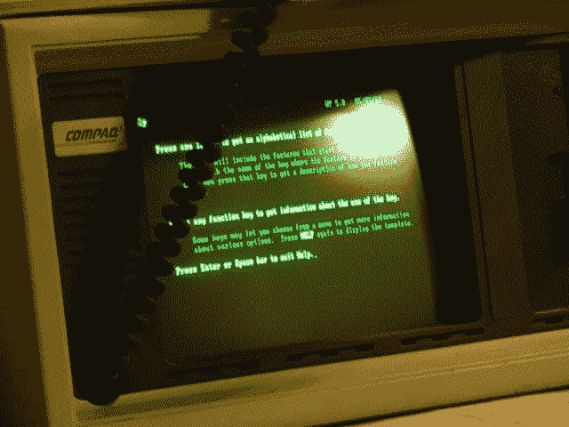](https://res.cloudinary.com/practicaldev/image/fetch/s--DMQ-0ujp--/c_limit%2Cf_auto%2Cfl_progressive%2Cq_auto%2Cw_880/https://cdn-images-1.medium.com/max/640/0%2AYZQl9JWZBeUzhdLF.jpg) 

<figcaption>绿屏([来源](https://commons.wikimedia.org/wiki/File:Compaq_Portable_and_Wordperfect.JPG) )</figcaption>

我们在黑暗模式下走了一圈。在个人计算的初期，黑暗模式不是一个选择的问题，而是一个事实:单色 CRT 电脑显示器通过在磷光屏幕上发射电子束来工作，早期 CRT 使用的磷光体是绿色的。因为文本以绿色显示，而屏幕的其余部分是黑色的，这些型号通常被称为[绿屏](https://commons.wikimedia.org/wiki/File:Schneider_CPC6128_with_green_monitor_GT65,_start_screen.jpg)。

[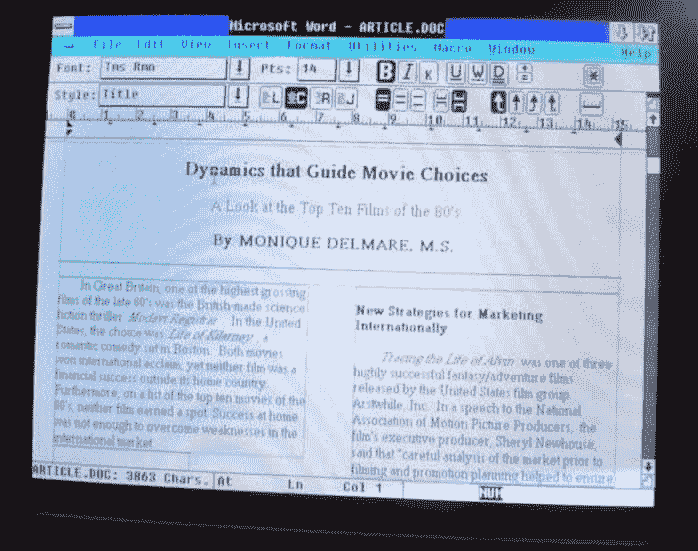](https://res.cloudinary.com/practicaldev/image/fetch/s--JynDJ8Z1--/c_limit%2Cf_auto%2Cfl_progressive%2Cq_auto%2Cw_880/https://cdn-images-1.medium.com/max/698/0%2AILIBhfzAmuuP6fAK.jpg) 

<figcaption>白底黑字([来源](https://www.youtube.com/watch?v=qKkABzt0Zqg) )</figcaption>

随后引入的彩色 CRT 通过使用红色、绿色和蓝色磷光体显示多种颜色。他们通过同时激活所有三种磷光体来产生白光。随着更复杂的所见即所得桌面出版的出现，让虚拟文档看起来像一张纸的想法变得流行起来。

[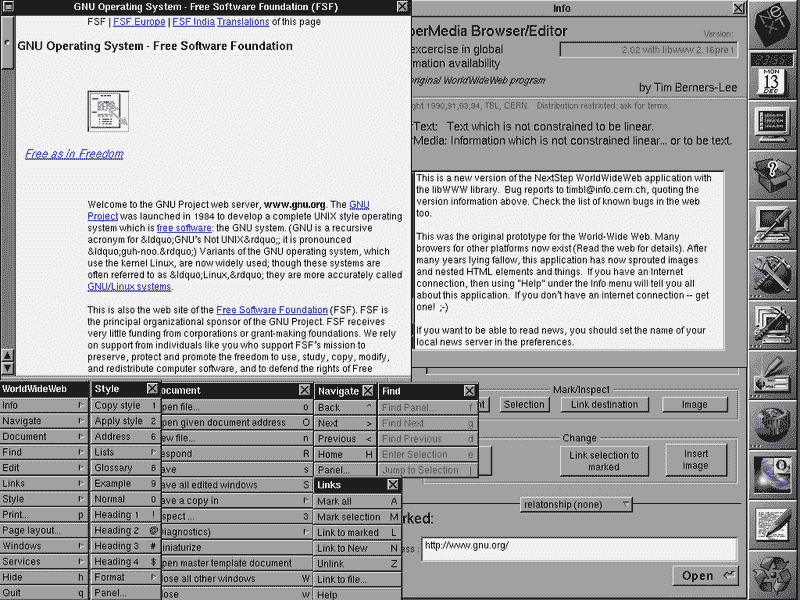](https://res.cloudinary.com/practicaldev/image/fetch/s--EA_UDgfO--/c_limit%2Cf_auto%2Cfl_progressive%2Cq_auto%2Cw_880/https://cdn-images-1.medium.com/max/800/0%2AQOV2uc-yZ1Tef17O.png) 

<figcaption>万维网浏览器([来源](https://commons.wikimedia.org/wiki/File:WorldWideWeb_FSF_GNU.png) )</figcaption>

这就是黑底白字作为一种设计趋势开始的地方，这种趋势被带到了早期的基于文档的网站上。有史以来第一个浏览器，[万维网](https://en.wikipedia.org/wiki/WorldWideWeb)(记住， [CSS 甚至还没有发明](https://en.wikipedia.org/wiki/Cascading_Style_Sheets#History))[以这种方式显示网页](https://commons.wikimedia.org/wiki/File:WorldWideWeb_FSF_GNU.png)。有趣的事实:第二个浏览器，[线模式浏览器](https://en.wikipedia.org/wiki/Line_Mode_Browser)——一个基于终端的浏览器——是暗绿色的。如今，网页和网络应用通常在浅色背景上设计深色文本，这也是用户代理样式表中的一个基本假设，包括 [Chrome 的](https://chromium.googlesource.com/chromium/blink/+/master/Source/core/css/html.css)。

[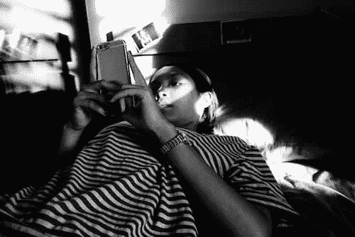](https://res.cloudinary.com/practicaldev/image/fetch/s--fImk0Jui--/c_limit%2Cf_auto%2Cfl_progressive%2Cq_auto%2Cw_880/https://cdn-images-1.medium.com/max/500/0%2A7glgTBgIbbQOgpju.jpg) 

<figcaption>床上用的智能手机([来源](https://unsplash.com/photos/W39xsPWZgA4) )</figcaption>

CRT 的时代早已过去。内容消费和创作已经转移到使用背光 LCD 或节能 AMOLED 屏幕的移动设备上。更小更便携的电脑、平板电脑和智能手机带来了新的使用模式。休闲任务，如网页浏览、娱乐编码和高端游戏，经常在下班后昏暗的环境中进行。晚上，人们甚至在床上享受他们的设备。越多的人在黑暗中使用他们的设备，追溯到黑暗中的光的根源的想法就越受欢迎。

### 为什么是黑暗模式

#### 出于审美原因的黑暗模式

当人们被问及为什么喜欢或想要深色模式时，最受欢迎的回答是*“这样看起来更舒服”，_ 其次是 _“它很优雅，很漂亮。”*苹果在他们的[黑暗模式开发者文档](https://developer.apple.com/documentation/appkit/supporting_dark_mode_in_your_interface)中明确写道:*“对于大多数用户来说，选择启用明亮还是黑暗的外观是一种审美，可能与环境照明条件无关。”*

> 👩‍🔬阅读更多关于[用户研究，了解为什么人们想要黑暗模式以及他们如何使用它](https://medium.com/dev-channel/let-there-be-darkness-maybe-9facd9c3023d)。

[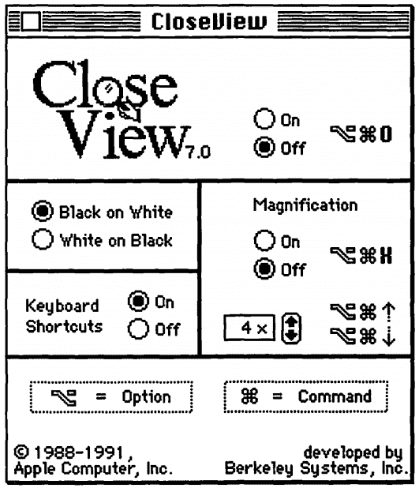](https://res.cloudinary.com/practicaldev/image/fetch/s--NgXd-OC_--/c_limit%2Cf_auto%2Cfl_progressive%2Cq_auto%2Cw_880/https://cdn-images-1.medium.com/max/531/0%2AZfv5E4GlFzQp4ZLN.png) 

<figcaption>系统 7 CloseView ( [来源](https://archive.org/details/mac_Macintosh_System_7_at_your_Fingertips_1992) )</figcaption>

#### 黑暗模式作为辅助工具

也有实际*需要*黑暗模式，并将其作为另一种辅助工具的人，比如视力低下的用户。我能找到的最早出现的这种辅助工具是[系统](https://en.wikipedia.org/wiki/System_7) 7 的*特写*功能，它有一个*白底黑字*和*黑底白字*的切换。虽然 System 7 支持彩色，但默认的用户界面仍然是黑白的。

一旦引入颜色，这些基于反转的实现就显示出了它们的弱点。Szpiro *等人*关于[弱视者如何使用计算设备](https://dl.acm.org/citation.cfm?id=2982168)的用户研究显示，所有受访用户都不喜欢倒置图像，但许多人更喜欢深色背景上的浅色文本。苹果为适应这种用户偏好，推出了一项名为[智能反转](https://www.apple.com//accessibility/iphone/vision/)的功能，可以反转显示屏上的颜色，除了图像、媒体和一些使用深色风格的应用程序。

低视力的一种特殊形式是计算机视觉综合症，也称为数字眼疲劳，其[定义](https://onlinelibrary.wiley.com/doi/full/10.1111/j.1475-1313.2011.00834.x)为*“与使用计算机(包括台式机、笔记本电脑和平板电脑)和其他电子显示器(如智能手机和电子阅读设备)相关的眼睛和视力问题的组合。”*有人[提出](https://bmjopen.bmj.com/content/5/1/e006748)青少年使用电子设备，尤其是在晚上，会导致睡眠时间缩短、睡眠开始潜伏期延长以及睡眠不足的风险增加。此外，根据罗森菲尔德的[研究，暴露在蓝光下](https://www.college-optometrists.org/oip-resource/computer-vision-syndrome--a-k-a--digital-eye-strain.html)[被广泛报道](https://www.ncbi.nlm.nih.gov/pmc/articles/PMC4254760/)参与[昼夜节律](https://en.wikipedia.org/wiki/Circadian_rhythm)和睡眠周期的调节，不规则的光环境可能导致睡眠剥夺，可能影响情绪和任务表现。为了限制这些负面影响，通过 iOS 的[夜班](https://support.apple.com/en-us/HT207570)或 Android 的[夜灯](https://support.google.com/pixelphone/answer/7169926)等功能调整显示器色温来减少蓝光会有所帮助，同时通过暗主题或暗模式来避免强光或不规则光。

#### amo led 屏幕上的黑暗模式节能

最后，众所周知，在 AMOLED 屏幕上，黑暗模式可以节省大量能源。针对 YouTube 等热门谷歌应用的 Android 案例研究表明，节电率最高可达 60%。下面的视频详细介绍了这些案例研究和每个应用的节能情况。

[https://www.youtube.com/embed/N_6sPd0Jd3g](https://www.youtube.com/embed/N_6sPd0Jd3g)

### 激活操作系统中的黑暗模式

现在我已经介绍了为什么黑暗模式对许多用户如此重要的背景，让我们回顾一下您如何支持它。

[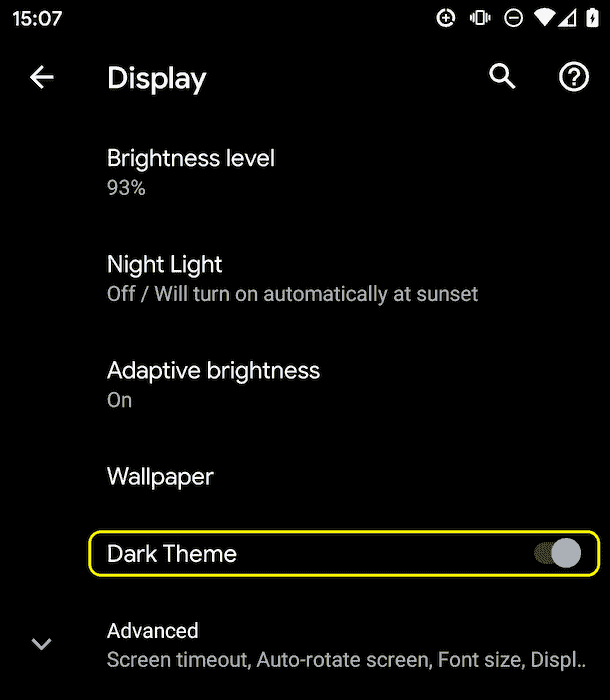](https://res.cloudinary.com/practicaldev/image/fetch/s--0w4FiTWe--/c_limit%2Cf_auto%2Cfl_progressive%2Cq_auto%2Cw_880/https://cdn-images-1.medium.com/max/610/0%2AErOuqrV3HKXKLA3w.png) 

<figcaption>安卓 Q 黑暗主题设置</figcaption>

支持黑暗模式或黑暗主题的操作系统通常在设置中有一个激活它的选项。在 macOS X 上，它位于系统偏好设置的*通用*部分，名为*外观* ( [截图](https://web.dev/prefers-color-scheme/macosx.png))，在 Windows 10 上，它位于*颜色*部分，名为*选择你的颜色* ( [截图](https://web.dev/prefers-color-scheme/windows10.png))。对于 Android Q，你可以在*显示*下找到它作为*黑暗主题*拨动开关([截图](https://web.dev/prefers-color-scheme/android.png)，在 iOS 13 上，你可以在设置的*显示&亮度*部分([截图](https://web.dev/prefers-color-scheme/ios.jpg))更改*外观*。

### `prefers-color-scheme`媒体查询

在我走之前，还有最后一点理论。[媒体查询](https://developer.mozilla.org/en-US/docs/Web/CSS/Media_Queries/Using_media_queries)允许作者测试和查询用户代理或显示设备的值或特征，而与正在呈现的文档无关。它们在 CSS @media 规则中用于有条件地将样式应用于文档，也用于各种其他上下文和语言，如 HTML 和 JavaScript。 [Media Queries Level 5](https://drafts.csswg.org/mediaqueries-5/) 引入了所谓的用户偏好媒体特性，也就是网站检测用户偏好的内容显示方式的一种方式。

> ☝️一个既定的用户偏好媒体功能是偏好减少运动，让您发现页面上减少运动的愿望。我以前写过[关于](https://developers.google.com/web/updates/2019/03/prefers-reduced-motion) [更喜欢——减少运动](https://developers.google.com/web/updates/2019/03/prefers-reduced-motion)。

[prefers-color-scheme](https://drafts.csswg.org/mediaqueries-5/#prefers-color-scheme) 媒体功能用于检测用户是否请求页面使用浅色或深色主题。它适用于以下值:

*   `no-preference`:表示系统不知道用户的偏好。这个关键字值在[布尔上下文](https://drafts.csswg.org/mediaqueries-5/#boolean-context)中被评估为`false`。
*   `light`:表示用户已经通知系统他们更喜欢浅色主题的页面(浅色背景上的深色文本)。
*   `dark`:表示用户已经通知系统他们更喜欢深色主题的页面(深色背景上的浅色文本)。

### 支持黑暗模式

### 查看浏览器是否支持黑暗模式

由于黑暗模式是通过媒体查询报告的，因此您可以通过检查媒体查询是否完全偏好-color-schemematches 来轻松检查当前浏览器是否支持黑暗模式。请注意，我没有包含任何值，而是纯粹检查媒体查询是否匹配。

```
if (window.matchMedia('(prefers-color-scheme)').media !== 'not all') {
 console.log('🎉 Dark mode is supported');
} 
```

在撰写本文时，Chrome 和 Edge 从版本 76 开始支持 prefers-color-scheme，Firefox 从版本 67 开始支持 prefers-color-scheme，Safari 从版本 12.1 开始支持 prefers-color-scheme，iOS 从版本 13 开始支持 prefers-color-scheme。对于所有其他浏览器，您可以检查[我可以使用支持表](https://caniuse.com/#feat=prefers-color-scheme)。

> 有一个自定义元素 [`<dark-mode-toggle>`](https://github.com/GoogleChromeLabs/dark-mode-toggle) 可用于为旧浏览器添加黑暗模式支持。我将在这篇文章的后面[部分写下它。](https://web.dev/prefers-color-scheme/#the-lessdark-mode-togglegreater-custom-element)

### 黑暗模式中的练习

让我们最后看看支持黑暗模式在实践中是什么样的。就像[汉兰达](https://en.wikipedia.org/wiki/Highlander_(film))一样，黑暗模式*只能有一种*:黑暗或者光明，但不能两者兼而有之！我为什么要提这个？因为这个事实应该对加载策略有影响。请不要强迫用户在他们目前不使用的模式下下载 CSS。为了优化加载速度，我将示例应用程序的 CSS 分成了三个部分，以便[推迟非关键的 CSS](https://web.dev/defer-non-critical-css/) :

*   包含在网站上普遍使用的通用规则。
*   仅包含黑暗模式所需的规则。
*   `light.css`它只包含光模式所需的规则。

### 加载策略

后两个是 light.css 和 dark.css，使用一个`<link media>`查询有条件地加载。最初，[并不是所有的浏览器都支持](https://caniuse.com/#feat=prefers-color-scheme) [偏好颜色方案](https://caniuse.com/#feat=prefers-color-scheme)(可以使用上面的[模式检测)，我通过在一个极小的内联脚本中有条件地插入`<link rel="stylesheet">`元素来加载默认的 light.css 文件来动态地处理这个问题(light 是一个任意的选择，我也可以将 dark 作为默认的后退体验)。为了避免无样式内容的闪现，我隐藏了页面的内容，直到 light.css 加载完毕。](https://web.dev/prefers-color-scheme/#finding-out-if-dark-mode-is-supported-by-the-browser)

```
<script>
 // If `prefers-color-scheme` is not supported, fall back to light mode.
 // In this case, light.css will be downloaded with `highest` priority.
 if (window.matchMedia('(prefers-color-scheme)').media === 'not all') {
 document.documentElement.style.display = 'none';
 document.head.insertAdjacentHTML(
 'beforeend',
 '<link rel="stylesheet" href="/light.css" onload="document.documentElement.style.display = ``">'
 );
 }
</script>
<!--
 Conditionally either load the light or the dark stylesheet. The matching file
 will be downloaded with `highest`, the non-matching file with `lowest`
 priority. If the browser doesn't support `prefers-color-scheme`, the media
 query is unknown and the files are downloaded with `lowest` priority (but
 above I already force `highest` priority for my default light experience).
-->
<link rel="stylesheet" href="/dark.css" media="(prefers-color-scheme: dark)">
<link rel="stylesheet" href="/light.css" media="(prefers-color-scheme: no-preference), (prefers-color-scheme: light)">
<!-- The main stylesheet -->
<link rel="stylesheet" href="/style.css"> 
```

### 样式表架构

我最大限度地利用了 [CSS 变量](https://developer.mozilla.org/en-US/docs/Web/CSS/var)，这使我的 generic style.css 成为了，嗯，generic，并且所有的亮暗模式定制都发生在另外两个文件 dark.css 和 light.css 中。我声明两个变量，-⁠-⁠color 和-⁠-⁠background-color，它们基本上创建了一个*暗亮*和一个*亮暗*基线主题。

```
/* light.css: 👉 dark-on-light */
:root {
 --color: rgb(5, 5, 5);
 --background-color: rgb(250, 250, 250);
} 
```

```
/* dark.css: 👉 light-on-dark */
:root {
 --color: rgb(250, 250, 250);
 --background-color: rgb(5, 5, 5);
} 
```

在我的 style.css 中，我在 body { … }规则中使用这些变量。因为它们是在[中定义的:根 CSS 伪类](https://developer.mozilla.org/en-US/docs/Web/CSS/:root)——一个在 html 中表示`<html>`元素的选择器，除了其特殊性更高之外，与选择器 HTML 相同——它们向下级联，这为我声明全局 CSS 变量提供了服务。

```
/* style.css */
:root {
 color-scheme: light dark;
}

body {
 color: var(--color);
 background-color: var(--background-color);
} 
```

在上面的代码示例中，您可能已经注意到属性[的配色方案](https://drafts.csswg.org/css-color-adjust-1/#propdef-color-scheme)带有空格分隔值 light dark。

> **警告:**配色属性仍在开发中它可能不会像宣传的那样工作，Chrome 的全面支持将在今年晚些时候到来。

这将告诉浏览器我的应用程序支持哪些颜色主题，并允许它激活用户代理样式表的特殊变体，这对于让浏览器使用深色背景和浅色文本呈现表单字段、调整滚动条或启用主题感知高亮颜色等非常有用。配色方案的具体细节在 [CSS 颜色调整模块级别 1](https://drafts.csswg.org/css-color-adjust-1/) 中指定。

> 🌒阅读更多关于[`color-scheme`实际上做什么](https://medium.com/dev-channel/what-does-dark-modes-supported-color-schemes-actually-do-69c2eacdfa1d)的内容。

其他的事情就是为我的网站上重要的东西定义 CSS 变量。在使用黑暗模式时，语义组织样式很有帮助。例如，不要用-⁠-⁠highlight-yellow，考虑把变量叫做-⁠-⁠accent-color，因为在黑暗模式下“黄色”实际上可能不是黄色，反之亦然。下面是我在例子中使用的一些变量的例子。

```
/* dark.css */
:root {
 --color: rgb(250, 250, 250);
 --background-color: rgb(5, 5, 5);
 --link-color: rgb(0, 188, 212);
 --main-headline-color: rgb(233, 30, 99);
 --accent-background-color: rgb(0, 188, 212);
 --accent-color: rgb(5, 5, 5);
} 
```

```
/* light.css */
:root {
 --color: rgb(5, 5, 5);
 --background-color: rgb(250, 250, 250);
 --link-color: rgb(0, 0, 238);
 --main-headline-color: rgb(0, 0, 192);
 --accent-background-color: rgb(0, 0, 238);
 --accent-color: rgb(250, 250, 250);
} 
```

### 完整示例

在下面的 [Glitch](https://dark-mode-baseline.glitch.me/) embed 中，您可以看到将上述概念付诸实践的完整示例。尝试在你特定的[操作系统的设置](https://web.dev/prefers-color-scheme/#activating-dark-mode-in-the-operating-system)中切换黑暗模式，看看页面会有什么反应。

[https://glitch.com/embed/#!/embed/dark-mode-baseline?previewSize=100&path=index.html](https://glitch.com/embed/#!/embed/dark-mode-baseline?previewSize=100&path=index.html)

### 加载冲击

当您使用这个示例时，您可以看到为什么我通过媒体查询加载我的 dark.css 和 light.css。尝试切换黑暗模式并重新加载页面:特定的当前不匹配的样式表仍然被加载，但是具有最低的优先级，因此它们永远不会与站点现在需要的资源竞争。

> 😲阅读更多关于[为什么浏览器下载带有不匹配媒体查询的样式表](https://blog.tomayac.com/2018/11/08/why-browsers-download-stylesheets-with-non-matching-media-queries-180513)。

[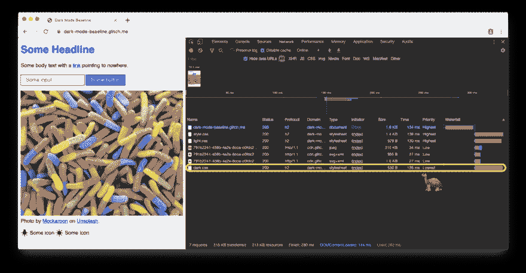](https://res.cloudinary.com/practicaldev/image/fetch/s--Axrwmzji--/c_limit%2Cf_auto%2Cfl_progressive%2Cq_auto%2Cw_880/https://cdn-images-1.medium.com/max/1024/0%2Al9ceKHmGLlj7jmxy.png) 

<figcaption>轻模式站点加载优先级最低的暗模式 CSS。</figcaption>

[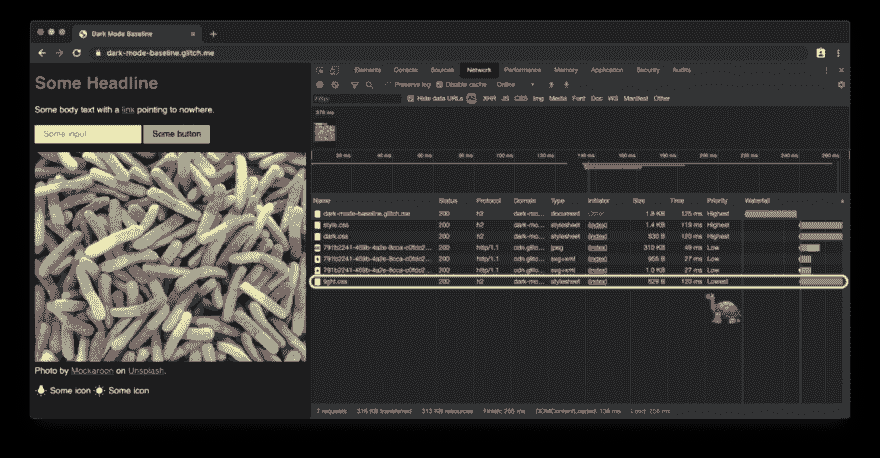](https://res.cloudinary.com/practicaldev/image/fetch/s--_59dZS6S--/c_limit%2Cf_auto%2Cfl_progressive%2Cq_auto%2Cw_880/https://cdn-images-1.medium.com/max/1024/0%2A0AmWb_46uTpJ-jk-.png) 

<figcaption>黑暗模式下的站点加载优先级最低的光明模式 CSS。</figcaption>

[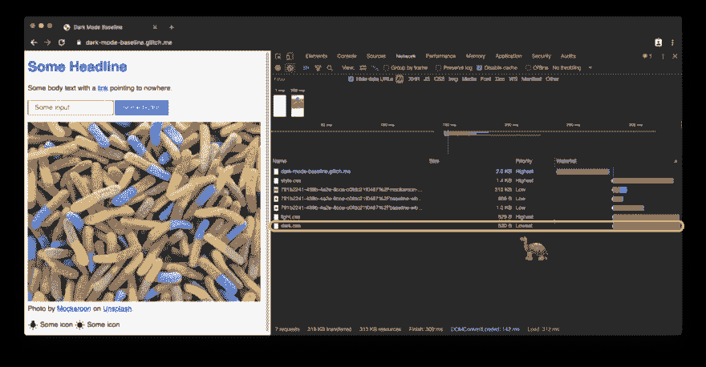](https://res.cloudinary.com/practicaldev/image/fetch/s--jzfaDJY4--/c_limit%2Cf_auto%2Cfl_progressive%2Cq_auto%2Cw_880/https://cdn-images-1.medium.com/max/1024/0%2AfJt_2qBrh-Jr2xqF.png) 

<figcaption>在不支持 prefers-color-scheme 的浏览器上，默认浅色模式的站点以最低优先级加载深色模式的 CSS。</figcaption>

### 对黑暗模式变化做出反应

像任何其他媒体查询更改一样，可以通过 JavaScript 订阅黑暗模式更改。例如，你可以用它来动态地改变页面的[图标](https://developers.google.com/web/fundamentals/design-and-ux/browser-customization/#provide_great_icons_tiles)，或者改变决定 Chrome 中地址栏颜色的 [`<meta name="theme-color">`](https://developers.google.com/web/fundamentals/design-and-ux/browser-customization/#meta_theme_color_for_chrome_and_opera) 。上面的[完整示例](https://web.dev/prefers-color-scheme/#full-example)展示了这一点，为了查看主题颜色和 favicon 的变化，在单独的标签中打开[演示。](https://dark-mode-baseline.glitch.me/)

```
const darkModeMediaQuery = window.matchMedia('(prefers-color-scheme: dark)');
 darkModeMediaQuery.addListener((e) => {
 const darkModeOn = e.matches;
 console.log(`Dark mode is ${darkModeOn ? '🌒 on' : '☀️ off'}.`);
 }); 
```

### 黑暗模式最佳实践

### 忌纯白

你可能注意到的一个小细节是，我不用纯白。相反，为了防止周围的深色内容发光和出血，我选择了稍微暗一点的白色。rgb(250，250，250)之类的效果不错。

### 将照片图像重新着色并变暗

如果你比较下面的两张截图，你会注意到不仅核心主题从*暗亮*变成了*亮暗*，而且英雄形象看起来也略有不同。我的[用户调查](https://medium.com/dev-channel/re-colorization-for-dark-mode-19e2e17b584b)显示，当黑暗模式激活时，大多数被调查的人更喜欢稍微不那么鲜艳和明亮的图像。我称之为*重新着色*。

[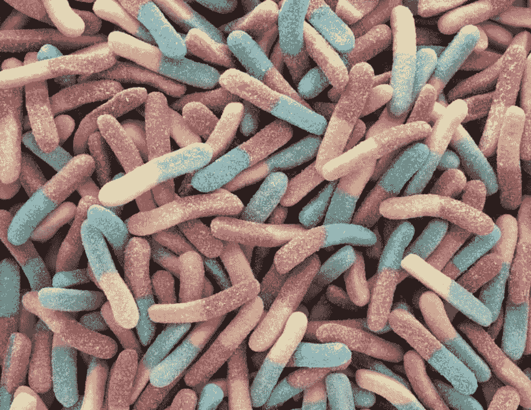](https://res.cloudinary.com/practicaldev/image/fetch/s--smP1NKHv--/c_limit%2Cf_auto%2Cfl_progressive%2Cq_auto%2Cw_880/https://cdn-images-1.medium.com/max/1024/0%2Awh4lG2vnLdTRcu5U.png) 

<figcaption>英雄形象在黑暗模式下略微变暗。</figcaption>

[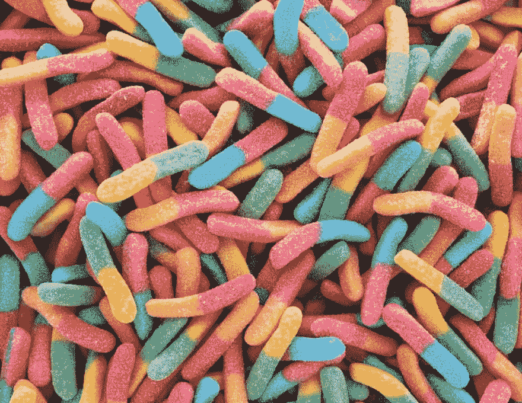](https://res.cloudinary.com/practicaldev/image/fetch/s--03529tiO--/c_limit%2Cf_auto%2Cfl_progressive%2Cq_auto%2Cw_880/https://cdn-images-1.medium.com/max/1024/0%2AwHfT_my7AgR5o09a.png) 

<figcaption>普通英雄在灯光模式下的形象。</figcaption>

重新着色可以通过我的图像上的 CSS 过滤器来实现。我使用 CSS 选择器来匹配所有没有。svg，想法是我可以给矢量图形(图标)一个不同于我的图像(照片)的重新着色处理，在下一段中有更多关于这个的内容。请注意，我再次使用了一个 [CSS 变量](https://developer.mozilla.org/en-US/docs/Web/CSS/var)，这样我可以在以后灵活地更改我的过滤器。

> 🎨阅读更多关于[用户对深色模式](https://medium.com/dev-channel/re-colorization-for-dark-mode-19e2e17b584b)的重新着色偏好的研究。

由于只有在黑暗模式下才需要重新着色，也就是说，当 dark.css 处于活动状态时，light.css 中没有相应的规则。

```
/* dark.css */
--image-filter: grayscale(50%);

img:not([src*=".svg"]) {
 filter: var(--image-filter);
} 
```

#### 用 JavaScript 自定义深色模式重新着色强度

不是每个人都一样，人们有不同的黑暗模式需求。通过坚持上面描述的重新着色方法，我可以很容易地使灰度强度成为我可以通过 JavaScript 改变的用户偏好，并且通过设置 0%的值，我也可以完全禁用重新着色。注意， [document.documentElement](https://developer.mozilla.org/en-US/docs/Web/API/Document/documentElement) 提供了对文档根元素的引用，也就是我可以用 [:rootCSS 伪类](https://developer.mozilla.org/en-US/docs/Web/CSS/:root)引用的同一个元素。

```
const filter = 'grayscale(70%)';
document.documentElement.style.setProperty('--image-filter', value); 
```

### 反转矢量图形和图标

对于矢量图形——在我的例子中，它被用作我通过``元素引用的图标——我使用了不同的重新着色方法。虽然[研究](https://dl.acm.org/citation.cfm?id=2982168)表明人们不喜欢照片的反转，但它对大多数图标来说确实很有效。我再次使用 CSS 变量来确定常规状态和[:悬停](https://developer.mozilla.org/en-US/docs/Web/CSS/:hover)状态下的反转量。

[](https://res.cloudinary.com/practicaldev/image/fetch/s--epkkiF9---/c_limit%2Cf_auto%2Cfl_progressive%2Cq_auto%2Cw_880/https://cdn-images-1.medium.com/max/744/0%2AtMg3mLZc7MdOoj8c.png) 

<figcaption>图标在黑暗模式下是倒置的。</figcaption>

[](https://res.cloudinary.com/practicaldev/image/fetch/s--5dUrXHVx--/c_limit%2Cf_auto%2Cfl_progressive%2Cq_auto%2Cw_880/https://cdn-images-1.medium.com/max/744/0%2A9vONLnkqYt3BiDx4.png) 

<figcaption>灯光模式下的常规图标。</figcaption>

请注意，我再次只反转了 dark.css 中的图标，而没有反转 light.css 中的图标，how :hover 在这两种情况下获得了不同的反转强度，使图标看起来稍微暗一点或稍微亮一点，这取决于用户选择的模式。

```
/* dark.css */
--icon-filter: invert(100%);
--icon-filter_hover: invert(40%);

img[src*=".svg"] {
 filter: var(--icon-filter);
} 
```

```
 /* light.css */
--icon-filter_hover: invert(60%); 
```

```
/* style.css */
img[src*=".svg"]:hover {
 filter: var(--icon-filter_hover);
} 
```

### 将`currentColor`用于内嵌 SVG

对于*内联* SVG 图像，你可以利用 [currentColor](https://developer.mozilla.org/en-US/docs/Web/CSS/color_value#currentColor_keyword) CSS 关键字来表示元素的颜色属性值，而不是[使用反转滤镜](https://web.dev/prefers-color-scheme/#invert-vector-graphics-and-icons)。这使您可以对默认情况下不接收颜色值的属性使用颜色值。方便的是，如果 currentColor 用作 SVG [fill 或](https://developer.mozilla.org/en-US/docs/Web/SVG/Tutorial/Fills_and_Strokes#Fill_and_Stroke_Attributes) [strokeattributes](https://developer.mozilla.org/en-US/docs/Web/SVG/Tutorial/Fills_and_Strokes#Fill_and_Stroke_Attributes) 的值，它会从 Color 属性的继承值中取值。更好的是:这也适用于 [`<use href="…">`](https://developer.mozilla.org/en-US/docs/Web/SVG/Element/use) ，因此您可以拥有单独的资源，并且 currentColor 仍将应用于上下文中。请注意，这只适用于 *inline* 或`<use href="…">`SVG，不适用于作为图像的 src 或通过 CSS 引用的 SVG。你可以在下面的演示中看到这一点。

```
<!-- Some inline SVG -->

 […]
 
```

[https://glitch.com/embed/#!/embed/dark-mode-currentcolor?previewSize=100&path=index.html](https://glitch.com/embed/#!/embed/dark-mode-currentcolor?previewSize=100&path=index.html)

### 模式间平滑过渡

由于颜色和背景色都是[可动画化的 CSS 属性](https://www.quackit.com/css/css3/animations/animatable_properties/)，从暗模式到亮模式的切换可以很平滑，反之亦然。创建动画就像为两个属性声明两个转换一样简单。下面的例子说明了整体思路，你可以在[演示](https://dark-mode-baseline.glitch.me/)中现场体验。

```
body {
 --duration: 0.5s;
 --timing: ease;

color: var(--color);
 background-color: var(--background-color);

transition:
 color var(--duration) var(--timing),
 background-color var(--duration) var(--timing);
} 
```

### 艺术方向用黑暗模式

虽然出于加载性能的原因，我建议在`<link>`元素的 media 属性中专门使用 prefers-color-scheme(而不是在样式表中内联),但有些情况下，您可能希望在 HTML 代码中直接内联使用 prefers-color-scheme。美术方向就是这样的情况。在 web 上，艺术指导处理页面的整体视觉外观，以及它如何在视觉上进行交流，激发情绪，对比特征，并在心理上吸引目标受众。

在深色模式下，由设计师判断在特定模式下什么是最好的图像，以及图像的[重新着色](https://web.dev/prefers-color-scheme/#photographic-images)是否可能*不够好*。如果与`<picture>`元素一起使用，要显示的图像的`<source>`可以依赖于媒体属性。在下面的例子中，我为黑暗模式显示了西半球，为明亮模式显示了东半球，或者当没有给定偏好时，在所有其他情况下默认为东半球。这当然纯粹是为了说明的目的。在您的设备上切换黑暗模式以查看差异。

```
<picture>
 <source srcset="western.webp" media="(prefers-color-scheme: dark)">
 <source srcset="eastern.webp" media="(prefers-color-scheme: light), (prefers-color-scheme: no-preference)">
 `
</picture> 
```

[https://glitch.com/embed/#!/embed/dark-mode-picture?previewSize=100&path=index.html](https://glitch.com/embed/#!/embed/dark-mode-picture?previewSize=100&path=index.html)

### 黑暗模式，但是增加了一个选择退出

正如上面的[为什么选择黑暗模式](https://web.dev/prefers-color-scheme/#why-dark-mode)一节中提到的，黑暗模式对于大多数用户来说是一种审美选择。因此，一些用户可能实际上喜欢让他们的操作系统 UI 处于黑暗中，但是仍然更喜欢以他们习惯的方式来查看他们的网页。一个很好的模式是最初坚持浏览器通过 prefers-color-scheme 发送的信号，但随后可以选择允许用户覆盖他们的系统级设置。

#### `<dark-mode-toggle>`自定义元素

你当然可以自己创建代码，但是你也可以使用现成的定制元素(web 组件),我就是为此目的而创建的。它叫做 [`<dark-mode-toggle>`](https://github.com/GoogleChromeLabs/dark-mode-toggle) ，它给你的页面增加了一个开关(黑暗模式:开/关)或主题切换器(主题:亮/暗)，你可以完全自定义。下面的演示展示了元素的作用(哦，我也有🤫悄悄溜进去的所有[其他](https://dark-mode-baseline.glitch.me/)T5】例子以上。

```
<dark-mode-toggle
 legend="Theme Switcher"
 appearance="switch"
 dark="Dark"
 light="Light"
 remember="Remember this"
></dark-mode-toggle> 
```

[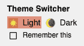](https://res.cloudinary.com/practicaldev/image/fetch/s--U0FxTRGJ--/c_limit%2Cf_auto%2Cfl_progressive%2Cq_auto%2Cw_880/https://cdn-images-1.medium.com/max/140/0%2AuXh_I436B20vKFFc.png) 

<figcaption><【黑暗模式】-在光明模式中切换>。</figcaption>

[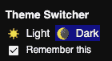](https://res.cloudinary.com/practicaldev/image/fetch/s--p77Kyrv4--/c_limit%2Cf_auto%2Cfl_progressive%2Cq_auto%2Cw_880/https://cdn-images-1.medium.com/max/140/0%2A-YKdMX1aGAEMXKh5.png) 

<figcaption><黑暗模式-在黑暗模式中切换>。</figcaption>

在下面的演示中，尝试单击或点击右上角的黑暗模式控件。如果您选中了第三个和第四个控件中的复选框，那么即使重新加载页面，您的模式选择也会被记住。这允许你的访问者在黑暗模式下保持他们的操作系统，但是在光明模式下享受你的站点，反之亦然。

## [Google chrome labs](https://github.com/GoogleChromeLabs)/[黑暗模式切换](https://github.com/GoogleChromeLabs/dark-mode-toggle)

### 一个自定义元素，允许您轻松地把一个黑暗的模式🌒在您的站点上切换或切换:

<article class="markdown-body entry-content p-5" itemprop="text">

[](https://www.webcomponents.org/element/dark-mode-toggle)

# `<dark-mode-toggle>`元素

一个自定义元素，让您可以轻松地把一个*黑暗模式<g-emoji class="g-emoji" alias="waxing_crescent_moon" fallback-src="https://github.githubassets.cimg/icons/emoji/unicode/1f312.png">🌒</g-emoji>* 在你的网站上切换，这样你可以根据 [`prefers-color-scheme`](https://drafts.csswg.org/mediaqueries-5/#prefers-color-scheme) 最初坚持你的用户的偏好，但也允许他们(可选地永久地)只为你的网站覆盖他们的系统设置。

<g-emoji class="g-emoji" alias="books" fallback-src="https://github.githubassets.cimg/icons/emoji/unicode/1f4da.png">📚</g-emoji>全部阅读(！)关于黑暗模式在相关文章[你好黑暗，我的老朋友](https://web.dev/prefers-color-scheme/)。

## 装置

来自 npm:

```
npm install --save dark-mode-toggle
```

在浏览器中:

```
import * as DarkModeToggle from 'https://cdn.pika.dev/dark-mode-toggle';
```

或者

```
import * as DarkModeToggle from 'https://unpkg.com/dark-mode-toggle';
```

## 使用

<g-emoji class="g-emoji" alias="warning" fallback-src="https://github.githubassets.cimg/icons/emoji/unicode/26a0.png">⚠️</g-emoji> 自定义元素假设您已经将 CSS 组织在不同的文件中，这些文件是根据样式表的对应`link`元素中的 **`media`** 属性有条件地加载的。这是一个很好的性能模式，因为你不会强迫人们根据他们当前的主题偏好下载他们不需要的 CSS，但是不匹配…

</article>

[View on GitHub](https://github.com/GoogleChromeLabs/dark-mode-toggle)

### 结论

使用和支持黑暗模式很有趣，并开辟了新的设计途径。对于你的一些访问者来说，这可能是不能处理你的网站和成为一个快乐的用户之间的区别。有一些陷阱和仔细的测试是绝对需要的，但黑暗模式绝对是一个很好的机会，让你展示你关心你的所有用户。这篇文章中提到的最佳实践和像 [`<dark-mode-toggle>`](https://github.com/GoogleChromeLabs/dark-mode-toggle) 自定义元素这样的助手应该会让你对自己创造惊人的黑暗模式体验的能力充满信心。[让我在 Twitter 上知道](https://twitter.com/tomayac)你创造了什么，这篇文章是否有用，或者有什么改进的建议。感谢阅读！🌒

### 相关链接

首选配色方案媒体查询的资源:

*   [Chrome 平台状态页面](https://chromestatus.com/feature/5109758977638400)
*   [铬虫](https://crbug.com/889087)
*   [媒体查询等级 5 规格](https://drafts.csswg.org/mediaqueries-5/#prefers-color-scheme)

配色方案 meta 标记和 CSS 属性的资源:

*   [Chrome 平台状态页面](https://chromestatus.com/feature/5330651267989504)
*   [铬虫](http://crbug.com/925935)
*   [CSS 颜色调整模块 1 级规格](https://drafts.csswg.org/css-color-adjust-1/)
*   [CSS WG GitHub 关于 meta 标签和 CSS 属性的问题](https://github.com/w3c/csswg-drafts/issues/3299)
*   [meta 标签的 HTML WHATWG GitHub 问题](https://github.com/whatwg/html/issues/4504)

一般黑暗模式链接:

*   [材质设计——黑暗主题](https://material.io/design/color/dark-theme.html)
*   [网页检查器中的黑暗模式](https://webkit.org/blog/8892/dark-mode-in-web-inspector/)
*   [WebKit 中的黑暗模式支持](https://webkit.org/blog/8840/dark-mode-support-in-webkit/)
*   [苹果人机界面指南——黑暗模式](https://developer.apple.com/design/human-interface-guidelines/macos/visual-design/dark-mode/)

本文的背景研究文章:

*   黑暗模式的“支持的配色方案”实际上是做什么的？🤔
*   让黑暗降临吧！🌚也许……
*   [黑暗模式的重新着色](https://medium.com/dev-channel/re-colorization-for-dark-mode-19e2e17b584b)

### 鸣谢

首选配色方案媒体功能、配色方案 CSS 属性和相关的 meta 标记是👏符文 Lillesveen 。Rune 也是 [CSS 颜色调整模块 1 级](https://drafts.csswg.org/css-color-adjust-1/)规范的共同编辑。我愿意🙏感谢 [Lukasz Zbylut](https://www.linkedin.com/in/lukasz-zbylut/) 、 [Rowan Merewood](https://twitter.com/rowan_m) 、 [Chirag Desai](https://www.linkedin.com/in/chiragd/) 和 [Rob Dodson](https://twitter.com/rob_dodson) 对本文的透彻评论。[装载策略](https://web.dev/prefers-color-scheme/#loading-strategy)是[杰克·阿奇博尔德](https://twitter.com/jaffathecake)的创意。[埃米利奥·科沃斯·Á·阿尔瓦雷斯](https://twitter.com/ecbos_)为我指出了正确的偏好配色方案检测方法。引用 SVGs 和 currentColor 的提示来自 [Timothy Hatcher](https://twitter.com/xeenon) 。最后，我要感谢许多匿名的用户研究参与者，他们帮助我形成了这篇文章中的建议。内森·安德森塑造的英雄形象。

* * *