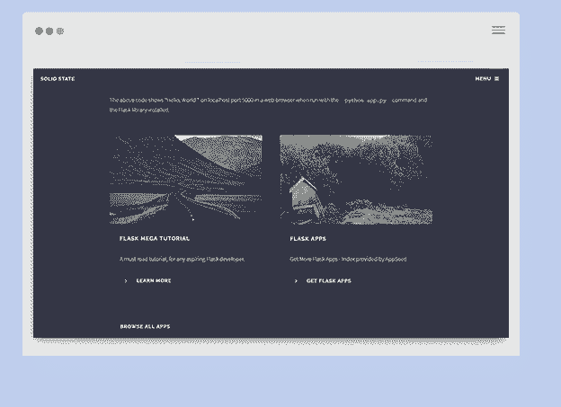

# 你好，又是我。HTML5 Up 设计刚刚达到全栈水平

> 原文：<https://dev.to/sm0ke/hello-me-again-html5-up-design-just-hit-the-full-stack-level-28h4>

你好，

我是 HTML5 Up 的超级粉丝，在此基础上，我编写了一些免费的应用程序。以下是清单:

[HTML5 以上应用编码全栈](https://appseed.us/apps/html5up)

编码快乐！