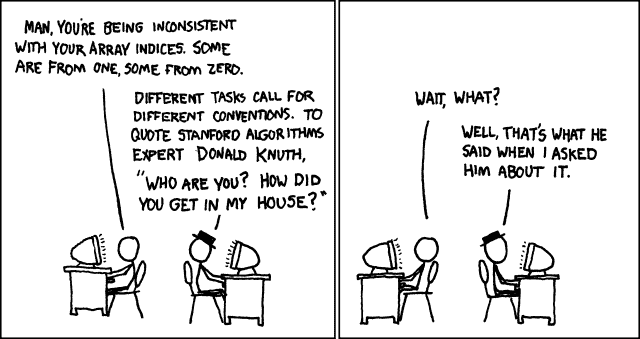
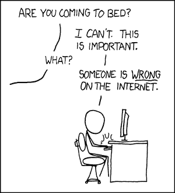

# 你好，世界！

> 原文：<https://dev.to/pheeria/hello-world-2ljg>

因为这是我在这里的第一篇博客，我决定“你好，世界！”其实我觉得哈萨克版更好:

```
print("Sälem, Älem!"); 
```

Enter fullscreen mode Exit fullscreen mode

无论如何，你可能会反对我有两个帖子，所以这是我的第二个。换句话说，1 号。

[](https://res.cloudinary.com/practicaldev/image/fetch/s--ENMQgdzz--/c_limit%2Cf_auto%2Cfl_progressive%2Cq_auto%2Cw_880/https://imgs.xkcd.com/comics/donald_knuth.png)

我最后一次写博客是在我高中毕业后的夏天。在上大学之前，我有很多时间，我渴望打出一大堆废话。渐渐地，我变成了一个被动的读者，即使有责任，我也懒得去评论。

[](https://res.cloudinary.com/practicaldev/image/fetch/s--asbvqrzA--/c_limit%2Cf_auto%2Cfl_progressive%2Cq_auto%2Cw_880/https://imgs.xkcd.com/comics/duty_calls.png)

我写博客的问题是我不知道如何写好文章。因为它可能会以我写一些没人会读的帖子而告终，我甚至从来没有开始写。

现在是教育的时候了。首先是我自己。我将在一个新的地方开始工作，在那里我将得到两倍的报酬，所以这个博客是我对第二份报酬的一种奉献。我将指导一个关于 CSS 战 1 的 12 篇文章的系列，其中第一篇你可能已经读过了。

[](/pheeria) [## CSS 战#1 -简单的正方形

### 奥尔扎斯阿斯卡尔 6 月 4 日 193 分钟阅读

#html #css #webdev #challenge](/pheeria/css-battle-1-simply-square-c19)

最初，我想在媒体上发布。你知道这是怎么回事。

1.  有所成就。任何事。
2.  宣称自己是那个领域的专家。
3.  写一篇有启发性的中帖，分享你的成功。
4.  你的生活不是没有意义的，每个人都会永远崇拜你。

然后我读到肯特·贝克抱怨付费墙阻止他的读者获得知识。然后我从我的一个朋友那里听说 freeCodeCamp 和 Hackernoon 正在转移到他们各自的平台上，其他开发者也来到了这里。好吧，我心想，它仍然是中等，我的生活将如何完成没有张贴在那里？我可以表现出与社区的团结，但仍然到处重复我的帖子。我试着发了一篇帖子，发现 Medium 既不支持 Markdown 也不突出代码语法，于是直接来到这里。毕竟，一个人应该认真地理解大众的情绪。

这就是我。那你呢。

顺便问一下，有计划的后期调度功能吗？如果我了解 Ruby，我可能会尝试做出贡献，但我没有。

那个分号也让你抓狂了吗？