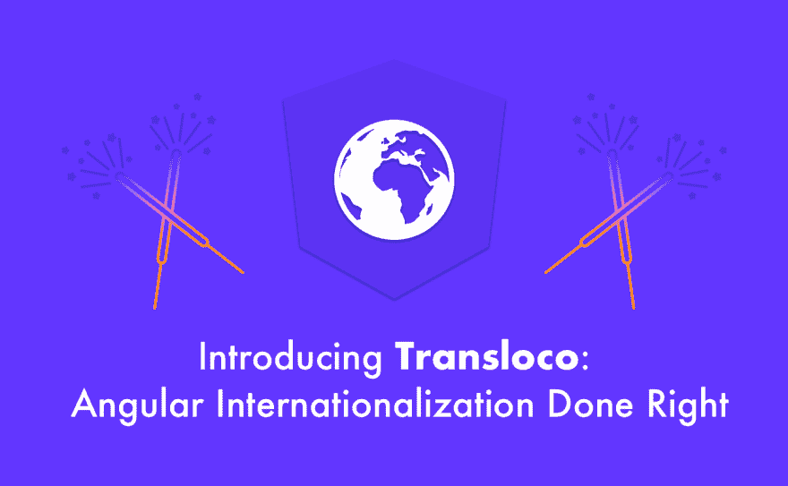
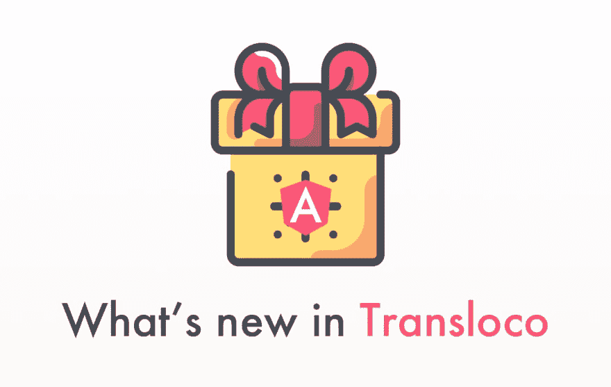

# 通过使用 Transloco:Angular 的国际化(i18n)库来帮助翻译人员

> 原文：<https://dev.to/shaharkazaz/help-the-translator-by-using-transloco-the-internationalization-i18n-library-for-angular-562j>

最初发布于 [shahar.kazaz](https://medium.com/@shahar.kazaz/help-the-translator-by-using-transloco-the-internationalization-i18n-library-for-angular-831c3c513ee4)

有时候，我们需要帮助译者理解描述和意思。为了准确翻译文本消息，译者可能需要额外的信息或上下文。

让我们以下面的翻译键为例:

```
{  "book":  "Book"  } 
```

这是“书”还是要“书”什么的？我们需要与我们的翻译沟通翻译的背景。

让我们学习如何使用 Transloco 国际化(i18n)库为 Angular 提供这种类型的注释。

对于每个需要描述的翻译键，我们可以添加一个后固定有`.comment`的伴随键，如下例所示:

```
{  "book":  "Book",  "book.comment":  "we mean a reading book"  } 
```

现在，我们不希望这些密钥进入我们的最终包，所以我们可以在构建生产环境时使用官方的 transloco 库删除它们。

首先，我们需要安装库:

```
npm install @ngneat/transloco-remove-comments 
```

然后，我们需要向`package.json`添加以下脚本:

```
"scripts":  {  "remove-comments":  "transloco-remove-comments dist/appName/assets/i18n",  "build:prod":  "ng build --prod && npm run remove-comments",  } 
```

现在，当我们构建生产环境时，库将负责从路径中指定的翻译文件中删除这些键。

Transloco 又一次让我们的生活变得更加舒适。干杯！🍻

* * *

以下是关于 Transloco 的更多精彩内容:

[](https://netbasal.com/introducing-transloco-angular-internationalization-done-right-54710337630c)

[](https://netbasal.com/good-things-come-to-those-who-wait-whats-new-in-transloco-5dadf886b485)

[](https://medium.com/@shahar.kazaz/creating-search-engine-friendly-internationalized-apps-with-angular-universal-and-transloco-ab9583cfb5ac)