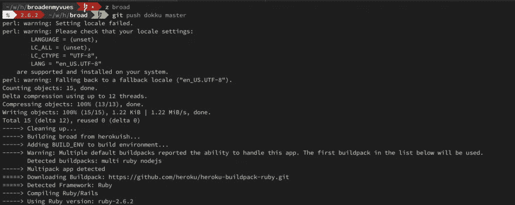
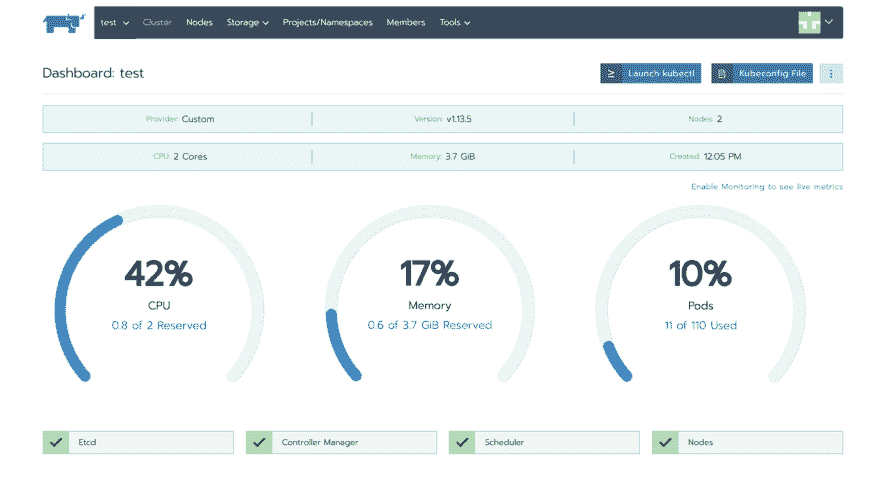
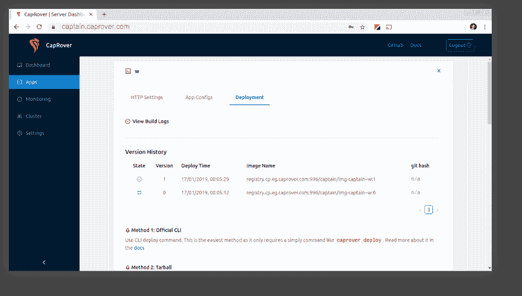

# Heroku vs 自托管 PaaS

> 原文：<https://dev.to/mskog/heroku-vs-self-hosted-paas-2bk1>

这篇文章最初发布在我的博客上

* * *

我一直在寻找更好的方式来主持我的副业项目。正如我在[之前的一篇文章](https://www.mskog.com/posts/hetzner-cloud-a-quick-review/)中提到的，我曾经有一个巨大的专用服务器，我把所有的应用程序和附带项目都放在上面。然后我换成用一个上面有 Dokku 的 VPS。但这是应该走的路吗？为什么不把 Heroku 用在所有事情上呢？有比 Dokku 更好的自托管解决方案吗？让我们来了解一下！

首先，我们必须确定我们想从中获得什么。我们想要尽可能便宜的东西，可以托管我们想要运行的任何东西，并且占用尽可能少的维护时间。“托管任何东西”对我来说很重要，因为我们现在有很多“仅 Node.js”服务，虽然这些服务很棒，但我仍然希望能够托管我想运行的任何东西。我也不想在这上面花太多时间，所以 Kubernetes 和其他先进的解决方案也出来了。最后，如果我想运行一个类似长生不老药/凤凰的东西，那么我不想担心让它工作。

像 Firebase 这样的 BaaS 解决方案(后端即服务)已经过时了，因为它们不能托管你想要的任何东西。无服务器解决方案也已经过时，因为它们不能可靠地托管你想要的任何东西，而且还会带来其他类型的问题。请注意，我不认为这些类型的服务是坏的，但如果可能的话，我希望能够在我选择的平台上托管任何项目。

#### Heroku

我能想到的主持一个项目的最简单的方式就是 Heroku。它根本不需要时间就可以开始，它可以很好地扩展，并且他们可以轻松使用各种数据库和第三方服务。你只需将你的代码推送到一个仓库，然后 Heroku 会用他们所谓的[构建包](https://devcenter.heroku.com/articles/buildpacks)为你构建应用程序。并主持它。不需要维护服务器，不需要备份数据等等。它只是工作，而且工作得非常好。唯一的警告是价格。虽然你*可以*免费开始，这可能对一些人来说足够了，但一旦你不再使用他们的免费计划，它就会很快累积起来。

Heroku 使用了一个他们称之为 dynos 的概念。默认情况下，dyno 是一个具有 512 MB RAM 的容器，它运行单个应用程序的一部分。要扩展您的应用程序，您只需添加更多 dynos，Heroku 就会自动为您进行负载平衡。您还可以让 dynos 运行后台作业和调度程序来做类似 cron 的事情。如果你的应用程序流量很大，那么你可以简单地添加更多的 dynos 来提高性能，Heroku 会自动在它们之间进行负载平衡。Heroku 提供了四种主要的 dynos:免费，爱好，标准和性能。

免费的 dynos 允许你托管尽可能多的应用程序，但是你的 dynos 每月可以运行的总小时数被限制在 1000。这意味着如果你在一个 dyno 上运行一个应用程序，那么这将占用你大约 720 小时的空闲时间。免费的 dynos 也会在 30 分钟不活动后休眠，然后如果有新的请求需要重新启动，这可能需要一段时间，特别是如果你使用像 Ruby on Rails 这样的较慢的堆栈。如果你有一个应用程序，一个 web dyno 服务请求，一个 worker dyno 处理后台作业，那么这两个应用程序都不能在免费计划下 24/7 运行，因为一个月要运行 744*2 个 dyno 小时。你也不能缩放你的爱好动态，即你只能运行一个单一的网络动态和一个单一的工人动态在同一应用程序上的爱好动态。最后，一个应用程序总共只能有两个 dyno，例如一个 web dyno 和一个 worker dyno。如果你需要一个数据库，你可以使用 Heroku Postgres，它可以免费提供 10000 行数据。你还可以免费得到一个 25 MB 的 redis 数据库。这是你可以用绝对免费的得到的东西。还有一些第三方扩展也提供免费服务。

必须指出的是，你可以用一些技巧来限制你需要的 dynos 的数量为 1。例如，如果你运行 Ruby，你可以使用 [Suckerpunch](https://github.com/brandonhilkert/sucker_punch) gem 来运行你的后台任务。Suckerpunch 与运行 web 服务器的进程运行在同一个进程中，所以只需要 1 个 dyno。这很好，直到你用完内存。

那么，一旦你超越了免费计划，会发生什么呢？假设您需要一个 web dyno 和一个 worker dyno(用于在后台发送电子邮件等),两者都全天候运行，并且数据库中有超过 10000 行。dyno 的下一层叫做 Hobby dyno，每月运行费用为 7 美元。这些从不睡觉，你可以有多达 10 种不同的进程类型。除了一些指标之外，这些是主要的区别。然而，您也不能扩展这些，所以您只能有一个 web dyno 运行您的应用程序。最便宜的数据库每月也要 9 美元，最多可容纳 1000 万行。这要好得多，但是请记住，您仍然无法访问任何类型的数据库内存缓存，整体性能相当差。总的来说，两个 dynos 和一个应用程序的数据库每月大约需要 27 美元。

一旦你升级到“真正的”计划，你会看到 25 美元的 dyno 和 50 美元的具有生产级性能和 4GB RAM 用于缓存等的数据库。请注意，这些 dynos **不能**与 hobby dynos 结合使用，因此您的应用程序的最低费用现在是每月 100 美元。然而，为了最小化成本，你**可以**做的一件事就是在应用程序之间共享数据库。只要有足够的空闲连接，您就可以将数据库用于任意多的应用程序。提到的数据库有 120 个并发连接的限制，这对大多数项目应用程序来说应该足够了。

##### Dyno 对照表

| 等级 | 每 Dyno 成本 | 睡 | 流程类型 | 最大 dynos | 缩放比例 |
| --- | --- | --- | --- | --- | --- |
| 自由的 | 自由的 | 是 | Two | Two | 不 |
| 业余爱好 | $9 | 不 | Ten | Ten | 不 |
| 生产 | $25+ | 不 | 无限的 | 无限的 | 是 |

##### 示例 app 价格对比

| 班级 | 总成本 | 数据库最大行数 |
| --- | --- | --- |
| 自由的 | 自由的 | 10K |
| 业余爱好 | $27 | 10M |
| 生产 | $100 | 无限制。带缓存 |

总之，Heroku 为没有特殊要求的简单副业项目提供了三种不同的定价:免费、27 美元和 100 美元。注意你的时间不是自由的(对吗？因此，虽然这对于一个简单的副业项目来说似乎很多，但你必须记住，你没有服务器要维护，没有包要更新，没有备份要管理，你所要做的就是将你的代码推送到 Git，网站将自动构建和更新。这对忙碌的人来说很有价值，但对我来说，仅仅经营一些甚至没有为我赚到钱的副业还是太多了，所以我需要去别处看看。

## 自主持“Heroku 式”

那么我们所说的“Heroku 式”是什么意思呢？一般来说，这意味着你应该能够像在 Heroku 上那样进行部署，所以一个简单的“git push”就能让你的代码运行起来。您应该能够轻松托管多个应用程序，并自动部署数据库等。我们不期望有 Heroku 那么多的“魔法”,但是日常事务应该很容易管理。

有相当多的这类服务，这个列表并不意味着是详尽无遗的。

#### 独轮车

Dokku 是 Heroku 喜欢的最简单的一个，也是最成熟的一个。安装非常简单，而且[数字海洋有办法创建一个预装了 Dokku】的水滴。您通过将代码推送到存储库来部署代码，就像 Heroku 一样。Dokku 使用 Heroku buildpacks 来识别您的应用程序使用哪个堆栈并自动构建它。如果您想要比 buildpacks 更高级的东西，也可以使用 docker 文件部署您的应用程序。](https://marketplace.digitalocean.com/apps/dokku)

Dokku 还可以向您的应用程序添加服务。它有各种各样的数据库插件，如 MySQL 和 PostgreSQL，缓存插件以及一个自动 SSL 插件。它有一个活跃的社区，每当有新的东西出现时，它就会创建新的插件。数据库插件具有内置的备份和导出功能。

就我个人而言，我用 Dokku 部署我所有的应用程序和辅助项目，我发现这是不使用 Heroku 就能运行的最简单的方法。在我看来，Dokku 只有一个很大的缺点:它只能在单个服务器上运行，并且不支持 Docker Swarm 或任何其他类型的多主机部署。Dokku [的维护者说](https://github.com/dokku/dokku/issues/1795)Dokku 的目标是成为一个单主机解决方案，并且没有计划支持任何类型的多主机部署。这对我来说不是问题，因为我没有大型应用程序或任何需要自动故障转移或类似功能的关键应用程序。如果你这样做，那么你将需要寻找一个更先进的解决方案。请记住，任何比 Dokku 更先进的解决方案都可能在设置和维护上更复杂，并且会有更多的移动部件。

总的来说，多库很棒。如果能支持多主机部署和某种简洁的图形用户界面、日志记录等等，那就太好了。

#### 弗林

Flynn 也被宣布为类似 Heroku 的产品，但与 Dokku 不同的是，它支持多服务器、扩展和开箱即用的负载平衡。[弗林医生](https://flynn.io/docs/basics)的部署与 Heroku 和 Dokku 非常相似。它具有相同的“推动部署”方法。Flynn 支持多个数据库以及所有应用程序的自动备份和恢复。然而，它比 Dokku 占用更多的资源，并且您最少需要两台主机来启动，每台主机都有 2GB 或更多的内存。

弗林是非常有前途的，当它被宣布的时候，但似乎这个项目没有任何进展。公司博客已经两年没有更新了，Github 页面上有[多个](https://github.com/flynn/flynn/issues/4527) [问题](https://github.com/flynn/flynn/issues/4530)询问该项目是否被放弃。人们还报告说，该项目是错误的，并没有像预期的那样工作。例如，弗林是在 Kubernetes 崛起之前宣布的，这可能解释了该项目放缓的原因。出于这些原因，我不会在今天的生产中使用 Flynn。

#### 牧场主

Rancher 是一个管理工具，位于 T2 Kubernetes 之上。它旨在帮助在多个提供商(如 AWS 和 DigitalOcean)上部署 Kubernetes 集群。您也可以轻松地在这样的部署之间迁移资源。它还将抽象 Kubernetes 配置管理，并有一个漂亮的图形用户界面。要开始使用 Rancher，您需要的是一台至少有 4GB ram 的服务器，作为 Rancher 部署的主管理服务器。在服务器上安装 Docker，启动一个容器，里面有牧场主管理的东西。然后，您只需访问服务器的 URL，就会看到 Rancher UI。在这里，您可以创建一个 Kubernetes 集群，如果您使用 AWS 或 DigitalOcean 这样的云提供商，可以让 Rancher 为您完成，或者在您的服务器上手动运行 Docker 命令。这花了我大约 5 分钟的时间，大部分时间都花在了在服务器上安装 Docker 上。

启动并运行后，我在几分钟内部署了一个简单的 Wordpress 应用程序。然而,“真正的”应用程序部署起来会更复杂，因为 Rancher 不像 Dokku 那样使用构建包。这是一个普通的 Docker 部署，在 Kubernetes 上有图像和容器，所以需要做更多的工作。

总而言之，我对 Rancher 很感兴趣，但因为我在寻找一些简单的东西，所以对我的小型副业项目来说，它太先进，也太耗费资源了。不过，稍后我会更深入地研究 Rancher，并尝试在它上面部署我的一个项目。那很可能是一篇独立的博客文章！

#### 盖洛普

CapRover 在许多方面与 Dokku 相似。它使用 Docker 进行部署，就像 Dokku 一样，但是 CapRover 不支持 [buildpack 部署](https://devcenter.heroku.com/articles/buildpacks)，因为它只使用 Docker 文件。这不一定是件坏事，因为 Dockerfile 部署在 Dokku 中也很棒。不过，对于简单的部署，您不必编写自己的 docker 文件，因为 Node.js、PHP 和 Ruby 等流行的堆栈有多种默认设置。虽然 Dokku 将其插件概念用于数据库等，但 CapRover 拥有所谓的“一键式应用程序”。本质上，这些是可以通过 CapRovers GUI 部署的应用程序和服务。是的，没错，这里也有一个 GUI。只需选择您想要的数据库或其他服务并部署它。然后您可以通过使用它的名字来连接它，因为在 CapRover 中运行的所有容器之间有一个内部 Docker 网络。

Dokku 和 CapRover 的一个很大的区别就是 CapRover 通过使用 [Docker Swarm](https://docs.docker.com/engine/swarm/) 来支持多个服务器。它会自动在多个服务器上平衡您的应用程序，您甚至可以开箱即用地进行自动负载平衡。

作为测试，我启动了 3 台服务器，并在上面安装了 CapRover。启动第一个服务器所需要做的就是安装 Docker，然后启动一个基于 CapRover 映像的容器。专业提示:使用类似于 [Ansible](https://www.ansible.com/) 的东西一次在多台主机上安装 Docker，因为这很繁琐。添加更多的服务器有点复杂，因为您需要在工作节点上设置 SSH 密钥，以便主服务器可以通过 SSH 访问它。不过，如果你习惯了这种事情，没什么大不了的。5 分钟后，我有了一个不错的 3 服务器集群，可以启动应用程序了。

为了在集群模式下运行，CapRover 需要有一个 [Docker 注册表](https://docs.docker.com/registry/deploying/)来存储所有服务器将使用的映像。它可以帮你做到这一点，只需在 GUI 中单击一下，或者你可以使用一个外部 Docker 注册表，如果你已经有一个。一旦完成，你只需像平常一样启动应用程序。

一旦集群准备就绪，我就试着给它部署我的一个小小的 Node.js 微服务。因为 CapRover 不支持 buildpack 部署，所以你必须使用 Dockerfiles 来实现。然而，CapRover 已经为 Node.js、PHP、Python/Django 和 Ruby/Rack 内置了这个，所以如果你使用这些栈中的任何一个，你都不必仅仅为了开始而编写你自己的 docker 文件。你所需要做的就是将一个简单的[队长定义文件](https://caprover.com/docs/captain-definition-file.html)添加到你的应用程序根中，然后你就可以开始了。尽管对于更复杂的应用程序来说，创建自己的定制 docker 文件可能是个好主意，但是默认设置似乎可以很好地开始使用。

在我添加了定义文件，安装了 NPM Caprover CLI 之后，我简单地运行`caprover deploy`来部署我的应用程序。CapRover 为应用程序构建了 Docker 映像，然后它就上线了。我很高兴地说，它的开箱即用非常完美。您甚至可以在 GUI 中使用“让我们加密”来启用 HTTPS。也没有更多的 CLI 的东西。然后，我将我的应用程序扩展到 3，以检查 Docker Swarm stuff 和 CapRover 在其他两个服务器上启动了额外的容器，并在这两个服务器之间实现了负载平衡。所有这些总共花了大约 10 分钟。非常好！然后我还试着启动了 CapRover 的一个预建应用程序:Wordpress。它启动了一个 MariaDB 容器和一个 PHP 容器，然后我看到了默认的 Wordpress 安装配置。这么简单！

我真正喜欢 CapRover 的是:

*   多个服务器！

*   它有一个非常好的图形用户界面，有很多功能。例如，您可以在这里设置环境变量，而不是通过 CLI 添加它们。

*   可以在 GUI 中查看应用程序日志。这太棒了！

*   使用 [Netdata](https://github.com/netdata/netdata) 进行内置监控。然而，这只适用于主服务器！

*   单击应用程序。例如，你可以很容易地启动 Wordpress，而根本不需要输入任何命令。

*   对装载的 Docker 卷中持久应用程序数据的内置支持。

那么，我会为了卡普洛人而放弃杜库吗？可能不是在这个时候，有几个原因:

*   我不需要多台服务器。如果我做了，那将是一个不同的故事。添加多个服务器、Docker 注册表和 Docker Swarm 是许多新的移动部件。如果什么东西坏了，我不喜欢修理它。Dokku 是 Docker 之上的一个更简单的 CLI 工具。

*   不支持构建包。Heroku buildpacks 是部署支持我的语言和应用程序堆栈的应用程序的可靠方法。定制 Dockerfile 部署更容易定制，但是对于简单的部署，我更喜欢使用 buildpacks。

*   不支持 Procfile。Dokku 将为 Procfile 中的每个进程自动启动多个容器。例如，如果您有一个 web 进程和一个工作进程，它将启动两个容器。如果你使用 CapRover，你必须编写一个定制的 docker 文件来启动多个进程，或者为每个进程使用一个 CapRover 应用程序。我可能会选择后者，但是 Procfile 更容易开箱即用。

*   没有滚动重启。在关闭旧容器之前，Dokku 将确保应用程序的新版本已经启动并运行。CapRover 在两次发布之间会有一点点停机时间。记住[滚动重启并不简单](https://github.com/caprover/caprover/issues/191)。

*   备份更加困难。Dokku 有简单的备份命令。你可以把数据库转储到磁盘，或者自动放入亚马逊 S3。如果您使用 CapRover，您必须通过启动一个容器、连接到数据库然后转储数据来手动完成这项工作。这并不难做到，但不像 Dokku 解决方案那样巧妙。

然而，CapRover 是一个很好的项目，如果我需要多个服务器，我绝对会尝试一下。不过，对于单个服务器来说，这两个项目中的任何一个都不会出错，我选择继续使用 Dokku，因为我已经让它运行起来了，而且我对它更加适应。

#### 结论

如果钱不是问题，那么我可能会用 Heroku 做任何事情。您再也不必考虑服务器、扩展或备份了(至少在您想解决扩展问题之前不会)。然而，由于如果你有很多中等规模的不盈利的副业项目，成本会迅速增加，你可能会选择像 Dokku 或 CapRover 这样的项目，然后逐步扩大规模。我将在其他时间更详细地研究 CapRover 和 Rancher，因为这两个项目都让我非常感兴趣。