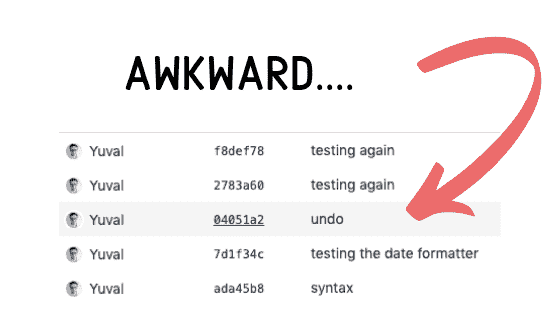

# 用 Git 壁球隐藏你可耻的行为

> 原文：<https://dev.to/yuvalo/hide-your-shameful-commits-with-git-squash-1c7l>

我们都这样做，我相信你也一样。你知道，当你测试某个东西时，快速提交，然后修复一个打字错误，然后再次提交，推送，测试等等。

[](https://res.cloudinary.com/practicaldev/image/fetch/s--CaDYnBZV--/c_limit%2Cf_auto%2Cfl_progressive%2Cq_auto%2Cw_880/https://thepracticaldev.s3.amazonaws.com/i/cbzshtbo4g1oxgac5lw6.png)

我通常在进行部署或构建代码时这样做，确信这只是一个微小的修正，一个小小的修改，仅此而已。所以我提交了一个没有意义的消息，push test，然后看到一个错误。姑且称之为 *BDD* :蛮力驱动开发。

现在，我只剩下一个分支，其中充满了令人尴尬的提交，这些提交将直接进入拉取请求和代码审查。

然而，我确实有一点锦囊妙计，可以帮助我推动这些变化，比如我团队中的那个 10 倍工程师。

用 git 壁球。除了看起来更聪明之外，您还可以让分支机构的历史更加清晰，对其他人来说可读性更好。

## 饭桶南瓜

压缩提交可以通过几种方式完成，最终目标是重写提交历史，只留下一个提交，而不是多个无意义的提交。您可以选择保留提交消息历史或者重写它，这样就有机会交流您引入的更改。

### git 登录前

理解 git squash 的最好方法是查看 git 日志。在这个例子中，我有一个包含三次提交的特性分支。

```
* 510b129 (HEAD -> docker-rmi) missing flag
* cd62deb typo #2
* dba34d5 typo
* 46e95a5 Listing local docker images
* e30e77d (master) Starting the build process
* 9409666 Adding the build script 
```

### git 日志之后

在执行“挤压”之后，git 日志如下所示:

```
* 617c65c (HEAD -> docker-rmi) Listing all the local docker images
* 46e95a5 Listing local docker images
* e30e77d (master) Starting the build process
* 9409666 Adding the build script 
```

就像我们回到了过去！
[T3】](https://res.cloudinary.com/practicaldev/image/fetch/s--Fuz8ZfJb--/c_limit%2Cf_auto%2Cfl_progressive%2Cq_auto%2Cw_880/https://thepracticaldev.s3.amazonaws.com/i/qqajkuvljinx0ol6sf87.jpg)

您可以看到，我们现在只有一条提交消息，其中包含了我们所做的所有更改，而不是所有“输入错误”的提交消息和丢失的标志。

有几种方法可以压缩提交，我将向您展示两种涵盖不同用例的方法。如果你想看更多的方法，StackOverflow 上有一个精彩的帖子。

### 挤在同一根树枝上

当您想要改变分支历史，压缩一些提交时，`git reset --soft`命令可以派上用场。

*警告* -确保你没有未提交的更改。在执行重置命令之前，提交或隐藏它们。

如果您想压缩您的最后三次提交，运行命令:

```
git reset --soft HEAD~3 && git commit 
```

另外，如果你想挤压到一个特定的提交:

```
git reset --soft 46e95a5 && git commit 
```

要推动您的更改，您必须使用- force 标志，因为您更改了分支历史。

```
git push --force 
```

同样，要了解更多信息，请参阅上面 StackOverflow 线程的链接。

### 合并上挤压

如果你是一个自信的人，只想保持主(或任何其他)分支干净，你可以使用`git merge --squash`命令。大多数拉请求用户界面也允许你挤压合并。

```
git checkout master
git merge --squash featurebranch 
```

默认情况下，提交包括所有原始消息，但是您也可以重写它。
你原来的分支保留了原来的历史，你可以参考。

### 现在就做这个

像 Git 的所有东西一样，了解这个方法为您增加了另一个工具。但是话又说回来，在您现有的代码库上第一次运行命令总会有这种“恐惧”。因此，继续创建一个干净的 git repo，并在一个安全的环境中尝试这些方法。一旦你自己看到它是如何工作的，你的手就不太可能颤抖了。

想了解更多？
[前往我的注册页面](https://pushbuildtestdeploy.com/signup)，不要错过任何帖子