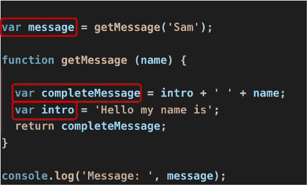
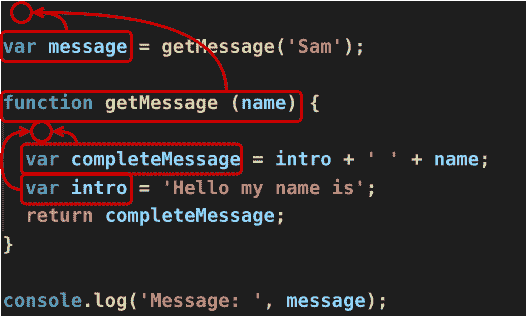

# 提升——最棘手的 Javascript 特性之一

> 原文：<https://dev.to/codingsam/hoisting-in-javascript-get-it-once-and-for-all-5f48>

Javascript 是一种编程语言，对于初学者来说可能有些棘手。一旦你理解了它是如何工作的，事情就变得很清楚了，但是在开始的时候，你最终会调试你自己创造的问题，因为你对这门语言一无所知。我们都去过那里。
也许你正在学习 Javascript，你正在处理在大多数编程语言中不会出现的问题。

在这篇文章中，我将向您展示一些代码片段，以及一些嵌入式代码笔。但是，您将看到`document.write`个呼叫，而不是`console.log`。这只是为了让你在 codepen 的应用程序上看到输出。否则，您将不得不打开浏览器的开发工具。

我们来看下面的 JS 代码片段:

```
console.log('Hello, my name is ', name);

var name = 'Sam'; 
```

[https://codepen.io/codingsam01/embed/BXNGqO?height=600&default-tab=js&embed-version=2](https://codepen.io/codingsam01/embed/BXNGqO?height=600&default-tab=js&embed-version=2)

你认为会发生什么？这里，你在声明变量和赋值之前使用它。在大多数编程语言中，这种代码会抛出一个错误，因为你试图使用一些未知的东西。
您将在控制台中看到以下输出:

```
Hello my name is undefined 
```

没有一个错误，但是您得到了一个意外的输出。
`undefined`是任意变量的默认值。

如果你不知道发生了什么，你会问自己:

*   当我尝试使用未知变量时，为什么代码没有崩溃？

*   有什么魔法允许我使用下面声明的变量吗？如果是，为什么我没有得到正确的变量值，而是得到了`undefined`？

在前面的代码示例中，尝试将`name`替换为其他内容:

```
console.log('Hello, my name is ', somethingElse);

var name = 'Sam'; 
```

[https://codepen.io/codingsam01/embed/NQGJxa?height=600&default-tab=js&embed-version=2](https://codepen.io/codingsam01/embed/NQGJxa?height=600&default-tab=js&embed-version=2)

你会得到这个:

```
ReferenceError: somethingElse is not defined 
```

这个错误是任何 Javascript 初学者都会想到的。但是在前面的例子中并没有发生。似乎可以在声明变量之前使用变量。

实际上，在幕后还发生了其他事情来允许开发人员这样做。叫做*吊装*。让我来帮助你理解 Javascript 最棘手的特性之一，特别是对于初学者。我还将向您展示如何避免它以及它何时会有用。

# 什么是*吊装*？

提升是一个将所有声明移动到其作用域顶部的过程。这是在运行代码之前由 Javascript 引擎处理的。

但是...声明的范围是什么？

在 Javascript 中，你有基于函数的作用域，这意味着，在函数中声明的任何变量，都将属于该函数的作用域，不管它发生在函数中的什么地方。例如，如果在 For 循环中声明一个变量，那么该变量在函数中的任何地方都是已知的，而不仅仅是在循环中。
但是，任何函数或在函数外声明的变量，都将属于全局作用域。

只有声明被*提升*(移到顶部)。
但是，哪类申报呢？

*   使用`var`关键字的变量声明；

*   使用`function`关键字的函数；

对`var`声明要小心。看到一个赋值，很容易认为变量的名字和值会被移动到顶部。

我们来看一个例子:

```
var a = 2; 
```

在这一行代码中，有两件事情正在进行，一个声明和一个赋值。这一行可以翻译成:

```
var a;
a = 2; 
```

只有宣言`var a`会被悬挂。就像第一段代码中发生的那样，如果你试图在赋值前使用变量`a`，它将是`undefined`而不是`2`。

然而，当你声明一个函数时，你也写了它的体。你不能创建一个只有名字的函数，然后指定它的行为。这就是为什么，当你声明一个函数时(使用`function`关键字),整个函数都会被提升。这意味着，您可以在第一次调用后在一行中声明它。
例如，下面的例子不会抛出错误:

```
var message = getMessage('Sam');
console.log(message);

function getMessage (name) {
  return 'Hello my name is ' + name;
} 
```

[https://codepen.io/codingsam01/embed/PoYzdgr?height=600&default-tab=js&embed-version=2](https://codepen.io/codingsam01/embed/PoYzdgr?height=600&default-tab=js&embed-version=2)

你会在控制台上看到“你好，我是山姆”。`getMessage`函数被提升，这意味着在运行代码之前，Javascript 引擎将它移到了顶部。

# 让我们看看它的行动吧！

请看下面的代码片段:

```
 var message = getMessage('Sam');

function getMessage (name) {

  var completeMessage = intro + '  ' + name;
  var intro = 'Hello my name is';
  return completeMessage;
}

console.log('Message: ', message); 
```

[https://codepen.io/codingsam01/embed/JjPKaqv?height=600&default-tab=js&embed-version=2](https://codepen.io/codingsam01/embed/JjPKaqv?height=600&default-tab=js&embed-version=2)

输出将是“消息:未定义的 Sam”。在运行代码之前，声明将被挂起。让我们分解*吊装*并遵循以下步骤:

*   首先，收集所有声明(`var`和`function`)

[](https://res.cloudinary.com/practicaldev/image/fetch/s--tfKUsTnN--/c_limit%2Cf_auto%2Cfl_progressive%2Cq_auto%2Cw_880/https://thepracticaldev.s3.amazonaws.com/i/vwbc44wrxedyiqhcr32s.png)

*   将这些声明移到其范围的顶部

[](https://res.cloudinary.com/practicaldev/image/fetch/s--7jlklfxi--/c_limit%2Cf_auto%2Cfl_progressive%2Cq_auto%2Cw_880/https://thepracticaldev.s3.amazonaws.com/i/74dpwcfri9qo7y9mgshr.png)

在这个过程之后，Javascript 引擎会像这样查看您的代码:

```
var message;

function getMessage (name) {
  var completeMessage;
  var intro;
  completeMessage = intro + '  ' + name;
  intro = 'Hello my name is';
  return completeMessage;
}

message = getMessage('Sam');

console.log('Message: ', message); 
```

`message`变量和`getMessage`函数是全局的，这就是它们被移到文件顶部的原因。`completeMessage`和`intro`变量被移到了`getMessage`主体的顶部，因为它们被附加到了函数的作用域。

`completeMessage`变量将是`undefined Sam`，因为对变量`intro`的赋值发生在下一行。

# 能躲得开吗？

你知道有多少编程语言有这个*提升*的特性？大多数编程语言都没有，这意味着，如果你试图使用一个还没有声明的变量或函数，你会得到一个错误。对我来说，这很有意义。为什么要在声明变量之前就使用它呢？
我真的不知道为什么 Javascript 有*吊*。但是，我知道 [ES6 (ECMAScript 版本 6)](http://es6-features.org) 增加了声明不被提升的变量的方法。ECMAScript 是 Javascript 所基于的标准化规范。

如果，在这一点上，你认为*提升*是一个坏主意，也许你不是唯一的一个，ES 规范的工作人员和你想的一样。也许这就是为什么他们创建了`const`和`let`关键字，允许你分别定义常量和变量。它们没有被升起。

如今，许多 Javascript 开发者不再使用`var`，因为*提升了*和基于函数的作用域。
参见我的帖子“为什么我们不再使用 var？”

[](/codingsam) [## 为什么我们不再使用 var？

### 编码 Sam Apr 27 ' 197 分钟读取

#javascript #es5vses6 #es6 #softwareengineering](/codingsam/why-don-t-we-use-var-anymore-c71)

在下面的例子中:

```
const message = getMessage('Sam');
function getMessage (name) {
  const completeMessage = intro + '  ' + name;
  const intro = 'Hello my name is';
  return completeMessage;
}

console.log('Message: ', message); 
```

[https://codepen.io/codingsam01/embed/wvwWYwB?height=600&default-tab=js&embed-version=2](https://codepen.io/codingsam01/embed/wvwWYwB?height=600&default-tab=js&embed-version=2)

您将在`getMessage`函数中得到一个错误，因为您试图在声明常量`intro`并为其赋值之前使用它。
在定义`getMessage`之前调用它不会抛出错误，因为，记住，函数是被提升的。但是也有一个解决方案来创建非悬挂的。只需使用*箭头功能*。

```
const getMessage = (name) => {
  return 'Hello my name is ' + name;
} 
```

它们没有被悬挂，因为它们没有名字(你没有使用`function`关键字)。当您创建一个箭头函数时，您正在创建一个匿名函数。如果你想保留对它的引用，你必须把这个匿名函数赋给一个常量或变量。

# 都是坏的吗？

到目前为止，我已经向您展示了什么是*提升*以及如何避免它。然而，我认为这并不是那么糟糕。这个特性有一个很好的用例。

假设您有一个`location.js`文件，它导出了一个任何开发人员都可以用来获取用户位置的函数。在获取位置之前，您需要请求获得该数据的许可。您的文件看起来会像这样:

```
export const getUserLocation () {
  const userAllowedToGetLocation = askUserPermission();
  if (userAllowedToGetLocation) {
    return userLocation();
  }
  else {
    throw new Error('User refused to provide location');
  }
}

function askUserPermission () {
  // Logic to ask user permission to get his/her location
}

function userLocation () {
  // Logic to get the user's location
} 
```

导出的函数是一个常量，其值为 arrow 函数。但是，这个函数使用了另外两个函数，它们是在导出的`getUserLocation`之后定义的。
你可以这样做是因为，记住，Javascript 中的函数是被提升的，而不是箭头函数。如果这些辅助函数是箭头函数，您必须将它们放在导出的函数之前。这是一个简单的例子，但有时，你可以有两个以上的辅助功能。需要处理该文件的其他开发人员必须滚动页面，直到找到要导出的内容。

如果你把所有的辅助功能放在文件的底部，你会使它更容易阅读，因为其他开发人员一打开文件就会看到主要的逻辑，而不必滚动很多功能。

我经常使用这种模式...但是你可能不同意。)

# 结论

提升对很多开发者来说是一个棘手的特性。幸运的是，我们有办法避免将所有声明移动到其作用域顶部的过程。但是，您可以很好地利用这个特性。当你有一个导出东西的文件，你可以把所有的辅助函数都移到底部，让你的代码更容易阅读。

你喜欢*吊*吗？你认为它有用吗？你知道利用它的其他方法吗？请在评论中告诉我你的想法！

编码快乐！:)

*   [编码 Sam](https://medium.com/u/58cf94a36c97) @介质

*   [codingsam @ Twitter](https://twitter.com/codingsam01)